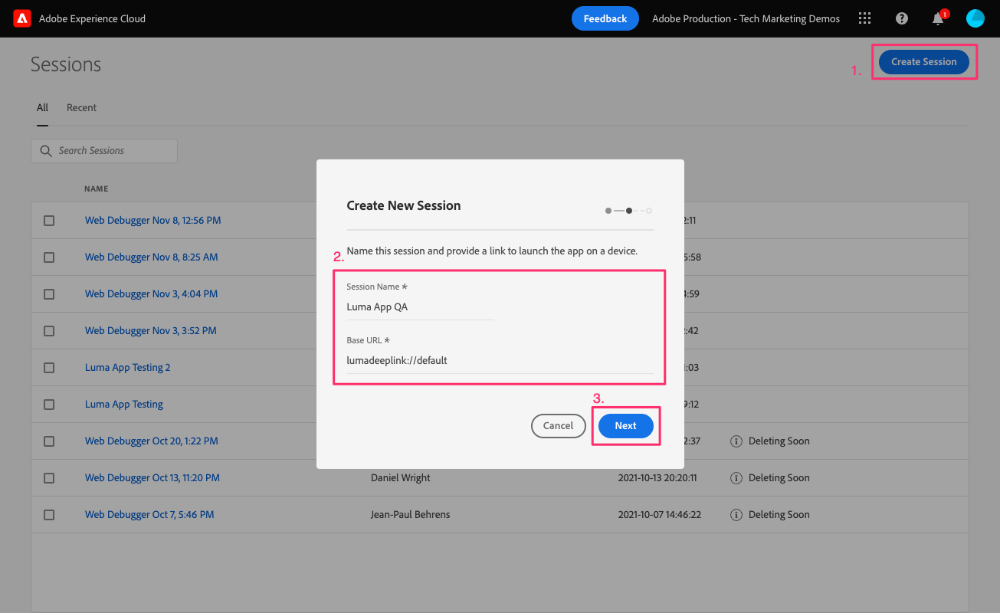

# Assurance

Obtenga información sobre cómo configurar Adobe Experience Platform Assurance en una aplicación móvil.

>[!INFO]
>
> Este tutorial se reemplazará con un nuevo tutorial con una nueva aplicación móvil de ejemplo a finales de noviembre de 2023

Assurance, anteriormente conocido como Project Griffon, está diseñado para ayudarle a inspeccionar, probar, simular y validar la forma en que recopila datos o sirve experiencias en su aplicación móvil.

Assurance le ayuda a inspeccionar los eventos de SDK sin procesar generados por el SDK para móviles de Adobe Experience Platform. Todos los eventos recopilados por el SDK están disponibles para su inspección. Los eventos del SDK se cargan en una vista de lista, ordenados por tiempo. Cada evento tiene una vista detallada que proporciona más detalles. También se proporcionan vistas adicionales para examinar la configuración del SDK, los elementos de datos, los estados compartidos y las versiones de extensión del SDK. Obtenga más información acerca de [Assurance](https://experienceleague.adobe.com/docs/experience-platform/assurance/home.html) en la documentación del producto.


## Requisitos previos

* La aplicación de ejemplo se ha creado y ejecutado correctamente con los SDK instalados y configurados.

## Objetivos de aprendizaje

En esta lección, deberá hacer lo siguiente:

* Confirme que su organización tiene acceso a (y solicítelo si no lo tiene).
* Configure la dirección URL base.
* Añada el código específico de iOS requerido.
* Conexión a una sesión.

## Confirmar acceso

Confirme que su organización tiene acceso a Assurance completando los siguientes pasos:

1. Visita [https://experience.adobe.com/#/assurance](https://experience.adobe.com/griffon){target="_blank"}
1. Inicie sesión con sus credenciales de Adobe ID para el Experience Cloud.
1. Si se le lleva al **[!UICONTROL Sesiones]** y, a continuación, tiene acceso a. Si llega a la página de acceso a la versión beta, seleccione **[!UICONTROL Registrar]**.

## Implementación

Además de la [Instalación del SDK](install-sdks.md) Si ha completado la lección anterior, iOS también requiere la siguiente adición. Agregue el siguiente código al archivo `AppDelegate.swift`:

```swift
func application(_ app: UIApplication, open url: URL, options: [UIApplication.OpenURLOptionsKey: Any] = [:]) -> Bool {
    Assurance.startSession(url: url)
    return true
}
```

El ejemplo de Luma proporcionado para este tutorial utiliza iOS 12.0. Si está siguiendo junto con su propia aplicación basada en escenas utilizando iOS 13 y posterior, utilice el `UISceneDelegate's scene(_:openURLContexts:)` Método como se indica a continuación:

```swift
func scene(_ scene: UIScene, openURLContexts URLContexts: Set<UIOpenURLContext>) {
    // Called when the app in background is opened with a deep link.
    if let deepLinkURL = URLContexts.first?.url {
        Assurance.startSession(url: deepLinkURL)
    }
}
```

Puede encontrar más información [aquí](https://developer.adobe.com/client-sdks/documentation/platform-assurance-sdk/api-reference/){target="_blank"}.

## Configuración de una dirección URL base

1. Abra XCode y seleccione el nombre del proyecto.
1. Vaya a **Información** pestaña.
1. Desplácese hacia abajo hasta **Tipos de URL** y seleccione la **+** para añadir uno nuevo.
1. Establecer **Identificador** y **Esquemas de URL** a &quot;lumadeeplink&quot;.
1. Cree y ejecute la aplicación.


Para obtener más información sobre los esquemas de URL en iOS, consulte [Documentación de Apple](https://developer.apple.com/documentation/xcode/defining-a-custom-url-scheme-for-your-app){target="_blank"}.

Assurance funciona abriendo una dirección URL, ya sea mediante explorador o código QR, que comienza con la dirección URL base que abre la aplicación y contiene parámetros adicionales. Estos parámetros únicos se utilizan para conectar la sesión.

## Conexión a una sesión

1. Vaya a [IU de Assurance](https://experience.adobe.com/griffon){target="_blank"}.
1. Seleccionar **[!UICONTROL Crear sesión]**.
1. Proporcionar **[!UICONTROL Nombre de sesión]** como `Luma App QA` y el **[!UICONTROL URL básica]** `lumadeeplink://default`
1. Seleccione **[!UICONTROL Siguiente]**.
   
1. **[!UICONTROL Escanear código QR]** si utiliza un dispositivo físico. Si utiliza el simulador, haga lo siguiente **[!UICONTROL Copiar vínculo]** y ábralo con Safari en el simulador.
   
1. Cuando la aplicación se carga, se le presenta un modal pidiéndole que introduzca su PIN del paso anterior.
   
1. Si la conexión se ha realizado correctamente, verá eventos en la interfaz de usuario web de Assurance y un icono flotante de Assurance en la aplicación.
   * Icono de garantía flotante.
     
   * Eventos del Experience Cloud que llegan a través de la IU web.
     

Si tiene algún problema, consulte la [técnico](https://developer.adobe.com/client-sdks/documentation/platform-assurance-sdk/){target="_blank"} and [general documentation](https://experienceleague.adobe.com/docs/experience-platform/assurance/home.html){target="_blank"}.

Siguiente: **[Consentimiento](consent.md)**

>[!NOTE]
>
>Gracias por dedicar su tiempo a conocer el SDK móvil de Adobe Experience Platform. Si tiene preguntas, desea compartir comentarios generales o tiene sugerencias sobre contenido futuro, compártalas en este [Entrada de discusión de la comunidad Experience League](https://experienceleaguecommunities.adobe.com/t5/adobe-experience-platform-data/tutorial-discussion-implement-adobe-experience-cloud-in-mobile/td-p/443796)
