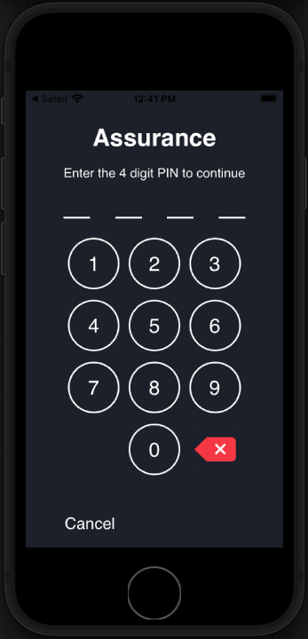

# Assurance

Obtenga información sobre cómo configurar Adobe Experience Platform Assurance en una aplicación móvil.

Assurance, conocido formalmente como Project Griffon, está diseñado para ayudarle a inspeccionar, probar, simular y validar cómo recopila datos o sirve experiencias en su aplicación móvil.

Assurance le ayuda a inspeccionar los eventos de SDK sin procesar generados por el SDK de Adobe Experience Platform Mobile. Todos los eventos recopilados por el SDK están disponibles para su inspección. Los eventos de SDK se cargan en una vista de lista, ordenados por tiempo. Cada evento tiene una vista detallada que proporciona más detalles. También se proporcionan vistas adicionales para examinar la configuración del SDK, los elementos de datos, los estados compartidos y las versiones de extensión del SDK. Obtenga más información sobre [Garantía](https://aep-sdks.gitbook.io/docs/foundation-extensions/adobe-experience-platform-assurance) en la documentación del producto.


## Requisitos previos

* La aplicación de ejemplo se ha creado y ejecutado correctamente con SDK instalados y configurados.

## Objetivos de aprendizaje

En esta lección:

* Confirme que su organización tiene acceso (y solicítelo si no lo tiene).
* Configure la URL base.
* Agregue el código específico de iOS necesario.
* Conéctese a una sesión.

## Confirmar acceso

Confirme que su organización tiene acceso a Assurance realizando los siguientes pasos:

1. Visita [https://experience.adobe.com/griffon](https://experience.adobe.com/griffon){target=&quot;_blank&quot;}
1. Inicie sesión con sus credenciales de Adobe ID para el Experience Cloud.
1. Si se le lleva a la **[!UICONTROL Sesiones]** y, a continuación, tendrá acceso. Si le lleva a la página de acceso beta, seleccione **[!UICONTROL Registro]**.

## Implementación

Además del [Instalación del SDK](install-sdks.md) Cuando haya completado la lección anterior, iOS también requiere la siguiente adición. Agregue el siguiente código al archivo `AppDelegate.swift`:

```swift
func application(_ app: UIApplication, open url: URL, options: [UIApplication.OpenURLOptionsKey: Any] = [:]) -> Bool {
    Assurance.startSession(url: url)
    return true
}
```

El ejemplo de Luma que se proporciona para este tutorial utiliza iOS 12.0. Si va a seguir junto con su propia aplicación basada en escenas utilizando iOS 13 y versiones posteriores, utilice el `UISceneDelegate's scene(_:openURLContexts:)` como se indica a continuación:

```swift
func scene(_ scene: UIScene, openURLContexts URLContexts: Set<UIOpenURLContext>) {
    // Called when the app in background is opened with a deep link.
    if let deepLinkURL = URLContexts.first?.url {
        Assurance.startSession(url: deepLinkURL)
    }
}
```

Encontrará más información [here](https://aep-sdks.gitbook.io/docs/foundation-extensions/adobe-experience-platform-assurance#implement-aep-assurance-session-start-apis-ios-only){target=&quot;_blank&quot;}.

## Configuración de una URL base

1. Abra XCode y seleccione el nombre del proyecto.
1. Vaya a la **Información** pestaña .
1. Desplácese hacia abajo hasta **Tipos de URL** y seleccione **+** para agregar uno nuevo.
1. Establezca **Identificador** y **Esquemas de URL** a &quot;lumadeeplink&quot;.
1. Compile y ejecute la aplicación.


Para obtener más información sobre los esquemas de URL en iOS, consulte [Documentación de Apple](https://developer.apple.com/documentation/xcode/defining-a-custom-url-scheme-for-your-app){target=&quot;_blank&quot;}.

El seguro funciona abriendo una URL, ya sea a través del navegador o código QR, que la URL comienza con la URL base que abre la aplicación y contiene parámetros adicionales. Estos parámetros únicos se utilizan para conectar la sesión.

## Conexión a una sesión

1. Vaya a la [Interfaz de usuario de Assurance](https://experience.adobe.com/griffon){target=&quot;_blank&quot;}.
1. Select **[!UICONTROL Crear sesión]**.
1. Proporcionar **[!UICONTROL Nombre de la sesión]** como `Luma App QA` y **[!UICONTROL Dirección URL base]** `lumadeeplink://default`
1. Seleccione **[!UICONTROL Siguiente]**.
   
1. **[!UICONTROL Analizar código QR]** si está usando un dispositivo físico. Si está utilizando el simulador, **[!UICONTROL Copiar vínculo]** y ábralo con Safari en el simulador.
   
1. Cuando la aplicación se carga, se le presenta un modal en el que se le pide que introduzca el PIN del paso anterior.
   
1. Si la conexión se ha realizado correctamente, verá eventos en la interfaz de usuario web de Assurance y un icono de Assurance flotante en la aplicación.
   * Icono de garantía flotando.
      
   * Eventos de Experience Cloud que pasan por la interfaz de usuario web.
      

Si tiene algún problema, revise la [technical](https://aep-sdks.gitbook.io/docs/foundation-extensions/adobe-experience-platform-assurance){target=&quot;_blank&quot;} y [documentación general](https://aep-sdks.gitbook.io/docs/beta/project-griffon){target=&quot;_blank&quot;}.

Siguiente: **[Consentimiento](consent.md)**

>[!NOTE]
>
>Gracias por invertir su tiempo en obtener información sobre el SDK de Adobe Experience Platform Mobile. Si tiene alguna pregunta, desea compartir comentarios generales o tiene sugerencias sobre contenido futuro, compártalas en este [Experience League de debate de la comunidad](https://experienceleaguecommunities.adobe.com/t5/adobe-experience-platform-launch/tutorial-discussion-implement-adobe-experience-cloud-in-mobile/td-p/443796)