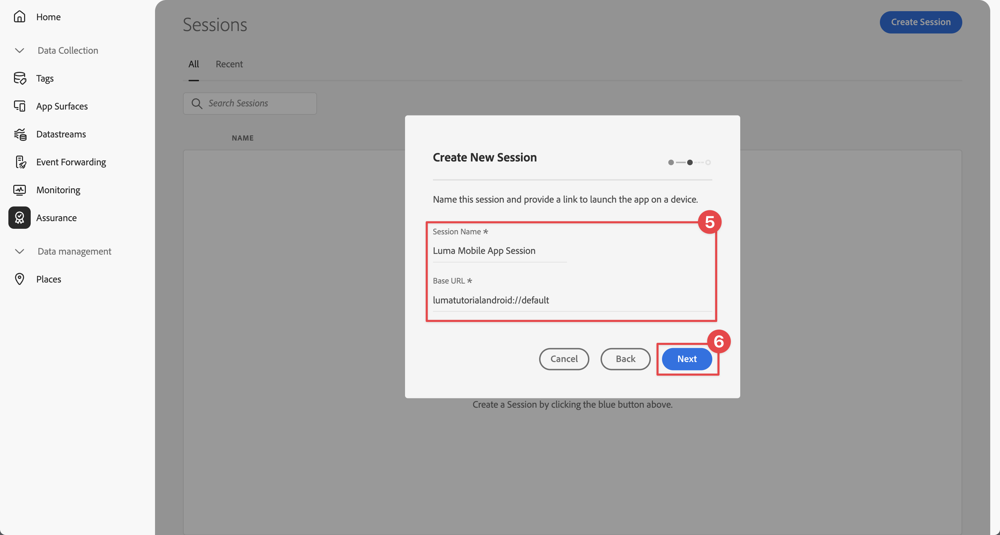
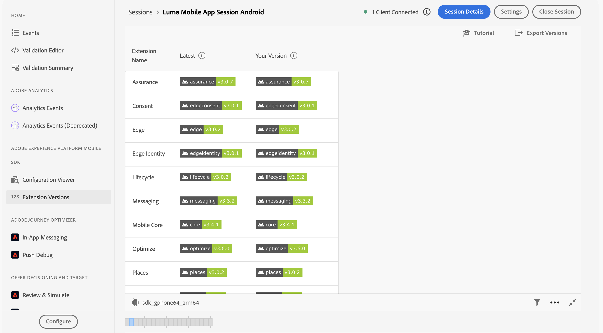

# Configuración de Assurance

Obtenga información sobre cómo configurar Adobe Experience Platform Assurance en una aplicación móvil.

Assurance, anteriormente conocido como Proyecto Griffon, está diseñado para ayudarle a inspeccionar, probar, simular y validar la forma en que recopila datos o sirve experiencias en su aplicación móvil.

Assurance le ayuda a inspeccionar los eventos de SDK sin procesar generados por el SDK para móviles de Adobe Experience Platform. Todos los eventos recopilados por el SDK están disponibles para su inspección. Los eventos del SDK se cargan en una vista de lista, ordenados por tiempo. Cada evento tiene una vista detallada que proporciona más detalles. También se proporcionan vistas adicionales para examinar la configuración de SDK, los elementos de datos, los estados compartidos y las versiones de extensión de SDK. Obtenga más información acerca de [Assurance](https://experienceleague.adobe.com/es/docs/experience-platform/assurance/home) en la documentación del producto.


## Requisitos previos

* La aplicación se ha configurado y instalado correctamente con los SDK.

## Objetivos de aprendizaje

En esta lección, deberá hacer lo siguiente:

* Confirme que su organización tiene acceso a (y solicítelo si no lo tiene).
* Configure la dirección URL base.
* Añada el código específico de iOS requerido.
* Conéctese a una sesión.

## Confirmar acceso

Confirme que su organización tiene acceso a Assurance. Usted, como usuario, debe añadirse al perfil de Adobe Experience Platform. Consulte [Acceso de usuario](https://experienceleague.adobe.com/en/docs/experience-platform/assurance/user-access) en la guía de Assurance para obtener más información.

## Implementación

Para implementar Assurance en la aplicación:

>[!BEGINTABS]

>[!TAB iOS]

Además de la [instalación general de SDK](install-sdks.md), iOS también requiere el siguiente código adicional para iniciar la sesión de Assurance en la aplicación.

1. Vaya a **[!DNL Luma]** > **[!DNL Luma]** > **[!UICONTROL SceneDelegate]** en el navegador de proyectos de Xcode.

1. Añada el siguiente código a `func scene(_ scene: UIScene, openURLContexts URLContexts: Set<UIOpenURLContext>`:

   ```swift
   // Called when the app in background is opened with a deep link.
   if let deepLinkURL = URLContexts.first?.url {
       // Start the Assurance session
       Assurance.startSession(url: deepLinkURL)
   }
   ```

   Este código inicia una sesión de garantía cuando la aplicación se encuentra en segundo plano y se abre mediante un vínculo profundo.

>[!TAB Android]

Además de la [instalación general de SDK](install-sdks.md), Android también requiere el siguiente código adicional para iniciar la sesión de Assurance en la aplicación.

1. En Android Studio, en la vista de **[!UICONTROL Android]**, vaya a **[!UICONTROL aplicación]** > **[!UICONTROL kotlin+java]** > **[!UICONTROL com.adobe.luma.tutorial.android]** > **[!UICONTROL LumaApplication]**.

1. Añada el siguiente código a `fun handleDeeplink(deeplink: String?)`:

   ```kotlin
   // Called when the app in background is opened with a deep link.
   if (deeplink.isNullOrEmpty()) {
      Log.w("Luma", "Deeplink is null or empty")
      return
   }
   
   Log.i("Luma", "Handling deeplink: $deeplink")
   Assurance.startSession(deeplink)
   ```

   Este código inicia una sesión de garantía cuando la aplicación se encuentra en segundo plano y se abre mediante un vínculo profundo.

>[!ENDTABS]


Consulte [Referencia de la API de Assurance](https://developer.adobe.com/client-sdks/documentation/platform-assurance-sdk/api-reference/){target="_blank"} para obtener más información.


## Definir un identificador de paquete

Debe proporcionar un identificador de paquete único para la aplicación.

>[!BEGINTABS]

>[!TAB iOS]

1. Abra el proyecto en Xcode.
1. Seleccione **[!DNL Luma]** en el navegador de proyectos.
1. Seleccione el destino **[!DNL Luma]**.
1. Seleccione la pestaña **Firma y capacidades**.
1. Defina un **[!UICONTROL Identificador de paquete]**.

Asegúrese de utilizar un identificador de paquete _unique_ y reemplace el identificador de paquete `com.adobe.luma.tutorial.swiftui`, ya que cada identificador de paquete debe ser único. Normalmente, utiliza un formato DNS inverso para cadenas de ID de paquete, como `com.organization.brand.uniqueidentifier`. La versión final de este tutorial, por ejemplo, utiliza `com.adobe.luma.tutorial.swiftui`.

{zoomable="yes"}

>[!TAB Android]

1. Abra el proyecto en Android Studio.
1. Seleccione **[!UICONTROL build.gradle.kts (Módulo :app)]** en el navegador.
1. Asegúrese de usar un identificador de paquete _unique_ y reemplace el valor `com.adobe.luma.tutorial.android` para `namespace` en `android`
1. Asegúrese de usar el mismo identificador de paquete _unique_ y reemplace `com.adobe.luma.tutorial.android` para `applicationId` en `defaultConfig` en `android`

Normalmente, utiliza un formato DNS inverso para cadenas de ID de paquete, como `com.organization.brand.uniqueidentifier`. La versión final de este tutorial, por ejemplo, utiliza `com.adobe.luma.tutorial.android`.

{zoomable="yes"}{zoomable="yes"}

>[!ENDTABS]


## Configuración de una dirección URL base

Debe configurar una dirección URL base para garantizar que la vinculación profunda funcione.

>[!BEGINTABS]

>[!TAB iOS]

1. Vaya al proyecto en Xcode.
1. Seleccione **[!DNL Luma]** en el navegador de proyectos.
1. Seleccione el destino **[!DNL Luma]**.
1. Seleccione la ficha **Información**.
1. Para agregar una URL base, desplácese hacia abajo hasta **Tipos de URL** y seleccione el botón **+**.
1. Establezca **Identificador** en el identificador de paquete que elija y establezca **Esquemas de URL** de su elección

   {zoomable="yes"}

Asegúrese de utilizar un identificador de paquete _unique_ y reemplace el identificador de paquete `com.adobe.luma.tutorial.swiftui`, ya que cada identificador de paquete debe ser único. Normalmente, utiliza un formato DNS inverso para cadenas de ID de paquete, como `com.organization.brand.uniqueidentifier`. Puede usar el mismo identificador de paquete que usó en [Definir identificador de paquete](#define-bundle-identifier).<br/>Del mismo modo, use un esquema de URL único y reemplace el esquema de URL ya proporcionado `lumatutorialswiftui` por el único.

Para obtener más información acerca de los esquemas de URL en iOS, consulte [Documentación de Apple](https://developer.apple.com/documentation/xcode/defining-a-custom-url-scheme-for-your-app){target="_blank"}.

Assurance funciona abriendo una dirección URL a través de un explorador o código QR. Esa URL comienza con la URL base que abre la aplicación y contiene parámetros adicionales. Estos parámetros únicos se utilizan para conectar la sesión. En la aplicación de ejemplo, el vínculo profundo es `lumatutorialswiftui://`.

>[!TAB Android]

1. Vaya a la vista de **[!UICONTROL Android]** de su proyecto en Android Studio.
1. Seleccione **[!UICONTROL aplicación]** > **[!UICONTROL manifiestos]** > **[!UICONTROL AndroidManifest.xml]** en el navegador.
1. Asegúrese de que el elemento XML **[!UICONTROL manifest]** > **[!UICONTROL application]** > **[!UICONTROL activity]** tenga el siguiente aspecto:

   ```xml
   <activity
      android:name=".MainActivity"
      android:exported="true"
      android:theme="@style/Theme.LumaAndroid">
      <intent-filter>
            <action android:name="android.intent.action.MAIN" />
            <category android:name="android.intent.category.LAUNCHER" />
      </intent-filter>
      <intent-filter
            android:label="@string/app_name">
            <action android:name="android.intent.action.VIEW" />
            <category android:name="android.intent.category.DEFAULT" />
            <category android:name="android.intent.category.BROWSABLE" />
            <data android:scheme="lumatutorialandroid"
               android:host="default" />
      </intent-filter>
   </activity>
   ```

Asegúrese de especificar un `android:scheme` (por ejemplo. `lumatutorialandroid`) y `android:host` (por ejemplo `default`) para definir la dirección URL base.

Para obtener más información sobre los vínculos profundos en Android, consulte [Crear vínculos profundos](https://developer.android.com/training/app-links/create-deeplinks){target="_blank"} en la documentación de Android.

Assurance funciona abriendo una dirección URL a través de un explorador o código QR. Esa URL comienza con la URL base, que abre la aplicación y contiene parámetros adicionales. Estos parámetros únicos se utilizan para conectar la sesión.  En la aplicación de ejemplo, el vínculo profundo es `lumatutorialandroid://default`.

>[!ENDTABS]


## Conexión a una sesión

Ahora puede utilizar Assurance para conectarse a una sesión.

>[!BEGINTABS]

>[!TAB iOS]

En Xcode:

1. Compile o vuelva a compilar y ejecute la aplicación en el simulador o en un dispositivo físico desde Xcode con .

   Opcionalmente, es posible que quiera *limpiar* su compilación, especialmente cuando vea resultados inesperados. Seleccione **[!UICONTROL Limpiar carpeta de compilación...]** en el menú Xcode **[!UICONTROL Producto]**.


1. En el cuadro de diálogo **[!UICONTROL Permitir que la &quot;aplicación de Luma&quot; use su ubicación]**, seleccione **[!UICONTROL Permitir al usar la aplicación]**.

   

1. En el cuadro de diálogo **[!UICONTROL &quot;Aplicación de Luma&quot; desea enviarle notificaciones]**, seleccione **[!UICONTROL Permitir]**.

   

1. Seleccione **[!UICONTROL Continuar...]** para permitir que la aplicación rastree su actividad.

   

1. En el cuadro de diálogo **[!UICONTROL Permitir que &quot;Aplicación de Luma&quot; rastree su actividad en las aplicaciones y sitios web de otras compañías]**, seleccione **[!UICONTROL Permitir]**.

   

1. Seleccione **[!UICONTROL Continuar]**.


En su explorador:

1. Vaya a la IU de recopilación de datos.
1. Seleccione **[!UICONTROL Assurance]** en el carril izquierdo.
1. Seleccione **[!UICONTROL Crear nueva sesión]** y la opción **[!UICONTROL Conexión de vínculo profundo]**.
1. Seleccione **[!UICONTROL Iniciar]**.
1. Proporcione un **[!UICONTROL Nombre de sesión]** como `Luma Mobile App Session` y la **[!UICONTROL URL base]**, que son los esquemas de URL que introdujo en Xcode, seguidos de `://`. Por ejemplo: `lumatutorialswiftui://`
1. Seleccione **[!UICONTROL Siguiente]**.
   {zoomable="yes"}
1. En el diálogo modal **[!UICONTROL Crear nueva sesión]**:

   Si utiliza un dispositivo físico:

   * Seleccione **[!UICONTROL Escanear código QR]**. Para abrir la aplicación, utilice la cámara del dispositivo físico para escanear el código QR y pulse el vínculo.

     {zoomable="yes"}

   Si utiliza un simulador:

   1. Seleccione **[!UICONTROL Copiar vínculo]**.
   1. Copie el vínculo profundo mediante  y utilice el vínculo profundo para abrir la aplicación con Safari en el simulador.
      {zoomable="yes"}

1. Cuando se carga la aplicación, aparece un cuadro de diálogo modal en el que se le solicita que introduzca el PIN que se muestra en el paso 7.

   

   Escriba el PIN y seleccione **[!UICONTROL Conectar]**.


1. Si la conexión se ha realizado correctamente, verá lo siguiente:
   * Un icono de Assurance flotando en la parte superior de la aplicación.

     

   * Actualizaciones de Experience Cloud que llegan a través de la interfaz de usuario de Assurance y muestran lo siguiente:

      1. Eventos de experiencia procedentes de la aplicación.
      1. Detalles de un evento seleccionado.
      1. El dispositivo y la cronología.

         {zoomable="yes"}

1. Seleccione **[!UICONTROL Continuar]** para ir a la pantalla Inicio.

>[!TAB Android]

En Android Studio:

1. Cree o reconstruya y ejecute la aplicación en el simulador o en un dispositivo físico desde Android Studio con .

   Opcionalmente, es posible que quiera *limpiar* su compilación, especialmente cuando vea resultados inesperados. Seleccione **[!UICONTROL Limpiar proyecto]** del menú **[!UICONTROL Generar]** de Android Studio.


1. En el cuadro de diálogo **[!UICONTROL Permitir que Luma Android le envíe notificaciones]**, seleccione **[!UICONTROL Permitir]**.

   

1. Seleccione **[!UICONTROL Mostrar cuadro de diálogo de permisos]**.

   

1. En el **[!UICONTROL Permitir que Luma Android acceda a la ubicación de este dispositivo?]**...

   

   * Seleccione **[!UICONTROL Preciso]**.
   * Seleccione **[!UICONTROL mientras usa la aplicación]**.

1. En la pantalla de introducción de la aplicación, selecciona **[!UICONTROL Abrir configuración del dispositivo]**.

1. En la pantalla **[!UICONTROL Permiso de ubicación]**, seleccione **[!UICONTROL Permitir todo el tiempo]**. A continuación, seleccione **[!UICONTROL ←]** para volver a la pantalla de introducción de la aplicación.

   

1. Seleccione **[!UICONTROL Continuar]** para ir a la pantalla Inicio.


En su explorador:

1. Vaya a la IU de recopilación de datos.
1. Seleccione **[!UICONTROL Assurance]** en el carril izquierdo.
1. Seleccione **[!UICONTROL Crear nueva sesión]** y la opción **[!UICONTROL Conexión de vínculo profundo]**.
1. Seleccione **[!UICONTROL Iniciar]**.
1. Proporcione un **[!UICONTROL Nombre de sesión]** como `Luma Mobile App Session` y la **[!UICONTROL URL base]**, que son las `android:scheme` y `android:host` que definió en **[!UICONTROL AndroidManifest.xml]** en Android Studio, separadas por `://`. Por ejemplo: `lumatutorialandroid://default`
1. Seleccione **[!UICONTROL Siguiente]**.
   {zoomable="yes"}

1. En el diálogo modal **[!UICONTROL Crear nueva sesión]**:

   Si utiliza un dispositivo físico:

   * Seleccione **[!UICONTROL Escanear código QR]**. Para abrir la aplicación, utilice la cámara del dispositivo físico para escanear el código QR y pulse el vínculo.

     {zoomable="yes"}

   Si utiliza un simulador:

   1. Seleccione **[!UICONTROL Copiar vínculo]**.
   1. Copie el vínculo profundo mediante  y utilice el vínculo profundo para abrir la aplicación con Chrome en el simulador.

   {zoomable="yes"}

   Cuando se le pida en Chrome que **Continúe con Luma Android**, seleccione **Continuar**.

1. Cuando se carga la aplicación, aparece un cuadro de diálogo modal en el que se le solicita que introduzca el PIN que se muestra en el paso 7.

   

   Escriba el PIN y seleccione **[!UICONTROL Conectar]**.


1. Si la conexión se ha realizado correctamente, verá lo siguiente:
   * Un icono de Assurance flotando en la parte superior de la aplicación.

     

   * Actualizaciones de Experience Cloud que llegan a través de la interfaz de usuario de Assurance y muestran lo siguiente:

      1. Eventos de experiencia procedentes de la aplicación.
      1. Detalles de un evento seleccionado.
      1. El dispositivo y la cronología.

         {zoomable="yes"}

>[!ENDTABS]

Si encuentra algún desafío, revise la [documentación técnica](https://developer.adobe.com/client-sdks/documentation/platform-assurance-sdk/){target="_blank"} y la [documentación general](https://experienceleague.adobe.com/es/docs/experience-platform/assurance/home){target="_blank"}.


## Verificar extensiones

Para comprobar si su aplicación utiliza las extensiones más actualizadas:

1. Seleccione **[!UICONTROL Configurar]**.

1. Seleccione  para  **[!UICONTROL versiones de extensión]**.

1. Seleccione **[!UICONTROL Guardar]**.

   {zoomable="yes"}

1. Seleccione  **[!UICONTROL Versiones de extensión]** para ver una descripción general de las extensiones más recientes disponibles y de las extensiones usadas en su versión de la aplicación.

>[!BEGINTABS]

>[!TAB iOS]

{zoomable="yes"}

Para actualizar las versiones de la extensión (por ejemplo, **[!UICONTROL Messaging]** y **[!UICONTROL Optimize]**), seleccione el paquete (extensión) de **[!UICONTROL Dependencias del paquete]** (por ejemplo, **[!UICONTROL AEPMessaging]**) y, en el menú contextual, seleccione **[!UICONTROL Actualizar paquete]**. Xcode actualiza las dependencias del paquete.

>[!TAB Android]

{zoomable="yes"}

Si ve extensiones obsoletas, consulte la [documentación de Android Studio](https://developer.android.com/build/agp-upgrade-assistant) sobre cómo actualizar los módulos de dependencia para su proyecto.


>[!ENDTABS]

>[!NOTE]
>
>Una vez que haya actualizado las extensiones (paquetes) en su entorno de desarrollo, cierre y elimine la sesión actual y repita todos los pasos de [Conexión a una sesión](#connecting-to-a-session) y [Verificación de las extensiones](#verify-extensions) para asegurarse de que Assurance informa correctamente de las extensiones correctas en una nueva sesión de Assurance.
>


>[!SUCCESS]
>
>Ahora ha configurado la aplicación para que utilice Assurance durante el resto del tutorial.
>
>Gracias por dedicar su tiempo a conocer Adobe Experience Platform Mobile SDK. Si tiene preguntas, desea compartir comentarios generales o tiene sugerencias sobre contenido futuro, compártalas en esta [publicación de debate de la comunidad de Experience League](https://experienceleaguecommunities.adobe.com/t5/adobe-experience-platform-data/tutorial-discussion-implement-adobe-experience-cloud-in-mobile/td-p/443796)


Siguiente: **[Implementar consentimiento](consent.md)**
