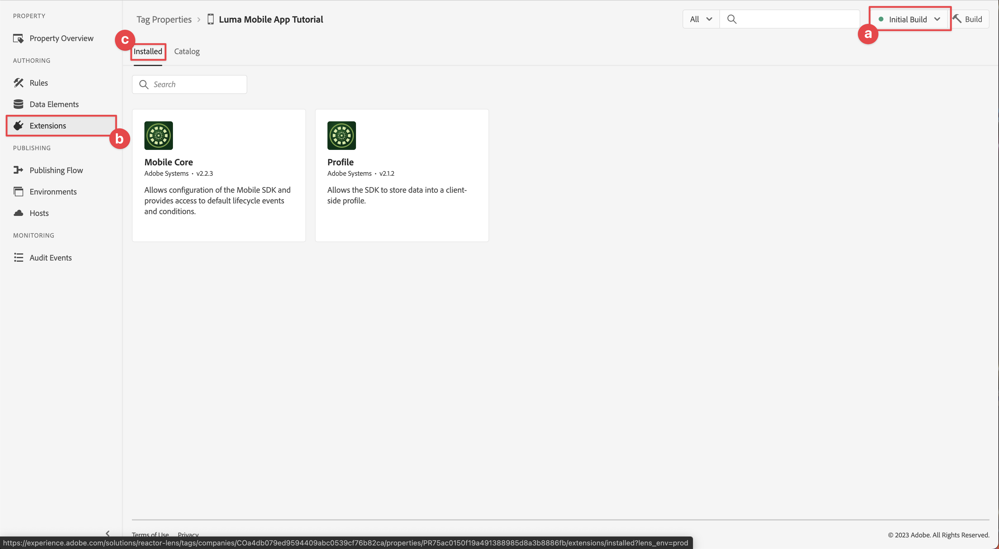

# Configuración de una propiedad de etiqueta

Obtenga información sobre cómo configurar una propiedad de etiqueta en la interfaz de [!UICONTROL Recopilación de datos].

Las etiquetas de Adobe Experience Platform son la próxima generación de funcionalidades de administración de etiquetas de Adobe. Las etiquetas ofrecen a los clientes una alternativa sencilla para implementar y gestionar las etiquetas de análisis, marketing y publicidad necesarias para potenciar las importantes experiencias del cliente. Obtenga más información acerca de [Etiquetas](https://experienceleague.adobe.com/es/docs/experience-platform/tags/home) en la documentación del producto.

## Requisitos previos

Para completar la lección, debe tener permiso para crear una propiedad de etiqueta. También es útil tener una comprensión básica de las etiquetas.

>[!NOTE]
>
> Platform Launch (lado del cliente) ahora tiene [Etiquetas](https://experienceleague.adobe.com/es/docs/experience-platform/tags/home)

## Objetivos de aprendizaje

En esta lección, deberá hacer lo siguiente:

* Instale y configure las extensiones de etiquetas móviles de.
* Genere las instrucciones de instalación de SDK.

## Configuración inicial

1. Cree una nueva propiedad de etiqueta móvil en la interfaz de recopilación de datos:
   1. Seleccione **[!UICONTROL Etiquetas]** en el panel de navegación izquierdo.
   1. Seleccionar **[!UICONTROL nueva propiedad]**
      {zoomable="yes"}.
   1. Para **[!UICONTROL Name]**, escriba `Luma Mobile App Tutorial`.
   1. Para la **[!UICONTROL plataforma]**, seleccione **[!UICONTROL móvil]**.
   1. Seleccione **[!UICONTROL Guardar]**.

      {zoomable="yes"}

      >[!NOTE]
      >
      > La configuración de consentimiento predeterminada para las implementaciones de Mobile SDK basadas en Edge, como la que estás haciendo en esta lección, proviene de la [!UICONTROL extensión de consentimiento] y no de la configuración de [!UICONTROL Privacidad] en la configuración de la propiedad de etiquetas. Puede añadir y configurar la extensión de consentimiento más adelante en esta lección. Para obtener más información, consulte [la documentación](https://developer.adobe.com/client-sdks/edge/consent-for-edge-network/).

1. Abra la nueva propiedad.
1. Crear una biblioteca:

   1. Vaya a **[!UICONTROL Flujo de publicación]** en el panel de navegación izquierdo.
   1. Seleccione **[!UICONTROL Agregar biblioteca]**.

      {zoomable="yes"}

   1. Para **[!UICONTROL Name]**, escriba `Initial Build`.
   1. Para el **[!UICONTROL Entorno]**, seleccione **[!UICONTROL Desarrollo (desarrollo)]**.
   1. Seleccione  **[!UICONTROL Agregar todos los recursos modificados]**.
   1. Seleccione **[!UICONTROL Guardar y generar en desarrollo]**.

      {zoomable="yes"}

   1. Finalmente, seleccione **[!UICONTROL Versión inicial]** como su biblioteca de trabajo en el menú **[!UICONTROL Seleccionar una biblioteca de trabajo]**.
      {zoomable="yes"}
1. Compruebe las extensiones:

   1. Asegúrese de que **[!UICONTROL Versión inicial]** esté seleccionada como la biblioteca predeterminada.

   1. Seleccione **[!UICONTROL Extensiones]** en el carril izquierdo.

   1. Seleccione la ficha **[!UICONTROL Instalado]**.

      Las extensiones [!UICONTROL Mobile Core] y [!UICONTROL Profile] deben estar preinstaladas.

      {zoomable="yes"}

## Configuración de extensión

1. Asegúrese de que está en **[!UICONTROL Extensiones]** dentro de la propiedad de su aplicación móvil.

1. Seleccione **[!UICONTROL Catálogo]**.

   {zoomable="yes"}

1. Utilice el campo  **[!UICONTROL Buscar]** para encontrar la extensión **Identidad**.

   1. Busque `Identity`.

   2. Seleccione la extensión **[!UICONTROL Identity]**.

   3. Seleccione **[!UICONTROL Instalar]**.

      {zoomable="yes"}

   Esta extensión no requiere ninguna configuración adicional.

1. Utilice el campo  **[!UICONTROL Buscar]** para buscar e instalar la extensión **AEP Assurance**.

   Esta extensión no requiere ninguna configuración adicional.

1. Utilice el campo  **[!UICONTROL Buscar]** para buscar e instalar la extensión **Consentimiento**. En la pantalla de configuración:

   1. Seleccione **[!UICONTROL Pendiente]**. En este tutorial, puede administrar el consentimiento más detalladamente en la aplicación. Obtenga más información acerca de la extensión de consentimiento en [la documentación](https://developer.adobe.com/client-sdks/documentation/consent-for-edge-network/).
   1. Seleccione **[!UICONTROL Guardar en biblioteca]**.

      {zoomable="yes"}

1. Utilice el campo  **[!UICONTROL Buscar]** para buscar e instalar la extensión **Adobe Experience Platform Edge Network**.

   1. En **[!UICONTROL Datastreams]**, seleccione la **[!UICONTROL secuencia de datos]** que creó en el [paso anterior](create-datastream.md) para cada uno de los entornos, por ejemplo **[!DNL Luma Mobile App]**.

   1. Si aún no se ha rellenado, especifique el **[!UICONTROL dominio de Edge Network]** en **[!UICONTROL Configuración del dominio]**. El dominio de Edge Network es el nombre de su organización, seguido de `data.adobedc.net`, por ejemplo `techmarketingdemos.data.adobedc.net`.

   1. En el menú **[!UICONTROL Guardar en biblioteca]**, seleccione **[!UICONTROL Guardar en biblioteca y crear]**.

      {zoomable="yes"}

La biblioteca se crea para las nuevas extensiones y configuraciones. Un(a) ● en el botón **[!UICONTROL Versión inicial]** indicó una compilación correcta.

## Generar instrucciones de instalación de SDK

Las etiquetas proporcionan instrucciones y fragmentos de código para instalar Adobe Experience Platform Mobile SDK en la aplicación.

>[!BEGINTABS]

>[!TAB iOS]

1. Seleccione **[!UICONTROL Entornos]** en el carril izquierdo.

1. Seleccione el icono de instalación de **[!UICONTROL Development]**  .

   {zoomable="yes"}

1. En el cuadro de diálogo **[!UICONTROL Instrucciones de instalación móvil]**, seleccione la pestaña **[!UICONTROL iOS]**.

1. Puedes copiar  las instrucciones para configurar tu proyecto usando CocoaPods. Los CocoaPods se utilizan para administrar las versiones y descargas de SDK. Para obtener más información, consulte la [documentación de CocoaPods](https://cocoapods.org/).

   Las [instrucciones de instalación](https://developer.adobe.com/client-sdks/documentation/getting-started/get-the-sdk/) le proporcionan un buen punto de partida para la implementación.

   Para el resto de este tutorial, **no** está usando las instrucciones de CocoaPods. En su lugar, se utiliza la configuración nativa basada en el Administrador de paquetes de Swift (SPM).

1. Seleccione la ficha **[!UICONTROL Swift]** debajo de **[!UICONTROL Agregar código de inicialización]**. Este bloque de código muestra cómo importar los SDK necesarios y registrar las extensiones en el inicio. Esta importación y registro se tratan con más detalle en [Instalar SDK](install-sdks.md).

1. Copie  el **[!UICONTROL Id. de archivo de entorno]** y guárdelo en un lugar donde lo necesite más adelante. Este ID único apunta a su entorno de desarrollo de. Cada entorno (producción, ensayo y desarrollo) tiene su propio valor de ID único.

   {zoomable="yes"}

>[!TAB Android]

1. Seleccione **[!UICONTROL Entornos]** en el carril izquierdo.
1. Seleccione el icono de instalación de **[!UICONTROL Development]**  .

   {zoomable="yes"}

1. En el cuadro de diálogo **[!UICONTROL Instrucciones de instalación móvil]**, seleccione la pestaña **[!UICONTROL Android]**.
1. Puede copiar  las instrucciones para configurar su proyecto mediante Gradle. Gradle se utiliza para administrar las versiones y descargas de SDK. Para obtener más información, consulte la [documentación de Gradle](https://gradle.org/)

   Las [instrucciones de instalación](https://developer.adobe.com/client-sdks/documentation/getting-started/get-the-sdk/) le proporcionan un buen punto de partida para la implementación.

1. Este bloque de código muestra cómo importar los SDK necesarios y registrar las extensiones en el inicio. Esta importación y registro se tratan con más detalle en [Instalar SDK](install-sdks.md).

1. Copie  el **[!UICONTROL Id. de archivo de entorno]** y guárdelo en un lugar donde lo necesite más adelante. Este ID único apunta a su entorno de desarrollo de. Cada entorno (producción, ensayo y desarrollo) tiene su propio valor de ID único.

   {zoomable="yes"}

>[!ENDTABS]

>[!NOTE]
>
>Las instrucciones de instalación deben considerarse un punto de partida y no una documentación definitiva. Las últimas versiones de SDK y ejemplos de código se encuentran en la [documentación](https://developer.adobe.com/client-sdks/home/) oficial.

## Arquitectura de etiquetas móviles

Si está familiarizado con la versión web de las etiquetas, anteriormente Launch, es importante comprender las diferencias en móvil.

* En la web, se procesa una propiedad de etiqueta en JavaScript que luego (normalmente) se aloja en la nube. Se hace referencia a ese archivo JavaScript directamente en el sitio web.

* En una propiedad de etiqueta móvil, las reglas y configuraciones se representan en archivos JSON alojados en la nube. La extensión principal de Mobile descarga y lee los archivos JSON en la aplicación móvil. Las extensiones son SDK independientes que funcionan juntos. Si agrega una extensión a la propiedad de etiquetas, también debe actualizar la aplicación. Si cambia una configuración de extensión o crea una regla, esos cambios se reflejarán en la aplicación una vez que publique la biblioteca de etiquetas actualizada. Esa flexibilidad le permite modificar la configuración (como el ID del grupo de informes de Adobe Analytics). O incluso puede cambiar el comportamiento de su aplicación (mediante elementos de datos y reglas, como verá en lecciones posteriores) sin tener que cambiar el código en la aplicación y volver a enviarlo a la tienda de aplicaciones.

>[!SUCCESS]
>
>Ahora tiene una propiedad de etiqueta móvil para usar en el resto de este tutorial.
>
>Gracias por dedicar su tiempo a conocer Adobe Experience Platform Mobile SDK. Si tiene preguntas, desea compartir comentarios generales o tiene sugerencias sobre contenido futuro, compártalas en esta [publicación de debate de la comunidad de Experience League](https://experienceleaguecommunities.adobe.com/t5/adobe-experience-platform-data/tutorial-discussion-implement-adobe-experience-cloud-in-mobile/td-p/443796?profile.language=es)

Siguiente: **[Instalar SDK](install-sdks.md)**
