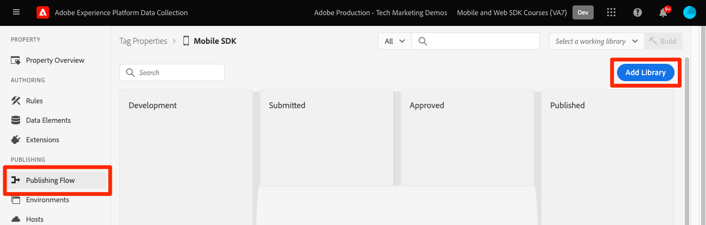

# Configuración de una propiedad de etiqueta

Obtenga información sobre cómo configurar una propiedad de etiqueta en la variable [!UICONTROL Recopilación de datos] interfaz.

Las etiquetas de Adobe Experience Platform son la próxima generación de funcionalidades de administración de etiquetas de Adobe. Las etiquetas ofrecen a los clientes una alternativa sencilla para implementar y administrar todas las etiquetas de análisis, marketing y publicidad necesarias para potenciar las importantes experiencias del cliente. Más información sobre [etiquetas](https://experienceleague.adobe.com/docs/experience-platform/tags/home.html?lang=es) en la documentación del producto.

## Requisitos previos

Para completar la lección, debe tener permiso para crear una propiedad de etiqueta. También es útil tener una idea de línea de base de las etiquetas.

>[!NOTE]
>
> El platform launch (lado del cliente) ya está [etiquetas](https://experienceleague.adobe.com/docs/experience-platform/tags/home.html?lang=es)

## Objetivos de aprendizaje

En esta lección:

* Instale y configure las extensiones de etiquetas móviles.
* Genere las instrucciones de instalación del SDK.

## Configuración inicial

1. Cree una nueva propiedad de etiqueta móvil:
   1. En el [Interfaz de recopilación de datos](https://experience.adobe.com/data-collection/){target=&quot;_blank&quot;}, seleccione **[!UICONTROL Etiquetas]** en la navegación izquierda
   1. Seleccione **[!UICONTROL Nueva propiedad]**

      .
   1. Para la variable **[!UICONTROL Nombre]**, introduzca `Mobile SDK Course`.
   1. Para la variable **[!UICONTROL Plataforma]**, seleccione **[!UICONTROL Móvil]**.
   1. Seleccione **[!UICONTROL Guardar]**.

      

      >[!NOTE]
      >
      > La configuración de consentimiento predeterminada para las implementaciones de sdk móviles basadas en Edge como la que está haciendo en este tutorial proviene del [!UICONTROL Extensión de consentimiento] y no [!UICONTROL Privacidad] en la configuración de la propiedad tag . Más adelante en esta lección, debe añadir y configurar la extensión de consentimiento. Para obtener más información, consulte [la documentación](https://aep-sdks.gitbook.io/docs/resources/privacy-and-gdpr).

1. Abrir la nueva propiedad
1. Crear una biblioteca:

   1. Vaya a **[!UICONTROL Flujo de publicación]** en el panel de navegación izquierdo.
   1. Select **[!UICONTROL Agregar biblioteca]**.

      

   1. Para la variable **[!UICONTROL Nombre]**, introduzca `Initial Build`.
   1. Para la variable **[!UICONTROL Entorno]**, seleccione **[!UICONTROL Desarrollo]**.
   1. Select  **[!UICONTROL Agregar todos los recursos modificados]**.
   1. Select **[!UICONTROL Guardar y crear en desarrollo]**.

      

   1. Finalmente, configúrelo como su **[!UICONTROL Biblioteca de trabajo]**.
      
1. Select **[!UICONTROL Extensiones]**.

   Las extensiones principal móvil y de perfil deben estar preinstaladas.

1. Select **[!UICONTROL Catálogo]**.

   

1. Utilice la variable [!UICONTROL Buscar] para buscar e instalar las siguientes extensiones. Ninguna de estas extensiones requiere ninguna configuración:
   * Identidad
   * AEP Assurance

## Configuración de extensión

1. Instale el **Consentimiento** extensión.

   Para los fines de este tutorial, seleccione **[!UICONTROL Pendiente]**. Obtenga más información sobre la extensión de consentimiento en [la documentación](https://aep-sdks.gitbook.io/docs/foundation-extensions/consent-for-edge-network).

   

1. Instale el **Adobe Experience Platform Edge Network** extensión.

   En el **[!UICONTROL Configuración de Edge]** lista desplegable, seleccione el conjunto de datos que ha creado en la [paso anterior](create-datastream.md).

1. Select **[!UICONTROL Guardar en biblioteca y crear]**.

   

## Generar instrucciones de instalación del SDK

1. Select **[!UICONTROL Entornos]**.

1. Seleccione el **[!UICONTROL Desarrollo]** icono de instalación.

   

1. Select **[!UICONTROL iOS]**.

1. Select **[!UICONTROL Swift]**.

   

1. Las instrucciones de instalación proporcionan un buen punto de partida para la implementación.

   Puede encontrar información adicional [here](https://aep-sdks.gitbook.io/docs/getting-started/get-the-sdk).

   * **[!UICONTROL ID del archivo de entorno]**: Este ID único apunta a su entorno de desarrollo y tenga en cuenta este valor. Producción/Ensayo/Desarrollo tendrán todos valores de ID diferentes.
   * **[!UICONTROL Podfile]**: CocoaPods se utiliza para administrar versiones y descargas del SDK. Para obtener más información, consulte la [documentación](https://cocoapods.org/).
   * **[!UICONTROL Código de inicialización]**: Este bloque de código muestra cómo importar los SDK necesarios y registrar las extensiones en el inicio.

>[!NOTE]
>Las instrucciones de instalación deben considerarse un punto de partida y no una documentación definitiva. Las últimas versiones del SDK y ejemplos de código se pueden encontrar en el [documentación](https://aep-sdks.gitbook.io/docs/).

## Arquitectura de etiquetas móviles

Si está familiarizado con la versión web de las etiquetas, anteriormente Launch, es importante comprender las diferencias en dispositivos móviles.

En la web, se representa una propiedad de etiqueta en JavaScript que (normalmente) se aloja en la nube. Se hace referencia a ese archivo JS directamente en el sitio web.

En una propiedad de etiqueta móvil, las reglas y configuraciones se procesan en archivos JSON alojados en la nube. La extensión principal de Mobile en la aplicación móvil descarga y lee los archivos JSON. Las extensiones son SDK independientes que funcionan juntos. Si agrega una extensión a la propiedad de etiqueta, también debe actualizar la aplicación. Si cambia una configuración de extensión o crea una regla, esos cambios se reflejan en la aplicación una vez que publique la biblioteca de etiquetas actualizada.

Siguiente: **[Instalación de SDK](install-sdks.md)**

>[!NOTE]
>
>Gracias por invertir su tiempo en obtener información sobre el SDK de Adobe Experience Platform Mobile. Si tiene alguna pregunta, desea compartir comentarios generales o tiene sugerencias sobre contenido futuro, compártalas en este [Experience League de debate de la comunidad](https://experienceleaguecommunities.adobe.com/t5/adobe-experience-platform-launch/tutorial-discussion-implement-adobe-experience-cloud-in-mobile/td-p/443796)