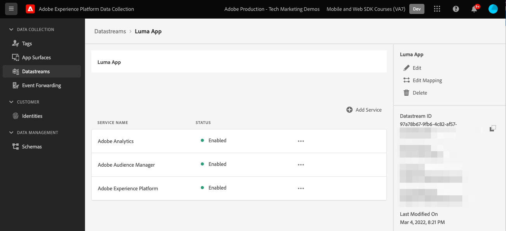

# Crear un flujo de datos

Aprenda a crear un conjunto de datos en Experience Platform.

Un conjunto de datos es una configuración del lado del servidor en Platform Edge Network.  El conjunto de datos garantiza que los datos entrantes de la red perimetral de plataforma se enruten correctamente a las aplicaciones y servicios de Adobe Experience Cloud. Para obtener más información, consulte la [documentación](https://experienceleague.adobe.com/docs/experience-platform/edge/fundamentals/datastreams.html?lang=es) o [video](https://experienceleague.adobe.com/docs/platform-learn/data-collection/edge-network/configure-datastreams.html?lang=es).

## Requisitos previos

Para crear un conjunto de datos, su organización debe estar aprovisionada para esta función en la interfaz de recopilación de datos (anteriormente [!UICONTROL Launch]) y debe tener permisos de usuario para [!UICONTROL Experience Platform] > [!UICONTROL Recopilación de datos] > **[!UICONTROL Administrar almacenes de datos]** y **[!UICONTROL Ver almacenes de datos]**.

## Objetivos de aprendizaje

En esta lección:

* Sepa cuándo utilizar un conjunto de datos.
* Crear un flujo de datos.
* Configure un conjunto de datos.

## Crear un flujo de datos

Los conjuntos de datos se pueden crear en la variable [!UICONTROL Recopilación de datos] interfaz con el [!UICONTROL Datastream] herramienta de configuración. Para crear un conjunto de datos:

1. Asegúrese de que está en el entorno limitado de Platform correcto.
1. Select **[!UICONTROL Nuevo conjunto de datos]**.

   

1. Proporcione un nombre, por ejemplo `Luma App`.
1. Seleccione el esquema creado en la lección anterior.
1. Seleccione **[!UICONTROL Guardar]**.

   

## Añadir servicios

A continuación, puede conectar los servicios de Experience Cloud al conjunto de datos. Cuando el SDK de Platform Mobile envía datos a la red perimetral, el conjunto de datos envía los datos a estos servicios:

1. Agregar **[!UICONTROL Adobe Analytics]** y proporcionar un grupo de informes.

1. Habilitar **[!UICONTROL Adobe Audience Manager]** (opcional).

1. Habilitar **[!UICONTROL Adobe Experience Platform]** y proporcione una **[!UICONTROL conjunto de datos]** (opcional).
   * Si aún no ha creado un conjunto de datos, siga las instrucciones [here](platform.md).

1. La configuración final debería tener este aspecto.
   

>[!NOTE]
>
>Al habilitar cada uno de los servicios que utiliza su organización, los datos recopilados en la aplicación móvil se pueden utilizar en todas partes. Para obtener más información sobre la configuración del conjunto de datos, consulte la documentación [here](https://experienceleague.adobe.com/docs/experience-platform/edge/fundamentals/datastreams.html#adobe-experience-platform-settings).

Al implementar el SDK de Platform Mobile en su propio sitio web, debe crear tres conjuntos de datos para asignarlos a los tres entornos de etiquetas (desarrollo, fase y producción). Si utiliza el SDK de Platform Mobile con aplicaciones basadas en plataforma como Adobe Real-time Customer Data Platform o Adobe Journey Optimizer, debe asegurarse de crear esos conjuntos de datos en los entornos limitados de Platform correspondientes.

Siguiente: **[Configuración de etiquetas](configure-tags.md)**

>[!NOTE]
>
>Gracias por invertir su tiempo en obtener información sobre el SDK de Adobe Experience Platform Mobile. Si tiene alguna pregunta, desea compartir comentarios generales o tiene sugerencias sobre contenido futuro, compártalas en este [Experience League de debate de la comunidad](https://experienceleaguecommunities.adobe.com/t5/adobe-experience-platform-launch/tutorial-discussion-implement-adobe-experience-cloud-in-mobile/td-p/443796)
