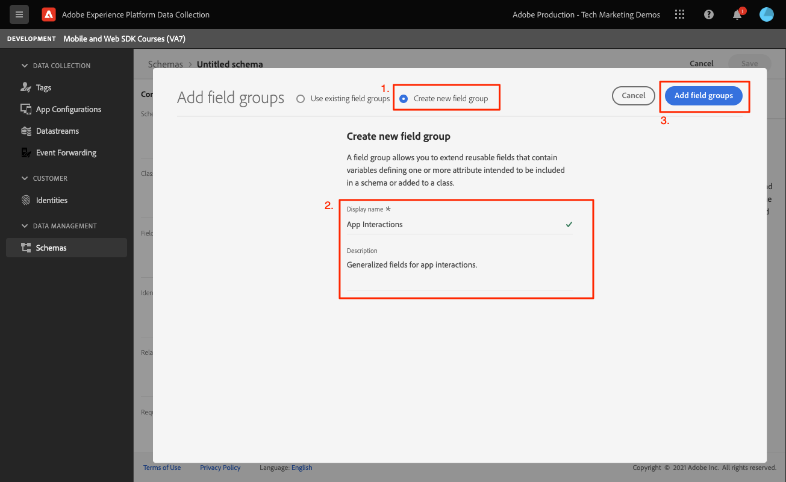

# Creación de un esquema XDM

Obtenga información sobre cómo crear un esquema XDM para eventos de aplicaciones móviles.

>[!INFO]
>
> Este tutorial se reemplazará con un nuevo tutorial con una nueva aplicación móvil de ejemplo a finales de noviembre de 2023

La estandarización y la interoperabilidad son conceptos clave detrás de Adobe Experience Platform. El modelo de datos de experiencia (XDM), impulsado por el Adobe, es un esfuerzo para estandarizar los datos de experiencia del cliente y definir esquemas para la administración de experiencias del cliente.

## ¿Qué son los esquemas XDM?

XDM es una especificación documentada públicamente y diseñada para mejorar la potencia de las experiencias digitales. Proporciona estructuras y definiciones comunes que permiten a cualquier aplicación comunicarse con los servicios de Platform. Al adherirse a los estándares XDM, todos los datos de experiencia del cliente se pueden incorporar en una representación común que puede ofrecer perspectivas de una manera más rápida e integrada. Puede obtener información valiosa de las acciones de los clientes, definir las audiencias de los clientes mediante segmentos y expresar los atributos del cliente con fines de personalización.

Experience Platform utiliza esquemas para describir la estructura de los datos de una manera uniforme y reutilizable. Al definir los datos de manera uniforme en todos los sistemas, resulta más fácil conservar el significado y, por lo tanto, obtener valor de los datos.

Antes de poder introducir datos en Platform, se debe crear un esquema para describir la estructura de los datos y proporcionar restricciones al tipo de datos que se pueden contener en cada campo. Los esquemas constan de una clase base y cero o más grupos de campos de esquema.

Para obtener más información sobre el modelo de composición de esquemas, incluidos los principios de diseño y las prácticas recomendadas, consulte la [conceptos básicos de composición de esquemas](https://experienceleague.adobe.com/docs/experience-platform/xdm/schema/composition.html?lang=es) o el curso [Modelar los datos de la experiencia del cliente con XDM](https://experienceleague.adobe.com/?recommended=ExperiencePlatform-D-1-2021.1.xdm&amp;lang=es).

>[!TIP]
>
>Si está familiarizado con la Referencia de diseño de soluciones (SDR) de Analytics, puede pensar en un esquema como un SDR más robusto.

## Requisitos previos

Para completar la lección, debe tener permiso para crear un esquema de Experience Platform.

## Objetivos de aprendizaje

En esta lección, deberá hacer lo siguiente:

* Creación de un esquema en la interfaz de recopilación de datos
* Añadir un grupo de campos estándar al esquema
* Crear y agregar un grupo de campos personalizados al esquema

## Navegar a esquemas

1. Inicie sesión en Adobe Experience Cloud.

1. Abra el conmutador de aplicaciones y seleccione **[!UICONTROL Recopilación de datos]**

   

1. Asegúrese de que está en la zona protegida de Experience Platform que está utilizando para este tutorial.

   >[!NOTE]
   >
   > Los clientes de aplicaciones basadas en Platform como Real-Time CDP deben utilizar una zona protegida de desarrollo para este tutorial. Otros clientes utilizarán la zona protegida de producción predeterminada.

1. Seleccionar **[!UICONTROL Esquemas]** bajo **[!UICONTROL Administración de datos]**.

   

Ahora se encuentra en la página de esquemas principales y se le presenta una lista de los esquemas existentes. También puede ver las pestañas correspondientes a los bloques de creación principales de un esquema:

* **Grupos de campos** son componentes reutilizables que definen uno o varios campos para capturar datos específicos, como detalles personales, preferencias de hotel o dirección.
* **Clases** defina los aspectos de comportamiento de los datos que contiene el esquema. Por ejemplo: `XDM ExperienceEvent` captura series de tiempo, datos de eventos y `XDM Individual Profile` captura datos de atributos de un individuo.
* **Tipos de datos** se utilizan como tipos de campo de referencia en clases o grupos de campos de la misma manera que los campos literales básicos.

Las descripciones anteriores son una descripción general de alto nivel. Para obtener más información, consulte la [Bloques de creación de esquemas](https://experienceleague.adobe.com/docs/platform-learn/tutorials/schemas/schema-building-blocks.html?lang=es) vídeo o lectura [Conceptos básicos de composición de esquemas](https://experienceleague.adobe.com/docs/experience-platform/xdm/schema/composition.html?lang=es) en la documentación del producto.

En este tutorial, se utiliza el grupo de campos Evento de experiencia del consumidor y se crea uno personalizado para mostrar el proceso.

>[!NOTE]
>
>El Adobe sigue añadiendo grupos de campos más estándar y deben utilizarse siempre que sea posible, ya que los servicios de Experience Platform entienden implícitamente estos campos y proporcionan una mayor coherencia cuando se utilizan en todos los componentes de Platform. El uso de grupos de campos estándar proporciona beneficios tangibles, como la asignación automática en Analytics y las funciones de IA en Platform.

## Arquitectura de esquema de aplicación de Luma

En un escenario real, el proceso de diseño del esquema podría tener este aspecto:

* Reúna los requisitos empresariales.
* Busque grupos de campos creados previamente para cubrir tantos requisitos como sea posible.
* Cree grupos de campos personalizados para cualquier hueco.

Para fines de aprendizaje, utilizará grupos de campos creados previamente y personalizados.

* **Evento de experiencia del consumidor**: grupo de campos creado previamente que tiene muchos campos comunes.
* **Información de aplicación**: grupo de campos personalizados diseñado para imitar los conceptos de TrackState/TrackAction Analytics.

<!--Later in the tutorial, you can [update the schema](lifecycle-data.md) to include the **[!UICONTROL AEP Mobile Lifecycle Details]** field group.-->

## Creación de un esquema

1. Seleccionar **[!UICONTROL Crear esquema]** para abrir el menú desplegable de opciones, seleccione **[!UICONTROL ExperienceEvent de XDM]**.

   

1. Buscar por `Consumer Experience Event`.

1. Puede obtener una vista previa de los campos o leer la descripción para obtener más información antes de seleccionar.

1. Seleccione la casilla de verificación y luego **[!UICONTROL Adición de grupos de campos]**.

   

   Volverá a la pantalla de composición del esquema principal, donde podrá ver todos los campos disponibles.

1. Asigne un nombre al esquema seleccionando **[!UICONTROL Esquema sin título]** desde la parte superior izquierda y, a continuación, proporcione un **[!UICONTROL Nombre para mostrar]** &amp; **[!UICONTROL Descripción]**, por ejemplo `Luma Tutorial Mobile` y `"Luma App" schema for Adobe Tutorial`

1. Seleccione **[!UICONTROL Guardar]**.

   

>[!NOTE]
>
>Tenga en cuenta que no tiene que utilizar todos los campos de un grupo. Si resulta útil, puede considerar un esquema como una capa de datos vacía. En la aplicación, rellene los valores relevantes en el momento adecuado.
>
>El `Consumer Experience Event` tiene un tipo de datos llamado `Web information`, que describe eventos como la vista de página y los clics en vínculos. En el momento de escribir este artículo, esta función no tiene paridad de aplicación móvil, por lo que va a crear la suya propia.

## Creación de un tipo de datos personalizado

Para empezar, cree un tipo de datos personalizado que describa los dos eventos:

* Vista de pantalla
* Interacción de aplicación

1. Seleccione el **[!UICONTROL Tipos de datos]** pestaña, luego seleccione **[!UICONTROL Crear tipo de datos]**.

   

1. Dale una. **[!UICONTROL Nombre para mostrar]** y **[!UICONTROL Descripción]**, por ejemplo `App Information` y `Custom data type describing "Screen Views" & "App Actions"`

   

   >[!TIP]
   >
   > Utilice siempre un formato legible y descriptivo [!UICONTROL nombres para mostrar] para sus campos personalizados, ya que esta práctica los hace más accesibles para los especialistas en marketing cuando los campos aparecen en servicios descendentes como el generador de segmentos.

1. Para añadir un campo, seleccione el botón (+).

   Este campo es un objeto contenedor para la interacción de la aplicación. Dale una maleta de camello **[!UICONTROL Nombre de campo]** `appInteraction`, **[!UICONTROL nombre para mostrar]** `App Interaction`, y **[!UICONTROL type]** `Object`.

1. Seleccione **[!UICONTROL Aplicar]**.

   

1. Para medir la frecuencia con la que se ha producido una acción, añada un campo seleccionando el botón (+) junto al `appInteraction` objeto creado.

1. Dale una maleta de camello **[!UICONTROL Nombre de campo]** `appAction`, **[!UICONTROL nombre para mostrar]** de `App Action` y **[!UICONTROL type]** `Measure`.

   Este paso sería el equivalente a un evento de éxito en Adobe Analytics.

1. Seleccione **[!UICONTROL Aplicar]**.

   

1. Añada un campo que describa el tipo de interacción seleccionando el botón (+) junto al `appInteraction` objeto.

1. Dale una. **[!UICONTROL Nombre de campo]** `name`, **[!UICONTROL nombre para mostrar]** de `Name` y **[!UICONTROL type]** `String`.

   Este paso es el equivalente de una dimensión en Adobe Analytics.

   

1. Desplácese hasta la parte inferior del carril derecho y seleccione **[!UICONTROL Aplicar]**.

1. Siga el mismo patrón para crear un `appStateDetails` objeto que contiene un campo Measure llamado `screenView` y dos cadenas denominadas `screenName` y `screenType`.

1. Seleccione **[!UICONTROL Guardar]**.

   

## Agregar un grupo de campos personalizados

Ahora añada un grupo de campos personalizados con su tipo de datos personalizado:

1. Abra el esquema que creó anteriormente en esta lección.

1. Seleccionar **[!UICONTROL Añadir]** junto a **[!UICONTROL Grupos de campos]**.

   

1. Esta vez cree un grupo de campos personalizados seleccionando la variable **[!UICONTROL Crear nuevo grupo de campos]** botón de opción cerca de la parte superior y, a continuación, proporcione un nombre y una descripción, por ejemplo, `App Interactions` y `Fields for app interactions`.

   

1. En la pantalla de composición principal, añada un campo a la raíz del esquema.

1. Seleccione el (+) junto al nombre del esquema.

1. En el carril derecho, proporcione un **[!UICONTROL Nombre de campo]** de `appInformation`, un nombre para mostrar de `App Information`.

1. Seleccionar `App Information` desde el **[!UICONTROL Tipo]** , el tipo de datos que creó en el ejercicio anterior.

1. Seleccione **[!UICONTROL Aplicar]**.

   

>[!NOTE]
>
>Los grupos de campos personalizados siempre se colocan bajo el identificador de organización de Experience Cloud.
>
>`_techmarketingdemos` se sustituye por el valor único de su organización.

Ahora tiene un esquema para utilizar para el resto del tutorial.

Siguiente: **[Crear un [!UICONTROL secuencia de datos]](create-datastream.md)**

>[!NOTE]
>
>Gracias por dedicar su tiempo a conocer el SDK móvil de Adobe Experience Platform. Si tiene preguntas, desea compartir comentarios generales o tiene sugerencias sobre contenido futuro, compártalas en este [Entrada de discusión de la comunidad Experience League](https://experienceleaguecommunities.adobe.com/t5/adobe-experience-platform-launch/tutorial-discussion-implement-adobe-experience-cloud-in-mobile/td-p/443796)