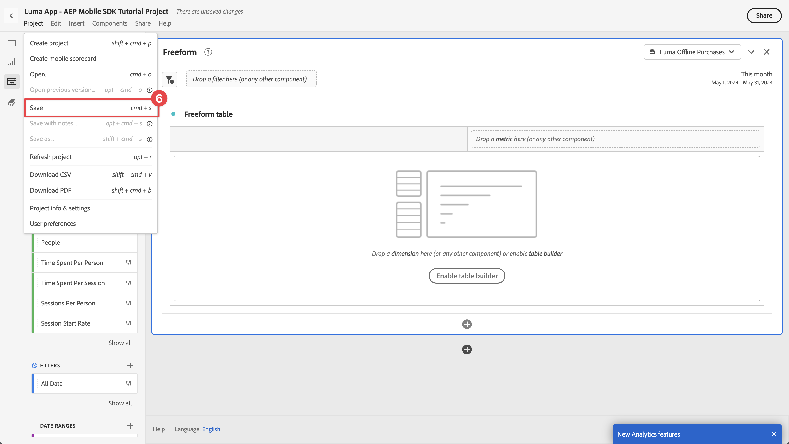
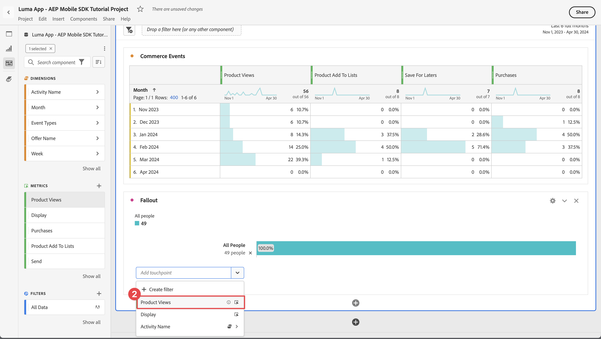

# Informar y analizar con Customer Journey Analytics

Obtenga información sobre cómo informar y analizar las interacciones de la aplicación móvil con Customer Journey Analytics.

Los datos del evento de la aplicación móvil, que ha recopilado y enviado al Edge Network de Platform en lecciones anteriores, se reenvían a los servicios configurados en el conjunto de datos. Si ha seguido la lección [Enviar datos al Experience Platform](platform.md), esos datos ahora se almacenan en un conjunto de datos del Experience Platform y están disponibles para que el Customer Journey Analytics los use para la generación de informes y análisis.

A diferencia de Adobe Analytics, el Customer Journey Analytics *utiliza* datos de conjuntos de datos creados en el Experience Platform. Los datos no se envían directamente al Customer Journey Analytics mediante el SDK para móviles de Adobe Experience Platform, sino que se envían a conjuntos de datos. A continuación, las conexiones se configuran en Customer Journey Analytics para seleccionar los conjuntos de datos que se utilizarán en los proyectos de informes y análisis.

Esta lección del tutorial se centra en la creación de informes y el análisis de los datos capturados desde la aplicación de tutorial de Luma. Una de las capacidades únicas de Customer Journey Analytics es la combinación de datos de varias fuentes (CRM, punto de venta, aplicación de fidelidad, centro de llamadas) y canales (web, móvil, sin conexión) para obtener información exhaustiva sobre los recorridos de los clientes. Esa capacidad está fuera del alcance de esta lección. Consulte [descripción general del Customer Journey Analytics](https://experienceleague.adobe.com/en/docs/analytics-platform/using/cja-overview/cja-overview) para obtener más información.

## Requisitos previos

Su organización debe estar aprovisionada y se debe conceder permiso para Customer Journey Analytics. Debe tener acceso de administrador al Customer Journey Analytics.

## Objetivos de aprendizaje

En esta lección, deberá hacer lo siguiente:

- Cree una conexión para definir los conjuntos de datos del Experience Platform que desea utilizar en Customer Journey Analytics.
- Cree una vista de datos para preparar los datos de los conjuntos de datos para la creación de informes y análisis
- Cree un proyecto para crear informes y visualizaciones que le permitan analizar los datos de su aplicación móvil.

La secuencia es intencional. Las conexiones utilizan conjuntos de datos y las vistas de datos utilizan conexiones.

## Crear una conexión

Una conexión en Customer Journey Analytics define los conjuntos de datos (y los datos dentro de estos conjuntos de datos) del Experience Platform que desea utilizar para los informes y análisis.

1. Vaya a la interfaz del Customer Journey Analytics mediante el menú Aplicaciones  de la parte superior derecha.

1. Seleccione **[!UICONTROL Conexiones]** en la barra de menús superior.

1. Asegúrese de seleccionar la ficha **[!UICONTROL Lista]** en la interfaz Conexiones. Verá una lista de conexiones existentes.

1. Seleccione **[!UICONTROL Crear nueva conexión]**.

1. En la pantalla **[!UICONTROL Conexiones]** > **[!UICONTROL Conexión sin título]**, en **[!UICONTROL Configuración de conexión]**

   1. Escriba un **[!UICONTROL nombre de conexión]**, por ejemplo `Luma App - AEP Mobile SDK Tutorial Connection`.
   2. Escriba una **[!UICONTROL descripción de la conexión]**, por ejemplo `Connection for the Luma app used in the AEP Mobile SDK tutorial`.

      En **[!UICONTROL configuración de datos]**:

   3. Seleccione el espacio aislado que utilizó para recopilar los datos de su aplicación móvil, por ejemplo **[!UICONTROL Cursos sobre Mobile y SDK para web]**.
   4. Seleccione **[!UICONTROL menos de 1 millón]** de **[!UICONTROL Cantidad promedio de eventos diarios]**.

   5. Seleccione **[!UICONTROL Agregar conjuntos de datos]** para seleccionar los conjuntos de datos del Experience Platform que desee utilizar en el Customer Journey Analytics.

      

   6. En el asistente **[!UICONTROL Agregar conjuntos de datos]**, paso **[!UICONTROL Seleccionar conjuntos de datos]**,

      1. Seleccione los siguientes conjuntos de datos:

         - **[!UICONTROL Conjunto de datos de evento de la aplicación móvil de Luma]**, el conjunto de datos que creó como parte de la sección [Crear un conjunto de datos](platform.md#create-a-dataset) en la lección para Experience Platform.
         - **[!UICONTROL ODE DecisionEvents - *nombre de zona protegida*] toma de decisiones**
         - **[!UICONTROL Conjuntos de datos de evento de seguimiento push de AJO]**

      1. Seleccione **[!UICONTROL Siguiente]**.

         

   7. En el paso **[!UICONTROL Configuración de conjuntos de datos]** del asistente **[!UICONTROL Agregar conjuntos de datos]**, debe definir los detalles para cada uno de los conjuntos de datos de evento.
      1. Consulte las siguientes tablas para obtener la configuración adecuada:

         | Conjunto de datos | ID de persona ① | Marca de tiempo ② | ③ de tipo de fuente de datos | Importar todos los ④ de datos nuevos | Relleno de todos los ⑤ de datos existentes |
         |---|---|---|---|---|---|
         | Conjunto de datos de evento de aplicación móvil Luma | identityMap | timestamp | Datos de aplicación móvil | habilitar | habilitar |
         | ODE DecisionEvents - *nombre de zona protegida* toma de decisiones | identityMap | timestamp | Datos de aplicación móvil | habilitar | habilitar |
         | Conjunto de datos de evento de experiencia de seguimiento push de AJO | identityMap | timestamp | Datos de aplicación móvil | habilitar | habilitar |

      1. Seleccione **[!UICONTROL Agregar conjuntos de datos]**.

         

1. Vuelva a **[!UICONTROL Conexiones]** > **[!UICONTROL Aplicación Luma - Conexión de tutorial del SDK móvil de AEP]**, seleccione **[!UICONTROL Guardar]** para guardar la conexión.

   

Ahora ha definido la conexión y el Customer Journey Analytics agrega los datos de los conjuntos de datos a su propia base de datos interna. Esta recopilación de datos puede tardar algún tiempo, según la cantidad de datos. Para la aplicación de tutorial, espere un par de horas a que los datos aparezcan en Customer Journey Analytics.

Para ver el estado de la conexión:

1. Seleccione **[!UICONTROL Connections]** en la interfaz principal del Customer Journey Analytics.
1. Seleccione el nombre de su conexión, por ejemplo **[!UICONTROL Aplicación de Luma - Conexión de tutorial del SDK móvil de AEP]**.

En **[!UICONTROL Conexiones]** > **[!UICONTROL Aplicación Luma - Conexión de tutorial de AEP Mobile SDK]**, verá lo siguiente:

1. Información sobre el total de registros agregados, registros omitidos y registros eliminados. Asegúrese de seleccionar **[!UICONTROL Todos los conjuntos de datos]** y seleccione un período de tiempo apropiado para ver los detalles de su conexión. Puede usar  para abrir un cuadro de diálogo y seleccionar el período de tiempo.
1. Información para conjuntos de datos individuales sobre registros añadidos, registros omitidos, registros eliminados, etc.

   

## Creación de una vista de datos

Una vez agregados los registros de los conjuntos de datos a Customer Journey Analytics, puede crear una vista de datos para definir sobre qué componentes de los datos desea informar.

Una vista de datos es un contenedor específico del Customer Journey Analytics que le permite determinar cómo interpretar los datos de una conexión. Puede configurar campos estándar y de esquema de cualquiera de los conjuntos de datos que haya definido en su Conexión como componentes (dimensiones, métricas) en Analysis Workspace.

Una vista de datos en Customer Journey Analytics ofrece una enorme flexibilidad para configurar y definir correctamente los datos de su conexión. En este tutorial, solo se utiliza la funcionalidad necesaria para los informes y análisis. Consulte [Vistas de datos](https://experienceleague.adobe.com/en/docs/analytics-platform/using/cja-dataviews/data-views) para obtener más información.

Para crear la vista de datos:

1. Vaya a la interfaz del Customer Journey Analytics mediante el menú Aplicaciones  de la parte superior derecha.

1. Seleccione **[!UICONTROL Vistas de datos]** en la barra de menús superior.
1. Seleccione **[!UICONTROL Crear nueva vista de datos]**.
1. En **[!UICONTROL Vistas de datos >]**, asegúrese de que la ficha **[!UICONTROL Configurar]** esté seleccionada.

   1. Seleccione su conexión en la lista desplegable Conexión de configuración, por ejemplo **[!UICONTROL Conexión de tutorial de la aplicación Luma - AEP Mobile SDK]**.
   1. Escriba un Nombre para la vista de datos, por ejemplo: `Luma App - AEP Mobile SDK Tutorial Data view`.
   1. Seleccione **[!UICONTROL Guardar y continuar]**.

      

1. En la pestaña **[!UICONTROL Componentes]** de la **[!UICONTROL vista de datos del tutorial de la aplicación Luma - SDK móvil de AEP]**, puede definir las métricas y las dimensiones que desee utilizar al crear informes en su aplicación móvil. De forma predeterminada, varias métricas y dimensiones estándar (denominadas conjuntamente componentes) ya están configuradas para la vista de datos. Sin embargo, la vista de datos requiere más componentes.  Para agregar un campo de esquema a partir del esquema definido anteriormente o de esquemas predeterminados (consulte [Crear un esquema](create-schema.md) lección), como componente (dimensión o métrica):

   1. Busque el campo de esquema:

      - busque el componente usando el campo de búsqueda  ***[!UICONTROL Buscar campos de esquema]***. Por ejemplo, `productListAdd`, o

        

      - bajar al campo de esquema en  **[!UICONTROL Conjuntos de datos de eventos]** .  Por ejemplo,  **[!UICONTROL Conjuntos de datos de evento]**   **[!UICONTROL comercio]**   **[!UICONTROL productListAdds]** 

        

   1. Arrastre el campo de esquema específico desde el panel Campos de esquema y suéltelo en la lista **[!UICONTROL MÉTRICAS]** o **[!UICONTROL DIMENSION]** del panel [!UICONTROL Componentes incluidos].

      

   1. Puede configurar los ajustes de un componente. Seleccione el componente y configure las opciones en el panel derecho.  Por ejemplo, puede cambiar el nombre de **[!UICONTROL commerce.productListAdds]** por `Product Add To Lists` mediante el campo **[!UICONTROL COMPONENT SETTINGS]** > **[!UICONTROL Component name]** en el panel derecho.

      

      O configure **[!UICONTROL INCLUIR VALORES DE EXCLUSIÓN]**.

      

   1. Ahora que sabe cómo agregar campos a la vista de datos y configurar el componente resultante, utilice las tablas siguientes para una lista de campos de esquema para agregar como métricas o dimensiones. Utilice el valor de columna **Ruta de esquema** de la tabla siguiente para buscar o recorrer el campo de esquema específico. Una vez agregadas las métricas y las dimensiones, compruebe en la tabla el valor de columna **Configuración del componente** si se requiere una configuración específica para un componente, como su **[!UICONTROL Nombre del componente]** o la definición de **[!UICONTROL INCLUIR VALORES DE EXCLUSIÓN]**.

      **MÉTRICAS**

      | Nombre del componente | Conjunto de datos | Tipo de datos del esquema | Ruta de esquema | Configuración de componentes |
      |---|---|---|---|---|
      | Descartar | Conjunto de datos de evento de experiencia de seguimiento push de AJO, conjunto de datos de evento de aplicación móvil de Luma | Entero | _experience.decisioning. propositionEventType.dismiss | Nombre de componente: `Dismiss` |
      | Cancelar suscripción | Conjunto de datos de evento de experiencia de seguimiento push de AJO, conjunto de datos de evento de aplicación móvil de Luma | Entero | _experience.decisioning. propositionEventType.unsubscribe | Nombre de componente: `Unsubscribe` |
      | Déclencheur | Conjunto de datos de evento de experiencia de seguimiento push de AJO, conjunto de datos de evento de aplicación móvil de Luma | Entero | _experience.decisioning. propositionEventType.déclencheur | Nombre de componente: `Trigger` |
      | Mostrar | Conjunto de datos de evento de experiencia de seguimiento push de AJO, conjunto de datos de evento de aplicación móvil de Luma | Entero | _experience.decisioning. propositionEventType.display | Nombre de componente: `Display` |
      | Enviar | Conjunto de datos de evento de experiencia de seguimiento push de AJO, conjunto de datos de evento de aplicación móvil de Luma | Entero | _experience.decisioning. propositionEventType.send | Nombre de componente: `Send` |
      | Interactuar | Conjunto de datos de evento de experiencia de seguimiento push de AJO, conjunto de datos de evento de aplicación móvil de Luma | Entero | _experience.decisioning. propositionEventType.interaction | Nombre de componente: `Interact` |
      | Eventos de ubicación | Conjunto de datos de evento de experiencia de seguimiento push de AJO, conjunto de datos de evento de aplicación móvil de Luma, eventos de decisión de ODE: decisiones sobre sdk para móviles y web | Cadena | Tipo de evento | Nombre de componente: `Location Events`   |
      | Vistas del producto | Conjunto de datos de evento de aplicación móvil Luma | Duplicada | commerce.productViews.value | Nombre de componente: `Product Views` |
      | Producto Añadido A Listas | Conjunto de datos de evento de aplicación móvil Luma | Duplicada | commerce.productListAdds.value | Nombre de componente: `Product Add To Lists` |
      | Compras | Conjunto de datos de evento de aplicación móvil Luma | Duplicada | commerce.purchases.value | Nombre de componente: `Purchases` |
      | Guardados para después | Conjunto de datos de evento de aplicación móvil Luma | Duplicada | commerce.saveForLaters.value | Nombre de componente: `Save For Laters` |
      | Interacciones de aplicación | Conjunto de datos de evento de aplicación móvil Luma | Duplicada | _techmarketingdemos.appInformation. appInteraction.appAction.value | Nombre de componente: `App Interactions` |
      | Vistas de pantalla | Conjunto de datos de evento de aplicación móvil Luma | Duplicada | _techmarketingdemos.appInformation. appStateDetails.screenView.value | Nombre de componente: `Screen Views` |

      {style="table-layout:auto"}

      >[!NOTE]
      >
      >Observe cómo el campo de esquema de la métrica Eventos de ubicación usa **[!UICONTROL INCLUDE EXCLUDE VALUES]** para contar los tipos de eventos que contienen `location`.

      La configuración de la vista de datos de **[!UICONTROL METRICS]** debe coincidir a continuación después de agregar todos los campos de esquema de la tabla anterior como componente de métrica:

      

      **DIMENSION**

      | Nombre del componente | Conjunto de datos | Tipo de datos del esquema | Ruta de esquema | Configuración de componentes |
      |---|---|---|---|---|
      | Ciudad | Conjunto de datos de evento de experiencia de seguimiento push de AJO, conjunto de datos de evento de aplicación móvil de Luma | Cadena | placeContext.geo.city | Nombre de componente: `City` |
      | Tipos de eventos | Conjunto de datos de evento de experiencia de seguimiento push de AJO, conjunto de datos de evento de aplicación móvil de Luma, eventos de decisión de ODE: decisiones sobre sdk para móviles y web | Cadena | eventType | Nombre de componente: `Event Types` |
      | Nombre de opción de decisión | Conjunto de datos de evento de experiencia de seguimiento push de AJO, conjunto de datos de evento de aplicación móvil de Luma, eventos de decisión de ODE: decisiones sobre sdk para móviles y web | Cadena | _experience.decisioning. propositions.items.name | Nombre de componente: `Decision Option Name` |
      | Nombre de interacción de aplicación | Conjunto de datos de evento de aplicación móvil Luma | Cadena | _techmarketingdemos.appInformation. appInteraction.name | Nombre de componente: `App Interaction Name` |
      | Nombre de pantalla | Conjunto de datos de evento de aplicación móvil Luma | Cadena | _techmarketingdemos.appInformation. appStateDetails.screenName | Nombre de componente: `Screen Name` |
      | Nombre de la actividad | Eventos de decisión de ODE: toma de decisiones de sdk para móviles y web | Cadena | _experience.decisioning. propositionDetails.activity.name | Nombre de componente: `Activity Name` |
      | Nombre de la oferta | Eventos de decisión de ODE: toma de decisiones de sdk para móviles y web | Cadena | _experience.decisioning. propositionDetails.selections.name | Nombre de componente: `Offer Name` |

      {style="table-layout:auto"}

      La configuración de la vista de datos de **[!UICONTROL DIMENSION]** debe coincidir a continuación después de agregar todos los campos de esquema de la tabla anterior como un componente de dimensión:

      

   1. Seleccione **[!UICONTROL Guardar y continuar]**.

1. La ficha **[!UICONTROL Configuración]** de la **[!UICONTROL aplicación Luma - Vista de datos del tutorial del SDK móvil de AEP]** le permite configurar filtros y ajustes de sesión. Para este tutorial, no se requiere ninguna configuración adicional.

   - Seleccione **[!UICONTROL Guardar y finalizar]**.

Ha definido la vista de datos y ya está todo listo para empezar a crear los informes y las visualizaciones.

## Creación de un proyecto

Los proyectos de Workspace se utilizan en Customer Journey Analytics para generar informes y visualizaciones. Existen muchas posibilidades para crear informes completos y visualizaciones atractivas, pero esto está fuera del ámbito de este tutorial. Consulte [Información general de Workspace](https://experienceleague.adobe.com/en/docs/customer-journey-analytics-learn/tutorials/analysis-workspace/workspace-projects/analysis-workspace-overview) y [Crear un nuevo proyecto](https://experienceleague.adobe.com/en/docs/customer-journey-analytics-learn/tutorials/analysis-workspace/workspace-projects/build-a-new-project) para obtener más información.

En esta sección de la lección, debe crear un proyecto que muestre informes y visualizaciones sobre:

- Uso de la aplicación: uso de la información en la pantalla e interacciones de la aplicación.
- Commerce: con los eventos de comercio, como la vista de producto, agregar al carro de compras y comprar.
- Ofertas: uso de las ofertas mostradas en los eventos de la aplicación.
- Visitas de tienda: uso de los eventos de geovalla (simulados) de la aplicación.

Para crear el proyecto:

1. Vaya a la interfaz del Customer Journey Analytics mediante el menú Aplicaciones  de la parte superior derecha.

1. Seleccione **[!UICONTROL Workspace]** en la barra de menús superior.

1. Seleccione **[!UICONTROL Crear proyecto]**.

   1. Seleccione **[!UICONTROL Proyecto Workspace en blanco]** en el cuadro de diálogo emergente.

   1. Seleccione **[!UICONTROL Crear]**.

      

1. Se le presenta la interfaz **[!UICONTROL Nuevo proyecto]**. En esta interfaz, puede generar informes y visualizaciones.

1. Seleccione el nombre del proyecto (**[!UICONTROL Nuevo proyecto]**) y proporcione su propio nombre para el proyecto. Por ejemplo, `Luma App - AEP Mobile SDK Tutorial Project`.
   

1. Para guardar el proyecto, seleccione **[!UICONTROL Proyecto]** > **[!UICONTROL Guardar]**.
   

1. En el cuadro de diálogo **[!UICONTROL Guardar]**, ignore todos los demás campos y seleccione **[!UICONTROL Guardar]**.
   

>[!IMPORTANT]
>
>   Recuerde guardar el proyecto con regularidad; de lo contrario, se perderán los cambios. Puede guardar rápidamente su proyecto usando **[!UICONTROL ctrl + s]** (Windows) o **[!UICONTROL ⌘ (cmd) + s]** (macOS).

Ya ha configurado el proyecto. Se proporciona una tabla de forma libre de forma predeterminada. Antes de agregar componentes, asegúrese de que el panel de forma libre utiliza la vista de datos y el período de tiempo correctos.

1. Seleccione la vista de datos en la lista desplegable. Por ejemplo, **[!UICONTROL aplicación de Luma - Vista de datos del tutorial del SDK móvil de AEP]**. Si no puede ver su vista de datos en la lista, seleccione **[!UICONTROL Mostrar todo]** en la parte inferior de la lista desplegable.
   

1. Para definir el período de tiempo apropiado para el panel, seleccione el ajuste preestablecido predeterminado **[!UICONTROL Este mes]**, introduzca una fecha de inicio y finalización personalizada, o use un **[!UICONTROL Ajuste preestablecido]** (como **[!UICONTROL Últimos 6 meses completos]**) y seleccione **[!UICONTROL Aplicar]**.
   

### Uso de aplicaciones

Ahora está listo para informar sobre cómo se utiliza la aplicación. Ha agregado el código necesario en la aplicación para registrar las interacciones de la aplicación y las pantallas que se usan en la aplicación (consulte la lección [Seguimiento de eventos](events.md)). Ahora quiere informar sobre estos datos.

#### Nombres de pantalla

Para informar sobre las pantallas visualizadas en la aplicación:

1. Cambie el nombre del panel **[!UICONTROL Forma libre]** a `App Usage`.

1. Cambie el nombre de **[!UICONTROL tabla de forma libre]** a `Screen Names`.

1. Seleccione **[!UICONTROL Mostrar todo]** debajo de la lista **[!UICONTROL MÉTRICAS]**.

1. Arrastre y suelte el componente **[!UICONTROL Vistas de pantalla]** en [!UICONTROL _Suelte una **métrica**&#x200B;aquí (o cualquier otro componente_)].
   
La tabla de forma libre ahora muestra las vistas de pantalla de cada día durante el período de tiempo seleccionado. Sin embargo, quiere mostrar el número de vistas de pantalla de cada una de las diferentes pantallas utilizadas en la aplicación.

1. Para mostrar la lista de componentes **[!UICONTROL DIMENSION]**, seleccione  para quitar el filtro  **[!UICONTROL Métricas]** del carril de componentes.
   

1. Seleccione **[!UICONTROL Mostrar todos]** debajo de la lista de **[!UICONTROL DIMENSION]**.

1. Arrastre y suelte el componente **[!UICONTROL Screen Name]** en el encabezado **[!UICONTROL Day]**. La operación muestra  **[!UICONTROL Reemplazar]** para indicar el reemplazo de la dimensión.
   

Se ha completado la primera tabla de forma libre del informe.

>[!NOTE]
>
>Guarde el proyecto antes de continuar.

#### Interacciones de aplicación

A continuación, creará una tabla de forma libre para informar sobre cómo interactuaron los usuarios con la aplicación.

1. Seleccione  y en la  emergente para agregar una nueva tabla de forma libre.
   

1. Cambie el nombre de **[!UICONTROL tabla de forma libre (2)]** a `App Interactions`.

1. Arrastre y suelte la métrica **[!UICONTROL Interacciones de aplicaciones]** en [!UICONTROL _Suelte una **métrica**&#x200B;aquí (o cualquier otro componente_)].

1. Arrastre y suelte la dimensión **[!UICONTROL Nombre de interacción de aplicación]** en el encabezado **[!UICONTROL Día]** para reemplazar esta dimensión.

El segundo informe ya está listo y muestra las interacciones de la aplicación.

La información está limitada principalmente porque usted implementó `MobileSDK.shared.sendAppInteractionEvent(actionName: "<actionName>")` llamadas de API solamente en la pantalla de inicio de sesión. Si agrega esta llamada de API a más pantallas de la aplicación, este informe se vuelve más informativo.

>[!NOTE]
>
>Guarde el proyecto antes de continuar.

### Commerce

Ahora desea crear un informe en un panel independiente sobre los eventos de comercio que se producen en la aplicación.

#### Eventos de Commerce

1. Seleccione  fuera del panel [!UICONTROL Uso de la aplicación] actual para crear un nuevo panel.
   

1. Asegúrese de seleccionar el período de tiempo adecuado.

1. Seleccione  **[!UICONTROL Tabla de forma libre]** para crear una nueva tabla de forma libre.
   

1. Cambiar el nombre de **[!UICONTROL panel]** a `Commerce`.

1. Cambie el nombre de **[!UICONTROL tabla de forma libre]** a `Commerce Events`.

1. Arrastre y suelte la métrica **[!UICONTROL Vistas del producto]** en [!UICONTROL _Suelte una **métrica**&#x200B;aquí (o cualquier otro componente_)].

1. Arrastre y suelte la métrica **[!UICONTROL Product Add To Lists]** a la derecha de la columna **[!UICONTROL Product Views]** para insertar esta columna en la tabla de forma libre. Asegúrese de que **[!UICONTROL + Add]** (en azul) se muestre al insertar la columna.
   

1. Repita el paso anterior para agregar la métrica **[!UICONTROL Guardar para más tarde]** y la métrica **[!UICONTROL Compras]** a la tabla de forma libre.

1. Arrastre y suelte la dimensión **[!UICONTROL Month]** sobre la dimensión **[!UICONTROL Day]** para cambiar la creación de informes de diaria a mensual.

Se ha completado el informe Eventos de Commerce.

>[!NOTE]
>
>Guarde el proyecto antes de continuar.

#### Abandonos

A continuación, creará una visualización de visitas en el orden previsto para el canal de comercio que muestra cuántos usuarios que vieron los productos agregaron estos productos al carro de compras y, a partir de ahí, cuántos usuarios guardaron estos productos para más adelante.

1. Seleccione  en el panel **[!UICONTROL Commerce]** y, en la ventana emergente, seleccione  (que representa la visualización de las visitas en el orden previsto).

1. Seleccione **[!UICONTROL Vistas del producto]** de la lista desplegable [!UICONTROL *Agregar punto de contacto*].
   
También puede arrastrar y soltar la dimensión **[!UICONTROL Vista de productos]** debajo de la dimensión **[!UICONTROL Todas las personas]** en la visualización de **[!UICONTROL Abandonos]**.

1. Repita el paso anterior para las dimensiones **[!UICONTROL Product Add To Lists]** y **[!UICONTROL Purchases]**.

Se ha completado el informe de visualización de abandonos.

>[!NOTE]
>
>Guarde el proyecto antes de continuar.

### Ofertas

Desea informar sobre cuántas ofertas y qué ofertas se muestran a los usuarios de la aplicación.

#### Información general mensual

1. Seleccione  fuera del panel actual de Commerce para crear un panel nuevo.

1. Cambie el nombre del **[!UICONTROL panel]** a `Offers`.

1. Asegúrese de seleccionar el periodo adecuado.

1. Seleccione  para crear una nueva tabla de forma libre.

1. Cambie el nombre de la **[!UICONTROL tabla de forma libre]** a `Monthly Overview`.

1. Arrastre y suelte la métrica **[!UICONTROL Display]** en [!UICONTROL _Suelte una métrica **aquí (o cualquier otro componente_)].**

1. Arrastre y suelte la dimensión **[!UICONTROL Month]** en la columna **[!UICONTROL Day]** para reemplazar la dimensión.

Se ha completado la descripción general mensual de las ofertas.

>[!NOTE]
>
>Guarde el proyecto antes de continuar.

#### Ofertas a personas

También desea disponer de un informe que muestre qué ofertas se mostraron en qué números a los usuarios de la aplicación.

1. Seleccione  en el panel **[!UICONTROL Ofertas]** y de la ventana emergente para agregar una nueva tabla de forma libre.

1. Cambie el nombre de **[!UICONTROL tabla de forma libre (2)]** a `People`.

1. Arrastre y suelte la métrica **[!UICONTROL Personas]** en [!UICONTROL _Suelte una **métrica**&#x200B;aquí (o cualquier otro componente_)].

1. Arrastre y suelte **[!UICONTROL Nombre de actividad]** en la columna **[!UICONTROL Día]** para reemplazar la dimensión.

1. Haga clic con el botón derecho en la fila para identificar una o más de las decisiones de oferta que definió en la lección [Crear y mostrar ofertas con Administración de decisiones](journey-optimizer-offers.md). Por ejemplo, **[!UICONTROL Luma - Decisión de aplicación móvil]**.

1. En el menú contextual, seleccione **[!UICONTROL Desglose]** > **[!UICONTROL Dimension]** > **[!UICONTROL Nombre de oferta]**. Esta selección desglosará la dimensión Nombre de la actividad en Nombres de oferta.
   

Se ha completado el informe Ofertas a personas.

>[!NOTE]
>
>Guarde el proyecto antes de continuar.

### Visitas de tienda

Por último, desea informar sobre las visitas a las tiendas.

1. Seleccione  fuera del panel de ofertas actual para crear un panel nuevo.

1. Cambie el nombre del **[!UICONTROL panel]** a `Store Visits`.

1. Asegúrese de seleccionar el periodo adecuado.

1. Seleccione  para crear una nueva tabla de forma libre.

1. Cambie el nombre de **[!UICONTROL tabla de forma libre]** a `Store Entries / Exits Across Cities`.

1. Arrastre y suelte la métrica **[!UICONTROL Eventos de ubicación]** en [!UICONTROL _Suelte una **métrica**&#x200B;aquí (o cualquier otro componente_)]. El informe ahora muestra una descripción general diaria de todos los eventos de ubicación que se produjeron en la aplicación. Recuerde cómo configuró específicamente esta dimensión como parte de su [vista de datos](#create-a-data-view).

1. Arrastre y suelte la dimensión **[!UICONTROL City]** en el encabezado de columna **[!UICONTROL Day]** para reemplazar la dimensión. El informe ahora muestra las ciudades para los eventos de ubicación.

1. Para quitar los eventos de geolocalización sin ciudades asociadas, selecciona  y, en la ventana emergente **[!UICONTROL Buscar]**, desactiva **[!UICONTROL Incluir &quot;Sin valor&quot;]** y, a continuación, selecciona **[!UICONTROL Aplicar]**.

   

   Esta acción quita la fila **[!UICONTROL Sin valor]** del informe.

1. Seleccione todas las filas de la tabla, haga clic con el botón derecho del ratón y, en el menú contextual, seleccione Desglose > Dimension > Tipos de eventos.

Se ha completado el informe Visitas de tienda. Ahora tiene un informe que muestra los usuarios que están entrando y saliendo de las inmediaciones de sus ubicaciones de almacenamiento (tal como definió estas ubicaciones en la lección [Places](places.md)).

Tenga en cuenta que si realmente desea informar sobre las personas que visitan físicamente su tienda, puede utilizar señalizaciones de. Pero esperamos que haya capturado el concepto de creación de informes sobre los datos de geolocalización.

## Pasos siguientes

Ahora debería tener una comprensión básica de cómo informar y visualizar sobre el uso de la aplicación móvil, las interacciones y mucho más mediante Customer Journey Analytics.

>[!SUCCESS]
>
>
>Gracias por dedicar su tiempo a conocer el SDK móvil de Adobe Experience Platform. Si tiene preguntas, desea compartir comentarios generales o tiene sugerencias sobre contenido futuro, compártalas en esta [publicación de debate de la comunidad de Experience League](https://experienceleaguecommunities.adobe.com/t5/adobe-experience-platform-data/tutorial-discussion-implement-adobe-experience-cloud-in-mobile/td-p/443796).

Siguiente: **[Conclusión y pasos siguientes](conclusion.md)**
