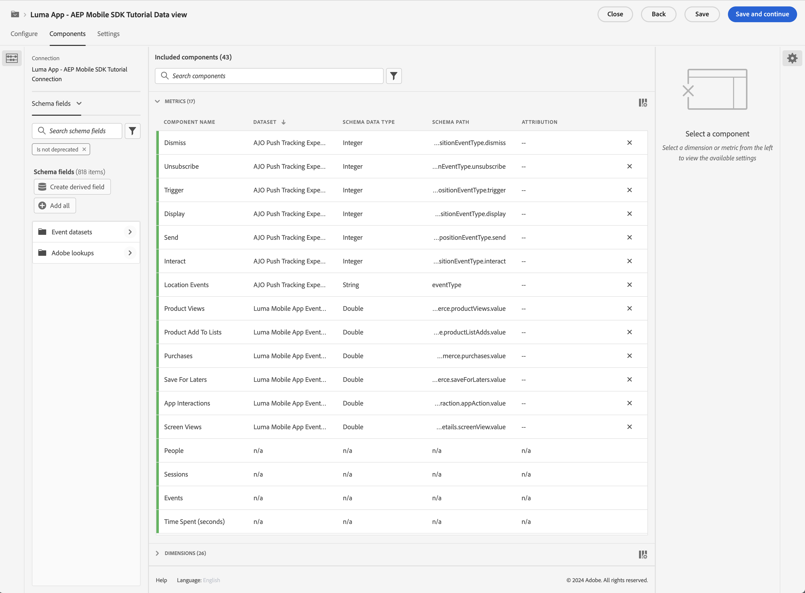

# Informar y analizar con Customer Journey Analytics

Obtenga información sobre cómo informar y analizar las interacciones de la aplicación móvil con Customer Journey Analytics.

Los datos del evento de la aplicación móvil, que ha recopilado y enviado al Edge Network de Platform en lecciones anteriores, se reenvían a los servicios configurados en el conjunto de datos. Si ha seguido la [Envío de datos al Experience Platform](platform.md) En esta lección, esos datos ahora se almacenan en el lago de datos de Experience Platform como conjuntos de datos de. En este punto, los datos ya están disponibles para que los use el Customer Journey Analytics en los informes y análisis.

Al contrario que Adobe Analytics, Customer Journey Analytics *utiliza* datos de conjuntos de datos creados en Experience Platform. Los datos no se envían directamente al Customer Journey Analytics mediante el SDK para móviles de Adobe Experience Platform, sino que se envían a conjuntos de datos. A continuación, las conexiones se configuran en Customer Journey Analytics para seleccionar los conjuntos de datos que se utilizarán en los proyectos de informes y análisis.

Esta lección del tutorial se centra en la creación de informes y el análisis de los datos capturados desde la aplicación de tutorial de Luma. Una de las capacidades únicas de Customer Journey Analytics es la combinación de datos de varias fuentes (CRM, punto de venta, aplicación de fidelidad, centro de llamadas) y canales (web, móvil, sin conexión) para obtener información exhaustiva sobre los recorridos de los clientes. Esa capacidad está fuera del alcance de esta lección. Consulte [Introducción al Customer Journey Analytics](https://experienceleague.adobe.com/en/docs/analytics-platform/using/cja-overview/cja-overview) para obtener más información.

## Requisitos previos

Su organización debe estar aprovisionada y se debe conceder permiso para Customer Journey Analytics. Debe tener acceso de administrador al Customer Journey Analytics.

## Objetivos de aprendizaje

En esta lección, deberá hacer lo siguiente:

- Cree una conexión para definir los conjuntos de datos del Experience Platform que desea utilizar en Customer Journey Analytics.
- Cree una vista de datos para preparar los datos de los conjuntos de datos para la creación de informes y análisis
- Cree un proyecto para crear informes y visualizaciones que le permitan analizar los datos de su aplicación móvil.

La secuencia es intencional. Las conexiones utilizan conjuntos de datos y las vistas de datos utilizan conexiones.

## Crear una conexión

Una conexión en Customer Journey Analytics define los conjuntos de datos (y los datos dentro de estos conjuntos de datos) del Experience Platform que desea utilizar para los informes y análisis.

1. Vaya a la interfaz del Customer Journey Analytics mediante las aplicaciones  en la parte superior derecha.

1. Seleccionar **[!UICONTROL Conexiones]** en la barra de menús superior.

1. Asegúrese de seleccionar **[!UICONTROL Lista]** en la interfaz Conexiones. Verá una lista de conexiones existentes.

1. Seleccionar **[!UICONTROL Crear nueva conexión]**.

1. En el **[!UICONTROL Conexiones]** > **[!UICONTROL Conexión sin título]** pantalla, en **[!UICONTROL Configuración de conexión]**

   1. Introduzca una **[!UICONTROL Nombre de conexión]**, por ejemplo `Luma App - AEP Mobile SDK Tutorial Connection`.
   2. Introduzca una **[!UICONTROL Descripción de conexión]**, por ejemplo `Connection for the Luma app used in the AEP Mobile SDK tutorial`.

      Entrada **[!UICONTROL Configuración de datos]**:

   3. Seleccione la zona protegida que ha utilizado para recopilar los datos de su aplicación móvil, por ejemplo **[!UICONTROL Cursos de SDK para móviles y web]**.
   4. Seleccionar **[!UICONTROL menos de 1 millón]** desde el **[!UICONTROL Promedio del número de eventos diarios]**.

   5. Seleccionar **[!UICONTROL Añadir conjuntos de datos]** para seleccionar los conjuntos de datos del Experience Platform que desea utilizar en Customer Journey Analytics.

      

   6. En el **[!UICONTROL Añadir conjuntos de datos]** asistente, **[!UICONTROL Seleccionar conjuntos de datos]** paso,

      1. Seleccione los siguientes conjuntos de datos:

         - **[!UICONTROL Conjunto de datos de evento de aplicación móvil Luma]**, el conjunto de datos que ha creado como parte de [Crear un conjunto de datos](platform.md#create-a-dataset) de la lección de Experience Platform.
         - **[!UICONTROL Eventos de decisión de MODE - *nombre de zona protegida*] toma de decisiones**
         - **[!UICONTROL Conjuntos de datos de evento de seguimiento push AJO]**

      1. Seleccionar **[!UICONTROL Siguiente]**.

         

   7. En el **[!UICONTROL Añadir conjuntos de datos]** asistente, **[!UICONTROL Configuración de conjuntos de datos]** paso, debe definir los detalles para cada uno de los conjuntos de datos de evento.
      1. Consulte las siguientes tablas para obtener la configuración adecuada:

         | Conjunto de datos | ID de persona ① | Marca de tiempo ② | ③ de tipo de fuente de datos | Importar todos los ④ de datos nuevos | Relleno de todos los ⑤ de datos existentes |
         |---|---|---|---|---|---|
         | Conjunto de datos de evento de aplicación móvil Luma | identityMap | timestamp | Datos de aplicación móvil | habilitar | habilitar |
         | Eventos de decisión de MODE - *nombre de zona protegida* toma de decisiones | identityMap | timestamp | Datos de aplicación móvil | habilitar | habilitar |
         | Conjunto de datos de evento de experiencia de seguimiento push AJO | identityMap | timestamp | Datos de aplicación móvil | habilitar | habilitar |

      1. Seleccionar **[!UICONTROL Añadir conjuntos de datos]**.

         

1. De nuevo en **[!UICONTROL Conexiones]** > **[!UICONTROL Aplicación Luma: conexión del tutorial del SDK móvil de AEP]**, seleccione **[!UICONTROL Guardar]** para guardar la conexión.

   

Ahora ha definido la conexión y el Customer Journey Analytics agrega los datos de los conjuntos de datos a su propia base de datos interna. Esta recopilación de datos puede tardar algún tiempo, según la cantidad de datos. Para la aplicación de tutorial, espere un par de horas a que los datos aparezcan en Customer Journey Analytics.

Para ver el estado de la conexión:

1. Seleccionar **[!UICONTROL Conexiones]** en la interfaz principal de Customer Journey Analytics.
1. Seleccione el nombre de la conexión, por ejemplo **[!UICONTROL Aplicación Luma: conexión del tutorial del SDK móvil de AEP]**.

En el **[!UICONTROL Conexiones]** > **[!UICONTROL Aplicación Luma: conexión del tutorial del SDK móvil de AEP]**, verá lo siguiente:

1. Información sobre el total de registros agregados, registros omitidos y registros eliminados. Asegúrese de seleccionar **[!UICONTROL Todos los conjuntos de datos]** y seleccione un período de tiempo adecuado para ver los detalles de la conexión. Puede utilizar  para abrir un cuadro de diálogo y seleccionar el periodo de tiempo.
1. Información para conjuntos de datos individuales sobre registros añadidos, registros omitidos, registros eliminados, etc.

   

## Creación de una vista de datos

Una vez agregados los registros de los conjuntos de datos a Customer Journey Analytics, puede crear una vista de datos para definir sobre qué componentes de los datos desea informar.

Una vista de datos es un contenedor específico del Customer Journey Analytics que le permite determinar cómo interpretar los datos de una conexión. Puede configurar campos estándar y de esquema de cualquiera de los conjuntos de datos que haya definido en su Conexión como componentes (dimensiones, métricas) en Analysis Workspace.

Una vista de datos en Customer Journey Analytics ofrece una enorme flexibilidad para configurar y definir correctamente los datos de su conexión. En este tutorial, solo se utiliza la funcionalidad necesaria para los informes y análisis. Consulte [Vistas de datos](https://experienceleague.adobe.com/en/docs/analytics-platform/using/cja-dataviews/data-views) para obtener más información.

Para crear la vista de datos:

1. Vaya a la interfaz del Customer Journey Analytics mediante las aplicaciones  en la parte superior derecha.

1. Seleccionar **[!UICONTROL Vistas de datos]** en la barra de menús superior.
1. Seleccionar **[!UICONTROL Crear nueva vista de datos]**.
1. Entrada **[!UICONTROL Vistas de datos >]**, asegúrese de que las variables **[!UICONTROL Configurar]** está seleccionada.

   1. Seleccione la conexión en la lista desplegable Configuración de conexión, por ejemplo **[!UICONTROL Aplicación Luma: conexión del tutorial del SDK móvil de AEP]**.
   1. Introduzca un Nombre para la vista de datos, por ejemplo: `Luma App - AEP Mobile SDK Tutorial Data view`.
   1. Seleccionar **[!UICONTROL Guardar y continuar]**.

      

1. En el **[!UICONTROL Componentes]** de la pestaña **[!UICONTROL Aplicación Luma: vista de datos del tutorial del SDK móvil de AEP]**, puede definir las métricas y dimensiones que desee utilizar al crear informes en su aplicación móvil. De forma predeterminada, varias métricas y dimensiones estándar (denominadas conjuntamente componentes) ya están configuradas para la vista de datos. Sin embargo, la vista de datos requiere más componentes.  Para añadir un campo de esquema desde el esquema definido anteriormente o los esquemas predeterminados (consulte [Creación de un esquema](create-schema.md) lección), como componente (dimensión o métrica):

   1. Busque el campo de esquema:

      - busque el componente mediante la variable  ***[!UICONTROL Buscar campos de esquema]*** campo de búsqueda. Por ejemplo, `productListAdd`, o

        

      - atravesar hasta el campo de esquema en  **[!UICONTROL Conjuntos de datos de evento]** .  Por ejemplo,  **[!UICONTROL Conjuntos de datos de evento]**   **[!UICONTROL comercio]**   **[!UICONTROL productListAdds]** 

        

   1. Arrastre el campo de esquema específico desde el panel Campos de esquema y suéltelo en la **[!UICONTROL MÉTRICAS]** o **[!UICONTROL DIMENSION]** lista en la [!UICONTROL Componentes incluidos] panel.

      

   1. Puede configurar los ajustes de un componente. Seleccione el componente y configure las opciones en el panel derecho.  Por ejemplo, puede cambiar el nombre de **[!UICONTROL commerce.productListAdds]** hasta `Product Add To Lists` uso del **[!UICONTROL CONFIGURACIÓN DE COMPONENTES]** > **[!UICONTROL Nombre del componente]** en el panel derecho.

      

      O configurar **[!UICONTROL INCLUIR VALORES DE EXCLUSIÓN]**.

      

   1. Ahora que sabe cómo agregar campos a la vista de datos y configurar el componente resultante, utilice las tablas siguientes para una lista de campos de esquema para agregar como métricas o dimensiones. Utilice el **Ruta de esquema** Valor de columna de la tabla siguiente para buscar o recorrer el campo de esquema específico. Una vez añadidas las métricas y dimensiones, consulte **Configuración de componentes** valor de columna en la tabla si se requieren configuraciones específicas para un componente, como su **[!UICONTROL Nombre del componente]** o definiendo **[!UICONTROL INCLUIR VALORES DE EXCLUSIÓN]**.

      **MÉTRICAS**

      | Nombre del componente | Conjunto de datos | Tipo de datos del esquema | Ruta de esquema | Configuración de componentes |
      |---|---|---|---|---|
      | Descartar | Conjunto de datos de evento de experiencia de seguimiento push de AJO, conjunto de datos de evento de aplicación móvil de Luma | Entero | _experience.decisioning. propositionEventType.dismiss | Nombre del componente: `Dismiss` |
      | Cancelar suscripción | Conjunto de datos de evento de experiencia de seguimiento push de AJO, conjunto de datos de evento de aplicación móvil de Luma | Entero | _experience.decisioning. propositionEventType.unsubscribe | Nombre del componente: `Unsubscribe` |
      | Déclencheur | Conjunto de datos de evento de experiencia de seguimiento push de AJO, conjunto de datos de evento de aplicación móvil de Luma | Entero | _experience.decisioning. propositionEventType.déclencheur | Nombre del componente: `Trigger` |
      | Mostrar | Conjunto de datos de evento de experiencia de seguimiento push de AJO, conjunto de datos de evento de aplicación móvil de Luma | Entero | _experience.decisioning. propositionEventType.display | Nombre del componente: `Display` |
      | Enviar | Conjunto de datos de evento de experiencia de seguimiento push de AJO, conjunto de datos de evento de aplicación móvil de Luma | Entero | _experience.decisioning. propositionEventType.send | Nombre del componente: `Send` |
      | Interactuar | Conjunto de datos de evento de experiencia de seguimiento push de AJO, conjunto de datos de evento de aplicación móvil de Luma | Entero | _experience.decisioning. propositionEventType.interaction | Nombre del componente: `Interact` |
      | Eventos de ubicación | Conjunto de datos de evento de experiencia de seguimiento push de AJO, conjunto de datos de evento de aplicación móvil de Luma, eventos de decisión de MODE: decisiones sobre sdk para móviles y web | Cadena | Tipo de evento | Nombre del componente: `Location Events`   |
      | Vistas del producto | Conjunto de datos de evento de aplicación móvil Luma | Doble | commerce.productViews.value | Nombre del componente: `Product Views` |
      | Producto Añadido A Listas | Conjunto de datos de evento de aplicación móvil Luma | Doble | commerce.productListAdds.value | Nombre del componente: `Product Add To Lists` |
      | Compras | Conjunto de datos de evento de aplicación móvil Luma | Doble | commerce.purchases.value | Nombre del componente: `Purchases` |
      | Guardados para después | Conjunto de datos de evento de aplicación móvil Luma | Doble | commerce.saveForLaters.value | Nombre del componente: `Save For Laters` |
      | Interacciones de aplicación | Conjunto de datos de evento de aplicación móvil Luma | Doble | _techmarketingdemos.appInformation. appInteraction.appAction.value | Nombre del componente: `App Interactions` |
      | Vistas de pantalla | Conjunto de datos de evento de aplicación móvil Luma | Doble | _techmarketingdemos.appInformation. appStateDetails.screenView.value | Nombre del componente: `Screen Views` |

      {style="table-layout:auto"}

      >[!NOTE]
      >
      >Observe cómo utiliza el campo de esquema de la métrica Eventos de ubicación **[!UICONTROL INCLUIR VALORES DE EXCLUSIÓN]** para contar los tipos de eventos que contienen `location`.

      Configuración de la vista de datos para **[!UICONTROL MÉTRICAS]** debe coincidir a continuación después de haber agregado todos los campos de esquema de la tabla anterior como componente de métrica:

      

      **DIMENSION**

      | Nombre del componente | Conjunto de datos | Tipo de datos del esquema | Ruta de esquema | Configuración de componentes |
      |---|---|---|---|---|
      | Ciudad | Conjunto de datos de evento de experiencia de seguimiento push de AJO, conjunto de datos de evento de aplicación móvil de Luma | Cadena | placeContext.geo.city | Nombre del componente: `City` |
      | Tipos de eventos | Conjunto de datos de evento de experiencia de seguimiento push de AJO, conjunto de datos de evento de aplicación móvil de Luma, eventos de decisión de MODE: decisiones sobre sdk para móviles y web | Cadena | eventType | Nombre del componente: `Event Types` |
      | Nombre de opción de decisión | Conjunto de datos de evento de experiencia de seguimiento push de AJO, conjunto de datos de evento de aplicación móvil de Luma, eventos de decisión de MODE: decisiones sobre sdk para móviles y web | Cadena | _experience.decisioning. propositions.items.name | Nombre del componente: `Decision Option Name` |
      | Nombre de interacción de aplicación | Conjunto de datos de evento de aplicación móvil Luma | Cadena | _techmarketingdemos.appInformation. appInteraction.name | Nombre del componente: `App Interaction Name` |
      | Nombre de pantalla | Conjunto de datos de evento de aplicación móvil Luma | Cadena | _techmarketingdemos.appInformation. appStateDetails.screenName | Nombre del componente: `Screen Name` |
      | Nombre de la actividad | Eventos de decisión de ODE: toma de decisiones de sdk para móviles y web | Cadena | _experience.decisioning. propositionDetails.activity.name | Nombre del componente: `Activity Name` |
      | Nombre de la oferta | Eventos de decisión de ODE: toma de decisiones de sdk para móviles y web | Cadena | _experience.decisioning. propositionDetails.selections.name | Nombre del componente: `Offer Name` |

      {style="table-layout:auto"}

      Configuración de la vista de datos para **[!UICONTROL DIMENSION]** debe coincidir a continuación después de agregar todos los campos de esquema de la tabla anterior como componente de dimensión:

      

   1. Seleccionar **[!UICONTROL Guardar y continuar]**.

1. El **[!UICONTROL Configuración]** de la pestaña **[!UICONTROL Aplicación Luma: vista de datos del tutorial del SDK móvil de AEP]** permite configurar filtros y ajustes de sesión. Para este tutorial, no se requiere ninguna configuración adicional.

   - Seleccionar **[!UICONTROL Guardar y finalizar]**.

Ha definido la vista de datos y ya está todo listo para empezar a crear los informes y las visualizaciones.

## Creación de un proyecto

Los proyectos de Workspace se utilizan en Customer Journey Analytics para crear informes y visualizaciones. Existen muchas posibilidades para crear informes completos y visualizaciones atractivas, pero esto está fuera del ámbito de este tutorial. Consulte [Información general de Workspace](https://experienceleague.adobe.com/en/docs/customer-journey-analytics-learn/tutorials/analysis-workspace/workspace-projects/analysis-workspace-overview) y [Creación de un nuevo proyecto](https://experienceleague.adobe.com/en/docs/customer-journey-analytics-learn/tutorials/analysis-workspace/workspace-projects/build-a-new-project) para obtener más información.

En esta sección de la lección, debe crear un proyecto que muestre informes y visualizaciones sobre:

- Uso de la aplicación: uso de la información en la pantalla e interacciones de la aplicación.
- Commerce: con los eventos de comercio, como la vista de producto, agregar al carro de compras y comprar.
- Ofertas: uso de las ofertas mostradas en los eventos de la aplicación.
- Visitas de tienda: uso de los eventos de geovalla (simulados) de la aplicación.

Para crear el proyecto:

1. Vaya a la interfaz del Customer Journey Analytics mediante las aplicaciones  en la parte superior derecha.

1. Seleccionar **[!UICONTROL Workspace]** en la barra de menús superior.

1. Seleccionar **[!UICONTROL Crear proyecto]**.

   1. Seleccionar **[!UICONTROL Proyecto de Workspace en blanco]** en el cuadro de diálogo emergente.

   1. Seleccione **[!UICONTROL Crear]**.

      

1. Se le presentará la variable **[!UICONTROL Nuevo proyecto]** interfaz. En esta interfaz, puede generar informes y visualizaciones.

1. Seleccione el nombre del proyecto (**[!UICONTROL Nuevo proyecto]**) y proporcione su propio nombre para el proyecto. Por ejemplo, `Luma App - AEP Mobile SDK Tutorial Project`.
   

1. Para guardar el proyecto, seleccione **[!UICONTROL Proyecto]** > **[!UICONTROL Guardar]**.
   

1. En el **[!UICONTROL Guardar]** diálogo, ignorar todos los demás campos y seleccionar **[!UICONTROL Guardar]**.
   

>[!IMPORTANT]
>
>   Recuerde guardar el proyecto con regularidad; de lo contrario, se perderán los cambios. Puede guardar rápidamente el proyecto mediante **[!UICONTROL ctrl+s]** (Windows) o **[!UICONTROL ⌘ (cmd) + s]** (macOS).

Ya ha configurado el proyecto. Se proporciona una tabla de forma libre de forma predeterminada. Antes de agregar componentes, asegúrese de que el panel de forma libre utiliza la vista de datos y el período de tiempo correctos.

1. Seleccione la vista de datos en la lista desplegable. Por ejemplo, **[!UICONTROL Aplicación Luma: vista de datos del tutorial del SDK móvil de AEP]**. Si no puede ver la vista de datos en la lista, seleccione **[!UICONTROL Mostrar todo]** en la parte inferior de la lista desplegable.
   

1. Para definir el período de tiempo adecuado para el panel, seleccione el ajuste preestablecido predeterminado **[!UICONTROL Este mes]** introduzca una fecha de inicio y de fin personalizada, o bien utilice una **[!UICONTROL Preestablecido]** (like **[!UICONTROL Los últimos 6 meses completos]**) y seleccione **[!UICONTROL Aplicar]**.
   

### Uso de aplicaciones

Ahora está listo para informar sobre cómo se utiliza la aplicación. Ha añadido el código necesario en la aplicación para registrar las interacciones de la aplicación y las pantallas que se utilizan en la aplicación (consulte la [Seguimiento de eventos](events.md) lección) y ahora desea informar sobre estos datos.

#### Nombres de pantalla

Para informar sobre las pantallas visualizadas en la aplicación:

1. Cambie el nombre del **[!UICONTROL Improvisado]** panel a `App Usage`.

1. Cambie el nombre del **[!UICONTROL Tabla de forma libre]** hasta `Screen Names`.

1. Seleccionar **[!UICONTROL Mostrar todo]** debajo de la **[!UICONTROL MÉTRICAS]** lista.

1. Arrastre y suelte el **[!UICONTROL Vistas de pantalla]** componente en [!UICONTROL _Suelte un **métrica**aquí (o cualquier otro componente)_)].
   
La tabla de forma libre ahora muestra las vistas de pantalla de cada día durante el período de tiempo seleccionado. Sin embargo, quiere mostrar el número de vistas de pantalla de cada una de las diferentes pantallas utilizadas en la aplicación.

1. Para mostrar el **[!UICONTROL DIMENSION]** lista de componentes, seleccione  para quitar el  **[!UICONTROL Métricas]** filtre desde el carril componentes.
   

1. Seleccionar **[!UICONTROL Mostrar todo]** debajo de la **[!UICONTROL DIMENSION]** lista.

1. Arrastre y suelte el **[!UICONTROL Nombre de pantalla]** en el **[!UICONTROL Día]** encabezado. La operación muestra  **[!UICONTROL Reemplazar]** para indicar el reemplazo de la dimensión.
   

Se ha completado la primera tabla de forma libre del informe.

>[!NOTE]
>
>Guarde el proyecto antes de continuar.

#### Interacciones de aplicación

A continuación, creará una tabla de forma libre para informar sobre cómo interactuaron los usuarios con la aplicación.

1. Seleccionar  y desde la ventana emergente  para agregar una nueva tabla de forma libre.
   

1. Cambiar nombre **[!UICONTROL Tabla de forma libre (2)]** hasta `App Interactions`.

1. Arrastre y suelte el **[!UICONTROL Interacciones de aplicación]** métrica en [!UICONTROL _Suelte un **métrica**aquí (o cualquier otro componente)_)].

1. Arrastre y suelte el **[!UICONTROL Nombre de interacción de aplicación]** dimensión en la **[!UICONTROL Día]** encabezado para reemplazar esta dimensión.

El segundo informe ya está listo y muestra las interacciones de la aplicación.

La información está limitada principalmente porque ha implementado `MobileSDK.shared.sendAppInteractionEvent(actionName: "<actionName>")` Llamadas de API solo en la pantalla de inicio de sesión. Si agrega esta llamada de API a más pantallas de la aplicación, este informe se vuelve más informativo.

>[!NOTE]
>
>Guarde el proyecto antes de continuar.

### Commerce

Ahora desea crear un informe en un panel independiente sobre los eventos de comercio que se producen en la aplicación.

#### Eventos de Commerce

1. Seleccionar  fuera de la actual [!UICONTROL Uso de aplicaciones] , para crear un nuevo panel.
   

1. Asegúrese de seleccionar el período de tiempo adecuado.

1. Seleccionar  **[!UICONTROL Tabla de forma libre]** para crear una nueva tabla de forma libre.
   

1. Cambiar nombre **[!UICONTROL Panel]** hasta `Commerce`.

1. Cambiar nombre **[!UICONTROL Tabla de forma libre]** hasta `Commerce Events`.

1. Arrastrar y soltar **[!UICONTROL Vistas del producto]** métrica en a [!UICONTROL _Suelte un **métrica**aquí (o cualquier otro componente)_)].

1. Arrastre y suelte el **[!UICONTROL Producto Añadido A Listas]** a la derecha de la métrica **[!UICONTROL Vistas del producto]** para insertar esta columna en la tabla de forma libre. Asegurar **[!UICONTROL + Agregar]** (en azul) al insertar la columna.
   

1. Repita el paso anterior para añadir el **[!UICONTROL Guardar para más tarde]** y la métrica **[!UICONTROL Compras]** a la tabla de forma libre.

1. Arrastre y suelte el **[!UICONTROL Mes]** dimensión en la parte superior de **[!UICONTROL Día]** dimensión para cambiar la creación de informes de diaria a mensual.

Se ha completado el informe Eventos de Commerce.

>[!NOTE]
>
>Guarde el proyecto antes de continuar.

#### Abandonos

A continuación, creará una visualización de visitas en el orden previsto para el canal de comercio que muestra cuántos usuarios que vieron los productos agregaron estos productos al carro de compras y, a partir de ahí, cuántos usuarios guardaron estos productos para más adelante.

1. Seleccionar  dentro de **[!UICONTROL Comercio]** y, en la ventana emergente, seleccione  (que representa la visualización de abandonos).

1. Seleccionar **[!UICONTROL Vistas del producto]** desde el [!UICONTROL *Añadir punto de contacto*] lista desplegable.
   
También puede arrastrar y soltar el **[!UICONTROL Vista de productos]** dimensión debajo de **[!UICONTROL Todas las personas]** dimensión en la **[!UICONTROL Abandonos]** visualización.

1. Repita el paso anterior para **[!UICONTROL Producto Añadido A Listas]** y **[!UICONTROL Compras]** dimensiones.

Se ha completado el informe de visualización de abandonos.

>[!NOTE]
>
>Guarde el proyecto antes de continuar.

### Ofertas

Desea informar sobre cuántas ofertas y qué ofertas se muestran a los usuarios de la aplicación.

#### Información general mensual

1. Seleccionar  fuera del panel actual de Commerce, para crear un nuevo panel.

1. Cambie el nombre del **[!UICONTROL Panel]** hasta `Offers`.

1. Asegúrese de seleccionar el periodo adecuado.

1. Seleccionar  Tabla de forma libre para crear una nueva tabla de forma libre.

1. Cambie el nombre del **[!UICONTROL Tabla de forma libre]** hasta `Monthly Overview`.

1. Arrastre y suelte el **[!UICONTROL Mostrar]** métrica en a [!UICONTROL _Suelte un **métrica**aquí (o cualquier otro componente)_)].

1. Arrastre y suelte el **[!UICONTROL Mes]** dimensión en la **[!UICONTROL Día]** para reemplazar la dimensión.

Se ha completado la descripción general mensual de las ofertas.

>[!NOTE]
>
>Guarde el proyecto antes de continuar.

#### Ofertas a personas

También desea disponer de un informe que muestre qué ofertas se mostraron en qué números a los usuarios de la aplicación.

1. Seleccionar  dentro de **[!UICONTROL Ofertas]** panel y en la ventana emergente para agregar una nueva tabla de forma libre.

1. Cambiar nombre **[!UICONTROL Tabla de forma libre (2)]** hasta `People`.

1. Arrastre y suelte el **[!UICONTROL People]** métrica en a [!UICONTROL _Suelte un **métrica**aquí (o cualquier otro componente)_)].

1. Arrastre y suelte el **[!UICONTROL Nombre de actividad]** en el **[!UICONTROL Día]** para reemplazar la dimensión.

1. Haga clic con el botón derecho en la fila para identificar una o más de las decisiones de oferta definidas en la [Creación y visualización de ofertas con Administración de decisiones](journey-optimizer-offers.md) lección. Por ejemplo, **[!UICONTROL Luma: decisión sobre aplicaciones móviles]**.

1. En el menú contextual, seleccione **[!UICONTROL Desglose]** > **[!UICONTROL Dimension]** > **[!UICONTROL Nombre de oferta]**. Esta selección desglosará la dimensión Nombre de la actividad en Nombres de oferta.
   

Se ha completado el informe Ofertas a personas.

>[!NOTE]
>
>Guarde el proyecto antes de continuar.

### Visitas de tienda

Por último, desea informar sobre las visitas a las tiendas.

1. Seleccionar  fuera del panel Ofertas actual, para crear un nuevo panel.

1. Cambie el nombre del **[!UICONTROL Panel]** hasta `Store Visits`.

1. Asegúrese de seleccionar el periodo adecuado.

1. Seleccionar  Tabla de forma libre para crear una nueva tabla de forma libre.

1. Cambiar nombre **[!UICONTROL Tabla de forma libre]** hasta `Store Entries / Exits Across Cities`.

1. Arrastre y suelte el **[!UICONTROL Eventos de ubicación]** métrica en a [!UICONTROL _Suelte un **métrica**aquí (o cualquier otro componente)_)]. El informe ahora muestra una descripción general diaria de todos los eventos de ubicación que se produjeron en la aplicación. Recuerde cómo configuró específicamente esta dimensión como parte de su [vista de datos](#create-a-data-view).

1. Arrastre y suelte el **[!UICONTROL Ciudad]** dimensión en la **[!UICONTROL Día]** encabezado de columna para reemplazar la dimensión. El informe ahora muestra las ciudades para los eventos de ubicación.

1. Para eliminar los eventos de geolocalización sin ciudades asociadas, seleccione , y desde el **[!UICONTROL Buscar]** emergente, desactivar **[!UICONTROL Incluir &quot;Sin valor&quot;]**, luego seleccione **[!UICONTROL Aplicar]**.

   

   Esta acción elimina el **[!UICONTROL Sin valor]** fila del informe.

1. Seleccione todas las filas de la tabla, haga clic con el botón derecho del ratón y, en el menú contextual, seleccione Desglose > Dimension > Tipos de eventos.

Se ha completado el informe Visitas de tienda. Ahora tiene un informe que muestra los usuarios que están dentro y fuera de las inmediaciones de sus ubicaciones de tienda (tal como definió estas ubicaciones en la [Places](places.md) lección).

Tenga en cuenta que si realmente desea informar sobre las personas que visitan físicamente su tienda, puede utilizar señalizaciones de. Pero esperamos que haya capturado el concepto de creación de informes sobre los datos de geolocalización.

## Pasos siguientes

Ahora debería tener una comprensión básica de cómo informar y visualizar sobre el uso de la aplicación móvil, las interacciones y mucho más mediante Customer Journey Analytics.

>[!SUCCESS]
>
>
>Gracias por dedicar su tiempo a conocer el SDK móvil de Adobe Experience Platform. Si tiene preguntas, desea compartir comentarios generales o tiene sugerencias sobre contenido futuro, compártalas en este [Entrada de discusión de la comunidad Experience League](https://experienceleaguecommunities.adobe.com/t5/adobe-experience-platform-data/tutorial-discussion-implement-adobe-experience-cloud-in-mobile/td-p/443796).

Siguiente: **[Conclusión y pasos siguientes](conclusion.md)**
