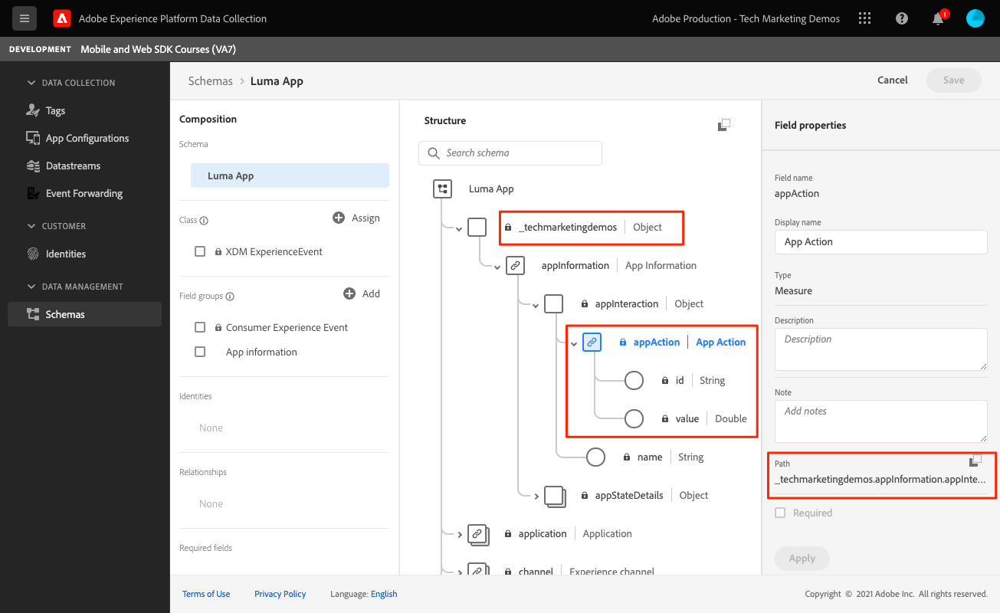

# Eventos

Obtenga información sobre cómo rastrear eventos en una aplicación móvil.

>[!INFO]
>
> Este tutorial se reemplazará con un nuevo tutorial con una nueva aplicación móvil de ejemplo a finales de noviembre de 2023

La extensión de red perimetral proporciona una API para enviar eventos de experiencia a Platform Edge Network. Un evento de experiencia es un objeto que contiene datos que se ajustan a la definición de esquema XDM ExperienceEvent. De forma más sencilla, capturan lo que las personas hacen en su aplicación móvil. Una vez que Platform Edge Network recibe los datos, se pueden reenviar a aplicaciones y servicios configurados en el conjunto de datos, como Adobe Analytics y Experience Platform. Obtenga más información acerca de [Eventos de experiencia](https://developer.adobe.com/client-sdks/documentation/getting-started/track-events/) en la documentación del producto.

## Requisitos previos

* Se ha actualizado PodFile con los SDK necesarios.
* Extensiones registradas en AppDelegate.
* MobileCore configurado para utilizar su AppId de desarrollo.
* SDK importados.
* La aplicación se ha creado y ejecutado correctamente con los cambios anteriores.

## Objetivos de aprendizaje

En esta lección, deberá hacer lo siguiente:

* Obtenga información sobre cómo estructurar datos XDM basados en un esquema.
* Envíe un evento XDM basado en un grupo de campos estándar.
* Envíe un evento XDM basado en un grupo de campos personalizados.
* Envíe un evento de compra de XDM.
* Valide con Assurance.

## Creación de un evento de experiencia

La extensión de Edge de Adobe Experience Platform puede enviar eventos que siguen un esquema XDM definido anteriormente a Adobe Experience Platform Edge Network.

El proceso es así...

1. Identifique la interacción de la aplicación móvil que está intentando rastrear.

1. Revise el esquema e identifique el evento adecuado.

1. Revise el esquema e identifique cualquier campo adicional que deba utilizarse para describir el evento.

1. Construir y rellenar el objeto de datos.

1. Crear y enviar evento.

1. Validación.

Veamos un par de ejemplos.

### Ejemplo de #1: grupos de campos estándar

Revise el siguiente ejemplo sin intentar implementarlo en la aplicación de ejemplo:

1. En su esquema, identifique el evento que está intentando recopilar; en este ejemplo, estamos realizando un seguimiento de una vista de producto.
   

1. Comience a construir el objeto:

   ```swift
   var xdmData: [String: Any] = [
       "eventType": "commerce.productViews",
       "commerce": [
           "productViews": [
           "value": 1
           ]
       ]
   ]
   ```

   * eventType: describe el evento que se produjo, use un [valor conocido](https://github.com/adobe/xdm/blob/master/docs/reference/classes/experienceevent.schema.md#xdmeventtype-known-values) cuando sea posible.
   * commerce.productViews.value: proporciona el valor numérico del evento. Si es booleano (o &quot;contador&quot; en Adobe Analytics), el valor siempre será 1. Si es un evento numérico o de moneda, el valor puede ser > 1.

1. En el esquema, identifique cualquier dato adicional asociado con el evento. En este ejemplo, incluya `productListItems` que es un conjunto estándar de campos utilizados con eventos relacionados con el comercio:
   
   * Observe que `productListItems` es una matriz para poder proporcionar varios productos.

1. Amplíe el objeto xdmData para incluir datos suplementarios:

   ```swift
   var xdmData: [String: Any] = [
       "eventType": "commerce.productViews",
           "commerce": [
           "productViews": [
               "value": 1
           ]
       ],
       "productListItems": [
           [
               "name":  productName,
               "SKU": sku,
               "priceTotal": priceString,
               "quantity": 1
           ]
       ]
   ]
   ```

1. Utilice la estructura de datos para crear un `ExperienceEvent`:

   ```swift
   let productViewEvent = ExperienceEvent(xdm: xdmData)
   ```

1. Envíe el evento y los datos a Platform Edge Network:

   ```swift
   Edge.sendEvent(experienceEvent: productViewEvent)
   ```

### Ejemplo de #2: grupos de campos personalizados

Revise el siguiente ejemplo sin intentar implementarlo en la aplicación de ejemplo:

1. En el esquema, identifique el evento que está intentando recopilar. En este ejemplo, realice el seguimiento de una &quot;interacción de aplicación&quot; que consista en un evento de acción de aplicación y un nombre.
   

1. Empiece a construir el objeto.

   >[!NOTE]
   >
   >  Los grupos de campos estándar siempre comienzan en la raíz del objeto.
   >
   >  Los grupos de campos personalizados siempre comienzan con un objeto único de su organización de Experience Cloud, &quot;_techmarketingdemos&quot; en este ejemplo.

   ```swift
   var xdmData: [String: Any] = [
   "_techmarketingdemos": [
       "appInformation": [
           "appInteraction": [
               "name": actionName,
               "appAction": [
                   "value": 1
                   ]
               ]
           ]
       ]
   ]
   ```

   O alternativamente...

   ```swift
   var xdmData: [String: Any] = [:]
   xdmData["_techmarketingdemos"] = [
       "appInformation": [
           "appInteraction": [
               "name": actionName,
               "appAction": [
                   "value": 1
               ]
           ]
       ]
   ]
   ```

1. Utilice la estructura de datos para crear un `ExperienceEvent`.

   ```swift
   let appInteractionEvent = ExperienceEvent(xdm: xdmData)
   ```

1. Envíe el evento y los datos a Platform Edge Network.

   ```swift
   Edge.sendEvent(experienceEvent: appInteractionEvent)
   ```

### Añadir el seguimiento de vista de pantalla a la aplicación Luma

Es de esperar que los ejemplos anteriores hayan explicado el proceso mental al construir un objeto de datos XDM. A continuación, añadiremos el seguimiento de vista de pantalla en la aplicación Luma.

1. Navegue hasta `Home.swift`.
1. Añada el siguiente código a `viewDidAppear(...)`.

   ```swift
           let stateName = "luma: content: ios: us: en: home"
           var xdmData: [String: Any] = [:]
           //Page View
           xdmData["_techmarketingdemos"] = [
               "appInformation": [
                   "appStateDetails": [
                       "screenType": "App",
                       "screenName": stateName,
                       "screenView": [
                           "value": 1
                       ]
                   ]
               ]
           ]
           let experienceEvent = ExperienceEvent(xdm: xdmData)
           Edge.sendEvent(experienceEvent: experienceEvent)
   ```

1. Repita el proceso para cada pantalla de la aplicación y actualice `stateName` a medida que avanza.


### Validación

1. Revise la [instrucciones de configuración](assurance.md) y conecte el simulador o dispositivo a Assurance.
1. Realice la acción y busque el `hitReceived` evento de la `com.adobe.edge.konductor` proveedor.
1. Seleccione el evento y revise los datos XDM en la `messages` objeto.
   

### Ejemplo de #3: compra

En este ejemplo, supongamos que el usuario realizó correctamente la siguiente compra:

* #1 del producto - Estera de yoga
   * 49,99 x1 $
   * SKU: 5829
* #2 del producto - Botella de agua.
   * 10,00 $ x3
   * SKU: 9841
* Total del pedido: 79,99 $
* ID de pedido único: 298234720
* Tipo de pago: Tarjeta de crédito Visa
* Id. de transacción de pago único: 847361

#### Esquema

Estos son los campos de esquema relacionados que se deben utilizar:

* eventType: &quot;commerce.purchases&quot;
* commerce.purchases
* commerce.order
* productsListItems
* _techmarketingdemos.appStateDetails (personalizado)

>[!TIP]
>
>Los grupos de campos personalizados siempre se colocan bajo el identificador de organización de Experience Cloud.
>
>&quot;_techmarketingdemos&quot; se sustituye por el valor único de su organización.


#### Código

Así se construiría y enviaría el objeto XDM en la aplicación.

```swift
let stateName = "luma: content: ios: us: en: orderconfirmation"
let currencyCode = "USD"
let orderTotal = "79.99"
let paymentType = "Visa Credit Card"
let orderId = "298234720"
let paymentTransactionId = "847361"
var xdmData: [String: Any] = [
  "eventType": "commerce.purchases",
  "commerce": [
    "purchases": [
      "value": 1
    ],
    "order": [
      "currencyCode": currencyCode,
      "priceTotal": orderTotal,
      "purchaseID": orderId,
      "purchaseOrderNumber": orderId,
      "payments": [ //Assuming only 1 payment type is used
        [
          "currencyCode": currencyCode,
          "paymentAmount": orderTotal,
          "paymentType": paymentType,
          "transactionID": paymentTransactionId
        ]
      ]
    ]
  ],
  "productListItems": [
      [
          "name":  "Yoga Mat",
          "SKU": "5829",
          "priceTotal": "49.99",
          "quantity": 1
      ],
      [
        "name":  "Water Bottle",
        "SKU": "9841",
        "priceTotal": "30.00",
        "quantity": 3
      ]
  ]
]

//Custom field group
xdmData["_techmarketingdemos"] = [
  "appInformation": [
    "appStateDetails": [
      "screenType": "App",
      "screenName": stateName,
      "screenView": [
        "value": 1
      ]
    ]
  ]
]
let experienceEvent = ExperienceEvent(xdm: xdmData)
Edge.sendEvent(experienceEvent: experienceEvent)
```

>[!NOTE]
>
>Para mayor claridad, todos los valores están codificados. En una situación real, los valores se rellenarían dinámicamente.


### Implementar en la aplicación de Luma

Debe tener todas las herramientas para empezar a añadir recopilación de datos a la aplicación de ejemplo de Luma. A continuación se muestra una lista de los requisitos hipotéticos de seguimiento que puede seguir.

* Realice un seguimiento de cada vista de pantalla.
   * Campos de esquema: screenType, screenName, screenView
* Rastree las acciones que no sean de comercio.
   * Campos de esquema: appInteraction.name, appAction
* Acciones comerciales:
   * Página de productos: productViews
   * Añadir al carrito: productListAdds
   * Eliminar del carro: productListRemovals
   * Comenzar cierre de compra: cierres de compra
   * Ver carrito: productListViews
   * Añadir a la lista de deseos: saveForLaters
   * Compra: compras, pedidos

>[!TIP]
>
>Revise la [aplicación totalmente implementada](https://github.com/Adobe-Marketing-Cloud/Luma-iOS-Mobile-App) para ver más ejemplos.

### Validación

1. Revise la [instrucciones de configuración](assurance.md) y conecte el simulador o dispositivo a Assurance.

1. Realice la acción y busque el `hitReceived` evento de la `com.adobe.edge.konductor` proveedor.

1. Seleccione el evento y revise los datos XDM en la `messages` objeto.
   

## Envío de eventos a Analytics y Platform

Ahora que ha recopilado los eventos y los ha enviado a Platform Edge Network, se enviarán a las aplicaciones y servicios configurados en su [secuencia de datos](create-datastream.md). En lecciones posteriores asignará estos datos a [Adobe Analytics](analytics.md) y [Adobe Experience Platform](platform.md).

Siguiente: **[WebViews](web-views.md)**

>[!NOTE]
>
>Gracias por dedicar su tiempo a conocer el SDK móvil de Adobe Experience Platform. Si tiene preguntas, desea compartir comentarios generales o tiene sugerencias sobre contenido futuro, compártalas en este [Entrada de discusión de la comunidad Experience League](https://experienceleaguecommunities.adobe.com/t5/adobe-experience-platform-data/tutorial-discussion-implement-adobe-experience-cloud-in-mobile/td-p/443796)