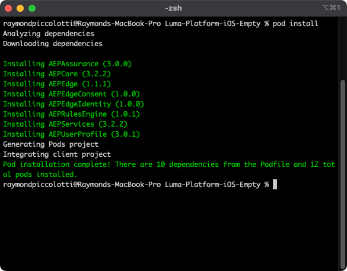
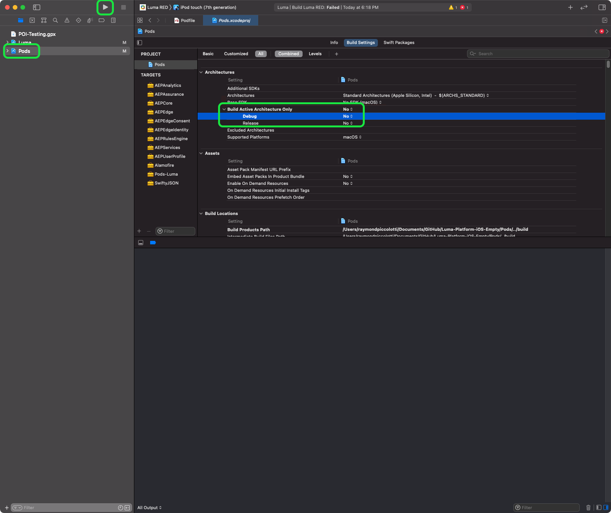

# Instalación de SDK de Adobe Experience Platform Mobile

Obtenga información sobre cómo implementar el SDK de Adobe Experience Platform Mobile en una aplicación móvil.

>[!INFO]
>
> Este tutorial se reemplazará con un nuevo tutorial con una nueva aplicación móvil de ejemplo a finales de noviembre de 2023

## Requisitos previos

* La biblioteca de etiquetas se ha creado correctamente con las extensiones descritas en la [lección anterior](configure-tags.md).
* ID de archivo del entorno de desarrollo de [Instrucciones de instalación de Mobile](configure-tags.md#generate-sdk-install-instructions).
* Descargado, vacío [aplicación de ejemplo](https://github.com/Adobe-Marketing-Cloud/Luma-iOS-Mobile-App){target="_blank"}.
* Experiencia con [XCode](https://developer.apple.com/xcode/){target="_blank"}.
* Básico [línea de comandos](https://en.wikipedia.org/wiki/Command-line_interface){target="_blank"} conocimiento.

## Objetivos de aprendizaje

En esta lección, deberá hacer lo siguiente:

* Actualice el archivo CocoaPod.
* Importe los SDK necesarios.
* Registre las extensiones.

>[!NOTE]
>
>En una implementación de aplicación móvil, los términos &quot;extensiones&quot; y &quot;SDK&quot; son casi intercambiables.


## Actualizar archivoDePod

>[!NOTE]
>
> Si no está familiarizado con CocoaPods, por favor revise el [guía de introducción](https://guides.cocoapods.org/using/getting-started.html).

La instalación suele ser un comando sudo simple:

```console
sudo gem install cocoapods
```

Una vez que haya instalado CocoaPods, abra el Podfile.


Actualice el archivo para incluir los siguientes pods:

```swift
pod 'AEPCore', '~> 3'
pod 'AEPEdge', '~> 1'
pod 'AEPUserProfile', '~> 3'
pod 'AEPAssurance', '~> 3'
pod 'AEPServices', '~> 3'
pod 'AEPEdgeConsent', '~> 1'
pod 'AEPLifecycle', '~>3'
pod 'AEPMessaging', '~>1'
pod 'AEPEdgeIdentity', '~>1'
pod 'AEPSignal', '~>3'
```

>[!NOTE]
>
> `AEPMessaging` solo es necesario si planea implementar la mensajería push mediante Adobe Journey Optimizer. Lea el tutorial sobre [implementación de la mensajería push con Adobe Journey Optimizer](journey-optimizer-push.md) para obtener más información.

Después de guardar los cambios en el Podfile, vaya a la carpeta con el proyecto y ejecute el `pod install` para instalar los cambios.



>[!NOTE]
>
> Si obtiene &quot;No se encontró ningún Podfile en el directorio del proyecto&quot;. error, el terminal está en la carpeta incorrecta. Vaya a la carpeta con el Podfile que ha actualizado e inténtelo de nuevo.

Si desea actualizar a la versión más reciente, ejecute el `pod update` comando.

>[!INFO]
>
>Si no puede usar CocoaPods en sus propias aplicaciones, puede aprender acerca de otros [implementaciones admitidas](https://github.com/adobe/aepsdk-core-ios#binaries) en el proyecto de GitHub.

## Creación de CocoaPods

Para generar CocoaPods, abra `Luma.xcworkspace`y seleccione **Product**, seguido de **Limpiar carpeta de compilación**.

>[!NOTE]
>
> Es posible que tenga que configurar **Crear solo la arquitectura activa** hasta **No**. Para ello, seleccione el proyecto Pods en el navegador de proyectos y seleccione **Configuración de compilación** y configure el **Crear arquitectura activa** hasta **No**.

Ahora puede generar y ejecutar el proyecto.



>[!NOTE]
>
>El proyecto de Luma se creó con Xcode v12.5 en un chipset M1 y se ejecuta en el simulador de iOS. Si utiliza una configuración diferente, es posible que tenga que cambiar la configuración de compilación para reflejar su arquitectura.
>
>Si la compilación no se ha realizado correctamente, intente revertir la variable **Crear arquitectura activa** > **Depurar** volver a establecer en **Sí**.
>
>La configuración del simulador &quot;iPod touch (7ª generación)&quot; se utilizó durante la creación de este tutorial.

## Importar extensiones

En cada una de las `.swift` , agregue las siguientes importaciones. Comience por agregar a `AppDelegate.swift`.

```swift
import AEPUserProfile
import AEPAssurance
import AEPEdge
import AEPCore
import AEPEdgeIdentity
import AEPEdgeConsent
import AEPLifecycle
import AEPMessaging //Optional, used for AJO push messaging
import AEPSignal
import AEPServices
```

## Actualizar AppDelegate

En el `AppDelegate.swift` , agregue el siguiente código a `didFinishLaunchingWithOptions`. Reemplace currentAppId por el valor de ID de archivo del entorno de desarrollo que recuperó de las etiquetas en [lección anterior](configure-tags.md).

```swift
let currentAppId = "b5cbd1a1220e/bae66382cce8/launch-88492c6dcb6e-development"

let extensions = [Edge.self, Assurance.self, Lifecycle.self, UserProfile.self, Consent.self, AEPEdgeIdentity.Identity.self, Messaging.self]

MobileCore.setLogLevel(.trace)

MobileCore.registerExtensions(extensions, {
    MobileCore.configureWith(appId: currentAppId)
})
```

`Messaging.self` solo es necesario si planea implementar la mensajería push mediante Adobe Journey Optimizer tal como se describe [aquí](journey-optimizer-push.md).

El código anterior hace lo siguiente:

* Registra las extensiones necesarias.
* Configura MobileCore y otras extensiones para utilizar la configuración de propiedad de etiquetas.
* Habilita el registro de depuración. Encontrará más detalles y opciones en la [Documentación del SDK móvil](https://developer.adobe.com/client-sdks/documentation/getting-started/enable-debug-logging/).

>[!IMPORTANT]
>En una aplicación de producción, debe cambiar el AppId en función del entorno actual (dev/stag/prod).
>

Siguiente: **[Configurar Assurance](assurance.md)**

>[!NOTE]
>
>Gracias por dedicar su tiempo a conocer el SDK móvil de Adobe Experience Platform. Si tiene preguntas, desea compartir comentarios generales o tiene sugerencias sobre contenido futuro, compártalas en este [Entrada de discusión de la comunidad Experience League](https://experienceleaguecommunities.adobe.com/t5/adobe-experience-platform-launch/tutorial-discussion-implement-adobe-experience-cloud-in-mobile/td-p/443796)