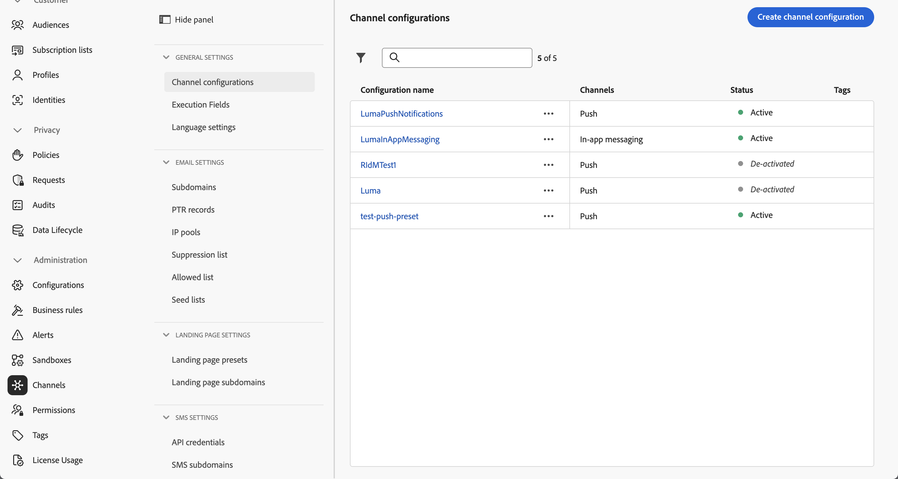

# Creación y envío de mensajes en la aplicación

Obtenga información sobre cómo crear mensajes en la aplicación para aplicaciones móviles con Experience Platform Mobile SDK y Journey Optimizer.

Journey Optimizer le permite crear campañas para enviar mensajes en la aplicación a audiencias de destino. Las campañas en Journey Optimizer se utilizan para entregar contenido único a una audiencia específica mediante varios canales. Con las campañas, las acciones se realizan simultáneamente, ya sea de forma inmediata o en función de una programación especificada. Cuando se utilizan recorridos (consulte la lección [Notificaciones push de Journey Optimizer](journey-optimizer-push.md)), las acciones se ejecutan de forma secuencial.


Antes de enviar mensajes en la aplicación con Journey Optimizer, debe asegurarse de que las configuraciones y integraciones adecuadas estén implementadas. Para comprender el flujo de datos de mensajería en la aplicación en Journey Optimizer, consulte [la documentación](https://experienceleague.adobe.com/docs/journey-optimizer/using/in-app/inapp-configuration.html?lang=es).

>[!NOTE]
>
>Esta lección es opcional y solo se aplica a los usuarios de Journey Optimizer que buscan enviar mensajes en la aplicación.


## Requisitos previos

* La aplicación se ha creado y ejecutado correctamente con los SDK instalados y configurados.
* Configure la aplicación para Adobe Experience Platform.
* Acceso a Journey Optimizer y permisos suficientes como se describe [aquí](https://experienceleague.adobe.com/docs/journey-optimizer/using/push/push-config/push-configuration.html?lang=es). Además, necesita permisos suficientes para las siguientes funciones de Journey Optimizer.
   * Administrar campañas.
* Dispositivo o simulador físico de iOS para realizar pruebas.


## Objetivos de aprendizaje

En esta lección, debe

* Crear una superficie de aplicación en AJO.
* Instale y configure la extensión de etiquetas de Journey Optimizer.
* Actualice la aplicación para registrar la extensión de etiqueta de Journey Optimizer.
* Valide la configuración en Assurance.
* Defina su propia experiencia de campaña y mensaje en la aplicación en Journey Optimizer.
* Envíe su propio mensaje en la aplicación desde la aplicación.

## Configuración

>[!TIP]
>
>Si ya configuró su entorno como parte de la lección [Mensajería push de Journey Optimizer](journey-optimizer-push.md), es posible que ya haya realizado algunos de los pasos de esta sección de configuración.


### Cree una configuración de canal en Journey Optimizer

Para empezar, debe crear una configuración de canal para poder enviar notificaciones de mensajes en la aplicación desde Journey Optimizer.

1. En la interfaz de Journey Optimizer, abra el menú **[!UICONTROL Canales]** > **[!UICONTROL Configuración general]** > **[!UICONTROL Configuraciones de canal]** y luego seleccione **[!UICONTROL Crear configuración de canal]**.

   

1. Introduzca un nombre y una descripción (opcional) para la configuración.

   >[!NOTE]
   >
   > Los nombres deben comenzar por una letra (A-Z). Solo puede contener caracteres alfanuméricos. También puede utilizar caracteres de guion bajo `_`, punto `.` y guion `-`.


1. Para asignar etiquetas de uso de datos principales o personalizadas a la configuración, puedes seleccionar **[!UICONTROL Administrar acceso]**. [Obtenga más información acerca del Control de acceso de nivel de objeto (OLAC)](https://experienceleague.adobe.com/es/docs/journey-optimizer/using/access-control/object-based-access).

1. Seleccione el canal **mensajería en la aplicación**.

1. Seleccione **[!UICONTROL Acciones de marketing]** para asociar directivas de consentimiento a los mensajes que usan esta configuración. Todas las políticas de consentimiento asociadas con la acción de marketing se aprovechan para respetar las preferencias de los clientes. [Más información sobre las acciones de marketing](https://experienceleague.adobe.com/es/docs/journey-optimizer/using/privacy/consent/consent#surface-marketing-actions).

1. Seleccione la plataforma para la que desea definir la configuración. Esto le permite especificar la aplicación de destino para cada plataforma y garantiza una entrega de contenido coherente en varias plataformas.

   >[!NOTE]
   >
   >En las plataformas iOS y Android, la entrega se basa únicamente en el ID de aplicación. Si ambas aplicaciones comparten el mismo ID de aplicación, el contenido se enviará a ambas, independientemente de la plataforma seleccionada en la **[!UICONTROL configuración del canal]**.

1. Seleccione **[!UICONTROL Enviar]** para guardar los cambios.

   

### Actualizar configuración de secuencia de datos

Para garantizar que los datos enviados desde su aplicación móvil a Edge Network se reenvíen a Journey Optimizer, actualice la configuración de Experience Edge.


1. En la IU de recopilación de datos, seleccione **[!UICONTROL Datastreams]** y su secuencia de datos, por ejemplo **[!DNL Luma Mobile App]**.
1. Seleccione  para **[!UICONTROL Experience Platform]** y seleccione  **[!UICONTROL Editar]** en el menú contextual.
1. En la pantalla **[!UICONTROL Datastreams]** >  > **[!UICONTROL Adobe Experience Platform]**, compruebe que **[!UICONTROL Adobe Journey Optimizer]** esté seleccionado. Consulte [Configuración de Adobe Experience Platform](https://experienceleague.adobe.com/docs/experience-platform/datastreams/configure.html?lang=es#aep) para obtener más información.
1. Para guardar la configuración de su secuencia de datos, seleccione **[!UICONTROL Guardar]**.


   


### Instalación de la extensión Journey Optimizer tags

Para que la aplicación funcione con Journey Optimizer, debe actualizar la propiedad de etiquetas.

1. Vaya a **[!UICONTROL Etiquetas]** > **[!UICONTROL Extensiones]** > **[!UICONTROL Catálogo]**.
1. Abra su propiedad, por ejemplo **[!DNL Luma Mobile App Tutorial]**.
1. Seleccione **[!UICONTROL Catálogo]**.
1. Busque la extensión **[!UICONTROL Adobe Journey Optimizer]**.
1. Instale la extensión de.

Cuando *solo* usa mensajes en la aplicación, en **[!UICONTROL Instalar extensión]** o **[!UICONTROL Configurar extensión]**, no necesita configurar nada. Sin embargo, si ya ha seguido la lección [Notificaciones push](journey-optimizer-push.md) del tutorial, verá que para el entorno **[!UICONTROL Desarrollo]**, el conjunto de datos **[!UICONTROL AJO Push Tracking Experience Event Dataset]** está seleccionado de la lista **[!UICONTROL Conjunto de datos de evento]**.


### Implementar Journey Optimizer en la aplicación

Como se ha explicado en lecciones anteriores, la instalación de una extensión de etiqueta móvil solo proporciona la configuración. A continuación, debe instalar y registrar Messaging SDK. Si estos pasos no están claros, revise la sección [Instalar SDK](install-sdks.md).

>[!NOTE]
>
>Si ha completado la sección [Instalar SDK](install-sdks.md), SDK ya está instalado y puede omitir este paso.
>

1. En Xcode, asegúrese de que [Mensajería de AEP](https://github.com/adobe/aepsdk-messaging-ios) se agrega a la lista de paquetes en Dependencias del paquete. Consulte [Administrador De Paquetes Swift](install-sdks.md#swift-package-manager).
1. Vaya a **[!DNL Luma]** > **[!DNL Luma]** > **[!UICONTROL AppDelegate]** en el navegador del proyecto Xcode.
1. Asegúrese de que `AEPMessaging` forme parte de su lista de importaciones.

   `import AEPMessaging`

1. Asegúrese de que `Messaging.self` forme parte de la matriz de extensiones que está registrando.

   ```swift
   let extensions = [
       AEPIdentity.Identity.self,
       Lifecycle.self,
       Signal.self,
       Edge.self,
       AEPEdgeIdentity.Identity.self,
       Consent.self,
       UserProfile.self,
       Places.self,
       Messaging.self,
       Optimize.self,
       Assurance.self
   ]
   ```


## Validar la configuración con Assurance

1. Revise la sección [instrucciones de configuración](assurance.md#connecting-to-a-session) para conectar el simulador o dispositivo a Assurance.
1. En la IU de Assurance, seleccione **[!UICONTROL Configurar]**.
   
1. Seleccione el botón  junto a **[!UICONTROL Mensajería en la aplicación]**.
1. Seleccione **[!UICONTROL Guardar]**.
   
1. Seleccione **[!UICONTROL Mensajería en la aplicación]** en el panel de navegación izquierdo.
1. Seleccione la ficha **[!UICONTROL Validación]**. Confirme que no está recibiendo ningún error.

   


## Cree su propio mensaje en la aplicación

Para crear su propio mensaje en la aplicación, debe definir una campaña en Journey Optimizer que almacene en déclencheur un mensaje en la aplicación en función de los eventos que se produzcan. Estos eventos pueden ser:

* datos enviados a Adobe Experience Platform,
* eventos de seguimiento principales, como la acción o el estado o la recopilación de datos PII, a través de las API genéricas principales de Mobile,
* eventos del ciclo vital de la aplicación, como inicio, instalación, actualización, cierre o bloqueo,
* eventos de geolocalización, como entrar o salir de un punto de interés.

En este tutorial, usará las API principales genéricas e independientes de la extensión de Mobile (consulte [API principales genéricas de Mobile](https://developer.adobe.com/client-sdks/documentation/mobile-core/#mobile-core-generic-apis)) para facilitar el seguimiento de eventos de pantallas de usuario, acciones y datos PII. Los eventos generados por estas API se publican en el centro de eventos de SDK y las extensiones los pueden utilizar. El centro de eventos de SDK proporciona la estructura de datos principal vinculada a todas las extensiones de SDK de Mobile Platform, y mantiene una lista de extensiones registradas y módulos internos, una lista de detectores de eventos registrados y una base de datos de estado compartida.

El centro de eventos de SDK publica y recibe datos de eventos de extensiones registradas para simplificar las integraciones con Adobe y soluciones de terceros. Por ejemplo, cuando se instala la extensión Optimize, todas las solicitudes e interacciones con el motor de ofertas de Journey Optimizer - Gestión de decisiones se gestionan mediante el centro de eventos.

1. En la interfaz de usuario de Journey Optimizer, seleccione **[!UICONTROL Campañas]** en el carril izquierdo.
1. Seleccione **[!UICONTROL Crear campaña]**.
1. En la pantalla **[!UICONTROL Crear campaña]**:
   1. Seleccione **[!UICONTROL Mensaje en la aplicación]** y elija una superficie de aplicación en la lista **[!UICONTROL Superficie de aplicación]**, por ejemplo **[!DNL Luma Mobile App]**.
   1. Seleccionar **[!UICONTROL Crear]**

      
1. En la pantalla de definición de campaña, en **[!UICONTROL Propiedades]**, escriba un **[!UICONTROL Nombre]** para la campaña, por ejemplo `Luma - In-App Messaging Campaign`, y una **[!UICONTROL Descripción]**, por ejemplo `In-app messaging campaign for Luma app`.
   
1. Desplácese hacia abajo hasta **[!UICONTROL Acción]** y seleccione **[!UICONTROL Editar contenido]**.
1. En la pantalla **[!UICONTROL Mensaje en la aplicación]**:
   1. Seleccione **[!UICONTROL Modal]** como **[!UICONTROL Diseño de mensaje]**.
   2. Escriba `https://luma.enablementadobe.com/content/dam/luma/en/logos/Luma_Logo.png` para la **[!UICONTROL URL multimedia]**.
   3. Escriba un **[!UICONTROL encabezado]**, por ejemplo `Welcome to this Luma In-App Message` y un **[!UICONTROL cuerpo]**, por ejemplo `Triggered by pushing that button in the app...`.
   4. Escriba **[!UICONTROL Descartar]** como **[!UICONTROL botón #1 texto (principal)]**.
   5. Observe cómo se actualiza la vista previa.
   6. Seleccione **[!UICONTROL Revisar para activar]**.

      
1. En la pantalla **[!UICONTROL Revisar para activar (Luma: mensajería en la aplicación)]**, seleccione  en el mosaico **[!UICONTROL Programar]**.
   
1. En la pantalla de **[!DNL Luma - In-App Messaging Campaign]**, seleccione  **[!UICONTROL Editar déclencheur]**.
1. En el cuadro de diálogo **[!UICONTROL déclencheur de mensajes en la aplicación]** , configure los detalles de la acción de seguimiento que almacena en déclencheur el mensaje en la aplicación:
   1. Para quitar **[!UICONTROL evento de inicio de aplicación]**, seleccione  .
   1. Use  **[!UICONTROL Agregar condición]** repetidamente para generar la siguiente lógica para **[!UICONTROL Mostrar mensaje si]**.
   1. Haga clic en **[!UICONTROL Finalizado]**.

      

   Ha definido una acción de seguimiento, donde **[!UICONTROL Action]** es igual a `in-app` y **[!UICONTROL Context data]** con la acción es un par de valor clave de `"showMessage" : "true"`.

1. En la pantalla **[!DNL Luma - In-App Messaging Campaign]**, seleccione **[!UICONTROL Revisar para activar]**.
1. En la pantalla **[!UICONTROL Revisar para activar (Luma: mensajería en la aplicación)]**, seleccione **[!UICONTROL Activar]**.
1. Ves a tu **[!DNL Luma - In-App Messaging Campaign]** con el estado **[!UICONTROL Activo]** en la lista **[!UICONTROL Campañas]**.
   


## Déclencheur del mensaje en la aplicación

Dispone de todos los ingredientes para enviar un mensaje en la aplicación. Lo que queda es cómo almacenar en déclencheur este mensaje en la aplicación.

1. Vaya a **[!DNL Luma]** > **[!DNL Luma]** > **[!DNL Utils]** > **[!UICONTROL MobileSDK]** en el navegador del proyecto Xcode. Busque la función `func sendTrackAction(action: String, data: [String: Any]?)` y agregue el código siguiente, que llama a la función [`MobileCore.track`](https://developer.adobe.com/client-sdks/documentation/mobile-core/api-reference/#trackaction), en función de los parámetros `action` y `data`.


   ```swift
   // Send trackAction event
   MobileCore.track(action: action, data: data)
   ```

1. Vaya a **[!DNL Luma]** > **[!DNL Luma]** > **[!DNL Views]** > **[!DNL General]** > **[!UICONTROL ConfigView]** en el navegador del proyecto Xcode. Busque el código del botón Mensaje en la aplicación y añada el siguiente código:

   ```swift
   // Setting parameters and calling function to send in-app message
   Task {
       MobileSDK.shared.sendTrackAction(action: "in-app", data: ["showMessage": "true"])
   }
   ```

## Validar con la aplicación

1. Vuelva a compilar y ejecute la aplicación en el simulador o en un dispositivo físico desde Xcode con .

1. Vaya a la ficha **[!UICONTROL Configuración]**.

1. Pulse **[!UICONTROL Mensaje en la aplicación]**. Verá que el mensaje en la aplicación aparece en la aplicación.

   


## Validación de la implementación en Assurance

Puede validar los mensajes en la aplicación en la interfaz de usuario de Assurance.

1. Revise la sección [instrucciones de configuración](assurance.md#connecting-to-a-session) para conectar el simulador o dispositivo a Assurance.
1. Seleccione **[!UICONTROL Mensajería en la aplicación]**.
1. Seleccione **[!UICONTROL Lista de eventos]**.
1. Seleccione una entrada de **[!UICONTROL Mostrar mensaje]**.
1. Inspeccione el evento sin procesar, especialmente `html`, que contiene el diseño y el contenido completos del mensaje en la aplicación.
   


## Pasos siguientes

Ahora debe tener todas las herramientas para empezar a añadir mensajes en la aplicación, cuando corresponda. Por ejemplo, promocionar productos en función de interacciones específicas que esté rastreando en la aplicación.

>[!SUCCESS]
>
>Ha habilitado la aplicación para mensajería en la aplicación y ha agregado una campaña de mensajería en la aplicación mediante Journey Optimizer y la extensión Journey Optimizer para Experience Platform Mobile SDK.
>
>Gracias por dedicar su tiempo a conocer Adobe Experience Platform Mobile SDK. Si tiene preguntas, desea compartir comentarios generales o tiene sugerencias sobre contenido futuro, compártalas en esta [publicación de debate de la comunidad de Experience League](https://experienceleaguecommunities.adobe.com/t5/adobe-experience-platform-data/tutorial-discussion-implement-adobe-experience-cloud-in-mobile/td-p/443796?profile.language=es).

Siguiente: **[Crear y mostrar ofertas](journey-optimizer-offers.md)**
