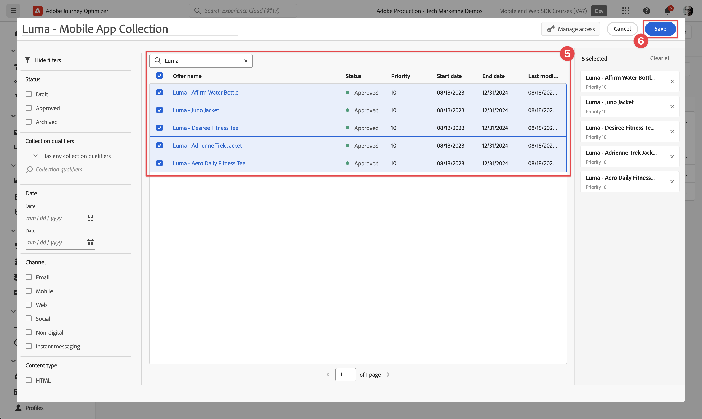
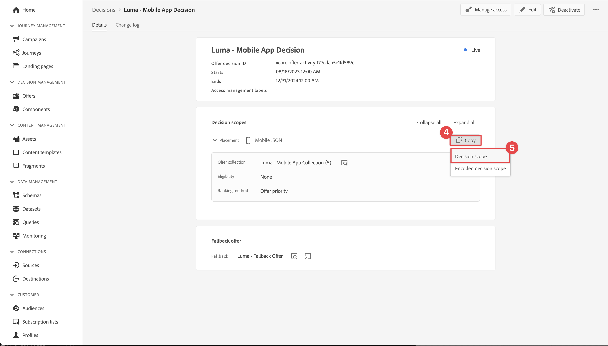

# Creación y visualización de ofertas con Administración de decisiones

Obtenga información sobre cómo mostrar ofertas de Administración de decisiones de Journey Optimizer en sus aplicaciones móviles con el SDK móvil de Experience Platform.

Administración de decisiones de Journey Optimizer le ayuda a ofrecer la mejor oferta y experiencia a sus clientes en todos los puntos de contacto y en el momento adecuado. Una vez diseñada, la audiencia debe segmentarse con ofertas personalizadas.


La administración de decisiones facilita la personalización con una biblioteca central de ofertas de marketing y un motor de decisión que aplica reglas y restricciones a perfiles enriquecidos en tiempo real creados por Adobe Experience Platform. Como resultado, le permite enviar a sus clientes la oferta correcta en el momento adecuado. Consulte [Acerca de la administración de decisiones](https://experienceleague.adobe.com/docs/journey-optimizer/using/offer-decisioning/get-started-decision/starting-offer-decisioning.html?lang=en) para obtener más información.


>[!NOTE]
>
>Esta lección es opcional y solo se aplica a los usuarios de Journey Optimizer que buscan utilizar la funcionalidad Administración de decisiones para mostrar ofertas en una aplicación móvil.


## Requisitos previos

* La aplicación se ha creado y ejecutado correctamente con los SDK instalados y configurados.
* Configure la aplicación para Adobe Experience Platform.
* Acceso a Journey Optimizer - Administración de decisiones con los permisos adecuados para administrar ofertas y decisiones como se describe [aquí](https://experienceleague.adobe.com/docs/journey-optimizer/using/access-control/privacy/high-low-permissions.html?lang=en#decisions-permissions).


## Objetivos de aprendizaje

En esta lección, debe

* Actualice la configuración de Edge para Administración de decisiones.
* Actualice la propiedad de etiquetas con la extensión Journey Optimizer - Decisioning.
* Actualice el esquema para capturar eventos de propuesta.
* Valide la configuración en Assurance.
* Cree una decisión de oferta basada en ofertas de Journey Optimizer - Gestión de decisiones.
* Actualice la aplicación para registrar la extensión de Optimizer.
* Implemente ofertas de Administración de decisiones en la aplicación.


## Configuración

>[!TIP]
>
>Si ya configuró el entorno como parte de la lección [Configurar pruebas A/B con Target](target.md), es posible que ya haya realizado algunos de los pasos de esta sección de configuración.

### Actualizar configuración de secuencia de datos

Para asegurarse de que los datos enviados desde la aplicación móvil al Edge Network de Platform se reenvíen a Journey Optimizer - Gestión de decisiones, actualice el flujo de datos.

1. En la IU de recopilación de datos, seleccione **[!UICONTROL Datastreams]** y su secuencia de datos, por ejemplo **[!DNL Luma Mobile App]**.
1. Seleccione  para **[!UICONTROL Experience Platform]** y seleccione  **[!UICONTROL Editar]** del menú contextual.
1. En la pantalla de **[!UICONTROL Datastreams]** >  > **[!UICONTROL Adobe Experience Platform]**, compruebe que **[!UICONTROL Offer decisioning]**, **[!UICONTROL Segmentación de Edge]** y **[!UICONTROL Adobe Journey Optimizer]** estén seleccionados. Si vas a seguir la lección de Target, selecciona **[!UICONTROL Destinos de Personalization]** también. Consulte [Configuración de Adobe Experience Platform](https://experienceleague.adobe.com/docs/experience-platform/datastreams/configure.html?lang=en#aep) para obtener más información.
1. Para guardar la configuración de su secuencia de datos, seleccione **[!UICONTROL Guardar]** .

   


### Instalación de Journey Optimizer: extensión de etiquetas de Decisioning

1. Vaya a **[!UICONTROL Etiquetas]**, busque la propiedad de etiquetas móviles y ábrala.
1. Seleccione **[!UICONTROL Extensiones]**.
1. Seleccione **[!UICONTROL Catálogo]**.
1. Busque la extensión **[!UICONTROL Adobe Journey Optimizer - Decisioning]**.
1. Instale la extensión de. La extensión no requiere ninguna configuración adicional.

   


### Actualizar el esquema

1. Vaya a la interfaz de recopilación de datos y seleccione **[!UICONTROL Esquemas]** en el carril izquierdo.
1. Seleccione **[!UICONTROL Examinar]** en la barra superior.
1. Seleccione el esquema para abrirlo.
1. En el editor de esquemas, seleccione  **[!UICONTROL Agregar]** junto a Grupos de campos.
1. En el cuadro de diálogo **[!UICONTROL Agregar grupos de campos]**,  buscar `proposition`, seleccione **[!UICONTROL Evento de experiencia - Interacciones de propuesta]** y seleccione **[!UICONTROL Agregar grupos de campos]**. Este grupo de campos recopila los datos de evento de experiencia relevantes para las ofertas: qué oferta se presenta, como parte de qué recopilación, decisión y otros parámetros (consulte más adelante en esta lección). Pero también ¿qué está pasando con la oferta? ¿Se muestra, interactúa con, se descarta, etc.?
   
1. Seleccione **[!UICONTROL Guardar]** para guardar los cambios en el esquema.


## Validar la configuración en Assurance

Para validar la configuración en Assurance:

1. Vaya a la interfaz de usuario de Assurance.
1. Seleccione **[!UICONTROL Configurar]** en el carril izquierdo y seleccione  junto a **[!UICONTROL Validar configuración]** debajo de **[!UICONTROL ADOBE JOURNEY OPTIMIZER DECISIONING]**.
1. Seleccione **[!UICONTROL Guardar]**.
1. Seleccione **[!UICONTROL Validar configuración]** en el carril izquierdo. Se validan tanto la configuración del flujo de datos como la configuración del SDK en la aplicación.
   


## Creación de ubicación

Para poder crear ofertas, debe definir cómo y dónde se pueden colocar estas ofertas en la aplicación móvil. En Administración de decisiones, defina ubicaciones para este fin y definirá una ubicación para el canal móvil que admita una carga útil JSON:

1. En la interfaz de usuario de Journey Optimizer, seleccione  **[!UICONTROL Componentes]** de **[!UICONTROL ADMINISTRACIÓN DE DECISIONES]** en el carril izquierdo.

1. Seleccione **[!UICONTROL Ubicaciones]** en la barra superior.

1. Si no aparece ninguna ubicación con el nombre **[!UICONTROL JSON móvil]**, **[!UICONTROL Móvil]** como **[!UICONTROL Tipo de canal]** y **[!UICONTROL JSON]** como **[!UICONTROL Tipo de contenido]**, debe crear una ubicación. De lo contrario, continúe con [Crear ofertas](#create-offers).

Para crear la ubicación JSON de Mobile:

1. Seleccione  Crear ubicación.

   1. en la sección **[!UICONTROL Detalles]**, escribe `Mobile JSON` como **[!UICONTROL Nombre]**, selecciona **[!UICONTROL Móvil]** de **[!UICONTROL Tipo de canal]** y **[!UICONTROL JSON]** de **[!UICONTROL Tipo de contenido]**.
   1. Seleccione **[!UICONTROL Guardar]** para guardar la ubicación.

   


## Crear ofertas

1. En la interfaz de usuario de Journey Optimizer, seleccione  **[!UICONTROL Ofertas]** de **[!UICONTROL ADMINISTRACIÓN DE DECISIONES]** en el carril izquierdo.
1. En la pantalla **[!UICONTROL Ofertas]**, seleccione **[!UICONTROL Examinar]** para ver la lista de ofertas.
1. Seleccione **[!UICONTROL Crear oferta]**.
1. En el diálogo **[!UICONTROL Nueva oferta]**, seleccione **[!UICONTROL Oferta personalizada]** y haga clic en **[!UICONTROL Siguiente]**.
1. En el paso **[!UICONTROL Detalles]** de **[!UICONTROL Crear nueva oferta personalizada]**:
   1. Escriba un **[!UICONTROL Nombre]** para la oferta, por ejemplo `Luma - Juno Jacket`, y una **[!UICONTROL fecha y hora de inicio]** y una **[!UICONTROL fecha y hora de finalización]**. Fuera de estas fechas, el motor de decisión no selecciona la oferta.
   1. Seleccione **[!UICONTROL Siguiente]**.

      

1. En el paso **[!UICONTROL Agregar representaciones]** de **[!UICONTROL Crear nueva oferta personalizada]**:
   1. Seleccione  **[!UICONTROL Móvil]** de la lista **[!UICONTROL Canal]** y seleccione **[!UICONTROL JSON móvil]** de la lista **[!UICONTROL Ubicación]**.
   1. Seleccione **[!UICONTROL Personalizado]** para **[!UICONTROL Contenido]**.
   1. Seleccione **[!UICONTROL Agregar contenido]**. En el diálogo **[!UICONTROL Agregar personalización]**:
      1. Si hay un selector [!UICONTROL Mode] disponible, asegúrate de que esté establecido en **[!UICONTROL JSON]**.
      1. Introduzca el siguiente JSON:

         ```json
         { 
             "title": "Juno Jacket",
             "text": "On colder-than-comfortable mornings, you'll love warming up in the Juno All-Ways Performance Jacket, designed to compete with wind and chill. Built-in Cocona&trade; technology aids evaporation, while a special zip placket and stand-up collar keep your neck protected.", 
             "image": "https://luma.enablementadobe.com/content/dam/luma/en/products/women/tops/jackets/wj06-purple_main.jpg" 
         }  
         ```

      1. Seleccione **[!UICONTROL Guardar]**.

         
   1. Seleccione **[!UICONTROL Siguiente]**.

      

1. En el paso **[!UICONTROL Agregar restricciones]** de **[!UICONTROL Crear nueva oferta personalizada]**:
   1. Establezca **[!UICONTROL Prioridad]** en `10`.
   1. Desactivar **[!UICONTROL Incluir límite]**.
   1. Seleccione **[!UICONTROL Siguiente]**.

      

1. En el paso **[!UICONTROL Revisar]** de **[!UICONTROL Crear nueva oferta personalizada]**:
   1. Revise la oferta y, a continuación, seleccione **[!UICONTROL Finalizar]**.
   1. En el diálogo **[!UICONTROL Guardar oferta]**, seleccione **[!UICONTROL Guardar y aprobar]**.

1. Repita los pasos del 3 al 8 para crear cuatro ofertas más con nombres y contenido diferentes. Todos los demás valores de configuración, como Fecha y hora de inicio o Prioridad, son similares a la primera oferta creada. Puede crear y editar ofertas duplicadas rápidamente.

   1. En la interfaz de usuario de Journey Optimizer, seleccione  **[!UICONTROL Ofertas]** en el carril izquierdo y, a continuación, seleccione Ofertas en la barra superior.
   1. Seleccione la fila de la oferta que ha creado.
   1. En el panel derecho, seleccione  **[!UICONTROL Más acciones]** y en el menú contextual, seleccione  **[!UICONTROL Duplicar]**.

      Utilice la tabla siguiente para definir las otras cuatro ofertas.

      | Nombre de oferta | Contenido de oferta en JSON |
      |---|---|
      | Luma: confirme la botella de agua | `{ "title": "Affirm Water Bottle", "text": "You'll stay hydrated with ease with the Affirm Water Bottle by your side or in hand. Measurements on the outside help you keep track of how much you're drinking, while the screw-top lid prevents spills. A metal carabiner clip allows you to attach it to the outside of a backpack or bag for easy access.", "image": "https://luma.enablementadobe.com/content/dam/luma/en/products/gear/fitness-equipment/ug06-lb-0.jpg" }` |
      | Luma: Desiree Fitness Tee | `{ "title": "Desiree Fitness Tee", "text": "When you're too far to turn back, thank yourself for choosing the Desiree Fitness Tee. Its ultra-lightweight, ultra-breathable fabric wicks sweat away from your body and helps keeps you cool for the distance.", "image": "https://luma.enablementadobe.com/content/dam/luma/en/products/women/tops/tees/ws05-yellow_main.jpg" }` |
      | Luma - Adrienne Trek Jacket | `{ "title": "Adrienne Trek Jacket", "text": "You're ready for a cross-country jog or a coffee on the patio in the Adrienne Trek Jacket. Its style is unique with stand collar and drawstrings, and it fits like a jacket should.", "image": "https://luma.enablementadobe.com/content/dam/luma/en/products/women/tops/jackets/wj08-gray_main.jpg" }` |
      | Luma: Camiseta de fitness diaria de Aero | `{ "title": "Aero Daily Fitness Tee", "text": "Need an everyday action tee that helps keep you dry? The Aero Daily Fitness Tee is made of 100% polyester wicking knit that funnels moisture away from your skin. Don't be fooled by its classic style; this tee hides premium performance technology beneath its unassuming look.", "image": "https://luma.enablementadobe.com/content/dam/luma/en/products/men/tops/tees/ms01-black_main.jpg" }` |

      {style="table-layout:fixed"}

1. Finalmente, debe crear una oferta de reserva, que es una oferta enviada a los clientes si no cumplen los requisitos para otras ofertas.
   1. Seleccione **[!UICONTROL Crear oferta]**.
   1. En el diálogo **[!UICONTROL Nueva oferta]**, seleccione **[!UICONTROL Oferta personalizada]** y seleccione **[!UICONTROL Siguiente]**.
   1. En el paso **[!UICONTROL Detalles]** de **[!UICONTROL Crear nueva oferta de reserva]**, escriba un **[!UICONTROL Nombre]** para la oferta, por ejemplo `Luma - Fallback Offer`, y seleccione **[!UICONTROL Siguiente]**.

   1. En el paso **[!UICONTROL Agregar representaciones]** de **[!UICONTROL Crear nueva oferta de reserva]**:
      1. Seleccione  **[!UICONTROL Móvil]** de la lista **[!UICONTROL Canal]** y seleccione **[!UICONTROL JSON móvil]** de la lista **[!UICONTROL Ubicación]**.
      1. Seleccione **[!UICONTROL Personalizado]** para **[!UICONTROL Contenido]**.
      1. Seleccione **[!UICONTROL Agregar contenido]**.
      1. En el cuadro de diálogo **[!UICONTROL Agregar personalización]**, escriba el siguiente JSON y seleccione **[!UICONTROL Guardar]**:

         ```json
         {  
            "title": "Luma",
            "text": "Your store for sports wear and equipment.", 
            "image": "https://luma.enablementadobe.com/content/dam/luma/en/logos/Luma_Logo.png" 
         }  
         ```

      1. Seleccione **[!UICONTROL Siguiente]**.


1. En el paso **[!UICONTROL Revisar]** de **[!UICONTROL Crear nueva oferta de reserva]**:
   1. Revise la oferta y, a continuación, seleccione **[!UICONTROL Finalizar]**.
   1. En el diálogo **[!UICONTROL Guardar oferta]**, seleccione **[!UICONTROL Guardar y aprobar]**.

Ahora debería tener la siguiente lista de ofertas:


## Crear una colección

Para presentar una oferta al usuario de la aplicación móvil, debe definir una colección de ofertas que consista en una o más de las ofertas creadas.

1. En la interfaz de usuario de Journey Optimizer, seleccione **[!UICONTROL Ofertas]** en el carril izquierdo.
1. Seleccione **[!UICONTROL Colecciones]** en la barra superior.
1. Seleccione  **[!UICONTROL Crear colección]**.
1. En el cuadro de diálogo **[!UICONTROL Nueva colección]**, escriba un **[!UICONTROL Nombre]** para su colección, por ejemplo `Luma - Mobile App Collection`, seleccione **[!UICONTROL Crear colección estática]** y haga clic en **[!UICONTROL Siguiente]**.
1. En **[!DNL Luma - Mobile App Collection]**, seleccione las ofertas que desee incluir en la colección. Para este tutorial, elija las cinco ofertas que ha creado. Puede filtrar fácilmente la lista usando el campo de búsqueda, por ejemplo, escribiendo **[!DNL Luma]**.
1. Seleccione **[!UICONTROL Guardar]**.

   


## Crear una decisión

El paso final es definir una decisión, que es la combinación de uno o más ámbitos de decisión y la oferta de reserva.

Un ámbito de decisión es una combinación de una ubicación específica (por ejemplo, un HTML en un correo electrónico o JSON en una aplicación móvil) y uno o más criterios de evaluación.

Un criterio de evaluación es la combinación de

* una colección de ofertas,
* reglas de elegibilidad: por ejemplo, ¿la oferta solo está disponible para una audiencia específica,
* un método de clasificación: cuando hay varias ofertas disponibles para elegir, qué método se utiliza para clasificarlas (por ejemplo, por prioridad de oferta, mediante una fórmula o un modelo de IA).

Consulte [Pasos clave para crear y administrar ofertas](https://experienceleague.adobe.com/docs/journey-optimizer/using/offer-decisioning/get-started-decision/key-steps.html?lang=en) si desea comprender mejor cómo interactúan y se relacionan entre sí las ubicaciones, las reglas, las clasificaciones, las ofertas, las representaciones, las colecciones, las decisiones, etc. Esta lección se centra únicamente en el uso del resultado de una decisión, en lugar de en la flexibilidad para definir decisiones dentro de Journey Optimizer: Gestión de decisiones.

1. En la interfaz de usuario de Journey Optimizer, seleccione **[!UICONTROL Ofertas]** en el carril izquierdo.
1. Seleccione **[!UICONTROL Decisiones]** en la barra superior.
1. Seleccione  **[!UICONTROL Crear decisión]**.
1. En el paso **[!UICONTROL Detalles]** de **[!UICONTROL Crear una nueva decisión de oferta]**:
   1. Escriba un **[!UICONTROL Nombre]** para la decisión, por ejemplo `Luma - Mobile App Decision`, ingrese **[!UICONTROL Fecha y hora de inicio]** y **[!UICONTROL Fecha y hora de finalización]**.
   1. Seleccione **[!UICONTROL Siguiente]**.

1. En el paso **[!UICONTROL Agregar ámbitos de decisión]** de **[!UICONTROL Crear una nueva decisión de oferta]**:
   1. Seleccione **[!UICONTROL JSON móvil]** de la lista **[!UICONTROL Ubicación]**.
   1. En el mosaico **[!UICONTROL Criterios de evaluación]**, seleccione  **[!UICONTROL Agregar]**.
      1. En el cuadro de diálogo **[!UICONTROL Agregar colección de ofertas]**, seleccione su colección de ofertas. Por ejemplo, **[!DNL Luma - Mobile App Collection]**.
      1. Seleccione **[!UICONTROL Agregar]**.

         
   1. Asegúrese de que **[!UICONTROL None]** esté seleccionado para **[!UICONTROL Elegibilidad]** y que **[!UICONTROL Prioridad de ofertas]** esté seleccionado como **[!UICONTROL método de clasificación]**.
   1. Seleccione **[!UICONTROL Siguiente]**.

      .
1. En el paso **[!UICONTROL Agregar oferta de reserva]** de **[!UICONTROL Crear una nueva decisión de oferta]**:
   1. Seleccione su oferta de reserva, por ejemplo **[!DNL Luma - Fallback offer]**.
   1. Seleccione **[!UICONTROL Siguiente]**.
1. En el paso **[!UICONTROL Resumen]** de **[!UICONTROL Crear una nueva decisión de oferta]**:
   1. Seleccione **[!UICONTROL Finalizar]**.
   1. En el diálogo **[!UICONTROL Guardar decisión de oferta]**, seleccione **[!UICONTROL Guardar y activar]**.
   1. En la ficha **[!UICONTROL Decisiones]**, verá su decisión con el estado **[!UICONTROL Activo]**.

La decisión de oferta, que consiste en un conjunto de ofertas, ya está lista para su uso. Para utilizar la decisión en la aplicación, debe hacer referencia en el código al ámbito de decisión.

1. En la IU de Journey Optimizer, seleccione **[!UICONTROL Ofertas]**.
1. Seleccione **[!UICONTROL Decisiones]** en la barra superior.
1. Seleccione su decisión, por ejemplo **[!DNL Luma - Mobile App Decision]**.
1. En el mosaico **[!UICONTROL Ámbitos de decisión]**, seleccione  **[!UICONTROL Copiar]**.
1. En el menú contextual, seleccione **[!UICONTROL ámbito de decisión]**.
   
1. Utilice cualquier editor de texto para pegar el ámbito de decisión para utilizarlo posteriormente. El ámbito de decisión tiene el siguiente formato JSON.

   ```json
   {
       "xdm:activityId":"xcore:offer-activity:xxxxxxxxxxxxxxx",
       "xdm:placementId":"xcore:offer-placement:xxxxxxxxxxxxxxx"
   }
   ```

## Implementación de ofertas en la aplicación

Como se ha explicado en lecciones anteriores, la instalación de una extensión de etiqueta móvil solo proporciona la configuración. A continuación, debe instalar y registrar Optimize SDK. Si estos pasos no están claros, revise la sección [Instalar SDK](install-sdks.md).

>[!NOTE]
>
>Si ha completado la sección [Instalar SDK](install-sdks.md), el SDK ya está instalado y puede omitir este paso.
>

1. En Xcode, asegúrese de que [AEP Optimize](https://github.com/adobe/aepsdk-messaging-ios) se agrega a la lista de paquetes en Dependencias del paquete. Consulte [Administrador De Paquetes Swift](install-sdks.md#swift-package-manager).
1. Vaya a **[!DNL Luma]** > **[!DNL Luma]** > **[!UICONTROL AppDelegate]** en el navegador del proyecto Xcode.
1. Asegúrese de que `AEPOptimize` forme parte de su lista de importaciones.

   ```swift
   import AEPOptimize
   ```

1. Asegúrese de que `Optimize.self` forme parte de la matriz de extensiones que está registrando.

   ```swift
   let extensions = [
       AEPIdentity.Identity.self,
       Lifecycle.self,
       Signal.self,
       Edge.self,
       AEPEdgeIdentity.Identity.self,
       Consent.self,
       UserProfile.self,
       Places.self,
       Messaging.self,
       Optimize.self,
       Assurance.self
   ]
   ```

1. Vaya a **[!DNL Luma]** > **[!DNL Luma]** > **[!DNL Model]** > **[!DNL Data]** > **[!UICONTROL decisiones]** en el navegador del proyecto Xcode. Actualice los valores `activityId` y `placementId` con los detalles del ámbito de decisión que copió de la interfaz de Journey Optimizer.

1. Vaya a **[!DNL Luma]** > **[!DNL Luma]** > **[!DNL Utils]** > **[!UICONTROL MobileSDK]** en el navegador del proyecto Xcode. Busque la función `func updatePropositionOD(ecid: String, activityId: String, placementId: String, itemCount: Int) async`. Añada el siguiente código:

   ```swift
   // set up the XDM dictionary, define decision scope and call update proposition API
   Task {  
      let ecid = ["ECID" : ["id" : ecid, "primary" : true] as [String : Any]]
      let identityMap = ["identityMap" : ecid]
      let xdmData = ["xdm" : identityMap]
      let decisionScope = DecisionScope(activityId: activityId, placementId: placementId, itemCount: UInt(itemCount))
      Optimize.clearCachedPropositions()
      Optimize.updatePropositions(for: [decisionScope], withXdm: xdmData)
   }
   ```

   Esta función:

   * configura un diccionario XDM `xdmData` que contiene el ECID para identificar el perfil para el que debe presentar las ofertas.
   * define `decisionScope`, un objeto que se basa en la decisión que ha definido en la interfaz de Journey Optimizer - Gestión de decisiones y se define usando el ámbito de decisión copiado de [Crear una decisión](#create-a-decision).  La aplicación Luma utiliza un archivo de configuración (`decisions.json`) que recupera los parámetros de ámbito en función del siguiente formato JSON:

     ```swift
     "scopes": [
         {
             "name": "name of the scope",
             "activityId": "xcore:offer-activity:xxxxxxxxxxxxxxx",
             "placementId": "xcore:offer-placement:xxxxxxxxxxxxxxx",
             "itemCount": 2
         }
     ]
     ```

     Sin embargo, puede usar cualquier tipo de implementación para asegurarse de que las API de optimización obtienen los parámetros adecuados (`activityId`, `placementId` y, `itemCount`) para construir un objeto [`DecisionScope`](https://developer.adobe.com/client-sdks/documentation/adobe-journey-optimizer-decisioning/api-reference/#decisionscope) válido para su implementación. <br/>Para su información: los demás valores de clave del archivo `decisions.json` son para uso futuro y no son relevantes y se utilizan actualmente en esta lección y como parte del tutorial.

   * llama a dos API: [`Optimize.clearCachePropositions`](https://support.apple.com/en-ie/guide/mac-help/mchlp1015/mac) y [`Optimize.updatePropositions`](https://developer.adobe.com/client-sdks/documentation/adobe-journey-optimizer-decisioning/api-reference/#updatepropositions).  Estas funciones borran todas las propuestas almacenadas en caché y actualizan las propuestas de este perfil.

1. Vaya a **[!DNL Luma]** > **[!DNL Luma]** > **[!DNL Views]** > **[!UICONTROL Personalization]** > **[!UICONTROL EdgeOffersView]** en el navegador del proyecto Xcode. Busque la función `func onPropositionsUpdateOD(activityId: String, placementId: String, itemCount: Int) async` e inspeccione el código de esta función. La parte más importante de esta función es la llamada a la API [`Optimize.onPropositionsUpdate`](https://developer.adobe.com/client-sdks/documentation/adobe-journey-optimizer-decisioning/api-reference/#onpropositionsupdate), que

   * recupera las propuestas del perfil actual en función del ámbito de decisión (que ha definido en Journey Optimizer - Gestión de decisiones),
   * recupera la oferta de la propuesta,
   * desajusta el contenido de la oferta para que se pueda mostrar correctamente en la aplicación, y
   * déclencheur la acción `displayed()` en la oferta que devuelve un evento al Edge Network para informar que se muestra la oferta.

1. Aún en **[!DNL EdgeOffersView]**, agregue el código siguiente al modificador `.onFirstAppear`. Este código garantiza que la llamada de retorno para actualizar las ofertas se registre solo una vez.

   ```swift
   // Invoke callback for offer updates
   Task {
       await self.onPropositionsUpdateOD(activityId: decision.activityId, placementId: decision.placementId, itemCount: decision.itemCount)
   }
   ```

1. Aún en **[!UICONTROL EdgeOffersView]**, agregue el siguiente código al modificador `.task`. Este código actualiza las ofertas cuando se actualiza la vista.

   ```swift
   // Clear and update offers
   await self.updatePropositionsOD(ecid: currentEcid, activityId: decision.activityId, placementId: decision.placementId, itemCount: decision.itemCount)
   ```


## Validación mediante la aplicación

1. Vuelva a compilar y ejecute la aplicación en el simulador o en un dispositivo físico desde Xcode con .

1. Vaya a la pestaña **[!DNL Personalisation]**.

1. Seleccione **[!DNL Edge Personalisation]**.

1. Desplácese hasta la parte superior y verá dos ofertas aleatorias mostradas de la colección que ha definido en el mosaico **[!DNL DECISION LUMA - MOBILE APP DECISION]**.

   

   Las ofertas son aleatorias, ya que ha dado a todas las ofertas la misma prioridad y la clasificación de la decisión se basa en la prioridad.


## Validar la implementación en Assurance

Para validar la implementación de ofertas en Assurance:

1. Revise la sección [instrucciones de configuración](assurance.md#connecting-to-a-session) para conectar su simulador o dispositivo a Assurance.
1. Seleccione **[!UICONTROL Configurar]** en el carril izquierdo y seleccione  junto a **[!UICONTROL Revisar y simular]** debajo de **[!UICONTROL ADOBE JOURNEY OPTIMIZER DECISIONING]**.
1. Seleccione **[!UICONTROL Guardar]**.
1. Seleccione **[!UICONTROL Revisar y simular]** en el carril izquierdo. Tanto la configuración del flujo de datos como la configuración del SDK se validan en la aplicación.
1. Seleccione **[!UICONTROL Solicitudes]** en la barra superior. Ve sus **[!UICONTROL ofertas]** solicitudes.
   

1. Puede explorar las pestañas **[!UICONTROL Simular]** y **[!UICONTROL Lista de eventos]** para obtener más funcionalidad y comprobar la configuración de Administración de decisiones de Journey Optimizer.

## Pasos siguientes

Ahora debería tener todas las herramientas para empezar a añadir más funcionalidades a su implementación de Journey Optimizer - Gestión de decisiones. Por ejemplo:

* aplique parámetros diferentes a las ofertas (por ejemplo, prioridad o límite)
* recopile atributos de perfil en la aplicación (consulte [Perfil](profile.md)) y utilícelos para generar audiencias. A continuación, utilice estas audiencias como parte de las reglas de idoneidad en su decisión.
* combinar más de un ámbito de decisión.

>[!SUCCESS]
>
>Ha habilitado la aplicación para que muestre ofertas con la extensión Journey Optimizer - Decisioning para el SDK de Experience Platform Mobile.
>
>Gracias por dedicar su tiempo a conocer el SDK móvil de Adobe Experience Platform. Si tiene preguntas, desea compartir comentarios generales o tiene sugerencias sobre contenido futuro, compártalas en esta [publicación de debate de la comunidad de Experience League](https://experienceleaguecommunities.adobe.com/t5/adobe-experience-platform-data/tutorial-discussion-implement-adobe-experience-cloud-in-mobile/td-p/443796).

Siguiente: **[Realizar pruebas A/B](target.md)**
