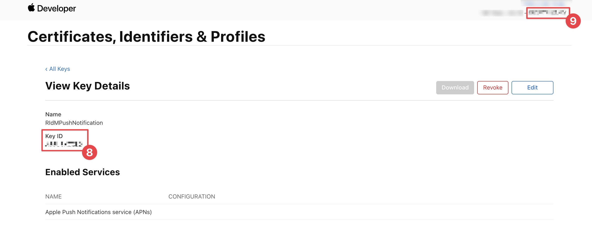
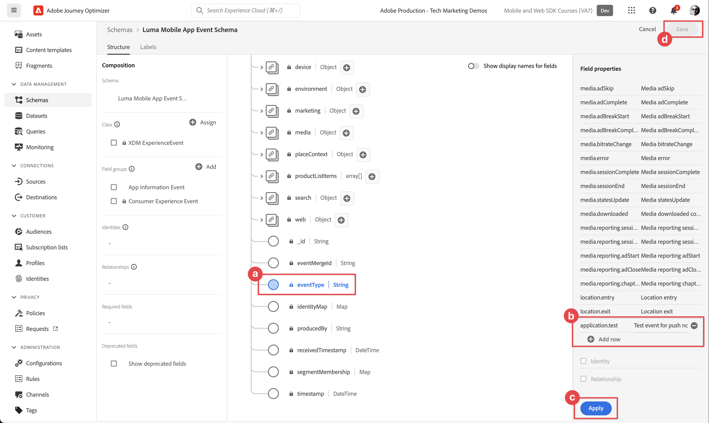

# Creación y envío de notificaciones push

Obtenga información sobre cómo crear notificaciones push para aplicaciones móviles con Experience Platform Mobile SDK y Journey Optimizer.

Journey Optimizer le permite crear recorridos y enviar mensajes a audiencias de destino. Antes de enviar notificaciones push con Journey Optimizer, debe asegurarse de que las configuraciones e integraciones adecuadas estén implementadas. Para comprender el flujo de datos de notificaciones push en Journey Optimizer, consulte la [documentación](https://experienceleague.adobe.com/docs/journey-optimizer/using/push/push-config/push-gs.html).


>[!NOTE]
>
>Esta lección es opcional y solo se aplica a los usuarios de Journey Optimizer que buscan enviar notificaciones push.


## Requisitos previos

* La aplicación se ha creado y ejecutado correctamente con los SDK instalados y configurados.
* Configure la aplicación para Adobe Experience Platform.
* Acceso a Journey Optimizer y permisos suficientes como se describe [aquí](https://experienceleague.adobe.com/docs/journey-optimizer/using/push/push-config/push-configuration.html?lang=en). Además, necesita permisos suficientes para las siguientes funciones de Journey Optimizer.
   * Cree una credencial push.
   * Cree una configuración de canal push.
   * Cree un recorrido.
   * Cree un mensaje.
   * Cree ajustes preestablecidos de mensaje.
* **Cuenta de desarrollador de Apple de pago** con acceso suficiente para crear certificados, identificadores y claves.
* Dispositivo o simulador físico de iOS para realizar pruebas.

## Objetivos de aprendizaje

En esta lección, debe

* Registre el ID de la aplicación con el servicio de notificaciones push de Apple (APNS).
* Cree una configuración de canal en Journey Optimizer.
* Actualice el esquema para incluir los campos de mensajería push.
* Instale y configure la extensión de etiquetas de Journey Optimizer.
* Actualice la aplicación para registrar la extensión de etiqueta de Journey Optimizer.
* Valide la configuración en Assurance.
* Envío de un mensaje de prueba desde Assurance
* Defina su propio evento, recorrido y experiencia de notificaciones push en Journey Optimizer.
* Envíe su propia notificación push desde la aplicación.


## Configuración

>[!TIP]
>
>Si ya configuró su entorno como parte de la lección [Mensajería en la aplicación de Journey Optimizer](journey-optimizer-inapp.md), es posible que ya haya realizado algunos de los pasos de esta sección de configuración.

### Registro del ID de la aplicación con APNS

Los siguientes pasos no son específicos de Adobe Experience Cloud y están diseñados para guiarle a través de la configuración de APNS.

#### Crear una clave privada

1. En Apple Developer Portal, vaya a **[!UICONTROL Keys]**.
1. Para crear una clave, seleccione **[!UICONTROL +]**.
   

1. Proporcione un **[!UICONTROL Nombre de clave]**.
1. Seleccione la casilla de verificación **[!UICONTROL Servicio de notificaciones push de Apple] (APN)**.
1. Seleccione **[!UICONTROL Continuar]**.
   
1. Revise la configuración y seleccione **[!UICONTROL Registrar]**.
1. Descargar la clave privada `.p8`. Se utiliza en el siguiente ejercicio cuando configura las credenciales push de Journey Optimizer.
1. Tome nota de la **[!UICONTROL ID de clave]**. Se utiliza en el siguiente ejercicio cuando configura las credenciales push de Journey Optimizer.
1. Tome nota de **[!UICONTROL Id. de equipo]**. Se utiliza en el siguiente ejercicio cuando configura las credenciales push de Journey Optimizer.
   

Encontrará documentación adicional [aquí](https://help.apple.com/developer-account/#/devcdfbb56a3).


#### Añadir las credenciales push de la aplicación en Journey Optimizer

A continuación, debe añadir las credenciales push de la aplicación móvil en Journey Optimizer. (En versiones anteriores del producto, se añadían como parte de la configuración &quot;Superficie de aplicación&quot; en la recopilación de datos).

Se requiere el registro de credenciales push de aplicaciones móviles para autorizar a Adobe a enviar notificaciones push en su nombre. Consulte los pasos detallados a continuación:

1. En la interfaz de Journey Optimizer, abra el menú **[!UICONTROL Canales]** > **[!UICONTROL Configuración push]** > **[!UICONTROL Credenciales push]**.

1. Seleccione **[!UICONTROL Crear credencial push]**.


   

1. En la lista desplegable **[!UICONTROL Plataforma]**, seleccione el sistema operativo **iOS**.

1. Introduzca el ID del paquete de la aplicación móvil en el campo **[!UICONTROL ID de la aplicación]** (ID del paquete de iOS). Por ejemplo, com.adobe.luma.tutorial.swiftui

1. Habilite la opción **[!UICONTROL Aplicar a todas las zonas protegidas]** para que estas credenciales push estén disponibles en todas las zonas protegidas. Si una zona protegida específica tiene sus propias credenciales para el mismo par de plataforma e ID de aplicación, esas credenciales específicas de la zona protegida tendrán prioridad.

1. Arrastre y suelte el archivo .p8 **Clave de autenticación de notificaciones push de Apple** obtenido en el ejercicio anterior.

1. Proporcione la **[!UICONTROL ID de clave]**, una cadena de 10 caracteres asignada durante la creación de la clave de autenticación `p8`. Se encuentra en la ficha **[!UICONTROL Keys]** de la página **Certificados, identificadores y perfiles** de las páginas del portal de Apple Developer. (Debió haberlo notado durante el ejercicio anterior).

1. Proporcione el **[!UICONTROL ID de equipo]**. El identificador de equipo es un valor que se encuentra en la ficha **Pertenencia** o en la parte superior de la página del portal para desarrolladores de Apple. (Debió haberlo notado durante el ejercicio anterior).

   

1. Haga clic en **[!UICONTROL Enviar]** para crear la configuración de sus credenciales push.

#### Cree una configuración de canal para push en Journey Optimizer

Una vez creada una configuración de credenciales push, debe crear una configuración para poder enviar notificaciones push desde Journey Optimizer.

1. En la interfaz de Journey Optimizer, abra el menú **[!UICONTROL Canales]** > **[!UICONTROL Configuración general]** > **[!UICONTROL Configuraciones de canal]** y luego seleccione **[!UICONTROL Crear configuración de canal]**.

   

1. Introduzca un nombre y una descripción (opcional) para la configuración.

   >[!NOTE]
   >
   > Los nombres deben comenzar por una letra (A-Z). Solo puede contener caracteres alfanuméricos. También puede utilizar caracteres de guion bajo `_`, punto `.` y guion `-`.


1. Para asignar etiquetas de uso de datos principales o personalizadas a la configuración, puedes seleccionar **[!UICONTROL Administrar acceso]**. [Obtenga más información acerca del Control de acceso de nivel de objeto (OLAC)](https://experienceleague.adobe.com/en/docs/journey-optimizer/using/access-control/object-based-access).

1. Seleccione el canal **Push**.


1. Seleccione **[!UICONTROL Acciones de marketing]** para asociar directivas de consentimiento a los mensajes que usan esta configuración. Todas las políticas de consentimiento asociadas con la acción de marketing se aprovechan para respetar las preferencias de los clientes. [Más información sobre las acciones de marketing](https://experienceleague.adobe.com/en/docs/journey-optimizer/using/privacy/consent/consent#surface-marketing-actions).

1. Elige tu **[!UICONTROL Plataforma]**.

1. Seleccione el mismo **[!UICONTROL ID de aplicación]** que para la credencial push configurada anteriormente.

1. Seleccione **[!UICONTROL Enviar]** para guardar los cambios.

   


### Actualizar configuración de secuencia de datos

Para garantizar que los datos enviados desde su aplicación móvil a Edge Network se reenvíen a Journey Optimizer, actualice la configuración de Experience Edge

1. En la IU de recopilación de datos, seleccione **[!UICONTROL Datastreams]** y su secuencia de datos, por ejemplo **[!DNL Luma Mobile App]**.
1. Seleccione  para **[!UICONTROL Experience Platform]** y seleccione  **[!UICONTROL Editar]** en el menú contextual.
1. En la pantalla **[!UICONTROL Datastreams]** >  > **[!UICONTROL Adobe Experience Platform]**:

   1. Si aún no está seleccionado, seleccione **[!UICONTROL Conjunto de datos del perfil push de AJO]** de **[!UICONTROL Conjunto de datos de perfil]**. Este conjunto de datos de perfil es necesario al usar la llamada API `MobileCore.setPushIdentifier` (consulte [Registrar el token de dispositivo para notificaciones push](#register-device-token-for-push-notifications)), que garantiza que el identificador único para notificaciones push (también conocido como identificador push) se almacene como parte del perfil del usuario.

   1. **[!UICONTROL Adobe Journey Optimizer]** está seleccionado. Consulte [Configuración de Adobe Experience Platform](https://experienceleague.adobe.com/docs/experience-platform/datastreams/configure.html?lang=en#aep) para obtener más información.

   1. Para guardar la configuración de su secuencia de datos, seleccione **[!UICONTROL Guardar]**.

   


### Instalación de la extensión Journey Optimizer tags

Para que la aplicación funcione con Journey Optimizer, debe actualizar la propiedad de etiquetas.

1. Vaya a **[!UICONTROL Etiquetas]** > **[!UICONTROL Extensiones]** > **[!UICONTROL Catálogo]**,
1. Abra su propiedad, por ejemplo **[!DNL Luma Mobile App Tutorial]**.
1. Seleccione **[!UICONTROL Catálogo]**.
1. Busque la extensión **[!UICONTROL Adobe Journey Optimizer]**.
1. Instale la extensión de.
1. En el diálogo **[!UICONTROL Instalar extensión]**
   1. Seleccione un entorno, por ejemplo **[!UICONTROL Desarrollo]**.
   1. Seleccione el conjunto de datos **[!UICONTROL AJO Push Tracking Experience Event Dataset]** de la lista **[!UICONTROL Event Dataset]**.
   1. Seleccione **[!UICONTROL Guardar en biblioteca y compilar]**.
      

>[!NOTE]
>
>Si no ve **[!UICONTROL Conjunto de datos de evento de experiencia de seguimiento push de AJO]** como opción, póngase en contacto con el servicio de atención al cliente.
>

## Validar la configuración con Assurance

1. Revise la sección [instrucciones de configuración](assurance.md#connecting-to-a-session) para conectar el simulador o dispositivo a Assurance.
1. En la IU de Assurance, seleccione **[!UICONTROL Configurar]**.
   
1. Seleccione  junto a **[!UICONTROL Push Debug]**.
1. Seleccione **[!UICONTROL Guardar]**.
   
1. Seleccione **[!UICONTROL Push Debug]** en el panel de navegación izquierdo.
1. Seleccione la ficha **[!UICONTROL Validar configuración]**.
1. Seleccione su dispositivo de la lista **[!UICONTROL Cliente]**.
1. Confirme que no está recibiendo ningún error.
   
1. Seleccione la ficha **[!UICONTROL Enviar inserción de prueba]**.
1. (opcional) Cambie los detalles predeterminados de **[!UICONTROL Title]** y **[!UICONTROL Body]**
1. Seleccione  **[!UICONTROL Enviar notificación push de prueba]**.
1. Compruebe **[!UICONTROL resultados de la prueba]**.
1. Debería ver la notificación push de prueba en la aplicación.

   


## Firma

La firma de la aplicación Luma es necesaria para enviar notificaciones push y **requiere una cuenta de desarrollador de Apple de pago**.

Para actualizar la firma de la aplicación:

1. Vaya a la aplicación en Xcode.
1. Seleccione **[!DNL Luma]** en el navegador de proyectos.
1. Seleccione el destino **[!DNL Luma]**.
1. Seleccione la pestaña **Firma y capacidades**.
1. Configure **[!UICONTROL Firma automática de administración]**, **[!UICONTROL Equipo]** y **[!UICONTROL Identificador de paquete]**, o use sus detalles específicos de aprovisionamiento de desarrollo de Apple.

   >[!IMPORTANT]
   >
   >Asegúrese de utilizar un identificador de paquete _unique_ y reemplace el identificador de paquete `com.adobe.luma.tutorial.swiftui`, ya que cada identificador de paquete debe ser único. Normalmente, utiliza un formato DNS inverso para cadenas de ID de paquete, como `com.organization.brand.uniqueidentifier`. La versión final de este tutorial, por ejemplo, utiliza `com.adobe.luma.tutorial.swiftui`.


   {zoomable="yes"}


## Añadir funciones de notificaciones push a la aplicación

>[!IMPORTANT]
>
>Para implementar y probar las notificaciones push en una aplicación de iOS, debes tener una cuenta de desarrollador de Apple **de pago**. Si no tiene una cuenta de desarrollador de Apple de pago, puede omitir el resto de esta lección.

1. En Xcode, seleccione **[!DNL Luma]** de la lista **[!UICONTROL TARGETS]**, seleccione la pestaña **[!UICONTROL Firma y capacidades]**, seleccione el botón **[!UICONTROL + capacidad]** y, a continuación, seleccione **[!UICONTROL Notificaciones push]**. Esto permite que la aplicación reciba notificaciones push.

1. A continuación, debe añadir una extensión de notificación a la aplicación. Vuelva a la ficha **[!DNL General]** y seleccione el icono **[!UICONTROL +]** en la parte inferior de la sección **[!UICONTROL TARGETS]**.

1. Se le pedirá que seleccione la plantilla para el nuevo destino. Seleccione **[!UICONTROL Extensión del servicio de notificaciones]** y, a continuación, seleccione **[!UICONTROL Siguiente]**.

1. En la siguiente ventana, use `NotificationExtension` como nombre de la extensión y haga clic en el botón **[!UICONTROL Finalizar]**.

Ahora debería tener una extensión de notificación push agregada a la aplicación, similar a la pantalla siguiente.


## Implementar Journey Optimizer en la aplicación

Como se ha explicado en lecciones anteriores, la instalación de una extensión de etiqueta móvil solo proporciona la configuración. A continuación, debe instalar y registrar Messaging SDK. Si estos pasos no están claros, revise la sección [Instalar SDK](install-sdks.md).

>[!NOTE]
>
>Si ha completado la sección [Instalar SDK](install-sdks.md), SDK ya está instalado y puede omitir este paso.
>

1. En Xcode, asegúrese de que [Mensajería de AEP](https://github.com/adobe/aepsdk-messaging-ios) se agrega a la lista de paquetes en Dependencias del paquete. Consulte [Administrador De Paquetes Swift](install-sdks.md#swift-package-manager).
1. Vaya a **[!DNL Luma]** > **[!DNL Luma]** > **[!UICONTROL AppDelegate]** en el navegador del proyecto Xcode.
1. Asegúrese de que `AEPMessaging` forme parte de su lista de importaciones.

   `import AEPMessaging`

1. Asegúrese de que `Messaging.self` forme parte de la matriz de extensiones que está registrando.

   ```swift
   let extensions = [
       AEPIdentity.Identity.self,
       Lifecycle.self,
       Signal.self,
       Edge.self,
       AEPEdgeIdentity.Identity.self,
       Consent.self,
       UserProfile.self,
       Places.self,
       Messaging.self,
       Optimize.self,
       Assurance.self
   ]
   ```

## Registrar token de dispositivo para notificaciones push

1. Agregar la API [`MobileCore.setPushIdentifier`](https://developer.adobe.com/client-sdks/documentation/mobile-core/api-reference/#setpushidentifier) a la función `func application(_ application: UIApplication, didRegisterForRemoteNotificationsWithDeviceToken deviceToken: Data)`.

   ```swift
   // Send push token to Mobile SDK
   MobileCore.setPushIdentifier(deviceToken)
   ```

   Esta función recupera el token del dispositivo exclusivo del dispositivo en el que está instalada la aplicación. A continuación, establece el token para la entrega de notificaciones push mediante la configuración que ha configurado y que depende del servicio de notificaciones push de Apple (APN).

>[!IMPORTANT]
>
>`MobileCore.updateConfigurationWith(configDict: ["messaging.useSandbox": true])` determina si las notificaciones push utilizan una zona protegida de APNS o un servidor de producción para enviar notificaciones push. Al probar la aplicación en el simulador o en un dispositivo, asegúrese de que `messaging.useSandbox` está establecido en `true` para que reciba notificaciones push. Al implementar su aplicación para producción con el programa Testflight de Apple, asegúrese de establecer `messaging.useSandbox` en `false`; de lo contrario, la aplicación de producción no podrá recibir notificaciones push.


## Cree su propia notificación push

Para crear su propia notificación push, debe definir un evento en Journey Optimizer que almacene en déclencheur un recorrido que se encargue de enviar una notificación push.

### Actualizar el esquema

Va a definir un nuevo tipo de evento, que aún no está disponible, como parte de la lista de eventos definidos en el esquema. Este tipo de evento se utiliza más adelante al activar las notificaciones push.

1. En la interfaz de usuario de Journey Optimizer, seleccione **[!UICONTROL Esquemas]** en el carril izquierdo.
1. Seleccione **[!UICONTROL Examinar]** en la barra de fichas.
1. Seleccione el esquema, por ejemplo **[!DNL Luma Mobile App Event Schema]** para abrirlo.
1. En el Editor de esquemas:
   1. Seleccione el campo **[!UICONTROL eventType]**.
   1. En el panel **[!UICONTROL Propiedades del campo]**, desplácese hacia abajo para ver la lista de valores posibles para el tipo de evento. Seleccione **[!UICONTROL Agregar fila]** y agregue `application.test` como **[!UICONTROL VALUE]** y `[!UICONTROL Test event for push notification]` como `DISPLAY NAME`.
   1. Seleccione **[!UICONTROL Aplicar]**.
   1. Seleccione **[!UICONTROL Guardar]**.
      

### Definición de un evento

Los eventos de Journey Optimizer le permiten almacenar en déclencheur sus recorridos de forma unitaria para enviar mensajes como, por ejemplo, notificaciones push. Consulte [Acerca de los eventos](https://experienceleague.adobe.com/docs/journey-optimizer/using/configuration/configure-journeys/events-journeys/about-events.html?lang=en) para obtener más información.

1. En la interfaz de usuario de Journey Optimizer, seleccione **[!UICONTROL Configuraciones]** en el carril izquierdo.

1. En la pantalla **[!UICONTROL Tablero]**, seleccione el botón **[!UICONTROL Administrar]** en el mosaico **[!UICONTROL Eventos]**.

1. En la pantalla **[!UICONTROL Eventos]**, seleccione **[!UICONTROL Crear evento]**.

1. En el panel **[!UICONTROL Editar evento de evento1]**:

   1. Escriba `LumaTestEvent` como **[!UICONTROL Nombre]** del evento.
   1. Proporcione una **[!UICONTROL descripción]**, por ejemplo `Test event to trigger push notifications in Luma app`.

   1. Seleccione el esquema del evento de experiencia de la aplicación móvil que creó anteriormente en [Crear un esquema XDM](create-schema.md) desde la lista **[!UICONTROL Esquema]**, por ejemplo **[!DNL Luma Mobile App Event Schema v.1]**.
   1. Seleccione  junto a la lista **[!UICONTROL Campos]**.

      

      En el cuadro de diálogo **[!UICONTROL Campos]**, asegúrese de que los siguientes campos estén seleccionados (sobre los campos predeterminados que siempre están seleccionados (**[!UICONTROL _id]**, **[!UICONTROL id]** y **[!UICONTROL timestamp]**)). Con la lista desplegable, puede alternar entre **[!UICONTROL Seleccionado]**, **[!UICONTROL Todo]** y **[!UICONTROL Principal]**, o usar el campo .

      * **[!UICONTROL Aplicación identificada (id.)]**,
      * **[!UICONTROL Tipo de evento (eventType)]**,
      * **[!UICONTROL Principal (principal)]**.

      

      A continuación, seleccione **[!UICONTROL Aceptar]**.

   1. Seleccione  junto al campo **[!UICONTROL Condición de ID de evento]**.

      1. En el cuadro de diálogo **[!UICONTROL Agregar una condición de id. de evento]**, arrastre y suelte **[!UICONTROL Tipo de evento (eventType)]** en **[!UICONTROL Arrastrar y soltar un elemento aquí]**.
      1. En la ventana emergente, desplácese hasta la parte inferior y seleccione **[!UICONTROL application.test]** (que es el tipo de evento que agregó anteriormente a la lista de tipos de eventos como parte de [Actualizar el esquema](#update-your-schema)). A continuación, desplácese hacia arriba y seleccione **[!UICONTROL Aceptar]**.
      1. Seleccione **[!UICONTROL Aceptar]** para guardar la condición.
         

   1. Seleccione **[!UICONTROL ECID (ECID)]** de la lista **[!UICONTROL Espacio de nombres]**. Automáticamente, el campo **[!UICONTROL Identificador de perfil]** se rellena con **[!UICONTROL El identificador del primer elemento del ECID de clave para el identityMap]** del mapa.
   1. Seleccione **[!UICONTROL Guardar]**.
      

Acaba de crear una configuración de evento basada en el esquema de eventos de experiencia de la aplicación móvil creado anteriormente como parte de este tutorial. Esta configuración de evento filtrará los eventos de experiencia entrantes usando su tipo de evento específico (`application.test`), de modo que solo los eventos con ese tipo específico, iniciados desde su aplicación móvil, almacenarán en déclencheur el recorrido que genere en el siguiente paso. En una situación real, es posible que desee enviar notificaciones push desde un servicio externo; sin embargo, se aplican los mismos conceptos: desde la aplicación externa, envíe un evento de experiencia a Experience Platform que tenga campos específicos que pueda utilizar para aplicar condiciones antes de que estos eventos entren en déclencheur con un recorrido.

### Creación del recorrido

El siguiente paso es crear el recorrido que almacene en déclencheur el envío de la notificación push al recibir el evento correspondiente.

1. En la interfaz de usuario de Journey Optimizer, seleccione **[!UICONTROL Recorridos]** en el carril izquierdo.
1. Seleccione **[!UICONTROL Crear Recorrido]**.
1. En el panel **[!UICONTROL Propiedades del Recorrido]**:

   1. Escriba un **[!UICONTROL Nombre]** para el recorrido, por ejemplo `Luma - Test Push Notification Journey`.
   1. Escriba una **[!UICONTROL descripción]** para el recorrido, por ejemplo `Journey for test push notifications in Luma mobile app`.
   1. Asegúrese de seleccionar **[!UICONTROL Permitir la reentrada]** y establezca **[!UICONTROL Período de espera de reentrada]** en **[!UICONTROL 30]** **[!UICONTROL Segundos]**.
   1. Seleccione **[!UICONTROL Aceptar]**.
      

1. En el lienzo del recorrido, en **[!UICONTROL EVENTS]**, arrastra y suelta tu  **[!DNL LumaTestEvent]** en el lienzo donde se muestra **[!UICONTROL Selecciona un evento de entrada o una actividad de lectura de audiencia]**.

   * En el panel **[!UICONTROL Eventos: LumaTestEvent]**, escriba una **[!UICONTROL Etiqueta]**, por ejemplo `Luma Test Event`.

1. En el menú desplegable **[!UICONTROL ACCIONES]**, arrastra y suelta  **[!UICONTROL Insertar]** en el  que aparece a la derecha de tu actividad **[!DNL LumaTestEvent]**. En el panel **[!UICONTROL Acciones: Push]**:

   1. Proporcione una **[!UICONTROL Etiqueta]**, por ejemplo `Luma Test Push Notification`, proporcione una **[!UICONTROL Descripción]**, por ejemplo `Test push notification for Luma mobile app`, seleccione **[!UICONTROL Transaccional]** de la lista **[!UICONTROL Categoría]** y seleccione **[!DNL Luma]** de la **[!UICONTROL Superficie de inserción]**.
   1. Seleccione  **[!UICONTROL Editar contenido]** para comenzar a editar la notificación push real.
      

      En el editor de **[!UICONTROL notificaciones push]**:

      1. Escriba un **[!UICONTROL Título]**, por ejemplo `Luma Test Push Notification` y un **[!UICONTROL Cuerpo]**, por ejemplo `Test push notification for Luma mobile app`.
      1. Opcionalmente, puede escribir un vínculo a una imagen (.png o .jpg) en **[!UICONTROL Agregar medios]**. Si lo hace, la imagen formará parte de la notificación push.
      1. Para guardar y salir del editor, selecciona .
         

   1. Para guardar y finalizar la definición de la notificación push, seleccione **[!UICONTROL Aceptar]**.

1. El recorrido debe ser similar al siguiente. Seleccione **[!UICONTROL Publicar]** para publicar y activar su recorrido.
   


## Déclencheur de la notificación push

Tiene todos los ingredientes para enviar una notificación push. Lo que queda es cómo almacenar en déclencheur esta notificación push. En esencia, es lo mismo que ha visto antes: simplemente envíe un evento de experiencia con la carga útil adecuada (como en [Eventos](events.md)).

Esta vez, el evento de experiencia que está a punto de enviar no se construye construyendo un diccionario XDM simple. Va a usar un(a) `struct` que representa una carga de notificación push. La definición de un tipo de datos dedicado es una forma alternativa de implementar la construcción de cargas útiles de evento de experiencia en la aplicación.

1. Vaya a **[!DNL Luma]** > **[!DNL Luma]** > **[!UICONTROL Modelo]** > **[!UICONTROL XDM]** > **[!UICONTROL TestPushPayload]** en el navegador del proyecto Xcode e inspeccione el código.

   ```swift
   import Foundation
   
   // MARK: - TestPush
   struct TestPushPayload: Codable {
      let application: Application
      let eventType: String
   }
   
   // MARK: - Application
   struct Application: Codable {
      let id: String
   }
   ```

   El código es una representación de la siguiente carga útil simple que va a enviar al déclencheur de su recorrido de notificaciones push de prueba

   ```json
   {
      "eventType": string,
      "application" : [
          "id": string
      ]
   }
   ```

1. Vaya a **[!DNL Luma]** > **[!DNL Luma]** > **[!DNL Utils]** > **[!UICONTROL MobileSDK]** en el navegador del proyecto Xcode y agregue el siguiente código a `func sendTestPushEvent(applicationId: String, eventType: String)`:

   ```swift
   // Create payload and send experience event
   Task {
       let testPushPayload = TestPushPayload(
           application: Application(
               id: applicationId
           ),
           eventType: eventType
       )
       // send the final experience event
       await sendExperienceEvent(
           xdm: testPushPayload.asDictionary() ?? [:]
       )
   }
   ```

   Este código crea una instancia de `testPushPayload` utilizando los parámetros proporcionados a la función (`applicationId` y `eventType`) y, a continuación, llama a `sendExperienceEvent` mientras convierte la carga útil en un diccionario. Este código, esta vez, también tiene en cuenta los aspectos asíncronos de llamar a Adobe Experience Platform SDK mediante el modelo de concurrencia de Swift basado en `await` y `async`.

1. Vaya a **[!DNL Luma]** > **[!DNL Luma]** > **[!DNL Views]** > **[!DNL General]** > **[!UICONTROL ConfigView]** en el navegador del proyecto Xcode. En la definición del botón de notificación push, añada el siguiente código para enviar la carga útil del evento de experiencia de notificación push de prueba al déclencheur del recorrido cada vez que se pulse ese botón.

   ```swift
   // Setting parameters and calling function to send push notification
   Task {
       let eventType = testPushEventType
       let applicationId = Bundle.main.bundleIdentifier ?? "No bundle id found"
       await MobileSDK.shared.sendTestPushEvent(applicationId: applicationId, eventType: eventType)
   }
   ```


## Validar con la aplicación

1. Vuelva a compilar y ejecute la aplicación en el simulador o en un dispositivo físico desde Xcode con .

1. Vaya a la ficha **[!UICONTROL Configuración]**.

1. Pulse **[!UICONTROL Notificación push]**. Verá aparecer la notificación push en la aplicación.

   


## Pasos siguientes

Ahora debe tener todas las herramientas para gestionar las notificaciones push en la aplicación. Por ejemplo, puede crear un recorrido en Journey Optimizer que envíe una notificación push de bienvenida cuando un usuario de la aplicación inicie sesión. O una notificación push de confirmación cuando un usuario compra un producto en la aplicación. O bien, introduce la geovalla de una ubicación (como verá en la lección [Places](places.md)).

>[!SUCCESS]
>
>Ahora ha habilitado la aplicación para notificaciones push mediante Journey Optimizer y la extensión de Journey Optimizer para Experience Platform Mobile SDK.
>
>Gracias por dedicar su tiempo a conocer Adobe Experience Platform Mobile SDK. Si tiene preguntas, desea compartir comentarios generales o tiene sugerencias sobre contenido futuro, compártalas en esta [publicación de debate de la comunidad de Experience League](https://experienceleaguecommunities.adobe.com/t5/adobe-experience-platform-data/tutorial-discussion-implement-adobe-experience-cloud-in-mobile/td-p/443796).

Siguiente: **[Crear y enviar mensajes en la aplicación](journey-optimizer-inapp.md)**
