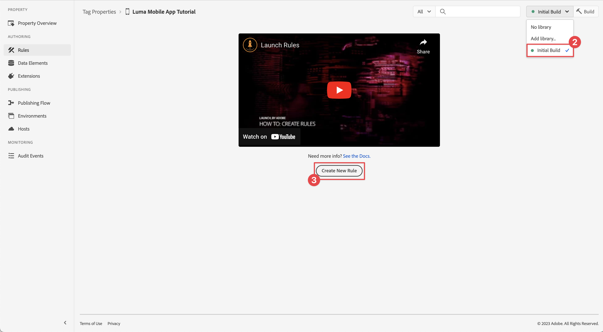
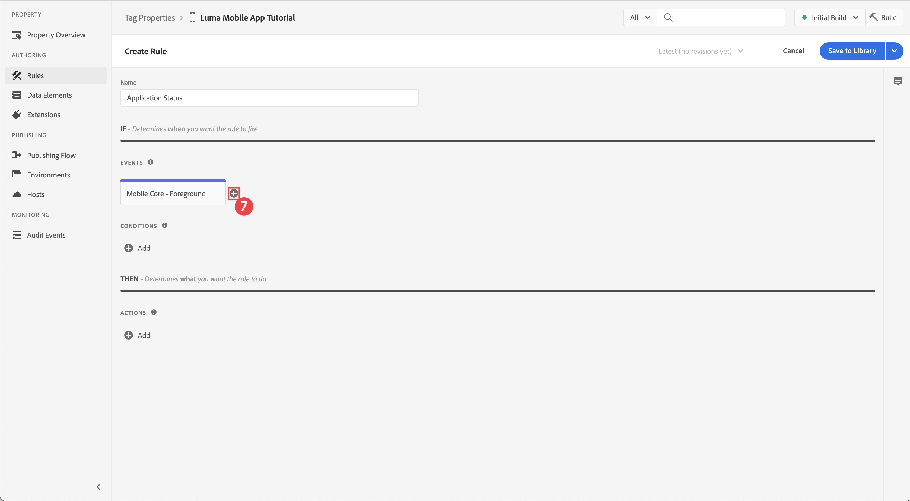

# Recopilar datos del ciclo vital

Obtenga información sobre cómo recopilar datos del ciclo vital en una aplicación móvil.

La extensión Adobe Experience Platform Mobile SDK Lifecycle permite la recopilación de datos del ciclo vital desde la aplicación móvil. La extensión de Adobe Experience Platform Edge Network envía estos datos del ciclo vital a Platform Edge Network, donde se reenvían a otras aplicaciones y servicios según la configuración del flujo de datos. Obtenga más información acerca de la [extensión del ciclo vital](https://developer.adobe.com/client-sdks/documentation/lifecycle-for-edge-network/) en la documentación del producto.


## Requisitos previos

* La aplicación se ha creado y ejecutado correctamente con los SDK instalados y configurados. Como parte de esta lección, ya ha iniciado la supervisión del ciclo vital. Consulte [Instalar SDK: actualizar AppDelegate](install-sdks.md#update-appdelegate) para revisarlos.
* Registró la extensión de Assurance como se describe en la [lección anterior](install-sdks.md).

## Objetivos de aprendizaje

En esta lección, deberá hacer lo siguiente:

<!--
* Add lifecycle field group to the schema.
* -->
* Habilite métricas precisas del ciclo vital iniciando/pausando correctamente la aplicación a medida que se mueve entre el primer y el segundo plano.
* Envíe datos de la aplicación a Platform Edge Network.
* Valide en Assurance.

<!--
## Add lifecycle field group to schema

The Consumer Experience Event field group you added in the [previous lesson](create-schema.md) already contains the lifecycle fields, so you can skip this step. If you don't use Consumer Experience Event field group in your own app, you can add the lifecycle fields by doing the following:

1. Navigate to the schema interface as described in the [previous lesson](create-schema.md).
1. Open the **Luma Mobile App Event Schema** schema and select **[!UICONTROL Add]** next to Field groups.
    {zoomable="yes"}
1. In the search bar, enter "lifecycle".
1. Select the checkbox next to **[!UICONTROL AEP Mobile Lifecycle Details]**.
1. Select **[!UICONTROL Add field groups]**.
    {zoomable="yes"}
1. Select **[!UICONTROL Save]**.
    {zoomable="yes"}
-->

## Cambios de implementación

Ahora puede actualizar el proyecto para registrar los eventos de ciclo vital.

>[!BEGINTABS]

>[!TAB iOS]

1. Vaya a **[!DNL Luma]** > **[!DNL Luma]** > **[!UICONTROL SceneDelegate]** en el navegador del proyecto Xcode.

1. Cuando se inicia, si la aplicación se reanuda desde un estado en segundo plano, iOS podría llamar al método delegado `sceneWillEnterForeground:` y en este método es donde desea almacenar en déclencheur un evento de inicio del ciclo vital. Agregar este código a `func sceneWillEnterForeground(_ scene: UIScene)`:

   ```swift
   // When in foreground start lifecycle data collection
   MobileCore.lifecycleStart(additionalContextData: nil)
   ```

1. Cuando la aplicación entre en segundo plano, deberá pausar la recopilación de datos del ciclo vital desde el método delegado `sceneDidEnterBackground:` de la aplicación. Agregar este código a `func sceneDidEnterBackground(_ scene: UIScene)`:

   ```swift
   // When in background pause lifecycle data collection
   MobileCore.lifecyclePause()
   ```

>[!TAB Android]

1. Vaya a **[!UICONTROL app]** > **[!UICONTROL kotlin+java]** > **[!UICONTROL com.adobe.luma.tutorial.android]** > **[!UICONTROL LumaApplication]** en el navegador de Android Studio.

1. Cuando se inicia, si la aplicación se reanuda desde un estado en segundo plano, Android podría llamar a la anulación `fun onActivityResumed function` y esta función es donde desea almacenar en déclencheur un evento de inicio del ciclo vital. Agregar este código a `override fun onActivityResumed(activity: Activity)`:

   ```kotlin
   // When in foreground start lifecycle data collection
   MobileCore.lifecycleStart(null)
   ```

1. Cuando la aplicación entre en segundo plano, deberá pausar la recopilación de datos del ciclo vital desde la función `override fun onActivityPaused` de la aplicación. Agregar este código a `override fun onActivityPaused(activity: Activity)`:

   ```kotlin
   // When in background pause lifecycle data collection
   MobileCore.lifecyclePause()
   ```

>[!ENDTABS]


## Validar con Assurance

1. Revise la sección [instrucciones de configuración](assurance.md#connecting-to-a-session) para conectar el simulador o dispositivo a Assurance.
1. Envíe la aplicación al segundo plano. Compruebe si hay **[!UICONTROL eventos LifecyclePause]** en la interfaz de usuario de Assurance.
1. Ponga la aplicación en primer plano. Compruebe si hay **[!UICONTROL eventos LifecycleResume]** en la interfaz de usuario de Assurance.
   {zoomable="yes"}


## Reenviar datos a Platform Edge Network

El ejercicio anterior envía los eventos en primer y segundo plano a Adobe Experience Platform Mobile SDK. Para reenviar estos eventos a Platform Edge Network:

1. Seleccione **[!UICONTROL Reglas]** en la propiedad Etiquetas.
   {zoomable="yes"}
1. Seleccione **[!UICONTROL Versión inicial]** como la biblioteca que se va a usar.
1. Seleccione **[!UICONTROL Crear nueva regla]**.
   {zoomable="yes"}
1. En la pantalla **[!UICONTROL Crear regla]**, escriba `Application Status` para **[!UICONTROL Nombre]**.
1. Seleccione  **[!UICONTROL Agregar]** por debajo de **[!UICONTROL EVENTOS]**.
   {zoomable="yes"}
1. En el paso **[!UICONTROL Configuración de eventos]**:
   1. Seleccione **[!UICONTROL Mobile Core]** como la **[!UICONTROL extensión]**.
   1. Seleccione **[!UICONTROL Primer plano]** como **[!UICONTROL Tipo de evento]**.
   1. Seleccione **[!UICONTROL Conservar cambios]**.
      {zoomable="yes"}
1. En la pantalla **[!UICONTROL Crear regla]**, selecciona  **[!UICONTROL Agregar]** junto a **[!UICONTROL Núcleo móvil - Primer plano]**.
   {zoomable="yes"}
1. En el paso **[!UICONTROL Configuración de eventos]**:
   1. Seleccione **[!UICONTROL Mobile Core]** como la **[!UICONTROL extensión]**.
   1. Seleccione **[!UICONTROL Fondo]** como **[!UICONTROL Tipo de evento]**.
   1. Seleccione **[!UICONTROL Conservar cambios]**.
      {zoomable="yes"}
1. En la pantalla **[!UICONTROL Crear regla]**, seleccione  **[!UICONTROL Agregar]** debajo de **[!UICONTROL ACCIONES]**.

   {zoomable="yes"}

1. En el paso **[!UICONTROL Configuración de la acción]**:
   1. Seleccione **[!UICONTROL Adobe Experience Edge Network]** como la **[!UICONTROL extensión]**.
   1. Seleccione **[!UICONTROL Reenviar evento a Edge Network]** como **[!UICONTROL Tipo de acción]**.
   1. Seleccione **[!UICONTROL Conservar cambios]**.
      {zoomable="yes"}
1. Seleccione **[!UICONTROL Guardar en biblioteca]**.
   {zoomable="yes"}
1. Seleccione **[!UICONTROL Build]** para reconstruir la biblioteca.
   {zoomable="yes"}

Una vez que haya creado la propiedad correctamente, los eventos se envían a Platform Edge Network y los eventos se reenvían a otras aplicaciones y servicios según la configuración del conjunto de datos.

Debería ver los eventos **[!UICONTROL Application Close (Background)]** y **[!UICONTROL Application Launch (Foreground)]** que contienen datos XDM en Assurance.

{zoomable="yes"}

>[!SUCCESS]
>
>Ahora ha configurado la aplicación para enviar eventos de estado de aplicación (primer plano, segundo plano) al Edge Network de Adobe Experience Platform y a todos los servicios definidos en la secuencia de datos.
>
> Gracias por dedicar su tiempo a conocer Adobe Experience Platform Mobile SDK. Si tiene preguntas, desea compartir comentarios generales o tiene sugerencias sobre contenido futuro, compártalas en esta [publicación de debate de la comunidad de Experience League](https://experienceleaguecommunities.adobe.com/t5/adobe-experience-platform-data/tutorial-discussion-implement-adobe-experience-cloud-in-mobile/td-p/443796?profile.language=es)

Siguiente: **[Rastrear datos de eventos](events.md)**
