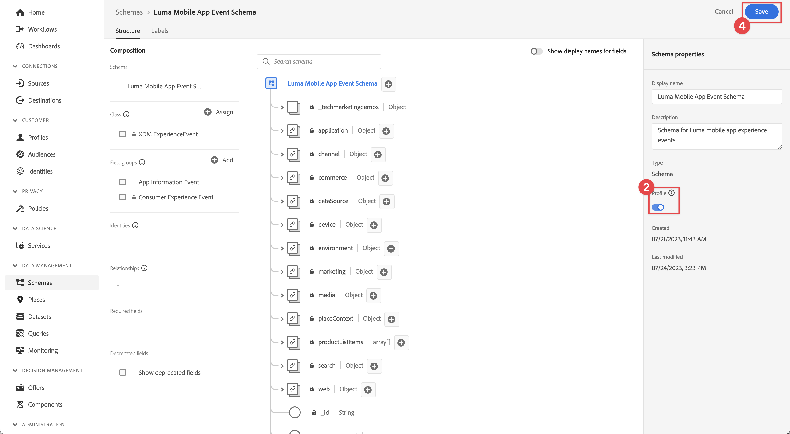

# Envío de datos al Experience Platform

Obtenga información sobre cómo enviar datos de aplicaciones móviles a Adobe Experience Platform.

Esta lección opcional es relevante para todos los clientes de Real-time Customer Data Platform (Real-Time CDP), Journey Optimizer y Customer Journey Analytics. Experience Platform, la base de los productos de Experience Cloud, es un sistema abierto que transforma todos los datos (de Adobe y sin Adobe) en perfiles de cliente sólidos. Estos perfiles de clientes se actualizan en tiempo real y utilizan perspectivas impulsadas por IA para ayudarle a ofrecer las experiencias correctas en todos los canales.

Los datos de [evento](events.md), [ciclo vital](lifecycle-data.md) e [identidad](identity.md) que recopiló y envió al Edge Network de Platform en lecciones anteriores se reenvían a los servicios configurados en su secuencia de datos, incluido Adobe Experience Platform.

## Requisitos previos

Su organización debe estar aprovisionada y se deben conceder permisos para Adobe Experience Platform.

Si no tiene acceso, [puede omitir esta lección](install-sdks.md).

## Objetivos de aprendizaje

En esta lección, deberá hacer lo siguiente:

* Cree un conjunto de datos de Experience Platform.
* Configure la secuencia de datos para reenviar datos al Experience Platform.
* Valide los datos del conjunto de datos.
* Habilite el esquema y el conjunto de datos para el Perfil del cliente en tiempo real.
* Validar datos en el perfil del cliente en tiempo real.
* Valide los datos en el gráfico de identidad.

## Crear un conjunto de datos

Todos los datos que se incorporan correctamente a Adobe Experience Platform se conservan dentro del lago de datos como conjuntos de datos. Un conjunto de datos es una construcción de almacenamiento y administración para una colección de datos (normalmente una tabla) que contiene un esquema (columnas) y campos (filas). Los conjuntos de datos también contienen metadatos que describen varios aspectos de los datos que almacenan. Consulte la [documentación](https://experienceleague.adobe.com/docs/experience-platform/catalog/datasets/overview.html?lang=es) para obtener más información.

1. Vaya a la interfaz del Experience Platform seleccionándola en el menú Aplicaciones  en la parte superior derecha.

1. Seleccione **[!UICONTROL Conjuntos de datos]** en el menú de navegación de la izquierda.

1. Seleccione  **[!UICONTROL Crear conjunto de datos]**.

1. Seleccione **[!UICONTROL Crear conjunto de datos a partir del esquema]**.
   

1. Busque su esquema. por ejemplo, usar `Luma Mobile` en el campo de búsqueda.
1. Seleccione el esquema, por ejemplo **[!DNL Luma Mobile App Event Schema]**.

1. Seleccione **[!UICONTROL Siguiente]**.
   

1. Proporcione **[!UICONTROL Nombre]**, por ejemplo `Luma Mobile App Events Dataset` y **[!UICONTROL Descripción]**.

1. Seleccione **[!UICONTROL Finalizar]**.
   

## Añadir el servicio de flujo de datos de Adobe Experience Platform

Para enviar los datos XDM del Edge Network a Adobe Experience Platform, agregue el servicio Adobe Experience Platform a la secuencia de datos que configuró como parte de [Crear una secuencia de datos](create-datastream.md).

>[!IMPORTANT]
>
>Solo puede habilitar el servicio Adobe Experience Platform cuando haya creado un conjunto de datos de evento.

1. En la IU de recopilación de datos, seleccione **[!UICONTROL Datastreams]** y su secuencia de datos.

1. Luego selecciona  **[!UICONTROL Agregar servicio]**.

1. Seleccione **[!UICONTROL Adobe Experience Platform]** de la lista [!UICONTROL Service].

1. Habilite el servicio activando **[!UICONTROL Enabled]**.

1. Seleccione el **[!UICONTROL Conjunto de datos de evento]** que creó anteriormente, por ejemplo **[!DNL Luma Mobile App Event Dataset]**.

1. Seleccione **[!UICONTROL Guardar]**.

   
1. La configuración final debería tener un aspecto similar al siguiente.

   

## Validación de datos en el conjunto de datos

Ahora que ha creado un conjunto de datos y ha actualizado el conjunto de datos para enviar datos al Experience Platform, todos los datos XDM enviados al Edge Network de Platform se reenvían a Platform y aterrizan en el conjunto de datos.

Abra la aplicación y vaya a las pantallas donde realiza el seguimiento de eventos. También puede almacenar en déclencheur las métricas del ciclo vital.

Abra el conjunto de datos en la interfaz de Platform. Debería ver los datos que llegan en lotes al conjunto de datos. Los datos suelen llegar en microlotes cada 15 minutos, por lo que es posible que no vea los datos inmediatamente.

También debería poder ver registros y campos de ejemplo usando la función **[!UICONTROL Vista previa del conjunto de datos]**:

Una herramienta más sólida para validar datos es [el servicio de consultas](https://experienceleague.adobe.com/docs/platform-learn/tutorials/queries/explore-data.html?lang=es) de Platform.

## Activar perfil de cliente en tiempo real

El perfil del cliente en tiempo real de Experience Platform le permite crear una vista integral de cada cliente individual que combina datos de varios canales, incluidos datos en línea, sin conexión, CRM y de terceros. El perfil le permite consolidar los distintos datos de clientes en una vista unificada, lo que ofrece una cuenta procesable con marca de tiempo de cada interacción de clientes.

### Habilitar el esquema

1. Abra el esquema, por ejemplo **[!DNL Luma Mobile App Event Schema]**.
1. Habilitar **[!UICONTROL perfil]**.
1. Seleccione **[!UICONTROL Los datos de este esquema contendrán una identidad principal en el campo identityMap.]** en el diálogo.
1. **[!UICONTROL Guardar]** el esquema.

   

### Habilitar el conjunto de datos

1. Abra el conjunto de datos, por ejemplo **[!DNL Luma Mobile App Event Dataset]**.
1. Habilitar **[!UICONTROL perfil]**.

   

### Validar datos en el perfil

Abra la aplicación y vaya a las pantallas donde realiza el seguimiento de eventos como, por ejemplo: inicie sesión en la aplicación de Luma y realice una compra.

Use Assurance para encontrar una de las identidades pasadas en identityMap (correo electrónico, lumaCrmId o ECID), por ejemplo, el ID de CRM.

En la interfaz de Platform,

1. Vaya a **[!UICONTROL Perfiles]** y seleccione **[!UICONTROL Examinar]** en la barra superior.
1. Especifique los detalles de identidad que acaba de tomar, por ejemplo `Luma CRM ID` para **[!UICONTROL área de nombres de identidad]** y el valor que copió para **[!UICONTROL valor de identidad]**. Luego selecciona **[!UICONTROL Ver]**.
1. Para ver los detalles, seleccione el perfil.

En la pantalla **[!UICONTROL Detail]**, puedes ver información básica sobre el usuario, incluidas las **[!UICONTROL **&#x200B; identidades vinculadas &#x200B;**]**:

En **[!UICONTROL Eventos]**, podrá ver los eventos recopilados de la implementación de su aplicación móvil para este usuario:

Desde la pantalla de detalles del perfil:

1. Para ver el gráfico de identidades, haz clic en el vínculo o navega a **[!UICONTROL Identidades]** y, a continuación, selecciona **[!UICONTROL Gráfico de identidades]** en la barra superior.
1. Para buscar el valor de identidad, especifique `Luma CRM ID` como **[!UICONTROL área de nombres de identidad]** y el valor copiado como **[!UICONTROL valor de identidad]**. Luego selecciona **[!UICONTROL Ver]**.

   Esta visualización muestra todas las identidades vinculadas en un perfil y su origen. Este es un ejemplo de un gráfico de identidades construido a partir de los datos recopilados al completar este tutorial del SDK móvil (Data Source 2) y el [tutorial del SDK web](https://experienceleague.adobe.com/docs/platform-learn/implement-web-sdk/overview.html?lang=es) (Data Source 1):

   

## Pasos siguientes

Los especialistas en marketing y análisis pueden hacer mucho más con los datos capturados en Experience Platform, incluido analizarlos en Customer Journey Analytics y crear segmentos en Real-time Customer Data Platform. ¡Ha tenido un buen comienzo!

>[!SUCCESS]
>
>Ahora ha configurado la aplicación para enviar datos no solo al Edge Network, sino también a Adobe Experience Platform. Gracias por dedicar su tiempo a conocer el SDK móvil de Adobe Experience Platform. Si tiene preguntas, desea compartir comentarios generales o tiene sugerencias sobre contenido futuro, compártalas en esta [publicación de debate de la comunidad de Experience League](https://experienceleaguecommunities.adobe.com/t5/adobe-experience-platform-data/tutorial-discussion-implement-adobe-experience-cloud-in-mobile/td-p/443796).

Siguiente: **[Crear y enviar notificaciones push](journey-optimizer-push.md)**
