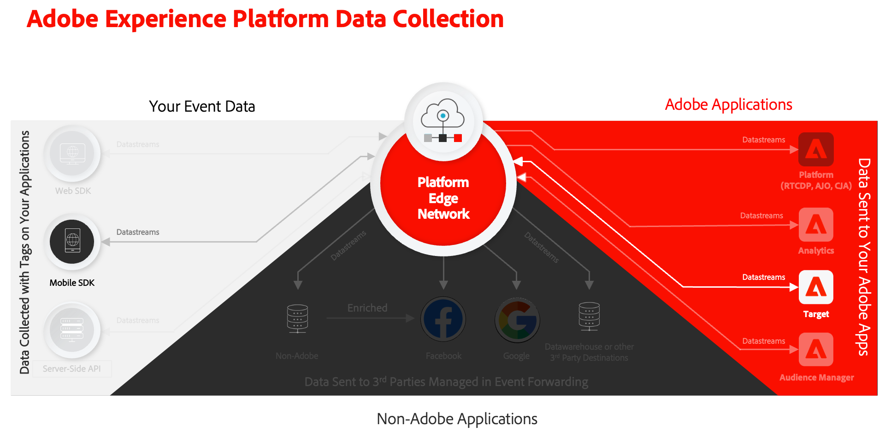

# Optimización y personalización con Adobe Target

Aprenda a optimizar y personalizar las experiencias en sus aplicaciones móviles con Platform Mobile SDK y Adobe Target.

Target proporciona todo lo que debe adaptar y personalizar las experiencias de los clientes. Target le ayuda a maximizar los ingresos de sus sitios web y móviles, aplicaciones, medios sociales y otros canales digitales. Target puede realizar pruebas A/B y multivariadas, recomendar productos y contenido, segmentar contenido, personalizar automáticamente el contenido con IA y mucho más. Esta lección se centra en la funcionalidad de prueba A/B de Target. Consulte la [descripción general de la prueba A/B](https://experienceleague.adobe.com/es/docs/target/using/activities/abtest/test-ab) para obtener más información.

{zoomable="yes"}

Antes de poder realizar pruebas A/B con Target, debe asegurarse de que las configuraciones y integraciones adecuadas estén implementadas.

>[!NOTE]
>
>Esta lección es opcional y solo se aplica a los usuarios de Adobe Target que buscan realizar pruebas A/B.


## Requisitos previos

* La aplicación se ha creado y ejecutado correctamente con los SDK instalados y configurados.
* Acceso a Adobe Target con [permisos, funciones, espacios de trabajo y propiedades correctamente configurados](https://experienceleague.adobe.com/es/docs/target/using/administer/manage-users/enterprise/property-channel).


## Objetivos de aprendizaje

En esta lección, deberá hacer lo siguiente:

* Actualice la secuencia de datos para la integración con Target.
* Actualice la propiedad de etiquetas con la extensión Offer Decisioning y Target.
* Actualice el esquema para capturar eventos de propuesta.
* Valide la configuración en Assurance.
* Cree una prueba A/B sencilla en Target.
* Actualice la aplicación para registrar la extensión de Optimizer.
* Implemente la prueba A/B en la aplicación.
* Valide la implementación en Assurance.


## Configuración

>[!TIP]
>
>Si ya configuró la aplicación como parte de la lección [ofertas de Journey Optimizer](journey-optimizer-offers.md), es posible que ya haya realizado algunos de los pasos de esta sección de configuración.

### Actualizar configuración de secuencia de datos

#### Adobe Target

Para garantizar que los datos enviados desde la aplicación móvil a Experience Platform Edge Network se reenvíen a Adobe Target, debe actualizar la configuración del flujo de datos.

1. En la IU de recopilación de datos, seleccione **[!UICONTROL Datastreams]** y su secuencia de datos, por ejemplo **[!DNL Luma Mobile App]**.
1. Seleccione **[!UICONTROL Agregar servicio]** y seleccione **[!UICONTROL Adobe Target]** de la lista **[!UICONTROL Servicio]**.
1. Si es cliente de Target Premium y desea usar tokens de propiedad, escriba el valor de destino **[!UICONTROL Token de propiedad]** que desee usar para esta integración. Los usuarios de Target Standard pueden omitir este paso.

   Puede encontrar sus propiedades en la interfaz de usuario de Target, en **[!UICONTROL Administración]** > **[!UICONTROL Propiedades]**. Seleccione  para mostrar el token de propiedad de la propiedad que desee usar. El token de propiedad tiene un formato como `"at_property": "xxxxxxxx-xxxx-xxxxx-xxxx-xxxxxxxxxxxx"`; solo debe especificar el valor `xxxxxxxx-xxxx-xxxxx-xxxx-xxxxxxxxxxxx`.

   De forma opcional, puede especificar un ID de entorno de destino. Target utiliza entornos para organizar sus sitios y entornos de preproducción para facilitar la administración y la creación de informes por separado. Los entornos preestablecidos incluyen Producción, Ensayo y Desarrollo. Consulte [Entornos](https://experienceleague.adobe.com/es/docs/target/using/administer/environments) y [Id. de entorno de destino](https://experienceleague.adobe.com/es/docs/platform-learn/implement-web-sdk/applications-setup/setup-target) para obtener más información.

   De forma opcional, puede especificar un área de nombres de ID de terceros de Target para admitir la sincronización de perfiles en un área de nombres de identidad (por ejemplo, ID de CRM). Consulte [Área de nombres de ID de terceros de Target](https://experienceleague.adobe.com/es/docs/platform-learn/implement-web-sdk/applications-setup/setup-target) para obtener más información.

1. Seleccione **[!UICONTROL Guardar]**.

   {zoomable="yes"}


#### Adobe Journey Optimizer

Para garantizar que los datos enviados desde su aplicación móvil a Edge Network se reenvíen a Journey Optimizer - Gestión de decisiones, actualice la configuración de su flujo de datos.

1. En la IU de recopilación de datos, seleccione **[!UICONTROL Datastreams]** y su secuencia de datos, por ejemplo **[!DNL Luma Mobile App]**.
1. Seleccione  para **[!UICONTROL Experience Platform]** y seleccione  **[!UICONTROL Editar]** en el menú contextual.
1. En la pantalla de **[!UICONTROL Datastreams]** >  > **[!UICONTROL Adobe Experience Platform]**, compruebe que **[!UICONTROL Offer Decisioning]**, **[!UICONTROL Edge Segmentation]** y **[!UICONTROL Personalization Destinations]** estén seleccionados. Si también sigues las lecciones de Journey Optimizer, seleccionas **[!UICONTROL Adobe Journey Optimizer]**. Consulte [Configuración de Adobe Experience Platform](https://experienceleague.adobe.com/es/docs/experience-platform/datastreams/configure) para obtener más información.
1. Para guardar la configuración de su secuencia de datos, seleccione **[!UICONTROL Guardar]** .

   {zoomable="yes"}


### Instalación de la extensión de Offer Decisioning y Target

Aunque esta lección trata sobre las pruebas A/B en Target, el resultado de una prueba se ve como una oferta y se implementa en la infraestructura de Adobe mediante la extensión de etiquetas de Adobe Offer Decisioning y Target. Esa extensión gestiona ambas ofertas proporcionadas por Journey Optimizer y Target.

1. Vaya a **[!UICONTROL Etiquetas]**, busque su propiedad de etiquetas móviles y abra la propiedad.
1. Seleccione **[!UICONTROL Extensiones]**.
1. Seleccione **[!UICONTROL Catálogo]**.
1. Busque la extensión **[!UICONTROL Offer Decisioning y Target]**.
1. Instale la extensión de. La extensión no requiere ninguna configuración adicional.

   {zoomable="yes"}


### Actualizar el esquema

1. Vaya a la interfaz de recopilación de datos y seleccione **[!UICONTROL Esquemas]** en el carril izquierdo.
1. Seleccione **[!UICONTROL Examinar]** en la barra superior.
1. Seleccione el esquema para abrirlo.
1. En el editor de esquemas, seleccione  **[!UICONTROL Agregar]** junto a **[!UICONTROL Grupos de campos]**.
1. En el cuadro de diálogo **[!UICONTROL Agregar grupos de campos]**, busque `proposition`, seleccione **[!UICONTROL Evento de experiencia - Interacciones de propuestas]** y seleccione **[!UICONTROL Agregar grupos de campos]**.
   {zoomable="yes"}
1. Para guardar los cambios en el esquema, seleccione **[!UICONTROL Guardar]**.


### Validar la configuración en Assurance

Para validar la configuración en Assurance:

1. Vaya a la IU de Assurance.
1. Seleccione **[!UICONTROL Configurar]** en el carril izquierdo y seleccione  junto a **[!UICONTROL Validar configuración]** debajo de **[!UICONTROL OFFER DECISIONING Y TARGET]**.
1. Seleccione **[!UICONTROL Guardar]**.
1. Seleccione **[!UICONTROL Validar configuración]** en el carril izquierdo. Tanto la configuración de la secuencia de datos como la configuración de SDK en la aplicación se validan.
   {zoomable="yes"}

## Crear una prueba A/B

Existen muchos tipos de actividades que puede crear en Adobe Target e implementar en una aplicación móvil, como se menciona en la introducción. Para esta lección, debe implementar una prueba A/B.

1. En la interfaz de usuario de Target, seleccione **[!UICONTROL Actividades]** en la barra superior.
1. Seleccione **[!UICONTROL Crear actividad]** y **[!UICONTROL Prueba A/B]** en el menú contextual.
1. En el cuadro de diálogo **[!UICONTROL Crear actividad de prueba A/B]**, seleccione **[!UICONTROL Móvil]** como **[!UICONTROL Tipo]**, seleccione un área de trabajo de la lista **[!UICONTROL Elegir Workspace]**. Seleccione su propiedad de la lista **[!UICONTROL Choose property]** si es cliente de Target Premium y ha especificado un token de propiedad en la secuencia de datos.
1. Seleccione **[!UICONTROL Crear]**.
   {zoomable="yes"}

1. En la pantalla **[!UICONTROL Actividad sin título]**, en el paso **[!UICONTROL Experiencias]**:

   1. Escriba `luma-mobileapp-abtest` en **[!UICONTROL Seleccionar ubicación]** debajo de **[!UICONTROL Ubicación 1]**. Este nombre de ubicación (denominada con frecuencia como mbox) se utiliza más adelante en la implementación de la aplicación.
   1. Seleccione  junto a **[!UICONTROL Contenido]** y seleccione **[!UICONTROL Crear oferta JSON]** del menú contextual.
   1. En el cuadro de diálogo **[!UICONTROL Crear oferta JSON]**, pegue el siguiente JSON.

      ```json
      { 
          "title": "Luma Anaolog Watch",
          "text": "Designed to stand up to your active lifestyle, this women's Luma Analog Watch features a tasteful brushed chrome finish and a stainless steel, water-resistant construction for lasting durability.", 
          "image": "https://luma.enablementadobe.com/content/dam/luma/en/products/gear/watches/Luma_Analog_Watch.jpg" 
      }
      ```

      {zoomable="yes"}

      Seleccione **[!UICONTROL Crear]**.

   1. Seleccione **[!UICONTROL +]** junto a **[!UICONTROL Experiencias]** para agregar **[!UICONTROL Experiencia B]**.


   1. Repita los pasos b y c para la experiencia B, pero en su lugar use `Aim Analog Watch` como título y pegue el siguiente JSON:

      ```json
      { 
          "title": "Aim Analog Watch",
          "text": "The flexible, rubberized strap is contoured to conform to the shape of your wrist for a comfortable all-day fit. The face features three illuminated hands, a digital read-out of the current time, and stopwatch functions.", 
          "image": "https://luma.enablementadobe.com/content/dam/luma/en/products/gear/watches/Aim_Watch.jpg" 
      }
      ```


1. En el paso **[!DNL Targeting]**, revise la configuración de la prueba A/B. De forma predeterminada, ambas ofertas se asignan por igual a todos los visitantes. Haga clic en **[!UICONTROL Siguiente]** para continuar.

   {zoomable="yes"}

1. En el paso **[!UICONTROL Objetivos y configuración]**:

   1. Cambie el nombre de la actividad sin título, por ejemplo, a `Luma Mobile SDK Tutorial - A/B Test Example`.
   1. Escriba un **[!UICONTROL Objetivo]** para la prueba A/B, por ejemplo `A/B Test for Luma mobile app tutorial`.
   1. Seleccione **[!UICONTROL Conversión]**, **[!UICONTROL Visualizó un mbox]** en el mosaico **[!UICONTROL Métrica de objetivo]** > **[!UICONTROL MI OBJETIVO PRINCIPAL]** e introduzca su nombre de ubicación (mbox), por ejemplo `luma-mobileapp-abtest`.
   1. Seleccione **[!UICONTROL Guardar y cerrar]**.

      {zoomable="yes"}

1. Vuelva a la pantalla **[!UICONTROL Todas las actividades]**:

   1. Seleccione  en su actividad.
   1. Seleccione  **[!UICONTROL Activar]** para activar la prueba A/B.

   {zoomable="yes"}


## Implementación de Target en la aplicación

Como se ha explicado en lecciones anteriores, la instalación de una extensión de etiqueta móvil solo proporciona la configuración. A continuación, debe instalar y registrar Optimize SDK. Si estos pasos no están claros, revise la sección [Instalar SDK](install-sdks.md).

>[!NOTE]
>
>Si ha completado la sección [Instalar SDK](install-sdks.md), SDK ya está instalado y puede omitir este paso.
>

>[!BEGINTABS]

>[!TAB iOS]

1. En Xcode, asegúrese de que [AEP Optimize](https://github.com/adobe/aepsdk-messaging-ios) se agrega a la lista de paquetes en Dependencias del paquete. Consulte [Administrador De Paquetes Swift](install-sdks.md#swift-package-manager).
1. Vaya a **[!DNL Luma]** > **[!DNL Luma]** > **[!DNL AppDelegate]** en el navegador del proyecto Xcode.
1. Asegúrese de que `AEPOptimize` forme parte de su lista de importaciones.

   `import AEPOptimize`

1. Asegúrese de que `Optimize.self` forme parte de la matriz de extensiones que está registrando.

   ```swift
   let extensions = [
       AEPIdentity.Identity.self,
       Lifecycle.self,
       Signal.self,
       Edge.self,
       AEPEdgeIdentity.Identity.self,
       Consent.self,
       UserProfile.self,
       Places.self,
       Messaging.self,
       Optimize.self,
       Assurance.self
   ]
   ```

1. Vaya a **[!DNL Luma]** > **[!DNL Luma]** > **[!DNL Utils]** > **[!DNL MobileSDK]** en el navegador del proyecto Xcode. Busque la función ` func updatePropositionAT(ecid: String, location: String) async`. Añada el siguiente código:

   ```swift
   // set up the XDM dictionary, define decision scope and call update proposition API
   Task {
       let ecid = ["ECID" : ["id" : ecid, "primary" : true] as [String : Any]]
       let identityMap = ["identityMap" : ecid]
       let xdmData = ["xdm" : identityMap]
       let decisionScope = DecisionScope(name: location)
       Optimize.clearCachedPropositions()
       Optimize.updatePropositions(for: [decisionScope], withXdm: xdmData) { data, error in
           if let error = error {
               Logger.aepMobileSDK.error("MobileSDK - updatePropositionsAT: Error updating propositions: \(error.localizedDescription)")
           }
       }
   }
   ```

   Esta función:

   * configura un diccionario XDM `xdmData`, que contiene el ECID para identificar el perfil para el que debe presentar la prueba A/B, y
   * define `decisionScope`, una matriz de ubicaciones sobre dónde presentar la prueba A/B.

   Entonces la función llama a dos API: [`Optimize.clearCachedPropositions`](https://developer.adobe.com/client-sdks/documentation/adobe-journey-optimizer-decisioning/api-reference/#clearpropositions) y [`Optimize.updatePropositions`](https://developer.adobe.com/client-sdks/documentation/adobe-journey-optimizer-decisioning/api-reference/#updatepropositions). Estas funciones borran todas las propuestas almacenadas en caché y actualizan las propuestas de este perfil. Una propuesta en este contexto es la experiencia (oferta) seleccionada de la actividad de Target (su prueba A/B) y que usted definió en [Crear una prueba A/B](#create-an-ab-test).

1. Vaya a **[!DNL Luma]** > **[!DNL Luma]** > **[!DNL Views]** > **[!DNL Personalization]** > **[!DNL TargetOffersView]** en el navegador del proyecto Xcode. Busque la función `func onPropositionsUpdateAT(location: String) async {` e inspeccione el código de esta función. La parte más importante de esta función es la llamada a la API [`Optimize.onPropositionsUpdate`](https://developer.adobe.com/client-sdks/documentation/adobe-journey-optimizer-decisioning/api-reference/#onpropositionsupdate), que:
   * recupera las propuestas del perfil actual en función del ámbito de decisión (que es la ubicación definida en la prueba A/B),
   * recupera la oferta de la propuesta,
   * desajusta el contenido de la oferta para que se pueda mostrar correctamente en la aplicación, y
   * déclencheur la acción `displayed()` en la oferta que devuelve un evento a Platform Edge Network para informar que se muestra la oferta.

1. Aún en **[!DNL TargetOffersView]**, agregue el código siguiente al modificador `.onFirstAppear`. Este código garantiza que la llamada de retorno para actualizar las ofertas se registre solo una vez.

   ```swift
   // Invoke callback for offer updates
   Task {
       await self.onPropositionsUpdateAT(location: location)
   }
   ```

1. Aún en **[!DNL TargetOffersView]**, agregue el código siguiente al modificador `.task`. Este código actualiza las ofertas cuando se actualiza la vista.

   ```swift
   // Clear and update offers
   await self.updatePropositionsAT(ecid: currentEcid, location: location)
   ```

>[!TAB Android]

1. En Android Studio, asegúrese de que [aepsdk-optimize-android](https://github.com/adobe/aepsdk-optimize-android) forme parte de las dependencias en **[!UICONTROL build.gradle.kts]** en **[!UICONTROL Android]**  > **[!UICONTROL Gradle Scripts]**. Ver [Gradle](install-sdks.md#gradle).
1. Vaya a **[!DNL app]** > **[!DNL kotlin+java]** > **[!UICONTROL com.adobe.luma.tutorial.android]** > **[!UICONTROL MainActivity]** en el navegador de Android Studio.
1. Asegúrese de que `Optimize` forme parte de su lista de importaciones.

   ```kotlin
   import com.adobe.marketing.mobile.optimize.Optimize
   ```

1. Asegúrese de que `Optimize.EXTENSION` forme parte de la matriz de extensiones que está registrando.

   ```kotlin
   val extensions = listOf(
      Identity.EXTENSION,
      Lifecycle.EXTENSION,
      Signal.EXTENSION,
      Edge.EXTENSION,
      Consent.EXTENSION,
      UserProfile.EXTENSION,
      Places.EXTENSION,
      Messaging.EXTENSION,
      Optimize.EXTENSION,
      Assurance.EXTENSION
   )
   ```

1. Vaya a **[!UICONTROL Android]**  > **[!DNL app]** > **[!DNL kotlin+java]** > **[!DNL com.adobe.luma.tutorial.android]** > **[!DNL models]** > **[!UICONTROL MobileSDK]** en el navegador de Android Studio. Busque la función ` suspend fun updatePropositionsAT(ecid: String, location: String)`. Añada el siguiente código:

   ```kotlin
   // set up the XDM dictionary, define decision scope and call update proposition API
   withContext(Dispatchers.IO) {
       val ecidMap = mapOf("ECID" to mapOf("id" to ecid, "primary" to true))
       val identityMap = mapOf("identityMap" to ecidMap)
       val xdmData = mapOf("xdm" to identityMap)
       val decisionScope = DecisionScope(location)
       Optimize.clearCachedPropositions()
       Optimize.updatePropositions(listOf(decisionScope), xdmData, null, object :
           AdobeCallbackWithOptimizeError<MutableMap<DecisionScope?, OptimizeProposition?>?> {
           override fun fail(optimizeError: AEPOptimizeError?) {
               val responseError = optimizeError
               Log.i("MobileSDK", "updatePropositionsAT error: ${responseError}")
           }
           override fun call(propositionsMap: MutableMap<DecisionScope?, OptimizeProposition?>?) {
               val responseMap = propositionsMap
               Log.i("MobileSDK", "updatePropositionsOD call: ${responseMap}")
           }
       })
   }
   ```

   Esta función:

   * configura un diccionario XDM `xdmData`, que contiene el ECID para identificar el perfil para el que debe presentar la prueba A/B, y
   * define `decisionScope`, una matriz de ubicaciones sobre dónde presentar la prueba A/B.

   Entonces la función llama a dos API: [`Optimize.clearCachedPropositions`](https://developer.adobe.com/client-sdks/documentation/adobe-journey-optimizer-decisioning/api-reference/#clearpropositions) y [`Optimize.updatePropositions`](https://developer.adobe.com/client-sdks/documentation/adobe-journey-optimizer-decisioning/api-reference/#updatepropositions). Estas funciones borran todas las propuestas almacenadas en caché y actualizan las propuestas de este perfil. Una propuesta en este contexto es la experiencia (oferta) seleccionada de la actividad de Target (su prueba A/B) y que usted definió en [Crear una prueba A/B](#create-an-ab-test).

1. Vaya a **[!DNL app]** > **[!DNL kotlin+java]** > **[!DNL com.adobe.luma.tutorial.android]** > **[!DNL views]** > **[!DNL TargetOffers.kt]** en el navegador de Android Studio. Busque la función `fun onPropositionsUpdateAT(location: String): List<OfferItem>` e inspeccione el código de esta función. La parte más importante de esta función es la llamada a la API [`Optimize.onPropositionsUpdate`](https://developer.adobe.com/client-sdks/documentation/adobe-journey-optimizer-decisioning/api-reference/#onpropositionsupdate), que:
   * recupera las propuestas del perfil actual en función del ámbito de decisión (que es la ubicación definida en la prueba A/B),
   * recupera la oferta de la propuesta,
   * desajusta el contenido de la oferta para que se pueda mostrar correctamente en la aplicación, y
   * devuelve la oferta.

1. Aún en **[!DNL TargetOffers.kt]**, agregue la función `LaunchedEffect` para asegurarse de que las ofertas se actualicen al iniciar la pestaña Personalization.

   ```kotlin
   // recompose the view when the number of received offers changes
   LaunchedEffect(offersAT.count()) {
       updatePropositionsAT(currentEcid, MobileSDK.shared.targetLocation.value)
       offersAT = onPropositionsUpdateAT(MobileSDK.shared.targetLocation.value)
   }
   ```

>[!ENDTABS]

Puede enviar parámetros de Target adicionales (como mbox, perfil, producto o parámetros de pedido) en una solicitud de consulta de personalización a la red de Experience Edge, agregándolos a un diccionario de datos al llamar a la API [`Optimize.updatePropositions`](https://developer.adobe.com/client-sdks/documentation/adobe-journey-optimizer-decisioning/api-reference/#updatepropositions). Consulte para obtener más información [Parámetros de destino](https://developer.adobe.com/client-sdks/documentation/adobe-journey-optimizer-decisioning/#target-parameters).


## Validación mediante la aplicación

>[!BEGINTABS]

>[!TAB iOS]

1. Vuelva a compilar y ejecute la aplicación en el simulador o en un dispositivo físico desde Xcode con .

1. Vaya a la ficha **[!UICONTROL Personalization]**.

1. Desplácese hacia abajo hasta la parte inferior y verá una de las dos ofertas que ha definido en su prueba A/B en el mosaico **[!UICONTROL TARGET]**.

   


>[!TAB Android]

1. Vuelva a compilar y ejecute la aplicación en el simulador o en un dispositivo físico desde Android Studio con .

1. Vaya a la pestaña **[!DNL Personalization]**.

1. Verá una de las dos ofertas que definió en su prueba A/B en el cuadro inferior del mosaico **[!UICONTROL TARGET]**.

   


>[!ENDTABS]

## Validación de la implementación en Assurance

Para validar la prueba A/B en Assurance:

1. Revise la sección [instrucciones de configuración](assurance.md#connecting-to-a-session) para conectar el simulador o dispositivo a Assurance.
1. Seleccione **[!UICONTROL Configurar]** en el carril izquierdo y seleccione  junto a **[!UICONTROL Revisar y simular]** debajo de **[!UICONTROL OFFER DECSIONING Y TARGET]**.
1. Seleccione **[!UICONTROL Guardar]**.
1. Seleccione **[!UICONTROL Revisar y simular]** en el carril izquierdo. Tanto la configuración de la secuencia de datos como la configuración de SDK en la aplicación se validan.
1. Seleccione **[!UICONTROL Solicitudes]** en la barra superior. Ve sus **[!DNL Target]** solicitudes.
   {zoomable="yes"}

1. Puede explorar las pestañas **[!UICONTROL Simular]** y **[!UICONTROL Lista de eventos]** para obtener funcionalidad adicional que le ayudará a validar la configuración de sus ofertas de Target.

## Próximos pasos

Ahora debe tener todas las herramientas para empezar a agregar más pruebas A/B u otras actividades de Target (como Segmentación de experiencias o Prueba multivariable), cuando corresponda y corresponda, a la aplicación. Hay información más detallada disponible en el repositorio de [GitHub para la extensión Optimize](https://github.com/adobe/aepsdk-optimize-ios), donde también puede encontrar un vínculo a un [tutorial](https://opensource.adobe.com/aepsdk-optimize-ios/#/tutorials/README) dedicado sobre cómo rastrear ofertas de Adobe Target.

>[!SUCCESS]
>
>Ha habilitado la aplicación para pruebas A/B y ha mostrado los resultados de una prueba A/B con la extensión Offer Decisioning y Target para Adobe Experience Platform Mobile SDK.
>
>Gracias por dedicar su tiempo a conocer Adobe Experience Platform Mobile SDK. Si tiene preguntas, desea compartir comentarios generales o tiene sugerencias sobre contenido futuro, compártalas en esta [publicación de debate de la comunidad de Experience League](https://experienceleaguecommunities.adobe.com/t5/adobe-experience-platform-data/tutorial-discussion-implement-adobe-experience-cloud-in-mobile/td-p/443796?profile.language=es).

Siguiente: **[Conclusión y pasos siguientes](conclusion.md)**
