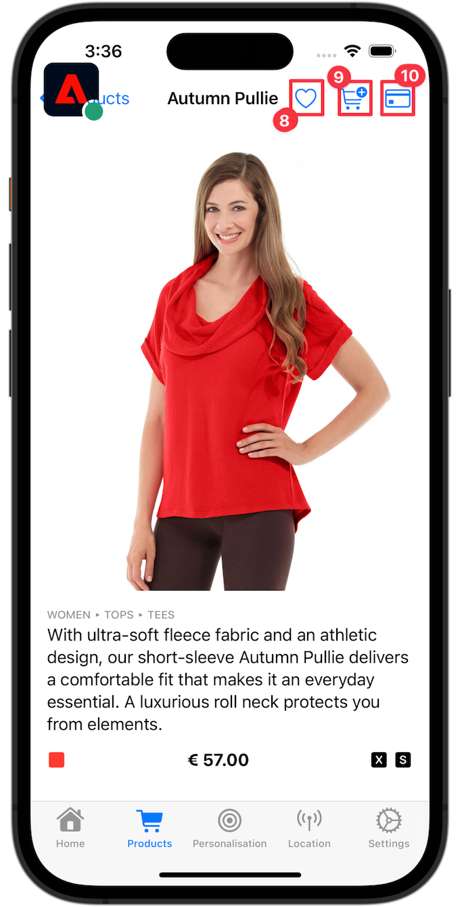

# Pruebe el uso de imágenes en línea mediante Markdown o un elemento de imagen de HTML.

Consulte a continuación para probar imágenes en línea con una sintaxis diferente

## HTML / anchura sin comillas

Revise la sección [instrucciones de configuración](assurance.md#connecting-to-a-session) para conectar el simulador o dispositivo con Assurance.

1. Mueva el icono de Assurance a la izquierda.
1. Seleccione **[!UICONTROL Inicio]** en la barra de pestañas y verifique que ve un **[!UICONTROL ECID]**, **[!UICONTROL correo electrónico]** y **[!UICONTROL ID de CRM]** en la pantalla Inicio.
1. Seleccione **[!DNL Products]** en la barra de fichas.
1. Seleccione un producto.
1. Seleccionar  (iOS) o  (Android).
1. Seleccionar .
1. Seleccionar .

>[!BEGINTABS]

>[!TAB iOS]

>[!TAB Android]

>[!ENDTABS]

## HTML / anchura con comillas

Revise la sección [instrucciones de configuración](assurance.md#connecting-to-a-session) para conectar el simulador o dispositivo con Assurance.

1. Mueva el icono de Assurance a la izquierda.
1. Seleccione **[!UICONTROL Inicio]** en la barra de pestañas y verifique que ve un **[!UICONTROL ECID]**, **[!UICONTROL correo electrónico]** y **[!UICONTROL ID de CRM]** en la pantalla Inicio.
1. Seleccione **[!DNL Products]** en la barra de fichas.
1. Seleccione un producto.
1. Seleccionar  (iOS) o  (Android).
1. Seleccionar .
1. Seleccionar .

>[!BEGINTABS]

>[!TAB iOS]

>[!TAB Android]

>[!ENDTABS]

## Markdown/width sin comillas

Revise la sección [instrucciones de configuración](assurance.md#connecting-to-a-session) para conectar el simulador o dispositivo con Assurance.

1. Mueva el icono de Assurance a la izquierda.
1. Seleccione **[!UICONTROL Inicio]** en la barra de pestañas y verifique que ve un **[!UICONTROL ECID]**, **[!UICONTROL correo electrónico]** y **[!UICONTROL ID de CRM]** en la pantalla Inicio.
1. Seleccione **[!DNL Products]** en la barra de fichas.
1. Seleccione un producto.
1. Seleccione {width=15} (iOS) o {width=25} (Android).
1. Seleccione {width=20}.
1. Seleccione {width=15}.

>[!BEGINTABS]

>[!TAB iOS]

{width=300}

>[!TAB Android]

{width=278}

>[!ENDTABS]

## Markdown / width con comillas

Revise la sección [instrucciones de configuración](assurance.md#connecting-to-a-session) para conectar el simulador o dispositivo con Assurance.

1. Mueva el icono de Assurance a la izquierda.
1. Seleccione **[!UICONTROL Inicio]** en la barra de pestañas y verifique que ve un **[!UICONTROL ECID]**, **[!UICONTROL correo electrónico]** y **[!UICONTROL ID de CRM]** en la pantalla Inicio.
1. Seleccione **[!DNL Products]** en la barra de fichas.
1. Seleccione un producto.
1. Seleccione {width="15"} (iOS) o {width="25"} (Android).
1. Seleccione {width="20"}.
1. Seleccione {width="15"}.

>[!BEGINTABS]

>[!TAB iOS]

{width="300"}

>[!TAB Android]

{&quot;width=278&quot;}

>[!ENDTABS]
