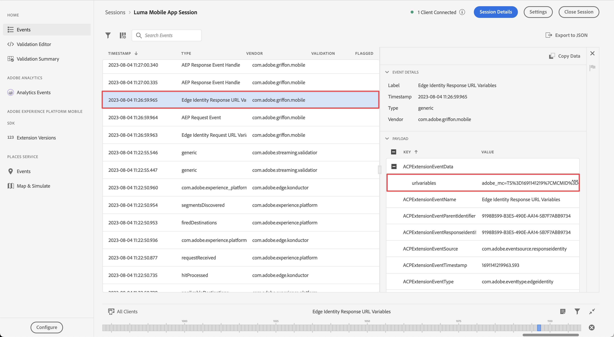

# Administrar vistas web

Obtenga información sobre cómo gestionar la recopilación de datos con WebViews en una aplicación móvil.

## Requisitos previos

* La aplicación se ha creado y ejecutado correctamente con los SDK instalados y configurados.

## Objetivos de aprendizaje

En esta lección, deberá hacer lo siguiente:

* Comprenda por qué debe tener especial consideración para WebViews en la aplicación.
* Comprenda el código necesario para evitar problemas de seguimiento.

## Posibles problemas de seguimiento

Los ECID independientes (identidad de Experience Cloud) se generan al enviar datos desde la parte nativa de la aplicación y desde un elemento WebView dentro de la aplicación. Estos ECID independientes dan como resultado visitas individuales desconectadas e infladas de datos de visitas y visitantes. Encontrará más información sobre el ECID en la [descripción general de ECID](https://experienceleague.adobe.com/es/docs/experience-platform/identity/features/ecid).

Para resolver las visitas desconectadas y los datos inflados, debe pasar el ECID del usuario desde la parte nativa de la aplicación a un WebView que pueda querer utilizar en la aplicación.

La extensión de AEP Edge Identity utilizada en WebView recopila el ECID actual y lo añade a la dirección URL en lugar de enviar una solicitud a Adobe para obtener un nuevo ID. A continuación, la implementación utiliza este ECID para solicitar la dirección URL.

## Implementación

Para implementar la vista web:

>[!BEGINTABS]

>[!TAB iOS]

Vaya a **[!DNL Luma]** > **[!DNL Luma]** > **[!DNL Views]** > **[!DNL Info]** > **[!DNL TermsOfServiceSheet]** y busque la función `func loadUrl()` en la clase `final class SwiftUIWebViewModel: ObservableObject`. Agregue la siguiente llamada para administrar el visor web:

```swift
// Handle web view
AEPEdgeIdentity.Identity.getUrlVariables {(urlVariables, error) in
    if let error = error {
        print("Error with Webview", error)
        return;
    }
    
    if let urlVariables: String = urlVariables {
        urlString.append("?" + urlVariables)
        guard let url = URL(string: urlString) else {
            return
        }
        DispatchQueue.main.async {
            self.webView.load(URLRequest(url: url))
        }
    }
    Logger.aepMobileSDK.info("Successfully retrieved urlVariables for WebView, final URL: \(urlString)")
}
```

La API [`AEPEdgeIdentity.Identity.getUrlVariables`](https://developer.adobe.com/client-sdks/documentation/identity-for-edge-network/api-reference/#geturlvariables) configura las variables para que la dirección URL contenga toda la información relevante, como ECID, etc. En el ejemplo se utiliza un archivo local, pero los mismos conceptos se aplican a las páginas remotas.

Puede obtener más información sobre la API `Identity.getUrlVariables` en la guía de referencia de la API de la extensión [Identity for Edge Network](https://developer.adobe.com/client-sdks/documentation/identity-for-edge-network/api-reference/#geturlvariables).


>[!TAB Android]

Vaya a **[!UICONTROL Android]**  > **[!DNL app]** > **[!DNL kotlin+java]** > **[!DNL com.adobe.luma.tutorial.android]** > **[!DNL views]** > **[!DNL WebViewModel]** y busque la función `fun loadUrl()` en `class WebViewModel: ViewModel()`. Agregue la siguiente llamada para administrar el visor web:

```kotlin
// Handle web view
Identity.getUrlVariables {
    urlVariables = it
    val baseUrl = getHtmlFileUrl("tou.html")

    val finalUrl = if (urlVariables.isNotEmpty()) {
        "$baseUrl?$urlVariables"
    } else {
        baseUrl
    }

    Handler(Looper.getMainLooper()).post {
        webView.loadUrl(finalUrl)
    }
    MobileSDK.shared.logInfo("TermsOfServiceSheet - loadUrl: Successfully loaded WebView with URL: $finalUrl")
}
```

La API [`Identity.getUrlVariables`](https://developer.adobe.com/client-sdks/documentation/identity-for-edge-network/api-reference/#geturlvariables) configura las variables para que la dirección URL contenga toda la información relevante, como ECID, etc. En el ejemplo se utiliza un archivo local, pero los mismos conceptos se aplican a las páginas remotas.

Puede obtener más información sobre la API `Identity.getUrlVariables` en la guía de referencia de la API de la extensión [Identity for Edge Network](https://developer.adobe.com/client-sdks/documentation/identity-for-edge-network/api-reference/#geturlvariables).

>[!ENDTABS]

## Validar en la aplicación

Para ejecutar el código:

1. Revise la sección [instrucciones de configuración](assurance.md#connecting-to-a-session) para conectar el simulador o dispositivo a Assurance.
1. Vaya a **[!UICONTROL Configuración]** en la aplicación
1. Pulse el botón **[!DNL View...]** para mostrar **[!DNL Terms of Use]**.

>[!BEGINTABS]

>[!TAB iOS]

 

>[!TAB Android]

 

>[!ENDTABS]


## Validar con Assurance

1. En la interfaz de usuario de Assurance, busque el evento **[!UICONTROL Variables de URL de respuesta de identidad de Edge]** del proveedor **[!UICONTROL com.adobe.griffon.mobile]**.
1. Seleccione el evento y revise el campo **[!UICONTROL urlvariable]** en el objeto **[!UICONTROL ACPExtensionsEventData]**, confirmando que los siguientes parámetros están presentes en la dirección URL: `adobe_mc`, `mcmid` y `mcorgid`.

   {zoomable="yes"}

   A continuación se muestra un campo `urvariables` de muestra:

   * Original (con caracteres de escape)

     ```html
     adobe_mc=TS%3D1636526122%7CMCMID%3D79076670946787530005526183384271520749%7CMCORGID%3D7ABB3E6A5A7491460A495D61%40AdobeOrg
     ```

   * Embellecido

     ```html
     adobe_mc=TS=1636526122|MCMID=79076670946787530005526183384271520749|MCORGID=7ABB3E6A5A7491460A495D61@AdobeOrg
     ```

Lamentablemente, la depuración de la sesión web es limitada. Por ejemplo, no puede utilizar Adobe Experience Platform Debugger en el explorador para continuar depurando la sesión de vista web.

>[!NOTE]
>
>La vinculación de visitantes a través de estos parámetros de URL se admite en Platform Web SDK (versiones 2.11.0 o posteriores) y al usar `VisitorAPI.js`.


>[!SUCCESS]
>
>Ahora ha configurado la aplicación para que muestre contenido basado en una URL en un visor web utilizando el mismo ECID que el ECID ya emitido por Adobe Experience Platform Mobile SDK.
>
>Gracias por dedicar su tiempo a conocer Adobe Experience Platform Mobile SDK. Si tiene preguntas, desea compartir comentarios generales o tiene sugerencias sobre contenido futuro, compártalas en esta [publicación de debate de la comunidad de Experience League](https://experienceleaguecommunities.adobe.com/t5/adobe-experience-platform-data/tutorial-discussion-implement-adobe-experience-cloud-in-mobile/td-p/443796?profile.language=es)

Siguiente: **[Identidad](identity.md)**
