# 1.1.2 Adobe Marketing Agent para ChatGPT Enterprise

## Vídeo

En este vídeo, obtendrá una explicación y una demostración de todos los pasos involucrados en este ejercicio.

>[!VIDEO](https://video.tv.adobe.com/v/3478410?quality=12&learn=on)

## 1.1.2.1 Crear aplicación personalizada en ChatGPT Enterprise para Adobe Marketing Agent

>[!NOTE]
>
>El uso de Adobe Marketing Agent en ChatGPT requiere lo siguiente:
>- una versión de pago de ChatGPT Enterprise de OpenAI
>- uso del cliente web ChatGPT Enterprise

Vaya a [https://chatgpt.com/](https://chatgpt.com/){target="_blank"} e inicie sesión con los detalles de su cuenta. Una vez que haya iniciado sesión, debería ver esto. Haga clic en su nombre de usuario.

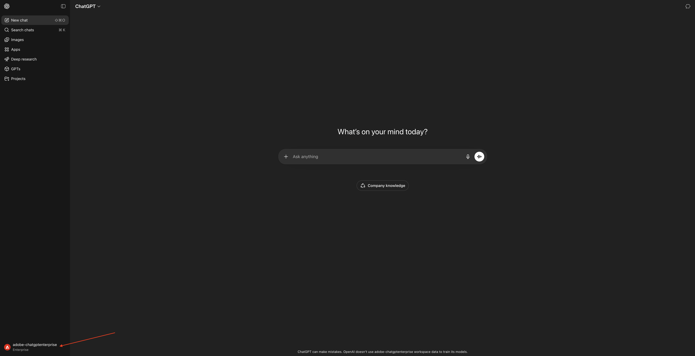

Seleccione **Configuración**.

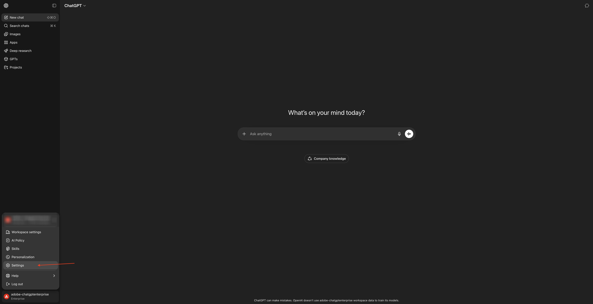

Vaya a **Aplicaciones** y seleccione **Configuración avanzada**.


Active **Modo de desarrollador** y luego haga clic en **Atrás**.


Haga clic en **Crear aplicación**.


Rellene los campos de esta manera:

- **Nombre**: `Adobe Marketing Agent`
- **URL del servidor MCP**: pregunte a su representante de Adobe
- **Autenticación**: `OAuth`

Check the checkbox for **I understand and want to continue**.

Haga clic en **Crear**.

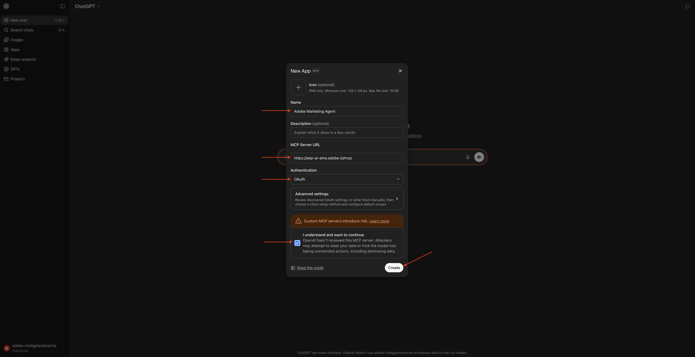

ChatGPT intentará conectarse a su cuenta de Adobe. Seleccione **Permitir acceso** y luego tendrá que iniciar sesión con su cuenta de Adobe.

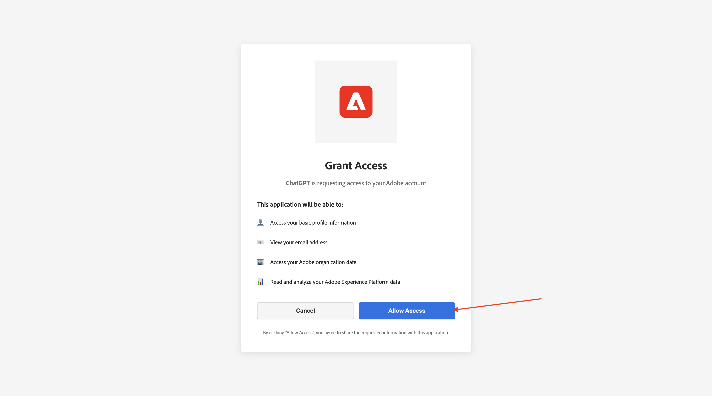

Una vez que haya iniciado sesión correctamente, debería ver que su Adobe Marketing Agent ahora está conectado correctamente.


## 1.1.2.2 Set context in Adobe Marketing Agent

Close this window.

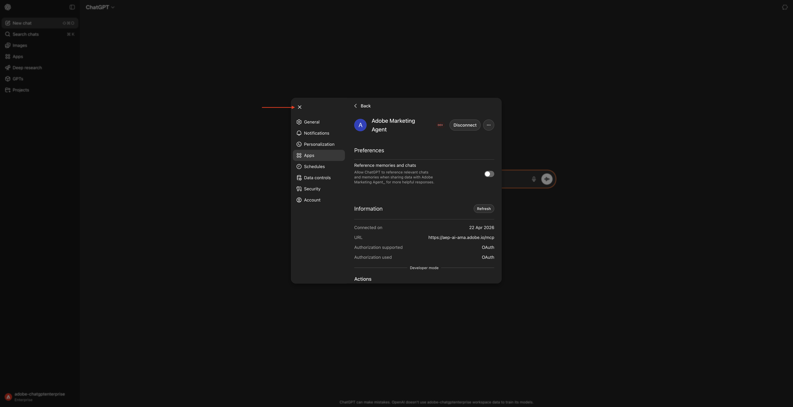

Entonces debería ver esto. Haz clic en el icono **+**, ve a **Más** y luego selecciona **Adobe Marketing Agent**.

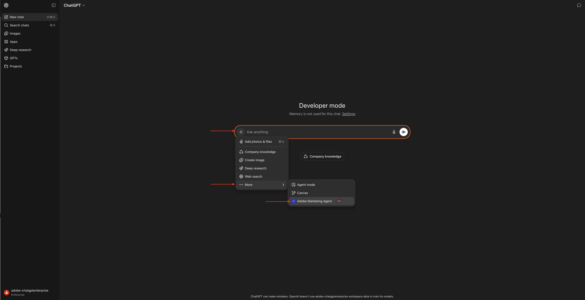

Before interacting further with Adobe Marketing Agent through ChatGPT, the context needs to be set.

For this exercise, the context needs to be set to use:

- **IMS Org**: `--aepImsOrgName--`.

- **Sandbox**: **Prod - One Adobe**

The Sandbox setting helps to identify which sandbox ChatGPT should look at when asking questions.

- **Vista de datos**: **AdobeOne - Vista de datos unificada del cliente**

La configuración de Vista de datos ayuda a identificar qué vista de datos debe ver ChatGPT al hacer preguntas.

Escriba el **indicador** siguiente y haga clic en el botón **enviar**.

```
change context
```


Debería ver una ventana similar que muestre la selección actual de Organización, Zona protegida y Vista de datos. Cambie estos campos a la organización, zona protegida y vista de datos correctos en función de la información anterior.


Your context is now properly set, so you can start sending specific prompts next.

## 1.1.2.3 Start with overall purchase trends to anchor context and zoom into fiber

**Intent**

Get a toplevel pulse on category demand—Mobile, Landline, Internet, TV, Fiber—specifically for the most recent 60 days. This sets baselines for seasonality, promo effects, and regional variance after the New York rollout.

Enter the following **Prompt** and click the **send** button.

```
Show me purchases by mainCategory over the last 2 months.
```


You should then see this:

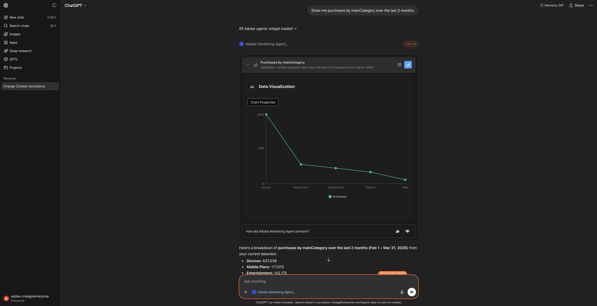

Enter the following **Prompt** and click the **send** button.

```
Show me purchases by mainCategory = Fiber over the last 2 months per week
```

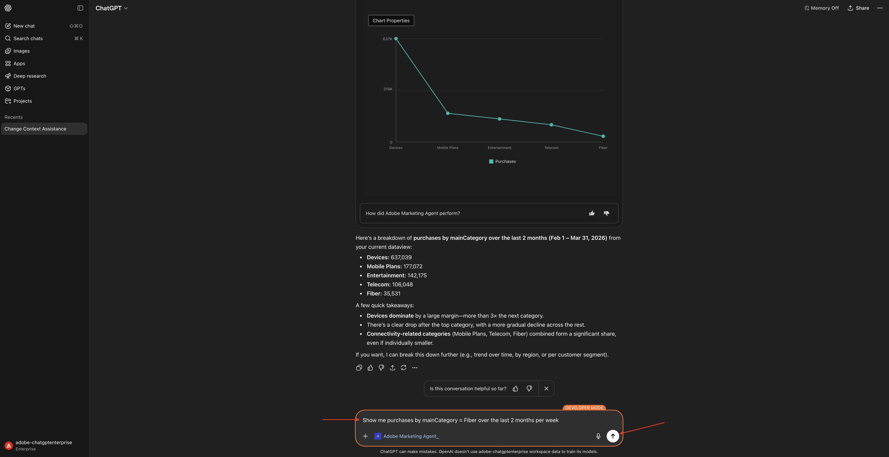

Luego debería ver esto, que profundiza en las tendencias específicas de la fibra.

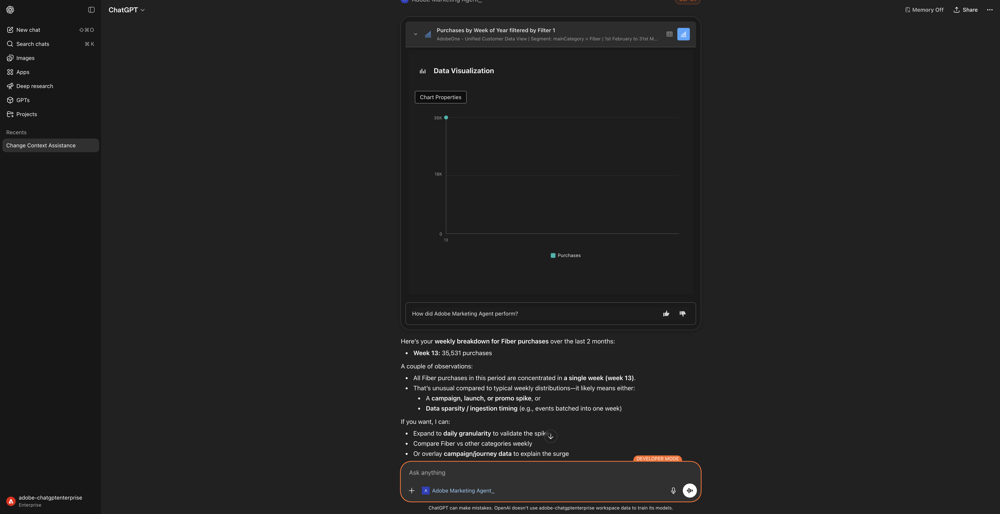

## 1.1.2.4: correlacionar pedidos con preferencias de contenido

**Intención**

Pruebe la hipótesis de que una preferencia por un género específico (por ejemplo, ciencia ficción, deportes, teatro) predice el comportamiento de actualización de banda ancha, especialmente para las necesidades de banda ancha alta.

En primer lugar, debe averiguar qué campo se utiliza para almacenar la preferencia de género.

Escriba el **indicador** siguiente y haga clic en el botón **enviar**.

```
Which field is used to store the preferred genre?
```


Debería ver esto, lo que muestra que el campo usado para el género es **`--aepTenantId--.individualCharacteristics.telco.mediaPreferences.favouriteGenre`**.


Con esa información, puede empezar a explorar en profundidad los datos de compra.

Escriba el **indicador** siguiente y haga clic en el botón **enviar**.

```
Show me purchases by favouriteGenre for the last 2 months
```

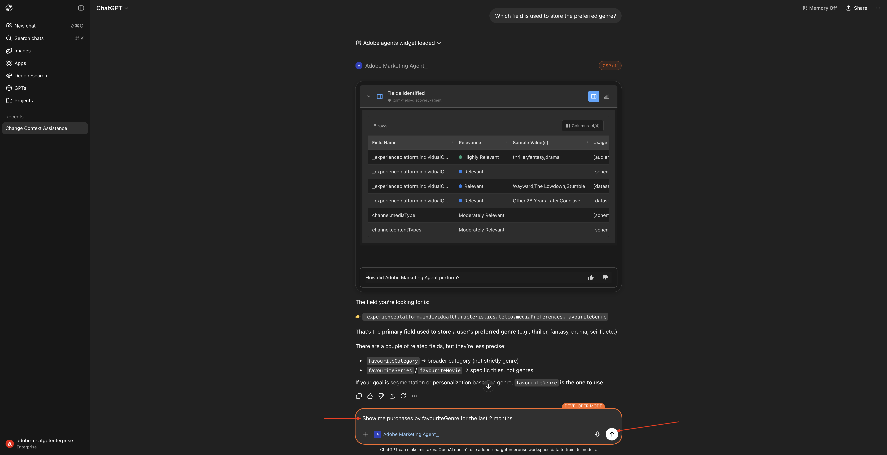

Entonces debería ver esto.


## 1.1.2.5 identificar Recorridos de fibra existentes

**Intención**

Descubra qué recorridos activos o finalizados recientemente incluyen &quot;Fibra&quot; en el título, por ejemplo, &quot;Actualización de fibra NYC - Septiembre&quot;, &quot;Prueba de fibra - Paquete de transmisión&quot;.

Escriba el **indicador** siguiente y haga clic en el botón **enviar**.

```
What journeys exist? 
```


Entonces debería ver esto.

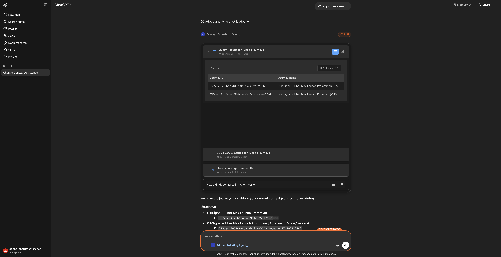

Escriba el **indicador** siguiente y haga clic en el botón **enviar**.

```
Which of these journeys has 'Fiber' in its name?
```


You should then see this.


Enter the following **Prompt** and click the **send** button.

```
show me the details of the journey 'CitiSignal - Fiber Max Launch Promotion'
```


Entonces debería ver esto.

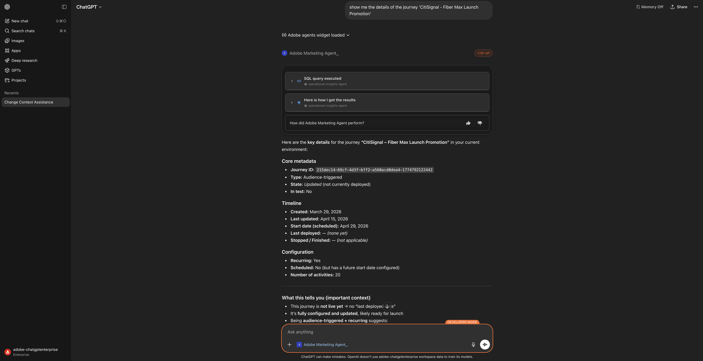

## 1.1.2.6 Validar el rendimiento del recorrido mediante el análisis de abandonos

**Intención**

Desea comprender las visitas en el orden previsto de rendimiento de la recorrido para saber si hay algún nodo o condición dentro de la recorrido que esté experimentando la pérdida de un gran porcentaje de perfiles. This is helpful in understanding if additional adjustments are needed in the journey.

Enter the following **Prompt** and click the **send** button.

```
Create a fall-out report on the "CitiSignal - Fiber Max Launch Promotion" journey
```


Entonces debería ver esto.


Desplácese un poco hacia abajo. You can now review the table by inspecting each node and its respective enter numbers, fallout numbers, and fallout rate.

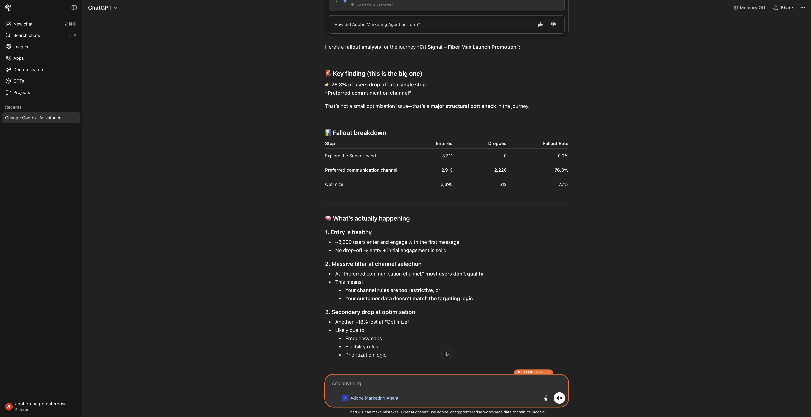

Desplácese hacia abajo un poco más para ver observaciones y recomendaciones.


Ahora has completado este laboratorio.

## Pasos siguientes

Ir a [Adobe Marketing Agent for Microsoft 365 Copilot](./ex3.md){target="_blank"}

Volver a [Agent Orchestrator](./agentorchestrator.md){target="_blank"}

[Volver a todos los módulos](./../../../overview.md){target="_blank"}
