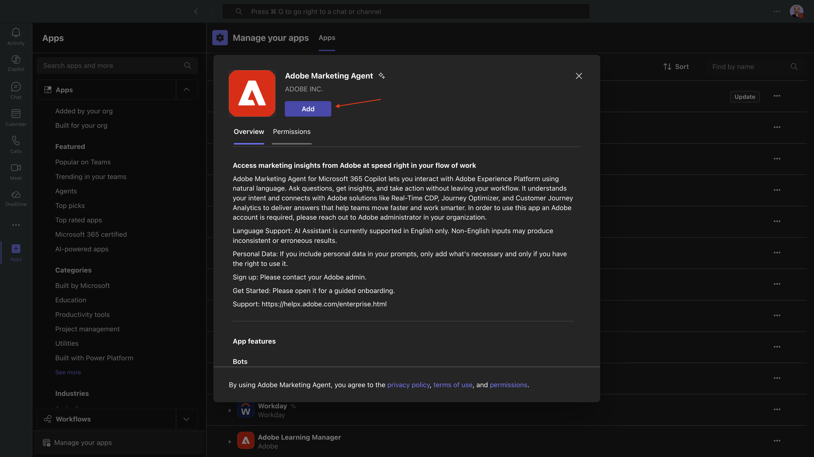
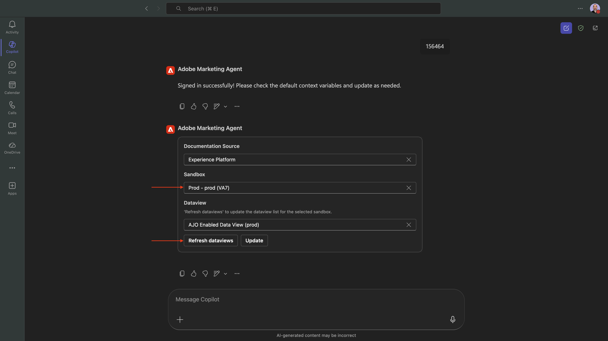

# 1.1.3 Adobe Marketing Agent for Microsoft 365 Copilot

## Requisitos previos

Para seguir los pasos de este laboratorio como se documenta a continuación, se requiere el siguiente acceso:

- Acceso a Real-Time CDP, Journey Optimizer y Customer Journey Analytics
- Acceso al asistente de IA en Adobe Experience Cloud
- Acceso a AEP Agent Orchestrator
- Acceso a Microsoft 365 Copilot

## Vídeo

En este vídeo, obtendrá una explicación y una demostración de todos los pasos involucrados en este ejercicio.

>[!VIDEO](https://video.tv.adobe.com/v/3479158?quality=12&learn=on)

## 1.1.3.1 Agregar Adobe Marketing Agent a equipos y copiloto de Microsoft 365

Abra Microsoft Teams e inicie sesión con los detalles de su cuenta. Una vez que haya iniciado sesión, debería ver esto.

Haga clic en **Aplicaciones**.


Seleccione **Administrar sus aplicaciones**.


Seleccione **Cargar una aplicación**.


Seleccione **Cargar una aplicación personalizada**.


Seleccione el archivo de manifiesto que le proporcionó su instructor y haga clic en **Abrir**.


Haga clic en **Agregar**.



Haga clic en **Abrir con Copilot**.


Adobe Marketing Agent se ha cargado correctamente.


Escriba la solicitud `login` y haga clic en el botón **enviar**.


Haga clic en **Iniciar sesión en Adobe Marketing Agent**.


Se abrirá una nueva ventana para pedirle que inicie sesión con las credenciales de su cuenta de Adobe.


A continuación, verá que se genera un código similar. Haga clic en **Copiar** para copiar el código.


Pegue el código en la ventana de Adobe Marketing Agent en Copilot y haga clic en el botón **enviar**.


Entonces debería ver algo similar a esto. Ahora ha iniciado sesión correctamente en Adobe Marketing Agent en Microsoft 365 Copilot.


## 1.1.3.2: establecer contexto en Adobe Marketing Agent

Antes de seguir interactuando con Adobe Marketing Agent a través de Copilot, se debe establecer el contexto.

Para este ejercicio, el contexto debe configurarse para utilizar:

- **Espacio aislado**: **Producto - Un Adobe (VA7)**

  La configuración de la zona protegida ayuda a identificar qué simulador de pruebas de IA debe consultar al hacer preguntas.

- **Vista de datos**: **AdobeOne - Vista de datos unificada del cliente**

  La configuración de vista de datos ayuda a identificar qué vista de datos debe ver el asistente de IA al hacer preguntas.

En primer lugar, cambie la zona protegida a la correcta y, a continuación, haga clic en **Actualizar vistas de datos**.



A continuación, seleccione la vista de datos correcta y haga clic en **Actualizar**.


Entonces debería ver esto. El contexto ahora está configurado correctamente para que pueda empezar a enviar solicitudes específicas a continuación.


## 1.1.3.3 Comience con las tendencias generales de compra para anclar el contexto y ampliar el alcance de la fibra

**Intención**

Obtenga un impulso de nivel superior sobre la demanda de categorías (móvil, fijo, Internet, TV, fibra), específicamente durante los últimos 60 días. Esto establece líneas de base para la estacionalidad, los efectos de promoción y la variación regional después del despliegue en Nueva York.

Escriba el **indicador** siguiente y haga clic en el botón **enviar**.

```
Show me purchases by mainCategory over the last 2 months.
```


Debería ver lo siguiente:


Escriba el **indicador** siguiente y haga clic en el botón **enviar**.

```
Show me purchases by mainCategory = Fiber over the last 2 months broken down by week
```


Luego debería ver esto, que profundiza en las tendencias específicas de la fibra.


## 1.1.3.4: correlacionar pedidos con preferencias de contenido

**Intención**

Pruebe la hipótesis de que una preferencia por un género específico (por ejemplo, ciencia ficción, deportes, teatro) predice el comportamiento de actualización de banda ancha, especialmente para las necesidades de banda ancha alta.

En primer lugar, debe averiguar qué campo se utiliza para almacenar la preferencia de género.

Escriba el **indicador** siguiente y haga clic en el botón **enviar**.

```
Which field is used to store the preferred genre
```


Debería ver esto, lo que muestra que el campo usado para el género es **`--aepTenantId--.individualCharacteristics.telco.mediaPreferences.favouriteGenre`**.


Con esa información, puede empezar a explorar en profundidad los datos de compra.

Escriba el **indicador** siguiente y haga clic en el botón **enviar**.

```
Show me purchases by preferred genre for the last 2 months until today
```


Entonces debería ver esto. Haga clic en **Ver datos**.


Entonces debería ver esto.


## 1.1.3.5 identificar Recorridos de fibra existentes

**Intención**

Descubra qué recorridos activos o finalizados recientemente incluyen &quot;Fibra&quot; en el título, por ejemplo, &quot;Actualización de fibra NYC - Septiembre&quot;, &quot;Prueba de fibra - Paquete de transmisión&quot;.

Escriba el **indicador** siguiente y haga clic en el botón **enviar**.

```
What journeys exist? 
```


A continuación, debería ver una lista de recorridos.


Escriba el **indicador** siguiente y haga clic en el botón **enviar**.

```
Which of these journeys has 'Fiber' in its name?
```


Entonces debería ver esto.


Escriba el **indicador** siguiente y haga clic en el botón **enviar**.

```
Show me the details of the journey 'CitiSignal - Fiber Max Launch Promotion'
```


Entonces debería ver esto.


## 1.1.3.6 Validar el rendimiento del recorrido mediante el análisis de abandonos

**Intención**

Desea comprender las visitas en el orden previsto de rendimiento de la recorrido para saber si hay algún nodo o condición dentro de la recorrido que esté experimentando la pérdida de un gran porcentaje de perfiles. Esto resulta útil para saber si se necesitan ajustes adicionales en el recorrido.

Escriba el **indicador** siguiente y haga clic en el botón **enviar**.

```
Create a fall-out report on the "CitiSignal - Fiber Max Launch Promotion" journey
```


Entonces debería ver esto.


Desplácese hacia abajo un poco más para ver observaciones y recomendaciones.


Ahora has completado este laboratorio.

## Pasos siguientes

Vaya a [Adobe Marketing Agent for Google Gemini Enterprise](./ex4.md){target="_blank"}

Volver a [Agent Orchestrator](./agentorchestrator.md){target="_blank"}

[Volver a todos los módulos](./../../../overview.md){target="_blank"}
