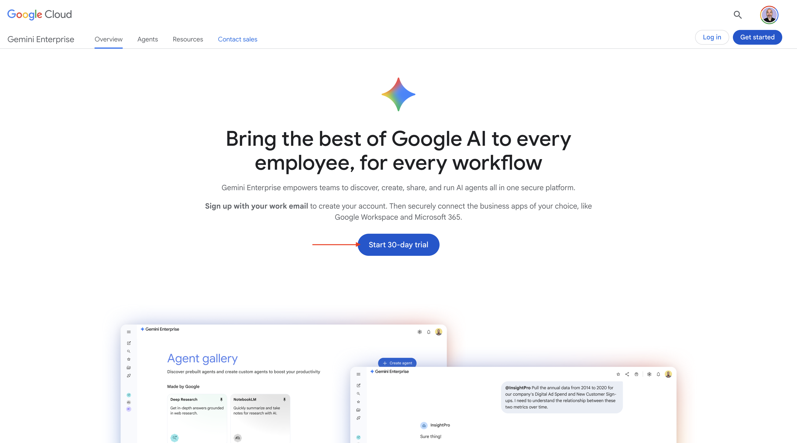
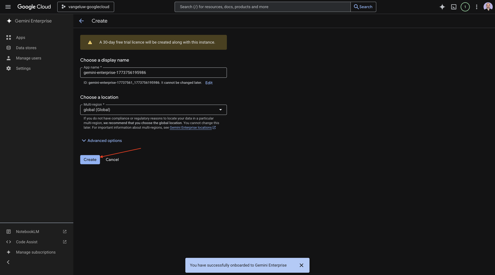
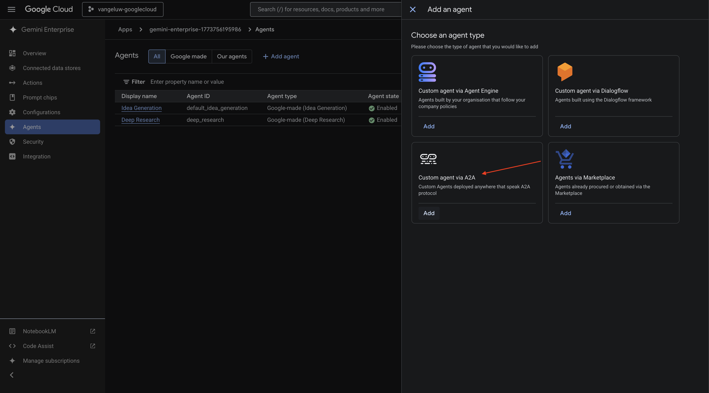
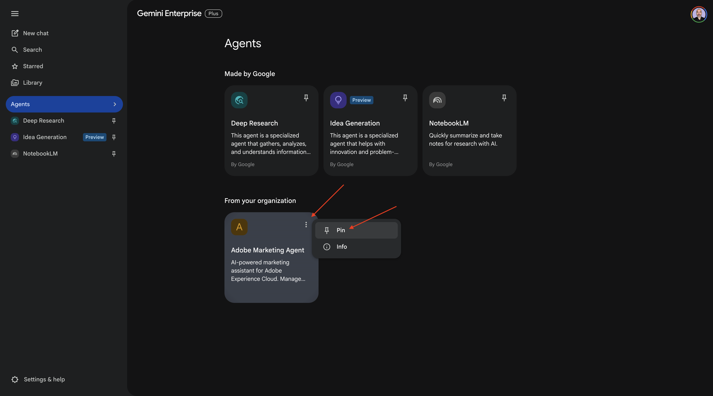
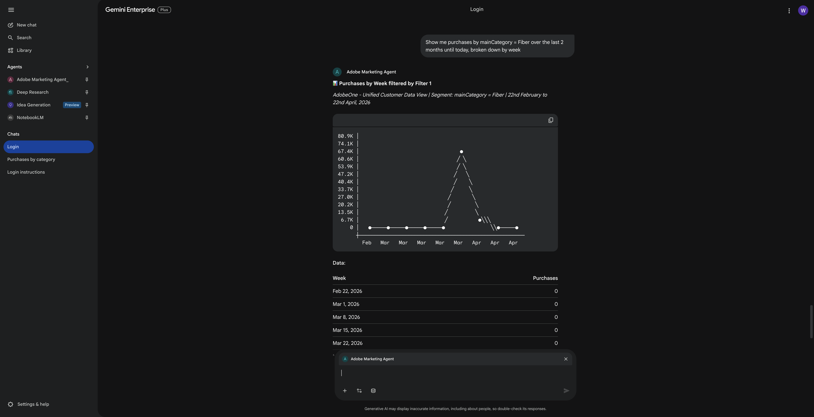
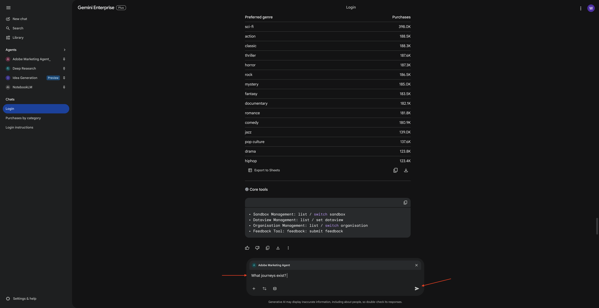
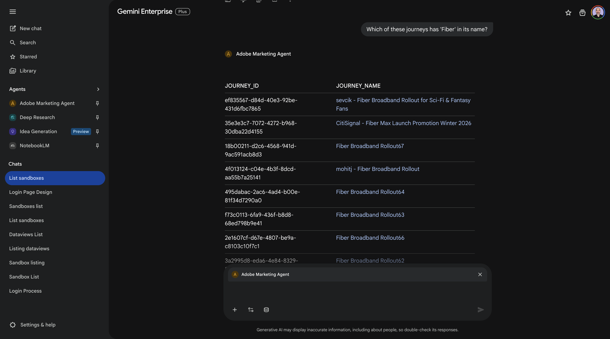
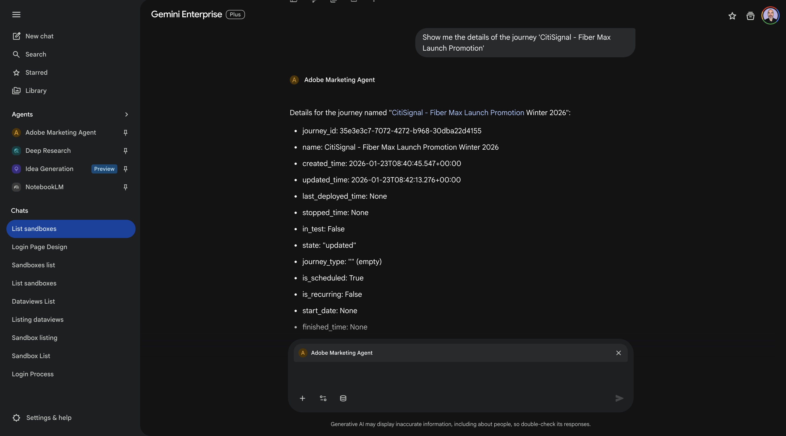

# 1.1.4 Adobe Marketing Agent para Google Gemini Enterprise

[!BADGE Beta]

+++Detalles de Beta
Al utilizar Adobe Marketing Agent con Google Gemini Enterprise Beta, Usted reconoce por la presente que Beta se proporciona &quot;tal cual&quot; sin garantía de ningún tipo. Adobe no tiene obligación de mantener, corregir, actualizar, cambiar, modificar o apoyar de otro modo Beta. Se recomienda tener precaución y no confiar en modo alguno en el correcto funcionamiento o rendimiento de dichos Beta y/o materiales de acompañamiento. Beta se considera información confidencial de Adobe.  Cualquier &quot;comentario&quot; (información sobre Beta, incluidos, entre otros, problemas o defectos que encuentre al utilizar Beta, sugerencias, mejoras y recomendaciones) proporcionado por usted a Adobe se asigna a Adobe, incluidos todos los derechos, el título y el interés en y para dichos comentarios.

+++

## Requisitos previos

Para seguir los pasos de este laboratorio como se documenta a continuación, se requiere el siguiente acceso:

- Acceso a Real-Time CDP, Journey Optimizer y Customer Journey Analytics
- Acceso al asistente de IA en Adobe Experience Cloud
- Acceso a AEP Agent Orchestrator
- Acceso a Google Gemini Enterprise

## Vídeo

En este vídeo, obtendrá una explicación y una demostración de todos los pasos involucrados en este ejercicio.

>[!VIDEO](https://video.tv.adobe.com/v/3481322?quality=12&learn=on)

Este laboratorio está en desarrollo.

## 1.1.4.1 acceso a Google Gemini Enterprise

Vaya a [https://cloud.google.com/gemini-enterprise](https://cloud.google.com/gemini-enterprise). Haz clic en **Comenzar prueba gratis de 30 días**.



Escribe la dirección de correo electrónico de tu cuenta de Google y haz clic en **Continuar con el correo electrónico**.


Proporcione su nombre y apellidos y haga clic en **Aceptar y comenzar**.


Haga clic en **Lo haré más tarde**.


Entonces debería ver esto.


Vaya a [https://cloud.google.com/gemini-enterprise](https://cloud.google.com/gemini-enterprise).

Entonces deberías ver algo como esto. También es posible que tenga que crear primero su cuenta de facturación para luego seleccionarla aquí posteriormente.


Haga clic en **Comenzar prueba gratuita de 30 días**.


Haga clic en **Continuar y activar la API**.


Haga clic en **Crear**.



Entonces debería ver esto.


## 1.1.4.2: crear su agente personalizado con A2A

Vaya a [https://console.cloud.google.com/gemini-enterprise](https://console.cloud.google.com/gemini-enterprise). Haga clic en **Agentes**.


Haga clic en **+Agregar agente**.


Seleccionar **agente personalizado mediante A2A**.



Pegue la **tarjeta de agente JSON**.

>[!NOTE]
>
>Consulte con su representante de Adobe para obtener la información de **Agent Card JSON**.


Después de pegar la **tarjeta del agente JSON**, haga clic en **Previsualizar detalles del agente**.


Entonces deberías ver algo como esto. Desplácese hacia abajo y haga clic en **Siguiente**.


Entonces deberías ver algo como esto.


Rellene los campos de la instancia.

- **ID de cliente**:

```
--aepImsOrgId--
```

- **Secreto de cliente**:

```
AdobeMarketingAgent
```

- **URL de autorización**:

```
https://XXX.adobe.io/authorize
```

- **URL de token**:

```
https://XXX.adobe.io/token
```

- **Ámbitos**:

```
openid email profile
```

Haga clic en **Finalizar**.


Entonces debería ver esto.


## 1.1.4.3 Iniciar sesión en Adobe Marketing Agent

Vaya a **Información general** y haga clic en **Vista previa**.


Haga clic en **Comenzar**


Vaya a **Agentes**. Debería ver **Adobe Marketing Agent** allí.


Haga clic en los 3 puntos **...** y, a continuación, seleccione **Anclaje**.



Vaya a **Nuevo chat** e introduzca el símbolo **@** en el chat. Haga clic en **Adobe Marketing Agent**.


Escriba el comando `login` y haga clic en **Enviar**.


Entonces debería ver esto. Haga clic en **Autorizar**.


Haga clic en **Permitir acceso**, complete el inicio de sesión con su Adobe ID y seleccione la instancia `--aepImsOrgName--` cuando se le solicite.


Entonces debería ver esto.


## 1.1.4.4: establecer contexto en Adobe Marketing Agent

Antes de seguir interactuando con Adobe Marketing Agent a través de Copilot, se debe establecer el contexto.

Para este ejercicio, el contexto debe configurarse para utilizar:

- **Espacio aislado**: **Prod - Accelerate (VA7)**

  La configuración de la zona protegida ayuda a identificar qué simulador de pruebas de IA debe consultar al hacer preguntas.

- **Vista de datos**: **Acelerar B2C 2026**

La configuración de vista de datos ayuda a identificar qué vista de datos debe ver el asistente de IA al hacer preguntas.

Para cambiar la zona protegida, escriba el siguiente comando y haga clic en el botón **enviar**.

```javascript
list sandboxes
```


Entonces debería ver algo similar a esto. Escriba el comando `switch to sandbox accelerate` y haga clic en el botón **Enviar**.


Entonces debería ver esto. Para cambiar la vista de datos, escriba el siguiente comando y haga clic en el botón **enviar**.

```javascript
list dataviews
```


Entonces debería ver algo similar a esto. Escriba el comando `switch dataview to Accelerate 2026 B2C` y haga clic en el botón **Enviar**.


Entonces debería ver esto. El contexto ahora está configurado correctamente para que pueda empezar a enviar solicitudes específicas a continuación.


## 1.1.4.5 Comience con las tendencias generales de compra para anclar el contexto y ampliar el alcance de la fibra

**Intención**

Obtenga un impulso de nivel superior sobre la demanda de categorías (móvil, fijo, Internet, TV, fibra), específicamente durante los últimos 60 días. Esto establece líneas de base para la estacionalidad, los efectos de promoción y la variación regional después del despliegue en Nueva York.

Escriba el **indicador** siguiente y haga clic en el botón **enviar**.

```javascript
Show me purchases by mainCategory over the last 7 months.
```


Debería ver lo siguiente:


Escriba el **indicador** siguiente y haga clic en el botón **enviar**.

```javascript
Show me purchases by mainCategory = Fiber over the last 7 months broken down by week
```


Luego debería ver esto, que profundiza en las tendencias específicas de la fibra.



## 1.1.4.6: correlacionar pedidos con preferencias de contenido

**Intención**

Pruebe la hipótesis de que una preferencia por un género específico (por ejemplo, ciencia ficción, deportes, teatro) predice el comportamiento de actualización de banda ancha, especialmente para las necesidades de banda ancha alta.

En primer lugar, debe averiguar qué campo se utiliza para almacenar la preferencia de género.

Escriba el **indicador** siguiente y haga clic en el botón **enviar**.

```javascript
Which field is used to store the preferred genre
```


Debería ver esto, lo que muestra que el campo usado para el género es **_experienceplatform.individualCharacteristic.preferences.ferredGenre**.


Con esa información, puede empezar a explorar en profundidad los datos de compra.

Escriba el **indicador** siguiente y haga clic en el botón **enviar**.

```javascript
Show me ordersYTD by preferredGenre for the last 7 months
```


Entonces debería ver esto.


## 1.1.4.7 identificar Recorridos de fibra existentes

**Intención**

Descubra qué recorridos activos o finalizados recientemente incluyen &quot;Fibra&quot; en el título, por ejemplo, &quot;Actualización de fibra NYC - Septiembre&quot;, &quot;Prueba de fibra - Paquete de transmisión&quot;.

Escriba el **indicador** siguiente y haga clic en el botón **enviar**.

```javascript
What journeys exist? 
```



A continuación, debería ver una lista de recorridos.


Escriba el **indicador** siguiente y haga clic en el botón **enviar**.

```javascript
Which of these journeys has 'Fiber' in its name?
```


Entonces debería ver esto.



Escriba el **indicador** siguiente y haga clic en el botón **enviar**.

```javascript
Show me the details of the journey 'CitiSignal - Fiber Max Launch Promotion'
```


Entonces debería ver esto.



## 1.1.4.8 Validar el rendimiento del recorrido mediante el análisis de abandonos

**Intención**

Desea comprender las visitas en el orden previsto de rendimiento de la recorrido para saber si hay algún nodo o condición dentro de la recorrido que esté experimentando la pérdida de un gran porcentaje de perfiles. Esto resulta útil para saber si se necesitan ajustes adicionales en el recorrido.

Escriba el **indicador** siguiente y haga clic en el botón **enviar**.

```javascript
Create a fall-out report on the "CitiSignal - Fiber Max Launch Promotion" journey
```


Entonces debería ver esto.


Ahora has completado este laboratorio.

Volver a [Agent Orchestrator](./agentorchestrator.md){target="_blank"}

[Volver a todos los módulos](./../../../overview.md){target="_blank"}
