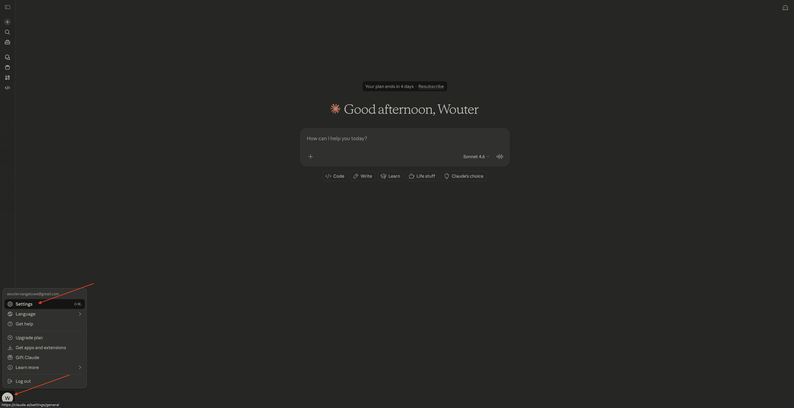
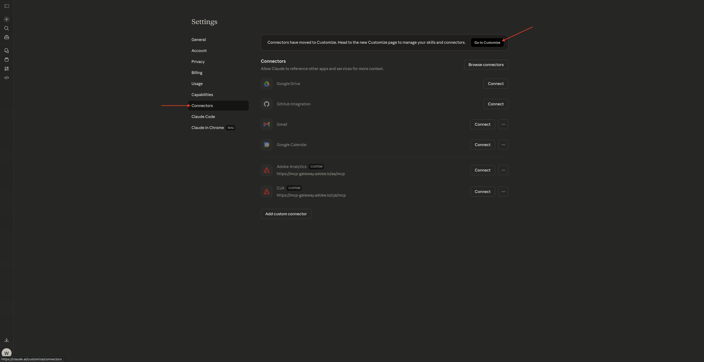
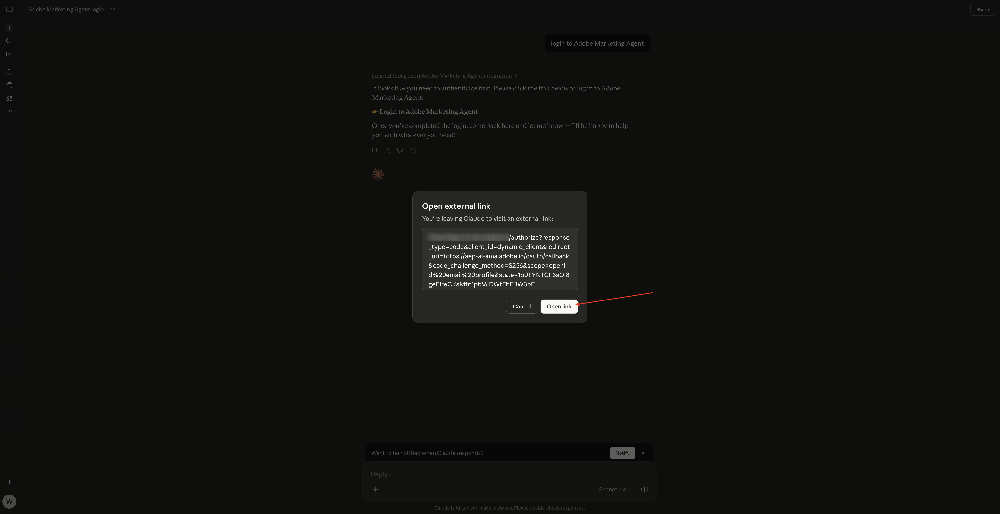
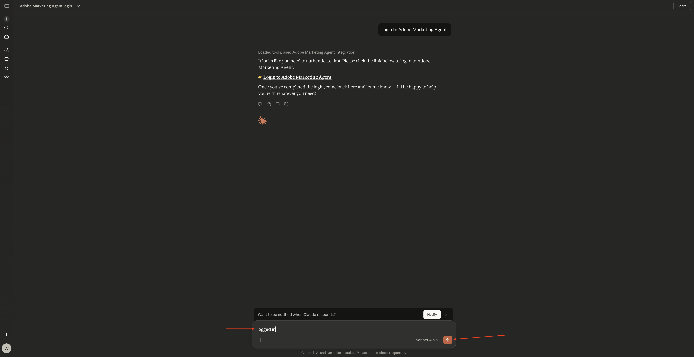
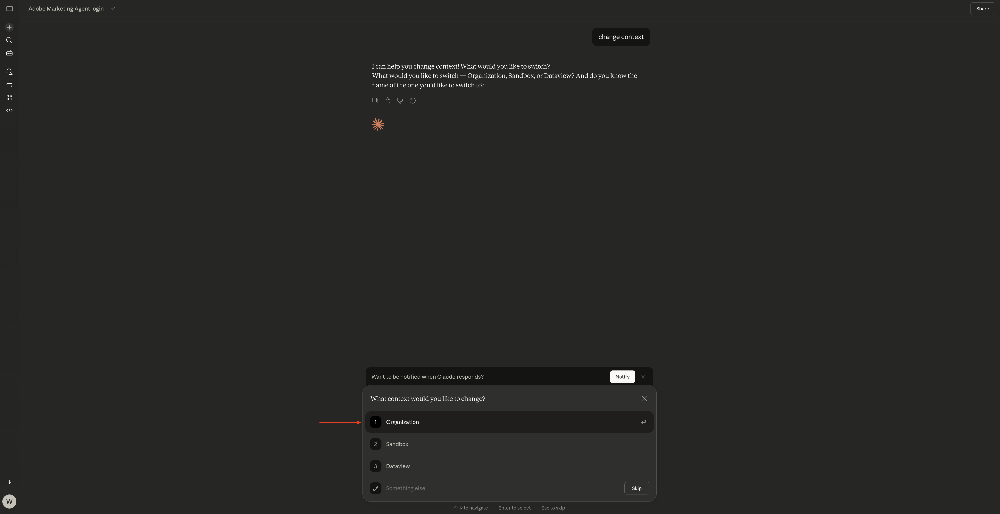
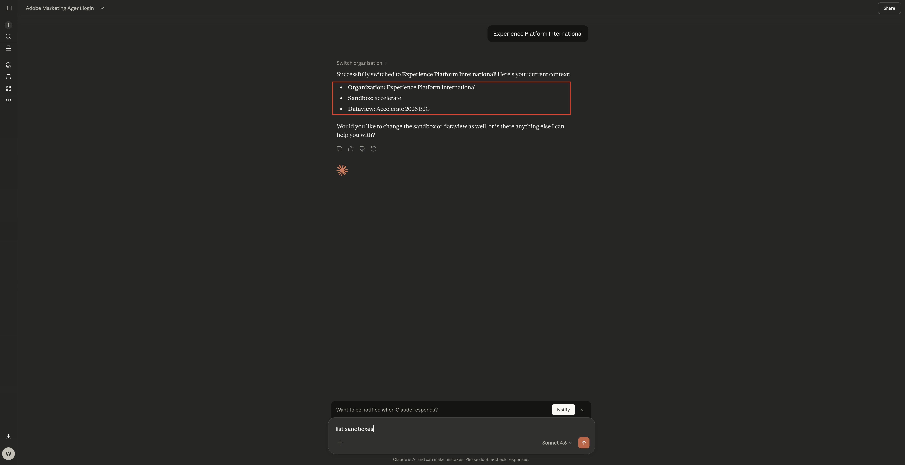
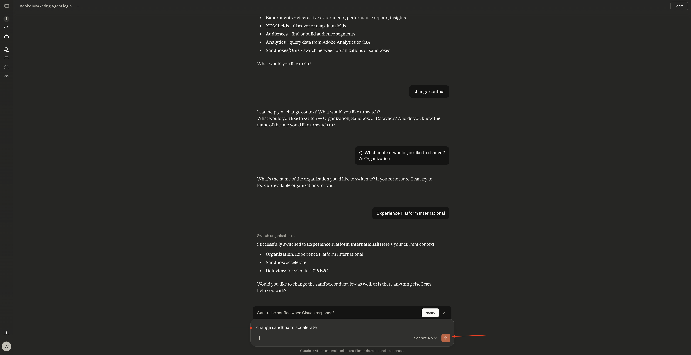

# 1.1.5 Adobe Marketing Agent para Claude

[!BADGE Beta]

+++Detalles de Beta
Al utilizar Adobe Marketing Agent con Claude Beta, por la presente reconoce que Beta se proporciona &quot;tal cual&quot; sin garantía de ningún tipo. Adobe no tiene obligación de mantener, corregir, actualizar, cambiar, modificar o apoyar de otro modo Beta. Se recomienda tener precaución y no confiar en modo alguno en el correcto funcionamiento o rendimiento de dichos Beta y/o materiales de acompañamiento. Beta se considera información confidencial de Adobe.  Cualquier &quot;comentario&quot; (información sobre Beta, incluidos, entre otros, problemas o defectos que encuentre al utilizar Beta, sugerencias, mejoras y recomendaciones) proporcionado por usted a Adobe se asigna a Adobe, incluidos todos los derechos, el título y el interés en y para dichos comentarios.

+++

## Requisitos previos

Para seguir los pasos de este laboratorio como se documenta a continuación, se requiere el siguiente acceso:

- Acceso a Real-Time CDP, Journey Optimizer y Customer Journey Analytics
- Acceso al asistente de IA en Adobe Experience Cloud
- Acceso a AEP Agent Orchestrator
- Acceso a Claude

## Vídeo

En este vídeo, obtendrá una explicación y una demostración de todos los pasos involucrados en este ejercicio.

>[!VIDEO](https://video.tv.adobe.com/v/3482212?quality=12&learn=on)

Este laboratorio está en desarrollo.

## 1.1.5.1 Crear aplicación personalizada en Claude.ai para CJA

>[!NOTE]
>
>El uso de Adobe Marketing Agent en Claude.ai requiere lo siguiente:
>- una versión de pago de Claude.ai

Vaya a [https://claude.ai/](https://claude.ai/){target="_blank"} e inicie sesión con los detalles de su cuenta. Una vez que haya iniciado sesión, debería ver esto.


Haga clic para abrir la cuenta y, a continuación, seleccione **Configuración**.



Vaya a **Conectores** y haga clic en **Ir a Personalizar**.



Haga clic en **+** y luego seleccione **Agregar conector personalizado**.


Rellene los campos de esta manera:

- **Nombre**: `Adobe Marketing Agent`
- **URL del servidor MCP**: consulte con su representante de Adobe

Haga clic en **Agregar**.


Entonces debería ver esto. Haga clic en **+** para iniciar una nueva conversación.


Haz clic en el icono **+**, ve a **Conectores** y asegúrate de que **Adobe Marketing Agent** esté habilitado**.


## 1.1.5.2 autenticar y establecer contexto

Antes de seguir interactuando con Adobe Marketing Agent a través de Claude.ai, debe iniciar sesión y establecer el contexto.

Escriba la siguiente solicitud y haga clic en **enviar**.

```
login to Adobe Marketing Agent
```


Seleccionar **Permitir siempre**.


Haga clic en el vínculo para iniciar sesión en el agente de marketing de Adobe**.


Haga clic en **Abrir vínculo**.



Haga clic en **Permitir acceso**.


Después de autenticarse correctamente, debería ver esto. Vuelve con Claude.


Escriba el siguiente comando y haga clic en **enviar**.

```javascript
logged in
```



Ha iniciado sesión correctamente. El siguiente paso es establecer el contexto. Escriba la siguiente solicitud y haga clic en **enviar**.


```javascript
change context
```


Seleccione **Organización**. También puede repetir este comando para cambiar la zona protegida y la vista de datos más adelante.



Escriba el nombre de su instancia y haga clic en **enviar**.


Seleccionar **Permitir siempre**.


Entonces deberías ver algo como esto.



Si la zona protegida aún no está configurada correctamente, puede utilizar el siguiente comando para cambiar a la zona protegida que necesita utilizar. Haga clic en **enviar**. También puede usar el comando `change context` anterior y seleccionar **zona protegida**

```javascript
change sandbox to --aepSandboxName--
```



Si la vista de datos aún no está configurada correctamente, puede utilizar el siguiente comando para cambiar a la zona protegida que necesita utilizar (reemplace XXX en el siguiente comando por el nombre de su vista de datos). Haga clic en **enviar**. También puede usar el comando `change context` anterior y seleccionar **vista de datos**

```javascript
change dataview to XXX
```


Una vez que **Organization**, **Sandbox** y **Dataview** estén correctamente configurados, podrás empezar a hacer preguntas a Adobe Marketing Agent.

## Pasos siguientes

Volver a [Agent Orchestrator](./agentorchestrator.md){target="_blank"}

[Volver a todos los módulos](./../../../overview.md){target="_blank"}
