# 1.1.6 Mazo de cables de IA

## Requisitos previos

Para seguir los pasos de este laboratorio como se documenta a continuación, se requiere el siguiente acceso:

- Acceso a Real-Time CDP, Journey Optimizer y Customer Journey Analytics
- Acceso al asistente de IA en Adobe Experience Cloud
- Acceso a AEP Agent Orchestrator
- Debe instalar Node.js 18+ en su sistema

## 1.1.6.1 acceder a Agent Orchestrator

Vaya a [https://ao.adobe.io/](https://ao.adobe.io/). Inicie sesión con su cuenta de Adobe. Después de iniciar sesión, asegúrese de que ha seleccionado la instancia y la zona protegida correctas cambiando la selección, tal como se indica a continuación.

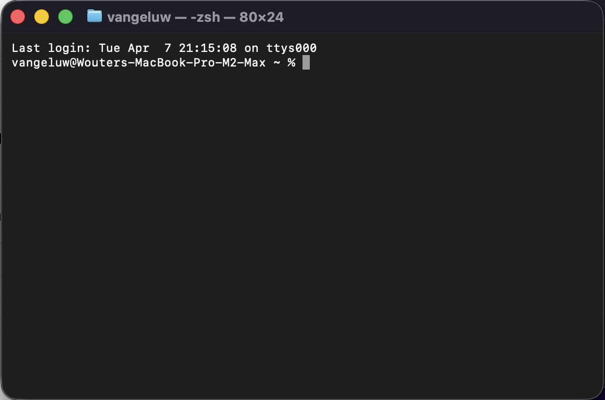

## 1.1.6.2 Establezca su contexto

Escriba el siguiente comando y haga clic en **Enviar**.

```
list dataviews
```


Puede recibir esta solicitud. Proporcione los permisos necesarios.


Puede recibir esta solicitud. Proporcione los permisos necesarios.

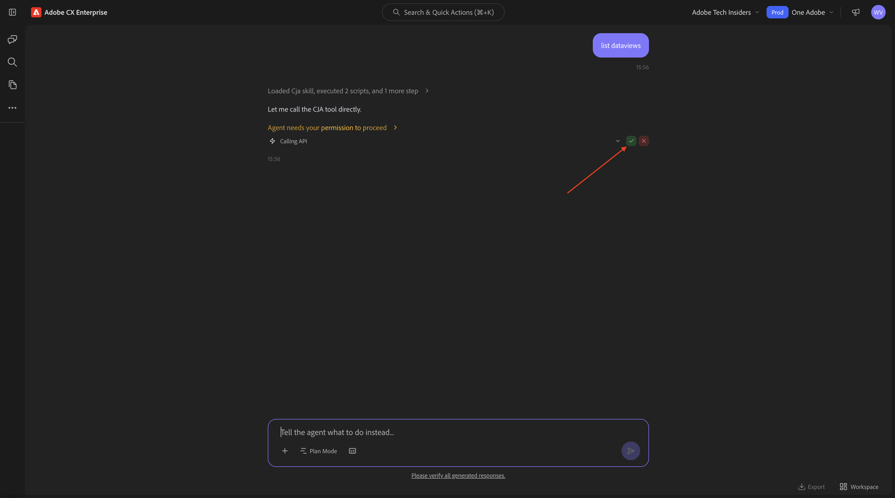

Entonces debería ver esto. Escriba el siguiente comando y haga clic en **Enviar**.

```
switch to dataview AdobeOne - Unified Customer Data View
```


Entonces debería ver esto.

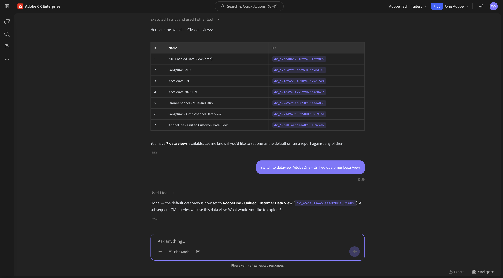

## 1.1.6.3 Comience con las tendencias generales de compra para anclar el contexto y ampliar el alcance de la fibra

**Intención**

Obtenga un impulso de nivel superior sobre la demanda de categorías (móvil, fijo, Internet, TV, fibra), específicamente durante los últimos 60 días. Esto establece líneas de base para la estacionalidad, los efectos de promoción y la variación regional después del despliegue en Nueva York.

Escriba el **indicador** siguiente y haga clic en el botón **enviar**.

```javascript
Show me purchases by mainCategory over the last 2 months.
```

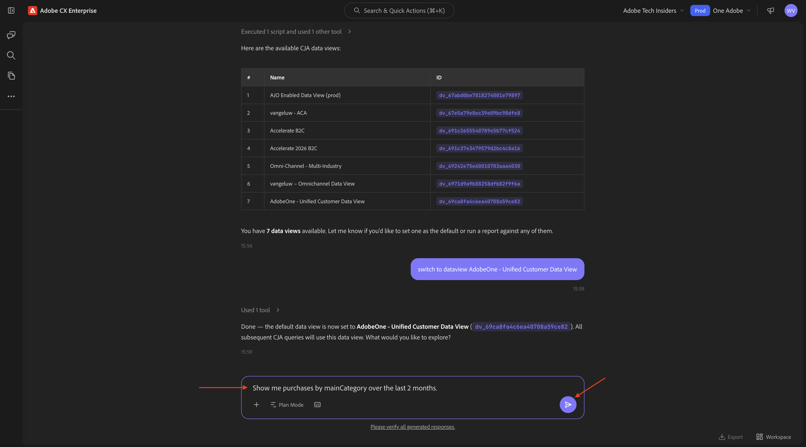

Debería ver lo siguiente:


Escriba el **indicador** siguiente y haga clic en el botón **enviar**.

```javascript
Show me purchases by mainCategory = Fiber over the last 2 months per week
```


Luego debería ver esto, que profundiza en las tendencias específicas de la fibra.

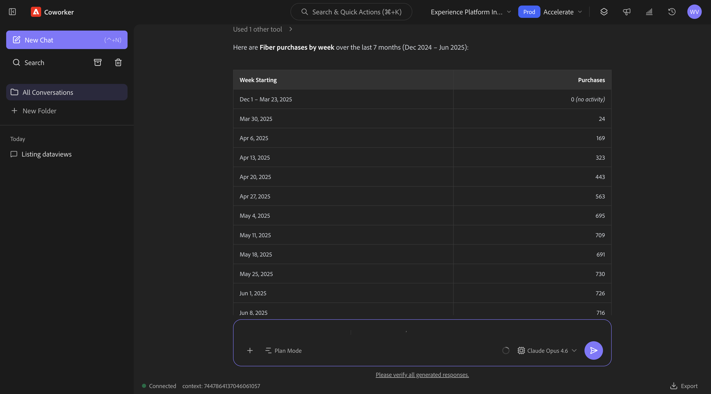

## 1.1.6.4: correlacionar pedidos con preferencias de contenido

**Intención**

Pruebe la hipótesis de que una preferencia por un género específico (por ejemplo, ciencia ficción, deportes, teatro) predice el comportamiento de actualización de banda ancha, especialmente para las necesidades de banda ancha alta.

En primer lugar, debe averiguar qué campo se utiliza para almacenar la preferencia de género.

Escriba el **indicador** siguiente y haga clic en el botón **enviar**.

```javascript
Which field is used to store the favourite genre?
```


Debería ver esto, lo que muestra que el campo usado para el género es **`--aepTenantId--.individualCharacteristics.telco.mediaPreferences.favouriteGenre`**.

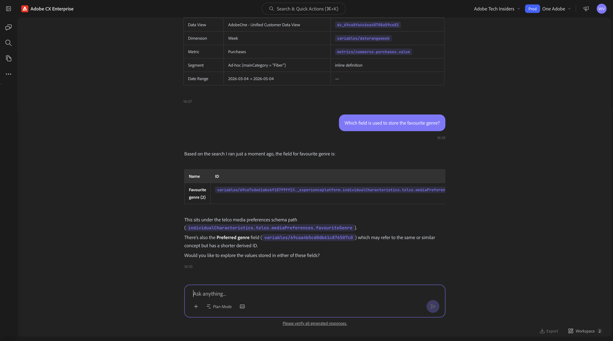

Con esa información, puede empezar a explorar en profundidad los datos de compra.

Escriba el **indicador** siguiente y haga clic en el botón **enviar**.

```javascript
Show me purchases by favourite genre for the last 2 months
```

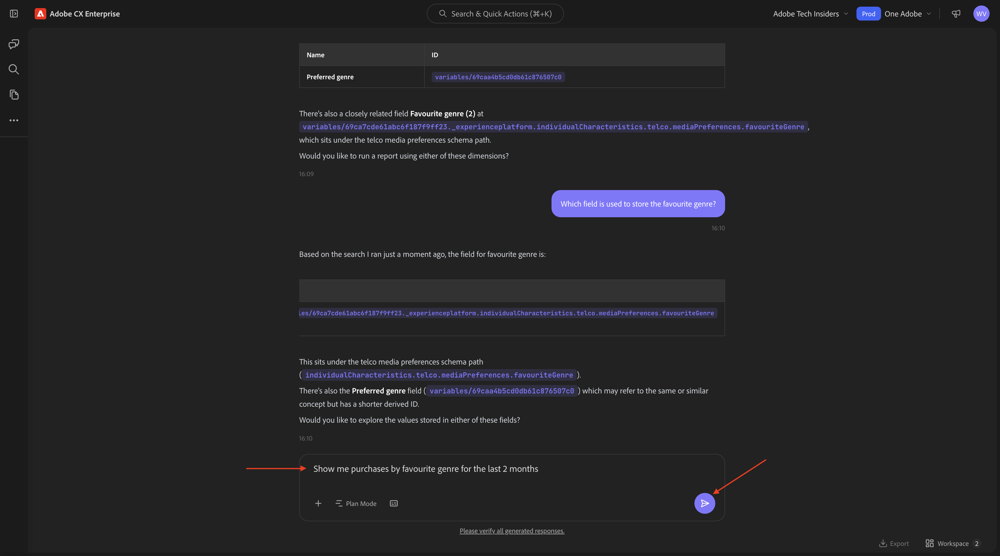

Entonces debería ver esto.


## 1.1.6.5 identificar Recorridos de fibra existentes

**Intención**

Descubra qué recorridos activos o finalizados recientemente incluyen &quot;Fibra&quot; en el título, por ejemplo, &quot;Actualización de fibra NYC - Septiembre&quot;, &quot;Prueba de fibra - Paquete de transmisión&quot;.

Escriba el **indicador** siguiente y haga clic en el botón **enviar**.

```javascript
What journeys exist? 
```

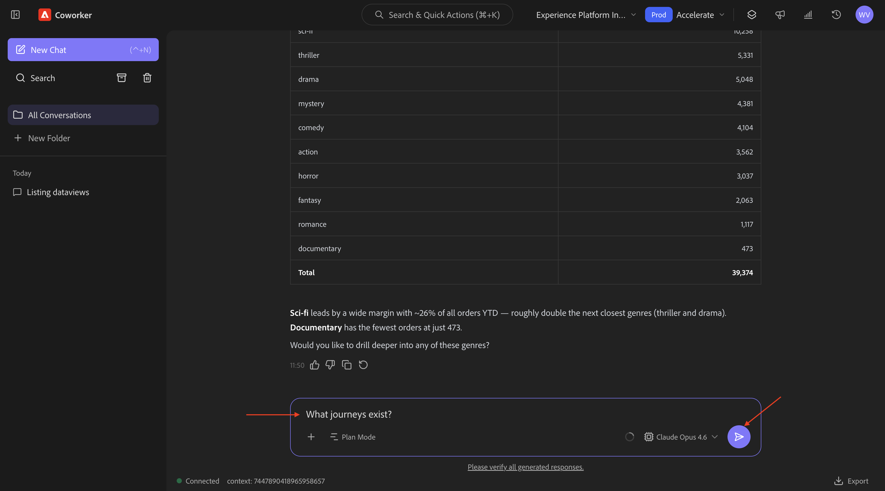

Entonces deberías ver algo como esto.

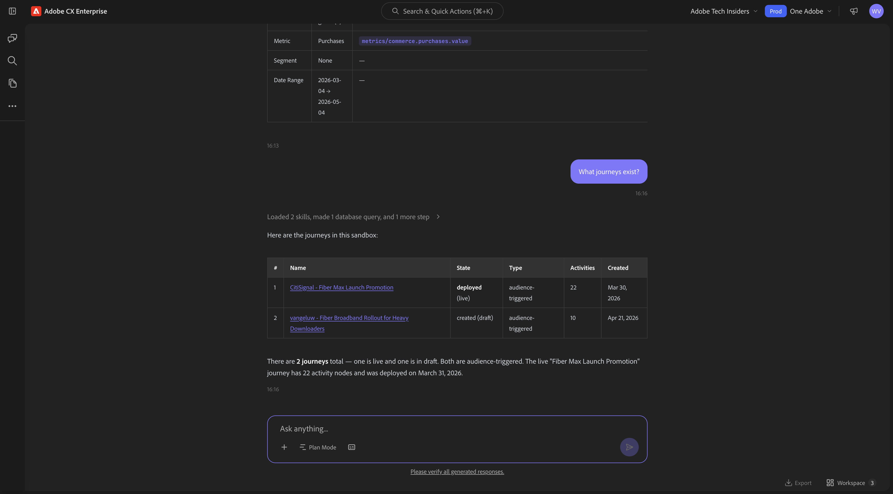

Escriba el **indicador** siguiente y haga clic en el botón **enviar**.

```javascript
Which of these journeys has 'Fiber' in its name?
```


Entonces debería ver esto. Haga clic en el vínculo de uno de los recorridos.


Se abrirá una nueva ventana y se le redirigirá inmediatamente a la descripción general de los detalles del recorrido.

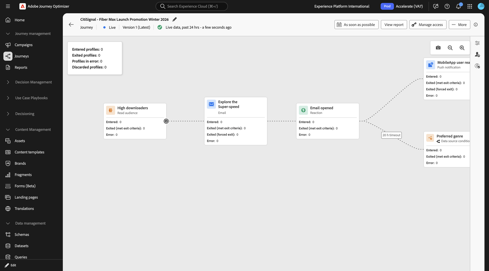

## 1.1.6.6 Comprobar qué audiencia se utiliza

**Intención**:

Comprenda la definición de la semilla del recorrido &quot;CitiSignal - Promoción de lanzamiento de Fiber Max&quot;: qué rasgos impulsaron la segmentación (por ejemplo, &quot;Preferencia de género SciFi&quot;, &quot;4+ dispositivos&quot;, &quot;flujo ≥ 300 GB/mes&quot;).

Escriba el **indicador** siguiente y haga clic en el botón **enviar**.

```javascript
What was the initial audience in the journey named CitiSignal - Fiber Max Launch Promotion?
```


Entonces debería ver esto.


## 1.1.6.7 Validar el rendimiento del recorrido mediante el análisis de abandonos

**Intención**

Desea comprender las visitas en el orden previsto de rendimiento de la recorrido para saber si hay algún nodo o condición dentro de la recorrido que esté experimentando la pérdida de un gran porcentaje de perfiles. Esto resulta útil para saber si se necesitan ajustes adicionales en el recorrido.

Escriba el **indicador** siguiente y haga clic en el botón **enviar**.

```javascript
Create a fall-out report on the "CitiSignal - Fiber Max Launch Promotion" journey
```


Entonces debería ver esto.


## 1.1.6.8 Crear una audiencia nueva

**Intención**

En base a los hallazgos e investigaciones anteriores, existe una correlación entre los clientes que consumen muchos datos y que tienen un género preferido de ciencia ficción o fantasía. Ahora combinará estos atributos en una audiencia.

Escriba el **indicador** siguiente y haga clic en el botón **enviar**.

```javascript
Create an audience that combines people with an average download usage per month of over 2000 GB and a preferred genre of sci-fi or fantasy.
```


Si son similares, las audiencias ya existentes ya están disponibles, debería ver un mensaje similar.


Revise el plan. Haga clic en **Aprobar plan**.


Se ha creado la audiencia.


>[!NOTE]
>
>Al crear una audiencia nueva, pasarán 24 horas antes de que la audiencia esté disponible para que el asistente de IA la utilice más.

## 1.1.6.9 Busque audiencias existentes alineadas con un uso elevado y compruebe si están en uso

**Intención**:

Busque cualquier audiencia denominada con &quot;descargadores masivos&quot;, definida por los umbrales mensuales de uso de datos.

>[!NOTE]
>
>En el paso anterior creó una nueva audiencia, recuerde que pasarán 24 horas antes de que la audiencia esté disponible para el asistente de IA para un uso posterior. Ahora debería usar otra audiencia que ya exista en su lugar.

Escriba el **indicador** siguiente y haga clic en el botón **enviar**.

```javascript
Is there an audience that has "heavy downloaders" in the title?
```

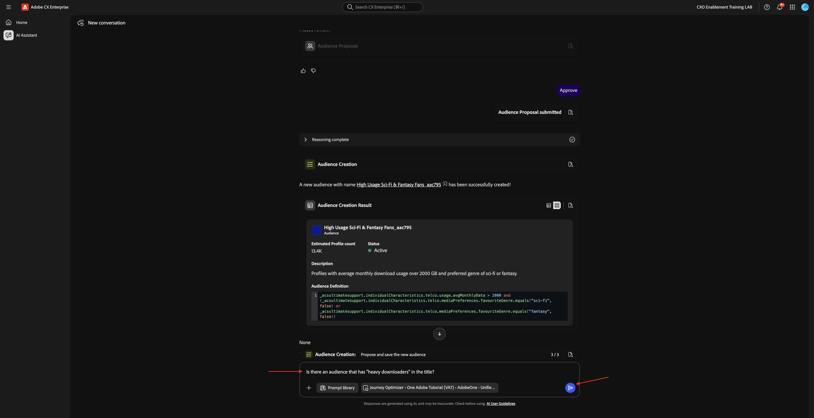

Entonces debería ver esto. Ahora desea ver todas sus audiencias y cuánto han cambiado en los últimos días.

Escriba el **indicador** siguiente y haga clic en el botón **enviar**.

```javascript
List how much these audiences changed over the last few days.
```


Entonces debería ver esto. Haga clic en **Mostrar más**.

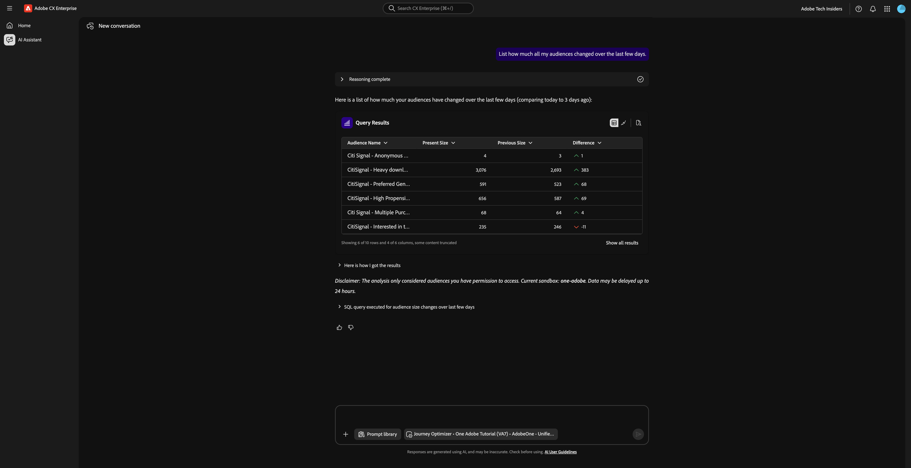

Entonces debería ver esto. Haga clic en para cerrar el panel derecho.


Desplácese un poco hacia abajo para revisar los pasos realizados por el Asistente de IA.


Ya existen algunas audiencias para &quot;descargadores pesados&quot;. Vamos a ver si ya están en uso.

Escriba el **indicador** siguiente y haga clic en el botón **enviar**.

```javascript
Which of the above are used in a journey? 
```


Entonces debería ver algo similar a esto.


Ahora debería comprobar si ese recorrido está activo. Escriba el **indicador** siguiente y haga clic en el botón **enviar**.

```javascript
Are these journeys active? 
```


Entonces debería ver algo similar a esto. Ninguno de estos recorridos se está ejecutando actualmente.


Para el próximo lanzamiento de Fiber Max, debería crear un nuevo recorrido.

## 1.1.6.10 Crear nuevo Recorrido para el lanzamiento de Fiber Max

**Intención**:

Cree un nuevo recorrido dirigido a la audiencia compuesta:

Heavy Downloaders ∩ Preferencia de ciencia ficción.

Escriba el **indicador** siguiente y haga clic en el botón **enviar**.

```javascript
Create a  journey towards the audience Heavy Downloaders - Sci-Fi Preference_kbaa_5207bf. The journey is for the rollout of fiber broadband. There will 2 versions of an email  based on  a split of the audience based on who is in the "Eligble for Fiber upgrade" audience.  After 3 days, profiles from both email treatments who have not purchased fibre max will be sent a follow up email. 
```


Entonces debería ver esto. Escriba `yes` y haga clic en generar.


Entonces debería ver esto. Escriba `yes` y haga clic en generar.

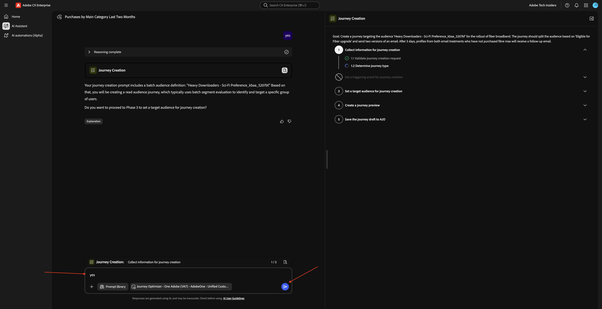

Entonces debería ver esto. Escriba `The first one` y haga clic en enviar.


Entonces debería ver esto. Escriba `yes` y haga clic en enviar.


Revise la respuesta. Escriba `yes` y haga clic en enviar.


Haga clic en **Revisar**.


Actualice el nombre del recorrido con su LDAP para que sea único. Haga clic en **Guardar**.


El recorrido se ha creado en modo de borrador.


## 1.1.6.11 administración de conflictos de Recorrido

Escriba el **indicador** siguiente y haga clic en el botón **enviar**.

```javascript
How can I manage journey conflicts?
```

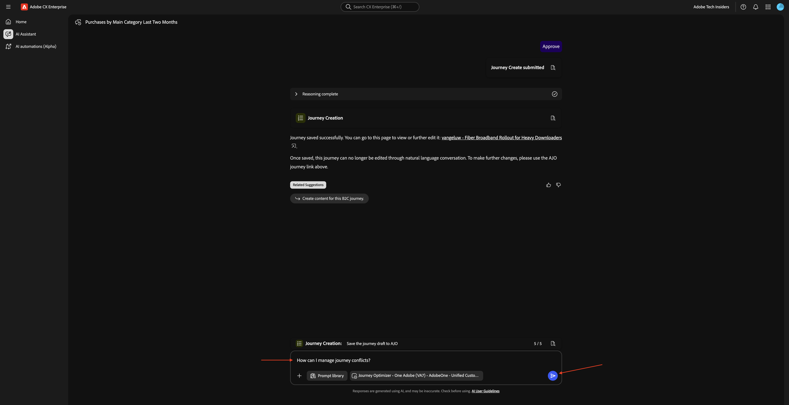

Revise la información.


Desplácese hacia abajo y seleccione **Fuentes** para comprobar que la información procede de Experience League.


Escriba el **indicador** siguiente y haga clic en el botón **enviar**.

```javascript
List any conflicts for the journey +CitiSignal Fiber Max
```

A continuación, seleccione manualmente el recorrido **CitiSignal - Fiber Max Launch Promotion** de la lista.


Entonces debería ver esto. Haga clic en **enviar**.


Revise la información de conflictos de recorrido.


Desplácese hacia abajo para ver más detalles sobre conflictos de recorrido.


## 1.1.6.12 experimentos

Escriba el **indicador** siguiente y haga clic en el botón **enviar**.

```javascript
How are the experiments performing for the journey named 'CitiSignal - Fiber Max Launch Promotion'?
```

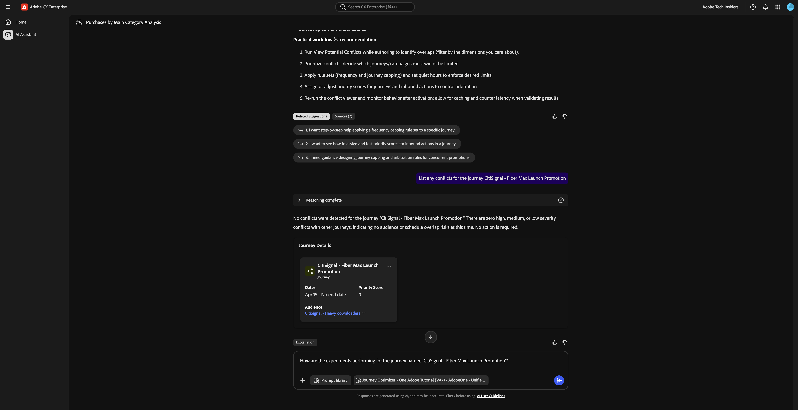

Debería ver lo siguiente:


Desplácese hacia abajo y haga clic en una de las sugerencias. Haga clic en **enviar**.

>[!NOTE]
>
>Las sugerencias son dinámicas, por lo que debería ver sugerencias diferentes cada vez que se genere una respuesta. Es probable que sus sugerencias sean diferentes a las que se muestran en esta captura de pantalla.


Debería ver una respuesta detallada relacionada con la sugerencia elegida.


Ahora has completado este laboratorio.

## Pasos siguientes

Volver a [Agent Orchestrator](./agentorchestrator.md){target="_blank"}

[Volver a todos los módulos](./../../../overview.md){target="_blank"}

