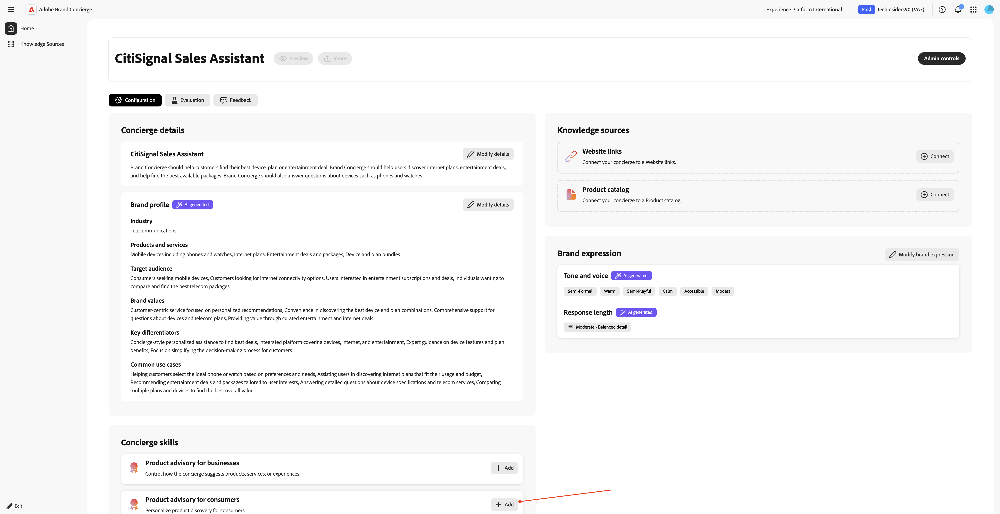
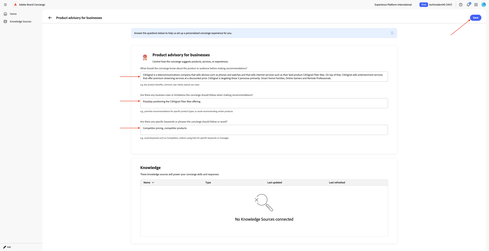
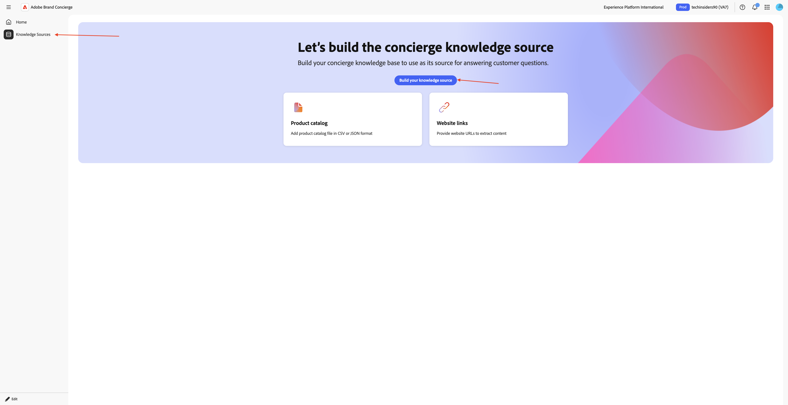
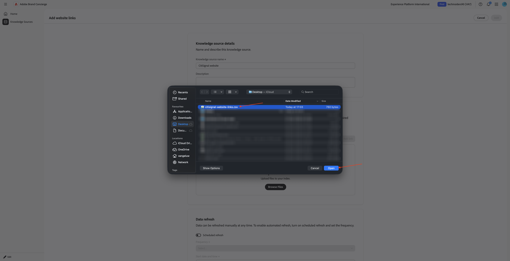
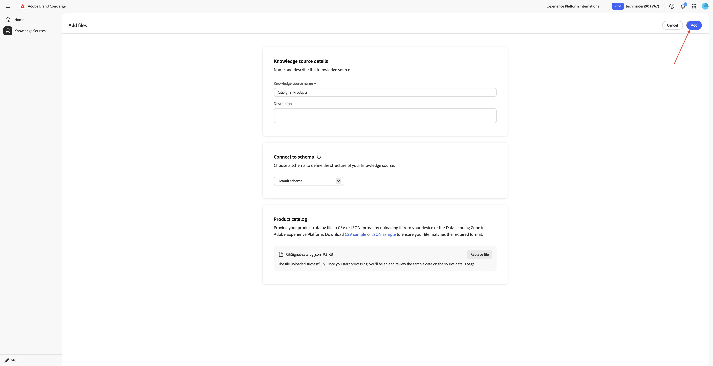
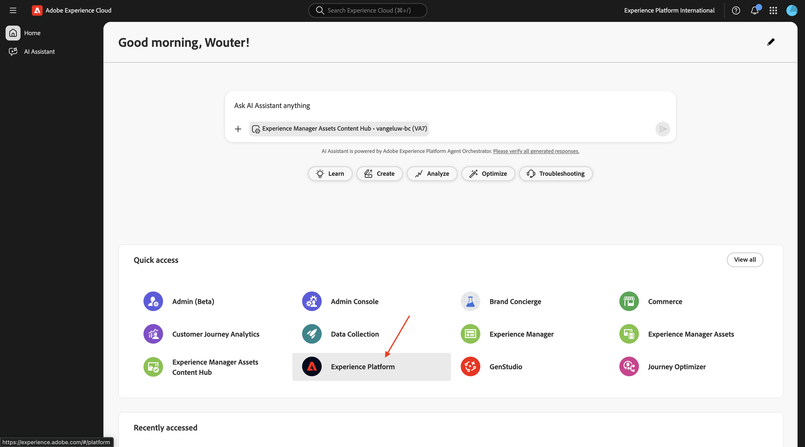
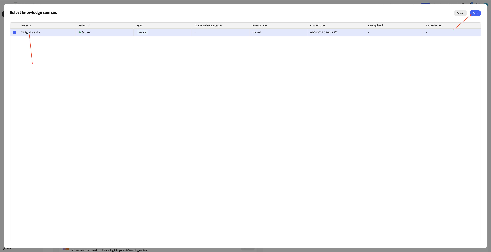
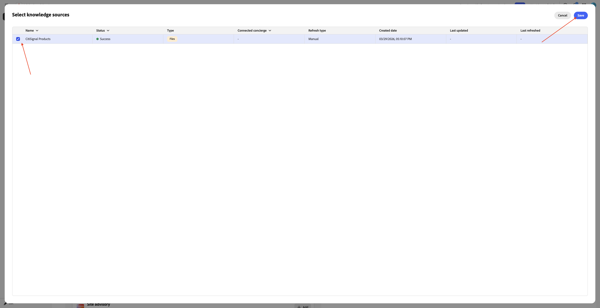
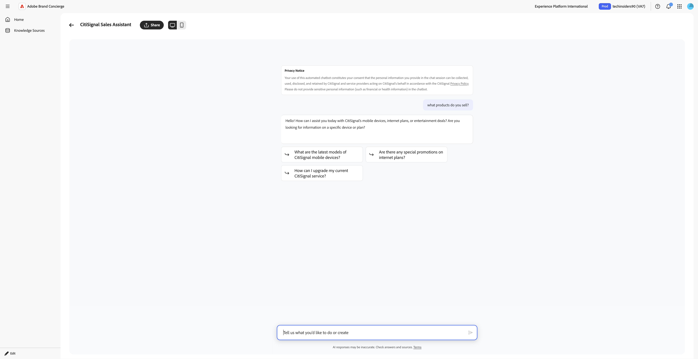

# 1.4.1 Introducción a Brand Concierge

## Información general de 1.4.1.1 Brand Concierge

Al configurar Brand Concierge, los dos elementos principales que utilizará son:

- **Compositor de agentes (capa de configuración)**

  Objetivo: La plataforma de IU principal utilizada para crear y configurar experiencias de IA conversacional.

  Responsabilidades clave:

   - Definición y administración de fuentes de datos y bases de conocimiento
   - Establecer la expresión de marca (tono, estilo, protecciones)
   - Configurar el agente de reserva de reuniones

- **Agent Orchestrator (Motor de ejecución)**

  Objetivo: Motor de razonamiento y orquestación que interpreta las solicitudes de los usuarios y ejecuta las acciones del agente adecuadas.

  Responsabilidades clave:

   - Interpretar intenciones del usuario en lenguaje natural
   - Generar y ejecutar planes de razonamiento de varios pasos
   - Seleccione e invoque los operadores o herramientas adecuados
   - Aplicar el contexto, el cumplimiento y las protecciones de la marca
   - Coordinación de flujos de trabajo de varios agentes
   - Agregar y componer respuestas de varias fuentes de datos

- **Tiempo de ejecución de la conversación Brand Concierge (capa de servicio)**

  Objetivo: La capa de servicio conversacional orientada al cliente que administra las sesiones de chat, el contexto y las interacciones con el cliente.

  Componentes clave:

   - Agente web (cliente): interfaz de usuario del explorador o del chat móvil integrada mediante Web SDK
   - Servicio de conversación (servidor): administra el estado de la sesión y actúa como puerta de enlace de la orquestación

  Responsabilidades clave:

   - Administrar sesiones de usuario y transcripciones de conversaciones
   - Administrar la autenticación y los perfiles de usuario
   - Enrutar mensajes entre el cliente y Agent Orchestrator
   - Contexto de conversación persistente
   - Registrar eventos de comportamiento y operativos en AEP para análisis
   - Aplicar configuraciones específicas de la superficie

## 1.4.1.2 configuración de instancia de Brand Concierge

Para empezar a crear su propia instancia de Brand Concierge, siga los pasos a continuación.

Vaya a [https://experience.adobe.com/](https://experience.adobe.com/){target="_blank"}. Abra **Brand Concierge**.


Entonces debería ver esto. Haga clic en el menú **selección de zona protegida**. Elija la zona protegida que se le ha asignado. Esa zona protegida debe llamarse `techinsidersX` (reemplace X por el número que se le asignó).


A continuación, rellene las siguientes variables:

- **Nombre de la compañía**: CitiSignal

- **nombre del conserje**: `CitiSignal Sales Assistant`.

Escriba el siguiente texto en **¿Qué desea que haga el conserje?**.

```javascript
Brand Concierge should help customers find their best device, plan or entertainment deal. Brand Concierge should help users discover internet plans, entertainment deals,  and help find the best available packages. Brand Concierge should also answer questions about devices such as phones and watches.
```

- **Vínculo al sitio web**: proporcione el vínculo al sitio web que está utilizando

Haga clic en **Continuar**.


Entonces debería ver esto. Esta información se generó mediante IA a partir de los datos proporcionados en la página anterior. Revisa la información y, cuando estés satisfecho con ella, haz clic en **Generar conserje**.


Entonces debería ver esto. Haga clic en **+ Agregar** junto al **aviso de producto para consumidores**.



Entonces debería ver esto. Rellene los campos siguientes con el texto siguiente.

**¿Qué debe saber el conserje sobre el producto o la audiencia antes de hacer recomendaciones?**

```
CitiSignal is a telecommunications company that sells devices such as phones and watches and that sells internet services such as their lead product CitiSignal Fiber Max. On top of that, CitiSignal sells entertainment services that offer premium streaming services at a discounted price. CitiSignal is targeting these 3 personas primarily: Smart Home Families, Online Gamers and Remote Professionals.
```

**¿Hay alguna regla de negocio o limitación que el conserje deba seguir al hacer recomendaciones?**

```
Prioritize positioning the CitiSignal Fiber Max offering.
```

**¿Hay alguna palabra clave o frase específica que el conserje deba seguir o evitar?**

```
Competitor pricing, competitor products
```

Haga clic en **Guardar**.



Haga clic en la **flecha** para regresar a la pantalla anterior.


Vaya a **Knowledge Source** y haga clic en **Crear su fuente de conocimientos**.



Seleccione **vínculos a sitios web** y haga clic en **Continuar**.


Entonces debería ver esto. Escriba `CitiSignal website` como nombre para la fuente de conocimientos.

Ahora necesita cargar un archivo .csv que contenga los enlaces de su sitio web. Descargue el sitio web [CitiSignal vincula el archivo CSV](./assets/citisignal-website-links.csv) con su escritorio.

Haga clic en **Examinar archivos**.


Abra el archivo **citisignal-website-links.csv** y actualice los vínculos para que apunten a su propio sitio web de Citisignal.


Seleccione el archivo **citisignal-website-links.csv** que acaba de descargar y editar. Haga clic en **Abrir**.



El archivo se agregará a esta fuente de conocimientos. Haga clic en **Agregar**.


Entonces debería ver esto. Haga clic en **Crear su fuente de conocimientos**.


Seleccione **Catálogo de productos** y haga clic en **Continuar**.


Entonces debería ver esto. Escriba `CitiSignal Products` como nombre para la fuente de conocimientos. Haz clic en **Examinar archivos** y, a continuación, selecciona **Examinar desde tu dispositivo**.


Ahora necesita cargar un archivo .csv que contenga los enlaces de su sitio web. Descargue el [catálogo de productos CitiSignal](./assets/CitiSignal-catalog.json.zip) en su escritorio y descomprímalo.


Seleccione el archivo **Citysignal-catalog.json** y haga clic en **Abrir**.


Entonces debería ver esto. Haga clic en **Agregar**.



Entonces volverás a estar aquí. El procesamiento tardará entre 10 y 20 minutos, por lo que tendrá que volver aquí más adelante para comprobar si el procesamiento se ha realizado correctamente.


## 1.4.1.3 pasos de incorporación a AEP

Brand Concierge usa Adobe Experience Platform para almacenar datos de interacción de conversaciones. La conexión entre Brand Concierge y Experience Platform requiere que Brand Concierge configure y utilice un conjunto de datos.

### Secuencia de datos

Vaya a [https://experience.adobe.com/](https://experience.adobe.com/){target="_blank"}. Abra **Experience Platform**.



Asegúrese de haber seleccionado la zona protegida correcta, que debe llamarse `techinsidersX`. En el menú de la izquierda, desplácese hacia abajo y seleccione **Datastreams**.


Haga clic en **Nueva secuencia de datos**.


Escriba **Nombre de secuencia de datos** `--aepUserLdap-- - Brand Concierge` y, a continuación, seleccione **Esquema de asignación** `cja-brand-concierge-sb-XXX`.

Haga clic en **Guardar**.


La secuencia de datos ya está configurada. Copie el nombre del flujo de datos y el ID del flujo de datos y escríbalos en un archivo de texto en el equipo.


### Administración de configuración de secuencia de datos

El siguiente paso es habilitar la API de administración de configuración de Brand Concierge para configurar el conjunto de datos que acaba de crear. Esto es necesario para resolver cosas como el ID de organización de IMS y los detalles de la zona protegida durante el procesamiento de la solicitud.

Vaya a **Inicio** y, a continuación, seleccione **Controles de administración**.


Vaya a **Administración de configuración de secuencia de datos** y haga clic en **Agregar configuración**.


Pegue el **ID de secuencia de datos** de la secuencia de datos que creó anteriormente. Haga clic en **Guardar**.


Entonces deberías ver algo como esto.


## Administración de configuración de estilo de 1.4.1.4

Vaya a **Administración de configuración de estilo**. Haga clic en **Inicializar configuración de estilo**.


Escriba **Nombre de marca** `CitiSignal` y haga clic en **Inicializar configuración de estilo**.


Entonces debería ver esto.


## 1.4.1.5 manifiesto de Agent Orchestrator

Vaya a **Actualizar manifiesto**. Entonces debería ver esto. Revise la información de cada campo y realice los cambios necesarios.

Agregue el siguiente texto en el campo **Pregunta multimodal que responde al mensaje**, al final del texto existente. No quite el texto que está allí, simplemente agregue el texto de abajo encima de lo que ya está allí.

```
# Product Catalog (Fallback Reference)

Use this catalog when <Documents> doesn't return relevant results:

## CONNECTIVITY
**CitiSignal Fiber Max**
- Description: High-speed fiber internet with blazing-fast speeds, seamless streaming, ultra-responsive gaming, crystal-clear video calls. No data caps, no throttling. Future-ready for smart homes.
- Image: https://delivery-p168681-e1803036.adobeaemcloud.com/adobe/assets/urn:aaid:aem:cdb9e163-f9f5-4338-9d62-9807b61c082f/as/CitiSignal-Fiber-Max.webp
- URL: https://main--citisignal-aem-accs--woutervangeluwe.aem.page/products/citisignal-fiber-max/CitiSignal-Fiber-Max

## ENTERTAINMENT
**Disney Plus**
- Description: Streaming home of Disney, Pixar, Marvel, Star Wars, National Geographic. Unlimited entertainment, new releases, original series, classic movies.
- Image: https://delivery-p168681-e1803036.adobeaemcloud.com/adobe/assets/urn:aaid:aem:b3bbe91a-e307-43bd-845f-1c77e7ba28df/as/Disney.webp
- URL: https://main--citisignal-aem-accs--woutervangeluwe.aem.page/products/disney/Disney

**Netflix + HBO Max**
- Description: Unlimited TV shows and movies. Watch as much as you want, whenever you want.
- Image: https://delivery-p168681-e1803036.adobeaemcloud.com/adobe/assets/urn:aaid:aem:883be2a0-6c42-4508-b9ac-1e3a33235081/as/Netflix-HBO-Max.webp
- URL: https://main--citisignal-aem-accs--woutervangeluwe.aem.page/products/netflix-hbo-max/Netflix-HBO-Max

**YouTube Premium**
- Description: Ad-free YouTube, YouTube Music, YouTube Kids. Watch offline, in background, on the go.
- Image: https://delivery-p168681-e1803036.adobeaemcloud.com/adobe/assets/urn:aaid:aem:ac2a8c66-8740-4fce-bd3a-8106db9e556f/as/YouTube-Premium.webp
- URL: https://main--citisignal-aem-accs--woutervangeluwe.aem.page/products/youtube-premium/YouTube-Premium

**Apple One**
- Description: Apple Music (100M+ songs), Apple TV+, Apple Arcade, iCloud+. Complete Apple ecosystem bundle.
- Image: https://delivery-p168681-e1803036.adobeaemcloud.com/adobe/assets/urn:aaid:aem:94126f30-931a-447e-9cef-f58c60dbb17c/as/Apple-One.webp
- URL: https://main--citisignal-aem-accs--woutervangeluwe.aem.page/products/apple-one/Apple-One

## DEVICES
**iPhone Air Sky Blue**
- Description: Slim iPhone with A19 Pro chip, 48MP camera, 6.5\" display, Apple Intelligence, all-day battery. Titanium frame, Ceramic Shield 2.
- Image: https://delivery-p168681-e1803036.adobeaemcloud.com/adobe/assets/urn:aaid:aem:0c4b1537-8268-4507-98e6-bbb03faa3ad1/as/iPhone-Air.webp
- URL: https://main--citisignal-aem-accs--woutervangeluwe.aem.page/products/iphone-air/iPhone-Air?optionsUIDs=Y29uZmlndXJhYmxlLzkzLzIw

**iPhone Air Cloud White**
- Description: Slim iPhone with A19 Pro chip, 48MP camera, 6.5\" display, Apple Intelligence, all-day battery. Titanium frame, Ceramic Shield 2.
- Image: https://delivery-p168681-e1803036.adobeaemcloud.com/adobe/assets/urn:aaid:aem:30447a9c-c037-4df3-ae88-4127b9ec325e/as/iPhone-Air.webp
- URL: https://main--citisignal-aem-accs--woutervangeluwe.aem.page/products/iphone-air/iPhone-Air?optionsUIDs=Y29uZmlndXJhYmxlLzkzLzI

**iPhone Air Space Black**
- Description: Slim iPhone with A19 Pro chip, 48MP camera, 6.5\" display, Apple Intelligence, all-day battery. Titanium frame, Ceramic Shield 2.
- Image: https://main--citisignal-aem-accs--woutervangeluwe.aem.page/products/iphone-air/iPhone-Air?optionsUIDs=Y29uZmlndXJhYmxlLzkzLzIz
- URL: https://main--citisignal-aem-accs--woutervangeluwe.aem.page/products/iphone-air/iPhone-Air?optionsUIDs=Y29uZmlndXJhYmxlLzkzLzIz

**iPhone Air Light Gold**
- Description: Slim iPhone with A19 Pro chip, 48MP camera, 6.5\" display, Apple Intelligence, all-day battery. Titanium frame, Ceramic Shield 2.
- Image: https://delivery-p168681-e1803036.adobeaemcloud.com/adobe/assets/urn:aaid:aem:ffa7b752-87ab-427f-a631-382fc67e7530/as/iPhone-Air.webp
- URL: https://main--citisignal-aem-accs--woutervangeluwe.aem.page/products/iphone-air/iPhone-Air?optionsUIDs=Y29uZmlndXJhYmxlLzkzLzIx

**Apple Watch Ultra 3-Black**
- Description: Rugged smartwatch with 42hr battery, satellite communication, titanium case, dual-frequency GPS, hypertension notifications.
- Image: https://delivery-p168681-e1803036.adobeaemcloud.com/adobe/assets/urn:aaid:aem:d33f4f49-1239-45b8-a6e6-b97f12177e06/as/Apple-Watch-Ultra-3.webp
- URL: https://main--citisignal-aem-accs--woutervangeluwe.aem.page/products/apple-watch-ultra-3/Apple-Watch-Ultra-3?optionsUIDs=Y29uZmlndXJhYmxlLzE4MS8yNA%3D%3D

**Apple Watch Ultra 3-Natural**
- Description: Rugged smartwatch with 42hr battery, satellite communication, titanium case, dual-frequency GPS, hypertension notifications.
- Image: https://delivery-p168681-e1803036.adobeaemcloud.com/adobe/assets/urn:aaid:aem:8f107329-66f1-43fd-b505-b1c16892379f/as/Apple-Watch-Ultra-3.webp
- URL: https://main--citisignal-aem-accs--woutervangeluwe.aem.page/products/apple-watch-ultra-3/Apple-Watch-Ultra-3?optionsUIDs=Y29uZmlndXJhYmxlLzE4MS8yNQ%3D%3D

# Sales Strategy

## Primary Focus: Connectivity Products
- When users ask about internet, connectivity, streaming, or home services, recommend **CitiSignal Fiber Max**.
- Highlight: blazing-fast fiber speeds, seamless streaming, no data caps, no throttling, future-ready.

## Entertainment Upselling Strategy
- After discussing connectivity, PROACTIVELY suggest entertainment products.
- Use natural transitions like:
  - \"With speeds like these, you'll want entertainment that keeps up...\"
  - \"Many of our customers enhance their experience with...\"
  - \"To get the most out of your connection...\"
- Match recommendations to user context:
  - Families with kids → **Disney Plus**
  - Movie/TV enthusiasts → **Netflix + HBO Max**
  - Ad-free YouTube fans → **YouTube Premium**
  - Apple ecosystem users → **Apple One**
```


Después de realizar los cambios, desplácese hacia arriba y haga clic en **Actualizar manifiesto**.


## 1.4.1.6 finalizar configuración de origen de conocimientos

Ir a **Fuentes de conocimiento**. Después de 10-20 minutos, el **estado** de ambas fuentes de conocimiento debería ser **Completado**. Una vez que el estado sea **Correcto** para ambas fuentes de conocimiento, haga clic en **Inicio**.


Entonces debería ver esto. Haga clic en **+ Conectar** en la tarjeta **Vínculos al sitio web**.


Seleccione la fuente de conocimiento **Sitio web de CitiSignal** y haga clic en **Guardar**.



Entonces debería ver esto. Haga clic en **+ Conectar** en la tarjeta **Catálogo de productos**.


Seleccione la fuente de conocimientos **Productos CitiSignal** y haga clic en **Guardar**.



Entonces debería ver esto. Haga clic en **Vista previa** para comenzar a interactuar con su Brand Concierge.


Ahora puede empezar a hacer preguntas relacionadas con las fuentes de conocimiento proporcionadas.


Escriba la pregunta `what products do you sell?` y haga clic en **enviar**.


Entonces debería recibir una respuesta similar.



La instancia de Brand Concierge ya está lista para implementarse en el sitio web.

## Pasos siguientes

Vaya a [Implementar Brand Concierge en su sitio web](./ex2.md){target="_blank"}

Volver a [Brand Concierge](./brandconcierge.md){target="_blank"}

[Volver a todos los módulos](./../../../overview.md){target="_blank"}
