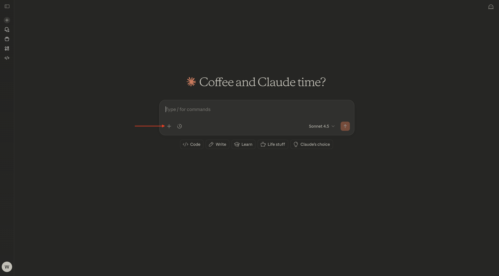
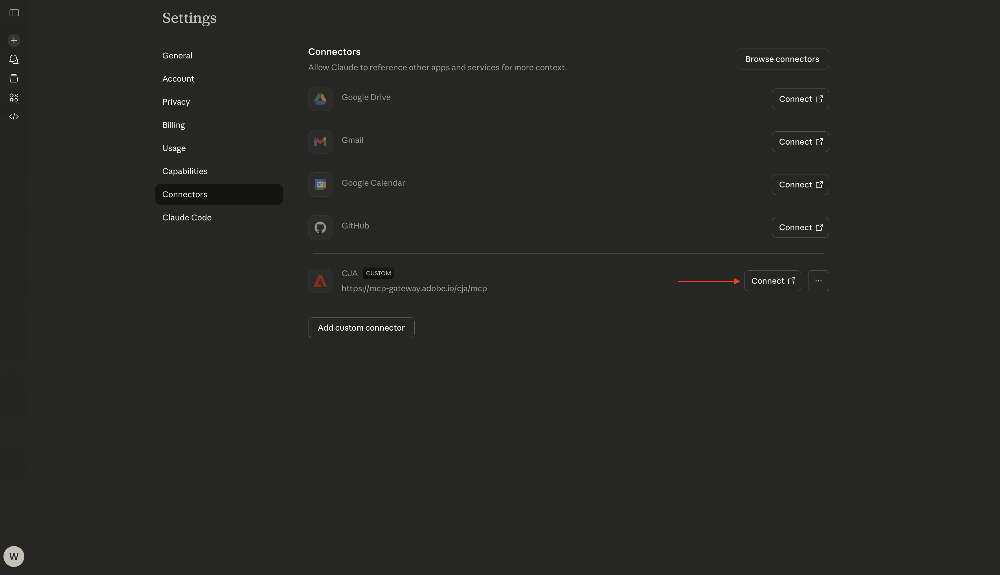
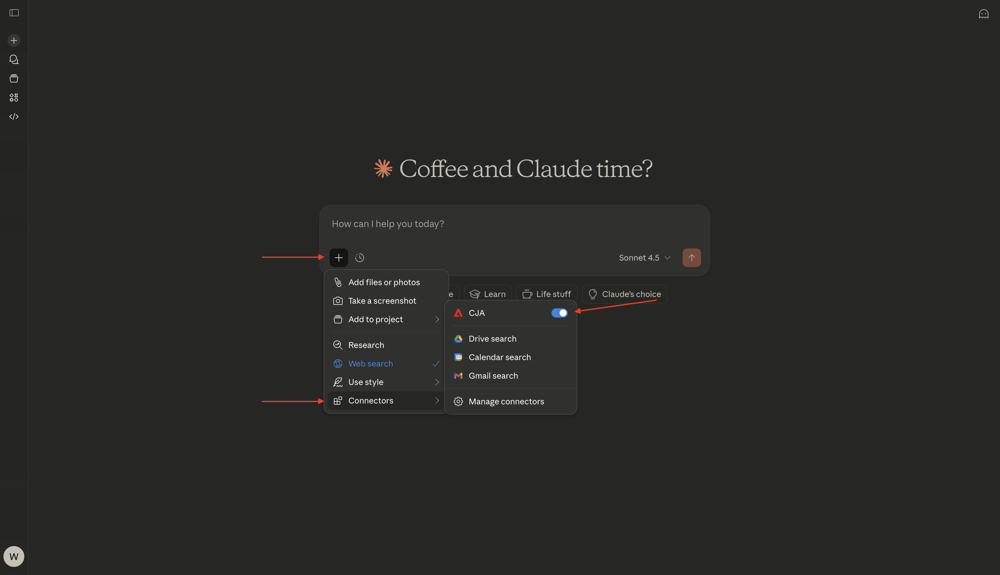
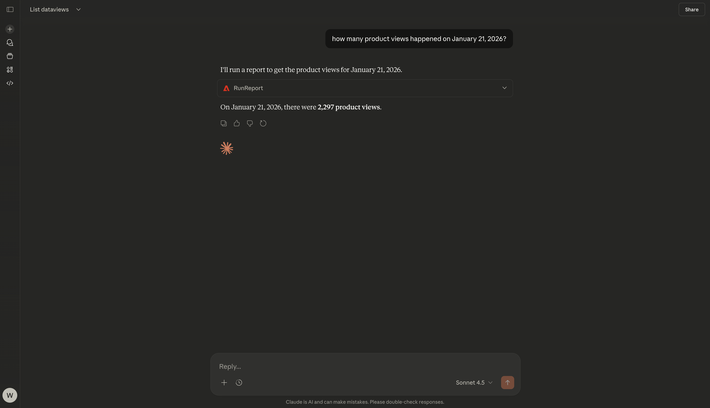
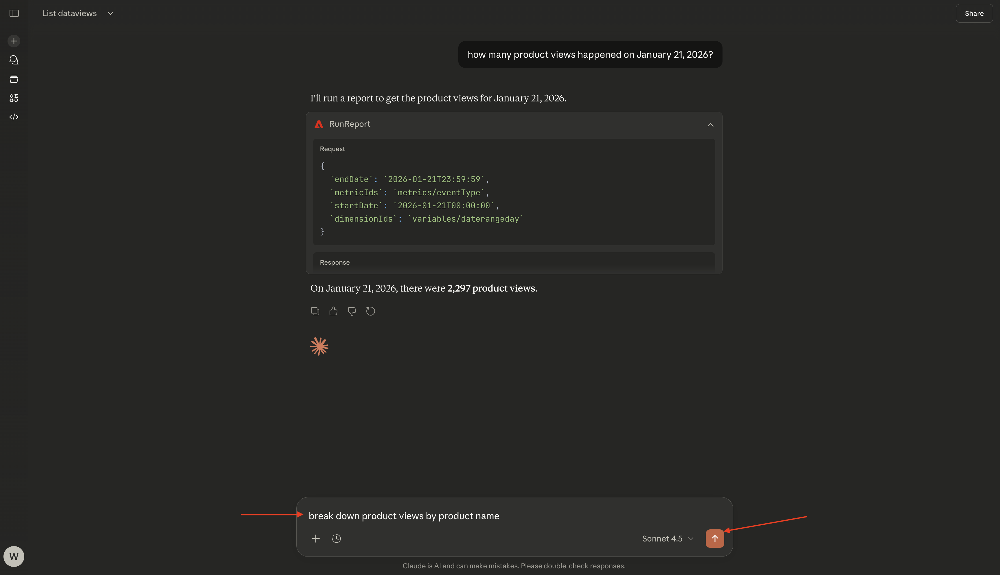
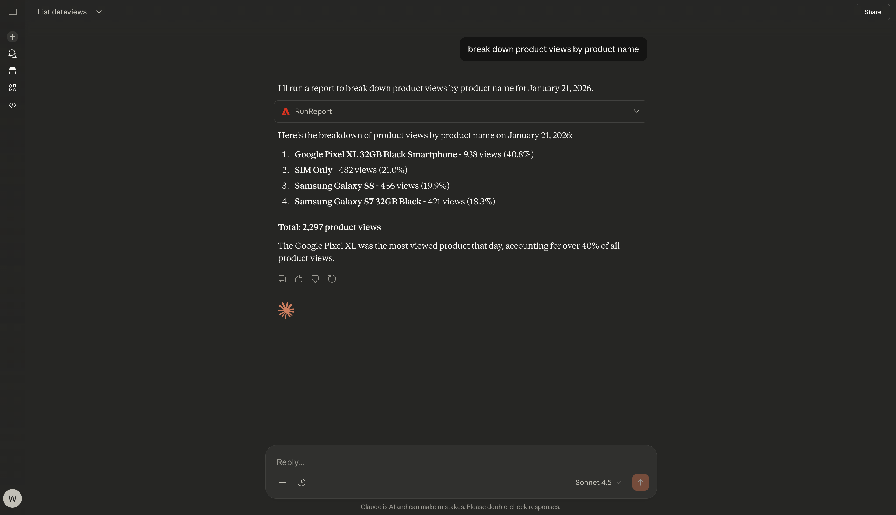
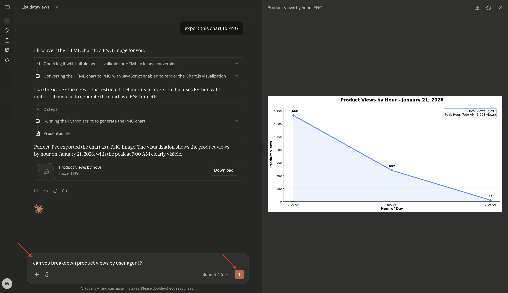

# 1.5.2 CJA y Claude.ai con servidor MCP

[!BADGE Alpha]

+++Detalles de Alpha
Al utilizar CJA &amp; Claude.ai con el servidor MCP Alpha, por la presente reconoce que el Alpha se proporciona &quot;tal cual&quot; sin garantía de ningún tipo. Adobe no tiene obligación de mantener, corregir, actualizar, cambiar, modificar o apoyar de otro modo Alpha. Se recomienda tener precaución y no confiar en modo alguno en el correcto funcionamiento o rendimiento de dichos Alpha y/o materiales de acompañamiento. Alpha se considera información confidencial de Adobe. Cualquier &quot;comentario&quot; (información sobre Alpha, incluidos, entre otros, problemas o defectos que encuentre al utilizar Alpha, sugerencias, mejoras y recomendaciones) proporcionado por usted a Adobe se asigna a Adobe, incluidos todos los derechos, el título y el interés en y para dichos comentarios.

+++


>[!NOTE]
>
>Este ejercicio sobre la configuración y el uso de un servidor MCP con Claude.ai para conectarse a CJA está relacionado con este ejercicio [1.1 Customer Journey Analytics: crear un tablero con Analysis Workspace sobre Adobe Experience Platform](./../../../modules/reporting-insights/cja-b2c/cjab2c-1/customer-journey-analytics-build-a-dashboard.md). La vista de datos y la conexión de CJA que se utilizan en el siguiente ejercicio son la vista de datos y la conexión que se configuraron en ese ejercicio. Si desea replicar los siguientes resultados, primero debe seguir esas instrucciones.

## Vídeo

En este vídeo, obtendrá una explicación y una demostración de todos los pasos involucrados en este ejercicio.

>[!VIDEO](https://video.tv.adobe.com/v/3479561?quality=12&learn=on)

## 1.5.2.1 Crear aplicación personalizada en Claude.ai para CJA

>[!NOTE]
>
>El uso de CJA en Claude.ai requiere lo siguiente:
>- una versión de pago de Claude.ai
>- uso del cliente web Claude.ai

Vaya a [https://claude.ai/](https://claude.ai/){target="_blank"} e inicie sesión con los detalles de su cuenta. Una vez que haya iniciado sesión, debería ver esto. Haga clic en el icono **+**.



Seleccione **Agregar conectores**.


Haga clic en **agregar uno personalizado**.


Rellene los campos de esta manera:

- **Nombre**: `CJA`
- **URL del servidor MCP**: consulte con su representante de Adobe

Haga clic en **Agregar**.


Entonces debería ver esto. Haga clic en **Conectar**.



Una vez que se haya autenticado correctamente, debería ver esto. Haga clic en el icono **+** para iniciar una nueva conversación.


Vaya a **+**, a **Conectores** y debería ver que el conector **CJA** ya está habilitado.



Ya está listo para iniciar el análisis de datos.


## 1.5.2.2: establecer contexto en CJA

Antes de seguir interactuando con CJA a través de Claude.ai, es necesario establecer el contexto.

Para este ejercicio, el contexto debe configurarse para utilizar:

- **Vista de datos**: **—aepUserLdap— - Vista de datos omnicanal**

La configuración de vista de datos ayuda a identificar qué vista de datos debe ver Claude.ai al hacer preguntas.

Escriba el **indicador** siguiente y haga clic en el botón **enviar**.

```javascript
list dataviews
```


Seleccionar **Permitir siempre**.


Debería ver una lista similar de vistas de datos disponibles.


Para cambiar eso a la vista de datos que necesita usarse, ingrese el siguiente **indicador** y haga clic en el botón **enviar**.

```javascript
switch to dataview --aepUserLdap-- - Omnichannel Data View
```


Seleccionar **Permitir siempre**.


Entonces debería ver esto.


El contexto ahora está configurado correctamente, por lo que puede empezar a enviar mensajes específicos a continuación.

## 1.5.2.3 Explorar la vista de datos

>[!NOTE]
>
>La vista de datos que se está usando aquí se configuró como parte del ejercicio [Crear una vista de datos](./../../../modules/reporting-insights/cja-b2c/cjab2c-1/ex3.md).

Escriba el siguiente **Mensaje** y haga clic en el botón **enviar** para explorar qué métricas y dimensiones están disponibles para usted.

```javascript
list the available metrics and dimensions
```


Seleccione **Permitir siempre** dos veces, una para recuperar **métricas** y otra para recuperar **dimensiones**.


Debería ver esta respuesta, que incluye las métricas y dimensiones configuradas como parte del ejercicio [Crear una vista de datos](./../../../modules/reporting-insights/cja-b2c/cjab2c-1/ex3.md).


## 1.5.2.4 tabla de forma libre: vistas del producto

Ahora puede empezar a explorar los datos. Comience por escribir la siguiente solicitud y haga clic en **enviar** para enviar su solicitud de informe.

```javascript
how many product views happened on January 21, 2026?
```


Seleccionar **Permitir siempre**.


Entonces debería ver una respuesta como esta.



Ahora puede desglosar la respuesta añadiendo una dimensión. Escriba el **prompt** siguiente y haga clic en el botón **enviar**.

```javascript
break down product views by product name
```



Entonces debería ver una respuesta como esta.



Ahora también puede crear una visualización. Escriba el **prompt** siguiente y haga clic en el botón **enviar**.

```javascript
create a line visualization by hour for product views on January 21
```


Entonces debería ver esto.


Ahora también puede descargar este gráfico de líneas. Escriba el **prompt** siguiente y haga clic en el botón **enviar**.

```javascript
export this chart to PNG
```


Entonces debería ver esto. Haga clic en **Descargar**.


A continuación, puede abrir el PNG descargado y utilizarlo en otros documentos.


Escriba el **prompt** siguiente y haga clic en el botón **enviar**.

```javascript
can you breakdown product views by user agent?
```



Entonces debería ver esto.


## Visualización de abandonos de 1.5.2.5

Escriba el **prompt** siguiente y haga clic en el botón **enviar**.

```javascript
can you create a fallout visualization for the product interaction funnel, starting with all traffic and then in the next steps add Product Views, Add to Cart and purchases?
```


Debería ver algo similar a esto, que incluye una visualización generada por Claude.ai basada en los datos proporcionados por Customer Journey Analytics.


Siguiente paso: [Adobe Analytics y Claude.ai con servidor MCP](./ex3.md){target="_blank"}

Volver a [Analytics y agentes](./analyticsagents.md){target="_blank"}

[Volver a todos los módulos](./../../../overview.md){target="_blank"}