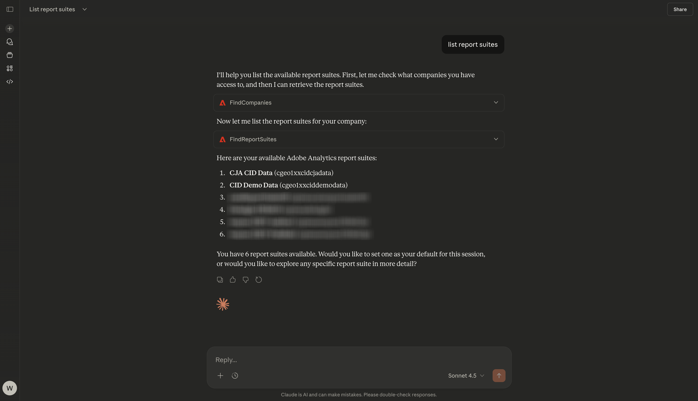
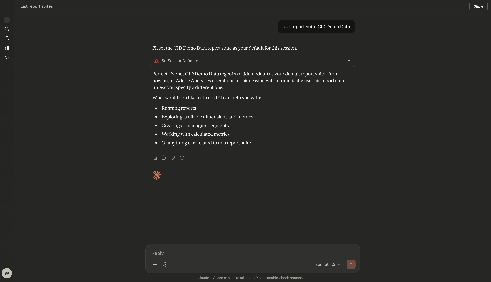
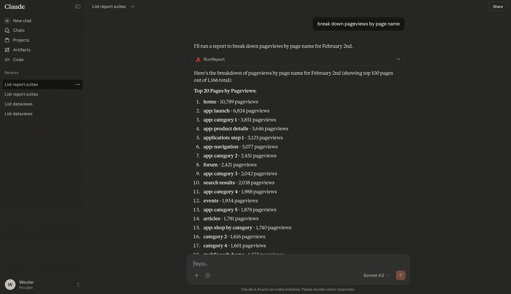
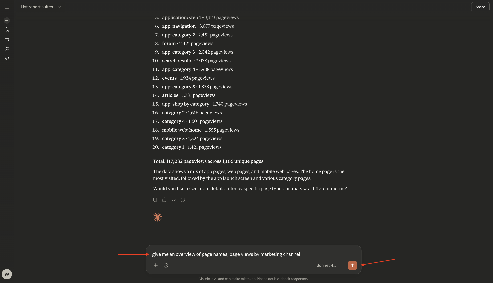
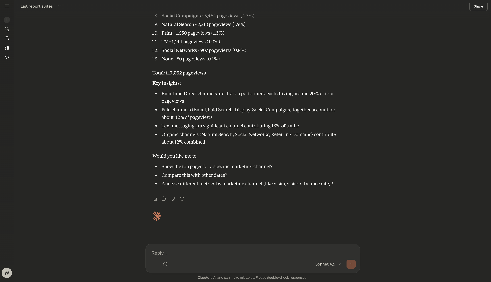
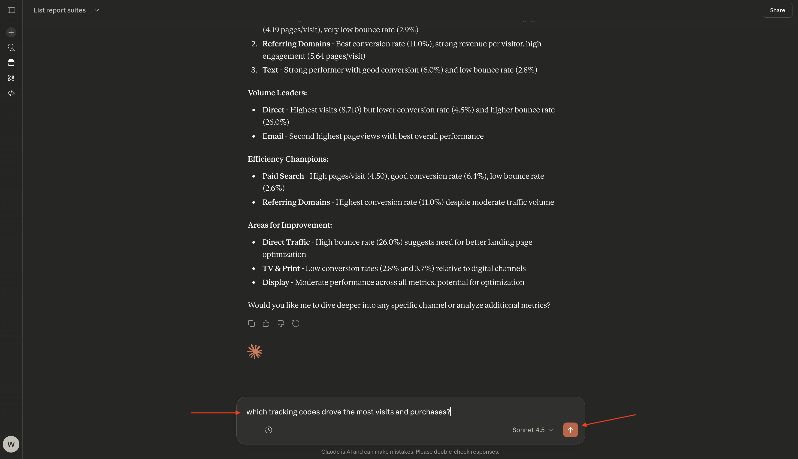
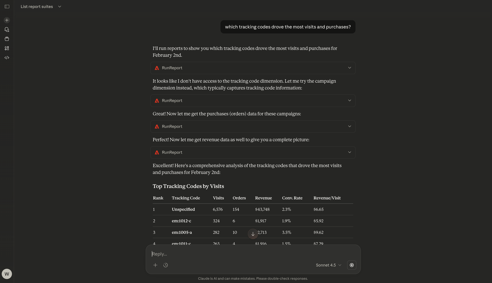

# 1.5.3 Adobe Analytics y Claude.ai con servidor MCP

[!BADGE Alpha]

+++Detalles de Alpha
Al utilizar CJA &amp; Claude.ai con el servidor MCP Alpha, por la presente reconoce que el Alpha se proporciona &quot;tal cual&quot; sin garantía de ningún tipo. Adobe no tiene obligación de mantener, corregir, actualizar, cambiar, modificar o apoyar de otro modo Alpha. Se recomienda tener precaución y no confiar en modo alguno en el correcto funcionamiento o rendimiento de dichos Alpha y/o materiales de acompañamiento. Alpha se considera información confidencial de Adobe. Cualquier &quot;comentario&quot; (información sobre Alpha, incluidos, entre otros, problemas o defectos que encuentre al utilizar Alpha, sugerencias, mejoras y recomendaciones) proporcionado por usted a Adobe se asigna a Adobe, incluidos todos los derechos, el título y el interés en y para dichos comentarios.

+++

## Vídeo

En este vídeo, obtendrá una explicación y una demostración de todos los pasos involucrados en este ejercicio.

>[!VIDEO](https://video.tv.adobe.com/v/3479562?quality=12&learn=on)

## 1.5.3.1 Crear aplicación personalizada en Claude.ai para Adobe Analytics

>[!NOTE]
>
>El uso de Adobe Analytics en Claude.ai requiere lo siguiente:
>- una versión de pago de Claude.ai
>- uso del cliente web Claude.ai

Vaya a [https://claude.ai/](https://claude.ai/){target="_blank"} e inicie sesión con los detalles de su cuenta. Una vez que haya iniciado sesión, debería ver esto. Haga clic en el icono **+**.


Seleccione **Agregar conectores**.


Haga clic en **agregar uno personalizado**.


Rellene los campos de esta manera:

- **Nombre**: `CJA`
- **URL del servidor MCP**: consulte con su representante de Adobe

Haga clic en **Agregar**.


Entonces debería ver esto. Haga clic en **Conectar**.


Una vez que se haya autenticado correctamente, debería ver esto. Haga clic en el icono **+** para iniciar una nueva conversación.


Vaya a **+**, a **Conectores** y debería ver que el conector **Adobe Analytics** ya está habilitado.


Ya está listo para iniciar el análisis de datos.


## 1.5.3.2: establecer contexto en Adobe Analytics

Antes de seguir interactuando con CJA a través de Claude.ai, es necesario establecer el contexto.

Para este ejercicio, el contexto debe configurarse para utilizar:

- **Grupo de informes**: **CID - Datos de demostración**

La configuración del grupo de informes ayuda a identificar qué datos debe ver Claude.ai al hacer preguntas.

Escriba el **indicador** siguiente y haga clic en el botón **enviar**.

```javascript
list report suites
```


Seleccionar **Permitir siempre**.


Seleccionar **Permitir siempre**.


Entonces deberías ver algo como esto.



Escriba el **indicador** siguiente y haga clic en el botón **enviar**.

```javascript
use report suite CID Demo Data
```


Seleccionar **Permitir siempre**.


Se ha seleccionado el grupo de informes.



## 1.5.2.3 Explorar el grupo de informes

Escriba el siguiente **Mensaje** y haga clic en el botón **enviar** para explorar qué métricas y dimensiones están disponibles para usted.

```javascript
list the available metrics and dimensions
```


Seleccionar **Permitir siempre**.


Seleccione **Permitir siempre** de nuevo.


Debería ver esta respuesta, que incluye las métricas y dimensiones configuradas en este grupo de informes.


## 1.5.2.4 informes

Ahora puede empezar a explorar los datos. Comience por escribir la siguiente solicitud y haga clic en **enviar** para enviar su solicitud de informe.

```javascript
show me pageviews for Feb 2?
```


Entonces deberías ver algo como esto.


Escriba el **indicador** siguiente y haga clic en el botón **enviar**.

```javascript
break down pageviews by page name
```


Entonces debería ver esto.



Escriba el **indicador** siguiente y haga clic en el botón **enviar**.

```javascript
give me an overview of page names, page views by marketing channel
```



Entonces deberías ver algo como esto.


Desplácese un poco hacia abajo para ver el análisis.



Escriba el **indicador** siguiente y haga clic en el botón **enviar**.

```javascript
Analyze different metrics by marketing channel
```


Entonces deberías ver algo como esto.


Escriba el **indicador** siguiente y haga clic en el botón **enviar**.

```javascript
which tracking codes drove the most visits and purchases?
```



Debería ver algo similar a esto: primero se muestran **códigos de seguimiento principales por visitas**.



Puedes ver los códigos de seguimiento que más compras condujeron en el informe **Códigos de seguimiento principales por pedidos (compras)**.


Y luego encuentras información adicional proporcionada por Claude.ai en función de los datos procedentes de Adobe Analytics.


Ya ha terminado este ejercicio.

Volver a [Analytics y agentes](./analyticsagents.md){target="_blank"}

[Volver a todos los módulos](./../../../overview.md){target="_blank"}