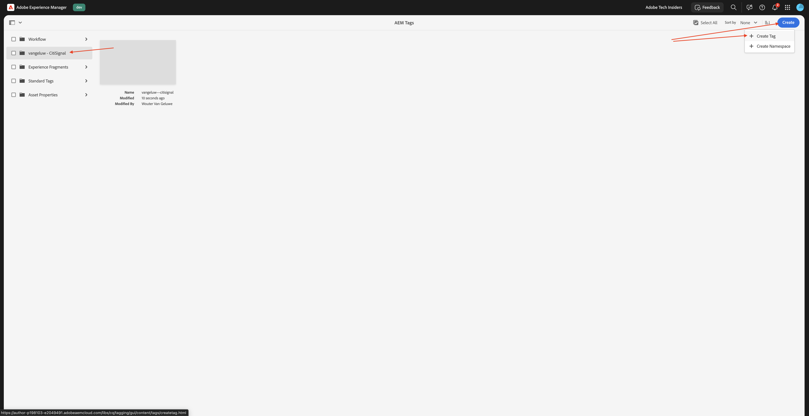
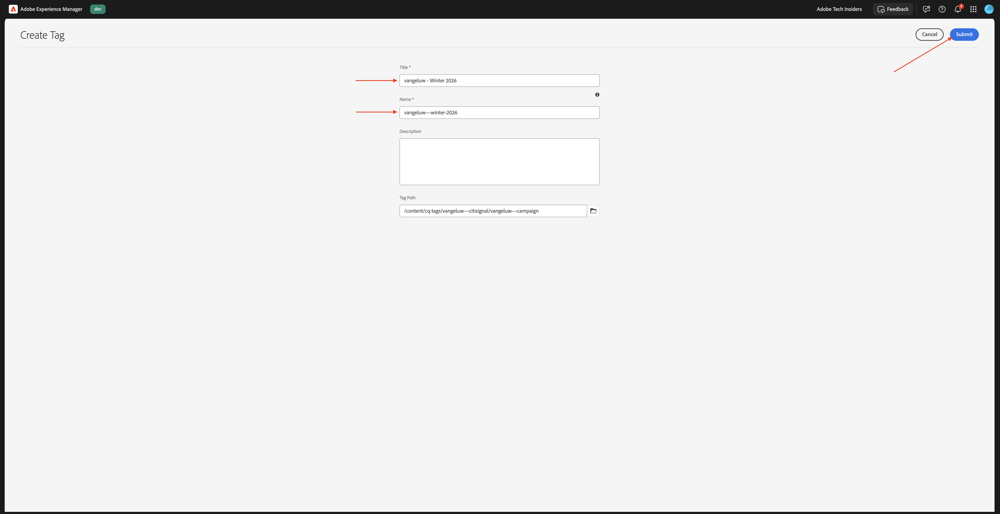
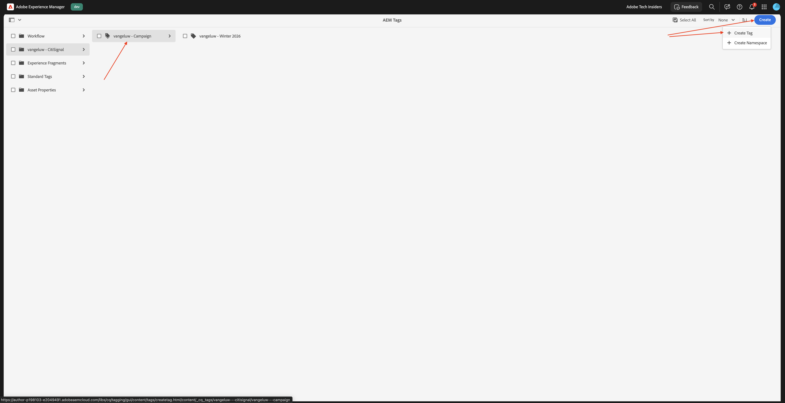
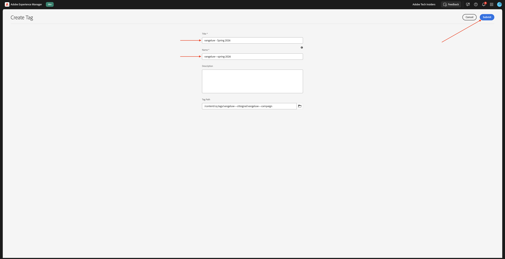
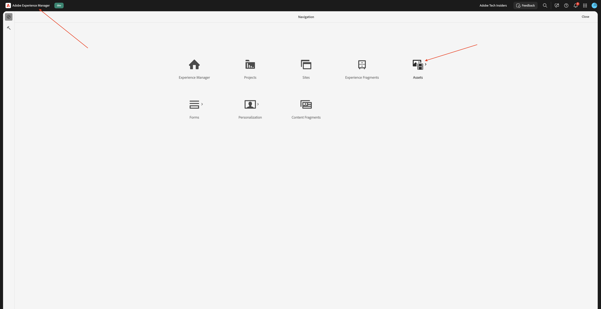
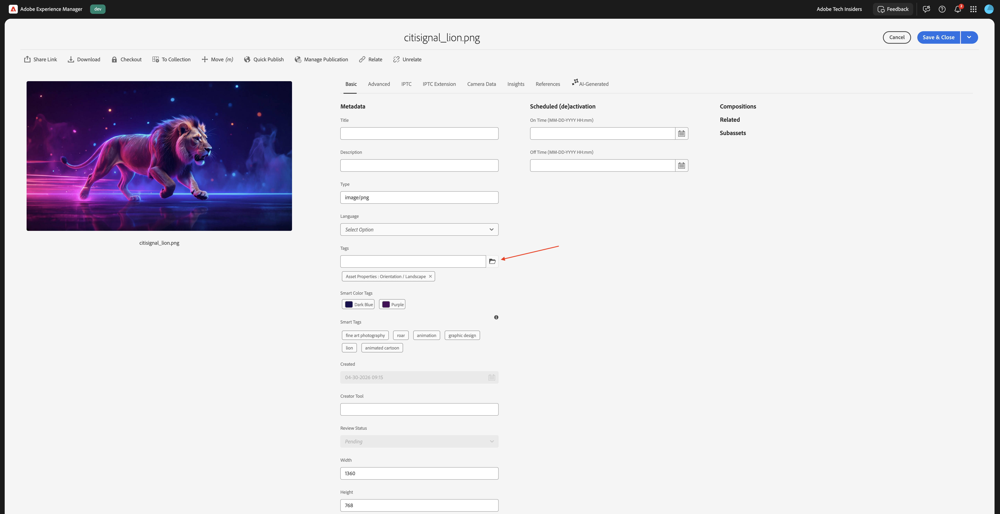
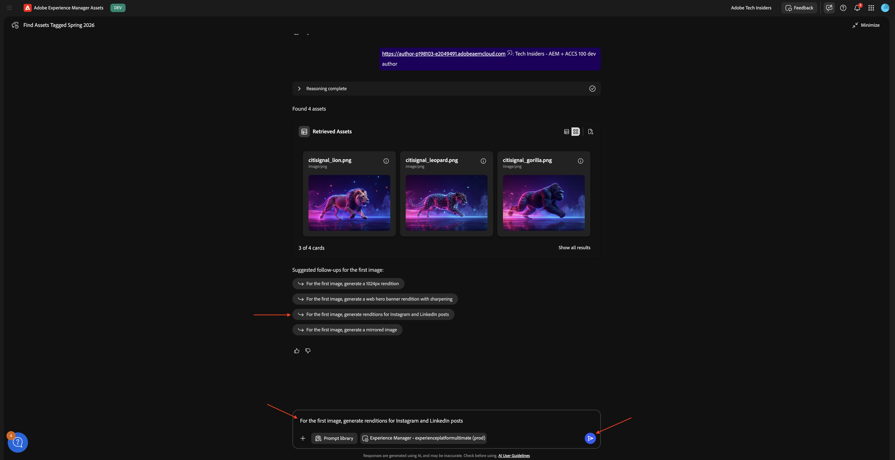

# 1.6.1 Introducción a AEM Agents

>[!IMPORTANT]
>
>Para completar este ejercicio, debe tener acceso a un entorno de AEM Sites y Assets CS con EDS en funcionamiento, y los distintos agentes de AEM deben estar habilitados para la organización de IMS que utilice.
>
>Si aún no cuenta con ese entorno, vaya al ejercicio [Adobe Experience Manager Cloud Service &amp; Edge Delivery Services](./../../../modules/asset-mgmt/module2.1/aemcs.md){target="_blank"}. Siga las instrucciones allí y tendrá acceso a dicho entorno.

>[!IMPORTANT]
>
>Si ha configurado anteriormente un programa AEM CS con un entorno AEM Sites y Assets CS, es posible que la zona protegida de AEM CS haya estado en hibernación. Dado que la dehibernación de una zona protegida de este tipo tarda de 10 a 15 minutos, sería aconsejable iniciar el proceso de dehibernación ahora para que no tenga que esperar más adelante.

## Agente de detección 1.6.1.1

Adobe Experience Manager (AEM) Discovery Agent es una herramienta con tecnología de IA en AEM as a Cloud Service que permite a los usuarios buscar, recuperar y utilizar contenido, incluidos Assets, fragmentos de contenido y Forms adaptable, mediante peticiones en lenguaje natural. Esto elimina la necesidad de realizar filtros manuales, con muchos clics o complejos. Para ello, comprende la intención y realiza búsquedas en todo el repositorio.

Para usar **Discovery Agent**, primero creará algunas etiquetas en Adobe Experience Manager y luego etiquetará algunos recursos usando esas etiquetas. Una vez hecho esto, podrá usar AI Assistant para descubrir recursos de una manera fácil y fácil de usar.

Vaya a [https://my.cloudmanager.adobe.com](https://my.cloudmanager.adobe.com){target="_blank"}. La organización que debe seleccionar es `--aepImsOrgName--`.

### Creación y uso de etiquetas con Assets

Haga clic para abrir el programa Cloud Manager, que debería llamarse `--aepUserLdap-- - CitiSignal AEM+ACCS`.


Haga clic en la dirección URL del entorno para abrirlo.


Haga clic en el icono **martillo**.


En **General**, haga clic en **Etiquetado**.


Entonces debería ver esto. Haga clic en **Crear** y luego seleccione **Crear área de nombres**.


En el campo **Título**, escriba: `CitiSignal`. Haga clic en **Crear**.


Explore en profundidad el espacio de nombres **CitiSignal** haciendo clic en él. Haga clic en **Crear** y luego seleccione **Crear etiqueta**.



En el campo **Título**, escriba: `Campaign`. Haga clic en **Enviar**.


Seleccione la etiqueta **Campaign** haciendo clic en ella. Haga clic en **Crear** y luego seleccione **Crear etiqueta**.


En el campo **Título**, escriba: `Winter 2026`. Haga clic en **Enviar**.



Seleccione la etiqueta **Campaign** haciendo clic en ella. Haga clic en **Crear** y luego seleccione **Crear etiqueta**.



En el campo **Título**, escriba: `Spring 2026`. Haga clic en **Enviar**.



Ahora debería tener esto.


Haga clic en **Adobe Experience Manager** y luego en **Assets**.



Haga clic en **Archivos**.


Haga doble clic en la carpeta **CitiSignal** para abrirla.


Haga clic en **Crear** y luego seleccione **Archivos**.


Descargue el archivo [citisignal-images-campaign.zip](./assets/citisignal-images-campaign.zip) y descomprímalo en su escritorio.


Seleccione. los 3 archivos que acaba de descargar y haga clic en **abrir**.


Haga clic en **Cargar**.


Entonces debería ver esto.


Seleccione la primera imagen y haga clic en **Propiedades**.


Haga clic en el icono **carpeta** en Etiquetas.



Seleccione la etiqueta **Primavera de 2026** y haga clic en **Seleccionar**. Repita ese proceso para estas imágenes:

- citisignal_lion.png
- citisignal_leopard.png
- citisignal_gorilla.png
- citisignal_rabbit.png


Una vez que hayas seleccionado esa etiqueta para todas las imágenes, ve a **Experience Manager Assets**.


Seleccione el repositorio que está utilizando.


Vaya a **Assets** y abra la carpeta **CitiSignal**.


Abra la primera imagen.


Seleccione **Aprobado** y haga clic en **Guardar**.


En **Etiquetas**, puede ver la etiqueta que seleccionó anteriormente.


Repita ese proceso para que se aprueben las 4 imágenes.


A continuación, ve a **Mi espacio de trabajo** y haz clic para abrir **Asistente de IA**.


Escriba la siguiente solicitud y haga clic en **Enviar**.

```javascript
find all assets tagged with 'Spring 2026'
```


Si tiene acceso a varios entornos de AEM Assets CS, verá algo similar a esto. Haga clic en la respuesta propuesta para el entorno que desee usar y, a continuación, haga clic en **Enviar**.


Debería ver una respuesta similar. Haga clic en el icono para expandir el asistente de IA a pantalla completa.


Revise las respuestas.


En la ventana Asistente de IA, puede hacer clic en para ver cualquiera de estos recursos.


A continuación, se le redirigirá directamente a AEM Assets CS, a esa imagen específica.


A continuación, también puede revisar cualquiera de los demás metadatos disponibles.


## 1.6.1.2 agente de producción de experiencia

### Actualización de contenido

La aptitud para la actualización de contenido actualiza fácilmente el contenido existente, incluidos los fragmentos de contenido, las páginas, los formularios y los recursos. El agente puede realizar acciones como actualizar, quitar, reemplazar o agregar elementos de contenido para mantener las experiencias precisas y actualizadas. Las entradas pueden ser descripciones en lenguaje natural y, cuando se utilizan con PDF de Jira y capturas de pantalla, pueden proporcionar entradas a.

Vuelva a la pantalla del asistente de IA.


Escriba la siguiente solicitud y haga clic en **Enviar**.

`Generate multiple social media formats (Instagram 1080x1920, Facebook 1200x630, Twitter 1200x675) for the third image`



Después de un par de minutos, debería ver una respuesta similar.


Revise las imágenes que se generaron.


### Creación de formularios

La habilidad Creación de formularios permite a los usuarios crear formularios adaptables mediante peticiones de datos en lenguaje natural sin depender de equipos de desarrollo o TI. Esta capacidad acelera el desarrollo de formularios a la vez que mantiene la coherencia de la marca y permite a los usuarios empresariales crear formularios sin tener conocimientos técnicos profundos del producto.


## Pasos siguientes

Volver a [AEM y agentes](./aemagents.md){target="_blank"}

[Volver a todos los módulos](./../../../overview.md){target="_blank"}
