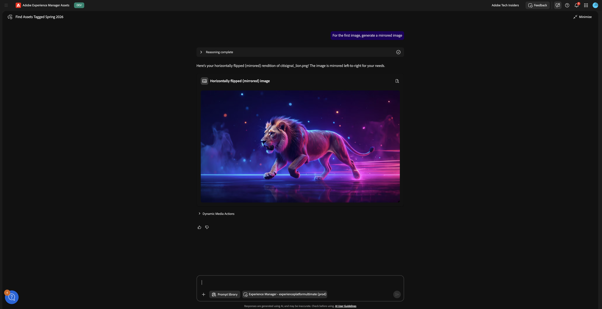
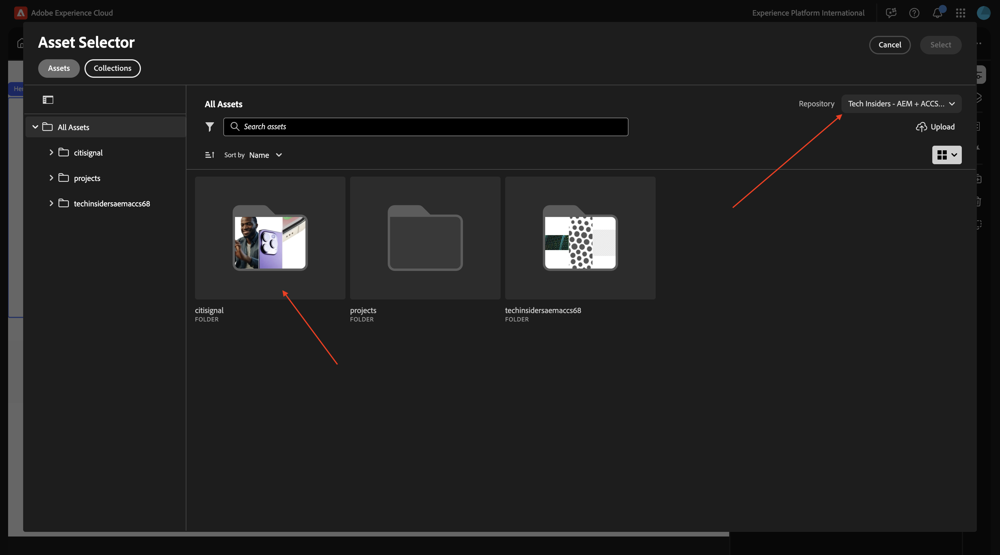
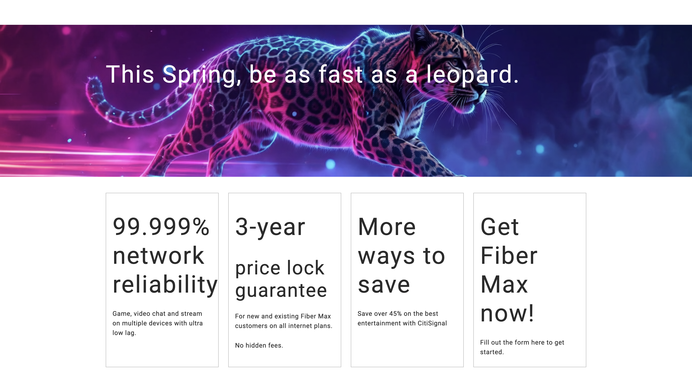
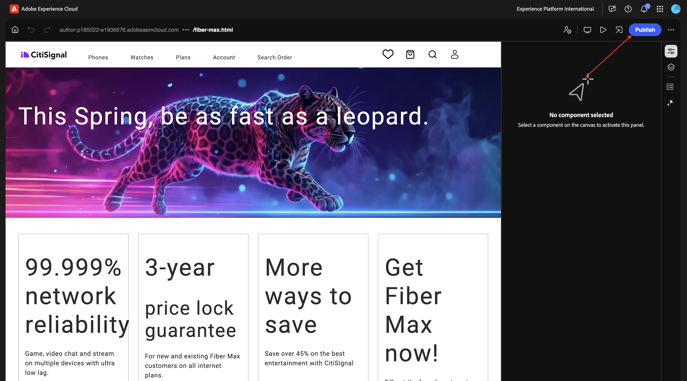
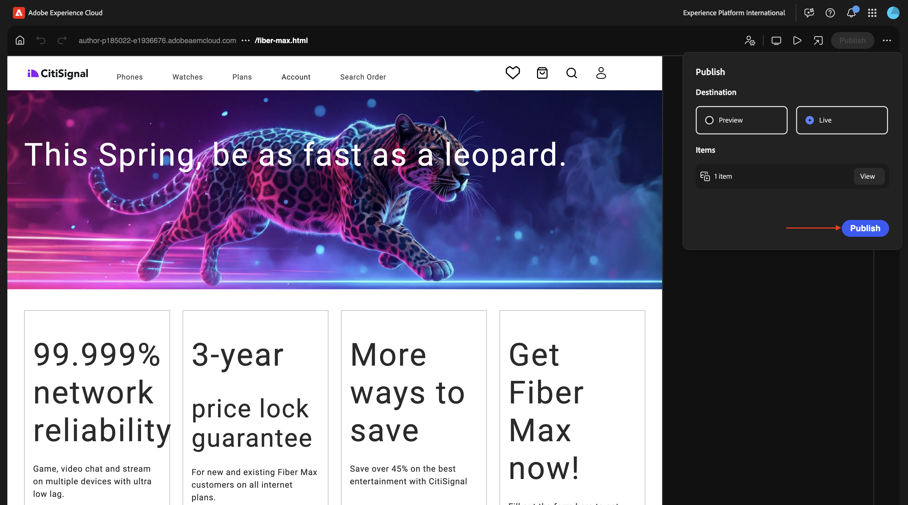

# 1.6.1 Introducción a AEM Agents

>[!IMPORTANT]
>
>Es posible que la zona protegida de AEM CS esté en hibernación. Dado que la dehibernación de una zona protegida tarda de 10 a 15 minutos, sería aconsejable iniciar el proceso de dehibernación ahora para no tener que esperarla más adelante.

## Agente de detección 1.6.1.1

Adobe Experience Manager (AEM) Discovery Agent es una herramienta con tecnología de IA en AEM as a Cloud Service que permite a los usuarios buscar, recuperar y utilizar contenido, incluidos Assets, fragmentos de contenido y Forms adaptable, mediante peticiones en lenguaje natural. Esto elimina la necesidad de realizar filtros manuales, con muchos clics o complejos. Para ello, comprende la intención y realiza búsquedas en todo el repositorio.

Para usar **Discovery Agent**, primero creará algunas etiquetas en Adobe Experience Manager y luego etiquetará algunos recursos usando esas etiquetas. Una vez hecho esto, podrá usar AI Assistant para descubrir recursos de una manera fácil y fácil de usar.

Vaya a [https://my.cloudmanager.adobe.com](https://my.cloudmanager.adobe.com){target="_blank"}. La organización que debe seleccionar es `--aepImsOrgName--`.

### Creación y uso de etiquetas con Assets

Haga clic en para abrir el programa de Cloud Manager, que debe utilizar las siguientes opciones de nomenclatura:

- **`Tech Insiders - AEM + ACCS X`**, donde X significa el número que se le asignó.
- **`Tech Insiders On Demand - AEM + ACCS X`**, donde X significa el número que se le asignó.
- **`--aepUserLdap-- - CitiSignal AEM+ACCS`**, en este caso no tiene un número porque está usando su propio programa de AEM que creó usted mismo.

En este ejemplo, se utilizará el programa **Tech Insiders - AEM + ACCS 100**. Debe utilizar su propio programa.


Haga clic en la dirección URL del entorno para abrirlo.


Haga clic en el icono **herramientas**.


En **General**, haga clic en **Etiquetado**.


Entonces debería ver esto. Haga clic en **Crear** y luego seleccione **Crear área de nombres**.


En el campo **Título**, escriba: `--aepUserLdap-- - CitiSignal`. Haga clic en **Crear**.


Explore en profundidad el espacio de nombres **`--aepUserLdap-- - CitiSignal`** haciendo clic en él. Haga clic en **Crear** y luego seleccione **Crear etiqueta**.


En el campo **Título**, escriba: `--aepUserLdap-- - Campaign`. Haga clic en **Enviar**.


Seleccione la etiqueta **`--aepUserLdap-- - Campaign`** al hacer clic en ella. Haga clic en **Crear** y luego seleccione **Crear etiqueta**.


En el campo **Título**, escriba: `--aepUserLdap-- - Winter 2026`. Haga clic en **Enviar**.


Seleccione la etiqueta **Campaign** haciendo clic en ella. Haga clic en **Crear** y luego seleccione **Crear etiqueta**.


En el campo **Título**, escriba: `--aepUserLdap-- - Spring 2026`. Haga clic en **Enviar**.


Ahora debería tener esto.


Haga clic en **Adobe Experience Manager** y luego en **Assets**.


Haga clic en **Archivos**.


Haga clic en la carpeta **CitiSignal** para abrirla.


Haga clic en **Crear** y luego seleccione **Archivos**.


Descargue el archivo [citisignal-images-campaign.zip](./assets/citisignal-images-campaign.zip) y descomprímalo en su escritorio.


Seleccione los tres archivos que acaba de descargar y haga clic en **abrir**.


Haga clic en **Cargar**.


Entonces debería ver esto.


Seleccione la primera imagen (citisignal_lion.png) y luego haga clic en **Propiedades**.


Haga clic en el icono **carpeta** en Etiquetas.


Seleccione la etiqueta **`--aepUserLdap-- - Spring 2026`** y haga clic en **Seleccionar**.


Haga clic en **Guardar y cerrar**.


Repita esto para estas imágenes:

- `citisignal_leopard.png`
- `citisignal_gorilla.png`
- `citisignal_neon_rabbit.png`

Una vez que hayas seleccionado esa etiqueta para todas las imágenes, ve a **Experience Manager Assets**.


Haz clic en el icono **perfil** en la parte superior derecha de la pantalla. Haga clic en **Cambiar vista**.


Entonces debería ver esto.


Haga doble clic para abrir la primera imagen.


Seleccione **Aprobado** y haga clic en **Guardar**.


En **Etiquetas**, puede ver la etiqueta que seleccionó anteriormente.


Repita ese proceso para que se aprueben las 4 imágenes.


A continuación, ve a **Mi espacio de trabajo** y haz clic para abrir **Asistente de IA**.


Escriba la siguiente solicitud y haga clic en **Enviar**.

```javascript
find all assets tagged with '--aepUserLdap-- - Spring 2026'
```


Si tiene acceso a varios entornos de AEM Assets CS, verá algo similar a esto. Haga clic en la respuesta propuesta para el entorno que desee usar y, a continuación, haga clic en **Enviar**.


Debería ver una respuesta similar. Haga clic en el icono para expandir el asistente de IA a pantalla completa.


Revise las respuestas.


Haga clic en el icono **Ver información** en cualquiera de los recursos.


A continuación, verá una vista ampliada del recurso seleccionado, con algunos metadatos.


## 1.6.1.2 agente de producción de experiencia

### Actualización de contenido: Assets

La aptitud para la actualización de contenido actualiza fácilmente el contenido existente, incluidos los fragmentos de contenido, las páginas, los formularios y los recursos. El agente puede realizar acciones como actualizar, quitar, reemplazar o agregar elementos de contenido para mantener las experiencias precisas y actualizadas. Las entradas pueden ser descripciones en lenguaje natural y, cuando se utilizan con PDF de Jira y capturas de pantalla, pueden proporcionar entradas a.

Vuelva a la pantalla del asistente de IA. Cierre el panel lateral.


Seleccione uno de los indicadores propuestos y haga clic en **Enviar**.

`For the first image, generate renditions for Instagram and LinkedIn posts`


Después de un par de minutos, debería ver una respuesta similar.


Revise las imágenes que se generaron.


Siéntase libre de experimentar con otros indicadores. Desplácese hacia arriba y seleccione uno de los otros indicadores propuestos, o escriba el suyo propio y haga clic en **Enviar**.

`For the first image, generate a mirrored image`


Revise las imágenes que se generaron.



### Actualización de contenido: páginas

Vuelva a su entorno de Adobe Experience Manager Author y luego vaya a **Sites**.


Vaya a **CitiSignal**. Haga clic en **Crear** y seleccione **Página**.


Seleccione **Página** y haga clic en **Siguiente**.


Introduzca los siguientes valores:

- Título: **Fibra máxima**
- Nombre: **fiber-max**
- Título de página: **Fibra máxima**

Haga clic en **Crear**.


Seleccione **Abrir**.


Entonces debería ver esto.


Haga clic en el área en blanco para seleccionar el componente **section**. A continuación, haga clic en el icono más **+** del menú derecho y seleccione **Hero**.


Entonces debería ver esto. Haga clic en **+ Agregar** para agregar una imagen.


Seleccione el repositorio de recursos. A continuación, abra la carpeta **CitiSignal**.



Elija la imagen del león que subió anteriormente. Haga clic en **Seleccionar**.


Entonces debería ver esto. Haga clic en el área **texto** para cambiar el texto.


Pegue este texto en la área:

```
This winter, be as fast as a lion.
```

Seleccione **Encabezado 1** y haga clic en **Listo**.


Entonces debería ver esto. Vaya a **Árbol de contenido** y seleccione el área **Sección**.


Haga clic en el icono **+** y luego seleccione **Tarjetas**.


Entonces debería ver esto. Asegúrese de que en el **árbol de contenido**, **Tarjetas** esté seleccionado.

A continuación, haga clic en el botón **+** 4 veces.


Ahora debería ver esto, donde hay 4 objetos **Card** en el objeto **Cards**.


Seleccione la primera **tarjeta**. Haga clic en el área **texto** para cambiar el texto.


Pegue el siguiente texto. Asegúrese de que la primera línea de texto esté usando **Encabezado 1**. Haga clic en **Finalizado**.

```
99.9% network reliability

Game, video chat and stream on multiple devices with ultra low lag.
```


Seleccione la segunda **tarjeta**. Haga clic en el área **texto** para cambiar el texto.


Pegue el siguiente texto. Asegúrese de que la primera línea de texto esté usando **Encabezado 1**. Haga clic en **Finalizado**.

```
3-year

price lock guarantee

For new and existing Fiber Max customers on all internet plans.

No hidden fees.
```


Seleccione la tercera **tarjeta**. Haga clic en el área **texto** para cambiar el texto.


Pegue el siguiente texto. Asegúrese de que la primera línea de texto esté usando **Encabezado 1**. Haga clic en **Finalizado**.

```
More ways to save

Save over 45% on the best entertainment with CitiSignal
```


Seleccione la cuarta **tarjeta**. Haga clic en el área **texto** para cambiar el texto.


Pegue el siguiente texto. Asegúrese de que la primera línea de texto esté usando **Encabezado 1**. Haga clic en **Finalizado**.

```
Get Fiber Max now!

Fill out the form here to get started.
```


Ahora debería tener esto. Haga clic en **Publicar**.


Vuelva a hacer clic en **Publicar**.


Haga clic en **Abrir página**.


Copie la dirección URL de la página como la necesitará a continuación.

La dirección URL debe ser similar a: `https://author-pXXXXXX-eXXXXXXX.adobeaemcloud.com/content/CitiSignal/fiber-max.html`.


Vaya a [https://experience.adobe.com/#/experiencemanager/](https://experience.adobe.com/#/experiencemanager/). Haga clic para abrir **Asistente de IA**.


Pegue la siguiente solicitud y haga clic en **enviar**. Sustituya XXX en este mensaje por la URL que copió en el paso anterior.

```
On the page XXX, please make the following changes:

- change the word 'winter' to 'spring'
- change the word 'lion' to 'leopard'
- change the image in the hero block to use the image 'citisignal_leopard.png'
- change the text '99.9% network reliability' to '99.999% network reliability'
```


Después de 1-2 minutos, debería ver esto. Escriba el mensaje `generate` y haga clic en **Enviar**.


Un par de minutos después, debería ver una confirmación como esta de que se han realizado los cambios. Haga clic en **Vista previa de la página actualizada**.


Ahora obtiene una confirmación visual de los cambios que se han realizado. Esta página de vista previa tiene un propósito meramente informativo. No puede realizar acciones desde esta página.



Para realizar una acción, haga clic en **Editar en AEM**.


En el editor universal, ahora puede ver todos los cambios en detalle, con la capacidad de cambiar cualquier cosa. Una vez que hayas revisado la página, haz clic en **Publicar**.



Vuelva a hacer clic en **Publicar**. El cambio que ha realizado aún no se ha publicado en el entorno de producción. En su lugar, se ha publicado en **Lanzamientos** en AEM.

Los lanzamientos le permiten desarrollar contenido de forma eficaz para una versión futura. Se crea un lanzamiento para permitirle realizar cambios como preparación para una publicación futura, al mismo tiempo que mantiene sus páginas actuales. Esto significa que está editando dos versiones al mismo tiempo: páginas que se publican actualmente y una versión de esas páginas, que se publicarán a la vez en el futuro. Una vez que llegue ese momento, puede reemplazar las páginas originales y publicar la nueva versión.



Para **promocionar** tus cambios pendientes para una versión futura, vuelve a AEM. Haz clic en **Adobe Experience Manager** en la parte superior de la página, haz clic en el icono de **martillo** y, a continuación, selecciona **Lanzamientos**.


Ahora debería ver un **lanzamiento** pendiente. Marque la casilla de verificación delante del **lanzamiento** pendiente.


Haga clic en **Promocionar**.


Seleccione **Promocionar lanzamiento completo** y haga clic en **Siguiente**.


Haga clic en **Promocionar**.


Ahora debería ver esto. Los cambios se están produciendo.


Actualice la página, debería ver todos los cambios en la página publicada.


Alternativamente, en lugar de pasar por el proceso de promoción manual, también puede introducir el indicador `accept` en el asistente de IA.


A continuación, debería recibir una confirmación de que los cambios se han publicado.


### Actualización de contenido: creación de formularios

En el módulo [Adobe Experience Manager Forms con Edge Delivery Services](./../../asset-mgmt/module1.3/aemforms.md){target="_blank"} puede encontrar los pasos necesarios para crear un formulario de forma manual.

La habilidad Creación de formularios ahora permite a los usuarios crear formularios adaptables mediante peticiones de datos en lenguaje natural sin depender de equipos de desarrollo o TI. Esta capacidad acelera el desarrollo de formularios a la vez que mantiene la coherencia de la marca y permite a los usuarios empresariales crear formularios sin tener conocimientos técnicos profundos del producto.

Vaya a [https://experience.adobe.com/#/ai-assistant/chat](https://experience.adobe.com/#/ai-assistant/chat).


Escriba la siguiente solicitud y haga clic en **enviar**.

```
Create a new adaptive form using Edge Delivery Services and the existing CitiSignal site, with the following details:
- Form name: "citisignal-fiber-max-interest-2"
- Form fields: 4 text input fields are needed, for "first-name", "last-name", "email" and "city"
- When the form is submitted, send the submission to a spreadsheet, with this URL: https://docs.google.com/spreadsheets/d/1WwKrcM8mZ2d_W3sMheUAw3nFhP_OFk05TsqxhHkudfQ/edit?usp=sharing.
```

## Pasos siguientes

Ir a [1.6.2 servidores y cursor de AEM MCP](./ex2.md){target="_blank"}

Volver a [AEM y agentes](./aemagents.md){target="_blank"}

[Volver a todos los módulos](./../../../overview.md){target="_blank"}
