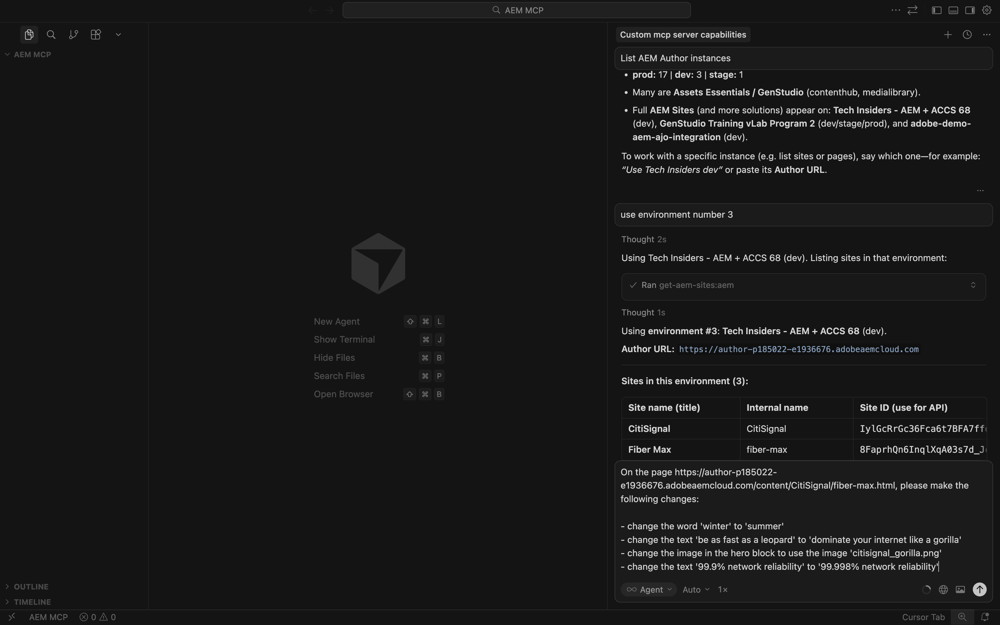
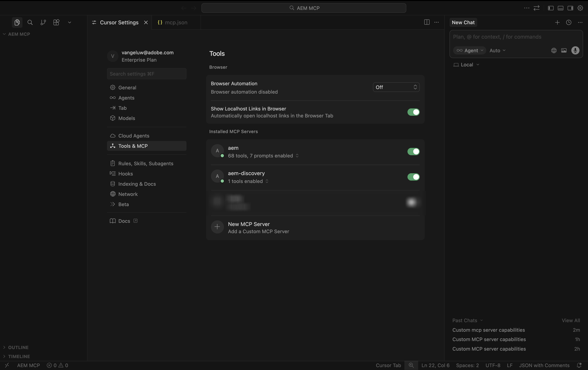

# 1.6.2 Servidores y cursor MCP de AEM

>[!IMPORTANT]
>
>Para completar este ejercicio, debe tener acceso a un entorno de AEM Sites y Assets CS con EDS en funcionamiento, y los distintos agentes de AEM deben estar habilitados para la organización de IMS que utilice.
>
>Si aún no cuenta con ese entorno, vaya al ejercicio [Adobe Experience Manager Cloud Service &amp; Edge Delivery Services](./../../../modules/asset-mgmt/module2.1/aemcs.md){target="_blank"}. Siga las instrucciones allí y tendrá acceso a dicho entorno.

>[!IMPORTANT]
>
>Si ha configurado anteriormente un programa AEM CS con un entorno AEM Sites y Assets CS, es posible que la zona protegida de AEM CS haya estado en hibernación. Dado que la dehibernación de una zona protegida de este tipo tarda de 10 a 15 minutos, sería aconsejable iniciar el proceso de dehibernación ahora para que no tenga que esperar más adelante.


Estos son todos los servidores MCP de AEM disponibles:

- https://mcp.adobeaemcloud.com/adobe/mcp/content
- https://mcp.adobeaemcloud.com/adobe/mcp/content-readonly (operaciones de contenido de solo lectura)
- https://mcp.adobeaemcloud.com/adobe/mcp/content-updater (Expone la aptitud correspondiente de Experience Production Agent)
- https://mcp.adobeaemcloud.com/adobe/mcp/experience-governance (Expone habilidades para obtener y comprobar la política de marca de una página)
- https://mcp.adobeaemcloud.com/adobe/mcp/discovery (Expone habilidades para descubrir contenido en un entorno de AEM)

En este ejercicio, encontrará instrucciones sobre cómo utilizar estos servidores MCP específicos:

- https://mcp.adobeaemcloud.com/adobe/mcp/content
- https://mcp.adobeaemcloud.com/adobe/mcp/discovery

Puede utilizar las siguientes instrucciones para configurar servidores MCP similares para los otros servidores MCP de AEM disponibles, ya que el proceso es muy similar.

## Configuración del servidor MCP del cursor del agente de producción de experiencia 1.6.2.1

Cree una nueva carpeta vacía en el escritorio.


Abra el cursor. Haga clic en **Abrir proyecto**.


Seleccione la carpeta que creó anteriormente y haga clic en **Abrir**.


Haga clic en **Sí, confío en los autores**.


Entonces debería ver esto. Utilice el método abreviado de teclado `Cmd + Shift + J` para abrir la configuración del cursor. Entonces debería ver esto. Vaya a **Herramientas y MCP**.


Haga clic en **+ Nuevo servidor MCP**.


Agregue el siguiente servidor MCP al archivo **mcp.json**. Es posible que ya haya otros servidores MCP especificados en este archivo. No los elimine y simplemente agregue las líneas nuevas siguientes. Guarde los cambios.

```json
"aem": {
    "url": "https://mcp.adobeaemcloud.com/adobe/mcp/content"
    }
```


Vuelva a la ficha **Configuración del cursor**. Ahora debería ver una herramienta llamada **aem** agregada en la lista de servidores MCP. Haga clic en **conectar** para autenticarse con su cuenta de Adobe.


Haz clic en **Abrir** en caso de que veas este mensaje. A continuación, debe autenticarse en el explorador.


Después de autenticarse correctamente, debería ver algo así.


Cierre las fichas **Configuración del cursor** y **mcp.json**. Pegue el siguiente mensaje en el chat y haga clic en **enviar**.

```
I just created a new custom mcp server named 'aem'. what can I do with that?
```


Haga clic en **Ejecutar**.


Debería ver una respuesta similar.


Como puede ver, se exponen capacidades similares a través del servidor MCP en Cursor en comparación con lo que era posible usando el AI Assistant en el ejercicio anterior.

Escriba la siguiente solicitud y haga clic en **Enviar**.

```javascript
List AEM Author instances
```


Entonces deberías ver algo como esto. Busque el entorno que desea usar y luego ingrese la siguiente solicitud y haga clic en **Enviar**.

```javascript
use environment number X
```


Entonces debería ver esto.


Pegue la siguiente solicitud y haga clic en **enviar**. Sustituya XXX en este mensaje por la URL que copió en el ejercicio anterior.

```
On the page https://author-p185022-e1936676.adobeaemcloud.com/content/CitiSignal/fiber-max.html, please make the following changes:

- change the word 'winter' to 'summer'
- change the text 'be as fast as a leopard' to 'dominate your internet like a gorilla'
- change the image in the hero block to use the image 'citisignal_gorilla.png'
- change the text '99.9% network reliability' to '99.998% network reliability'
```



Después de 1-2 minutos, debería obtener una respuesta similar. Copie la dirección URL y abra la página en el explorador.


Entonces debería ver esto.


Escriba la siguiente solicitud y haga clic en **Enviar**.

```javascript
promote the changes by creating a new launch and promoting it
```


Después de 1-2 minutos, los cambios se han promocionado.


Ahora puede ver los cambios en directo en el sitio web.


No dude en explorar las demás funcionalidades de AEM MCP Server.

## Configuración del servidor MCP del cursor del agente de detección 1.6.2.2

Utilice el método abreviado de teclado `Cmd + Shift + J` para abrir la configuración del cursor. Entonces debería ver esto. Vaya a **Herramientas y MCP**. Haga clic en **+ Nuevo servidor MCP**.


Agregue el siguiente servidor MCP al archivo **mcp.json**. Es posible que ya haya otros servidores MCP especificados en este archivo. No los elimine y simplemente agregue las líneas nuevas siguientes. Guarde los cambios.

```
,
"aem-discovery": {
    "url": "https://mcp.adobeaemcloud.com/adobe/mcp/discovery"
}
```


Vuelva a la ficha **Configuración del cursor**. Ahora debería ver una herramienta llamada **aem** agregada en la lista de servidores MCP. Haga clic en **conectar** para autenticarse con su cuenta de Adobe.


Después de autenticarse, debería ver esto.



Cierre las fichas **Configuración del cursor** y **mcp.json**. Pegue el siguiente mensaje en el chat y haga clic en **enviar**.

```
I just created a new custom mcp server named 'aem-discovery'. what can I do with that?
```


```
for the environment https://author-pXXXXXX-eXXXXXXX.adobeaemcloud.com/, list all assets tagged with 'Spring 2026'
```


Entonces deberías ver algo como esto.


## Pasos siguientes

Volver a [AEM y agentes](./aemagents.md){target="_blank"}

[Volver a todos los módulos](./../../../overview.md){target="_blank"}
