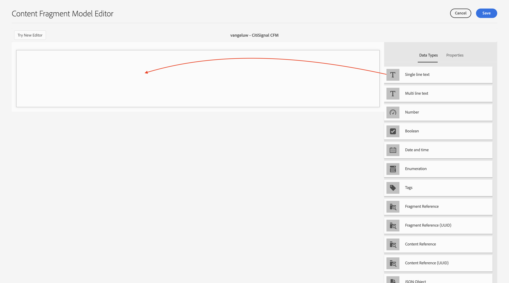
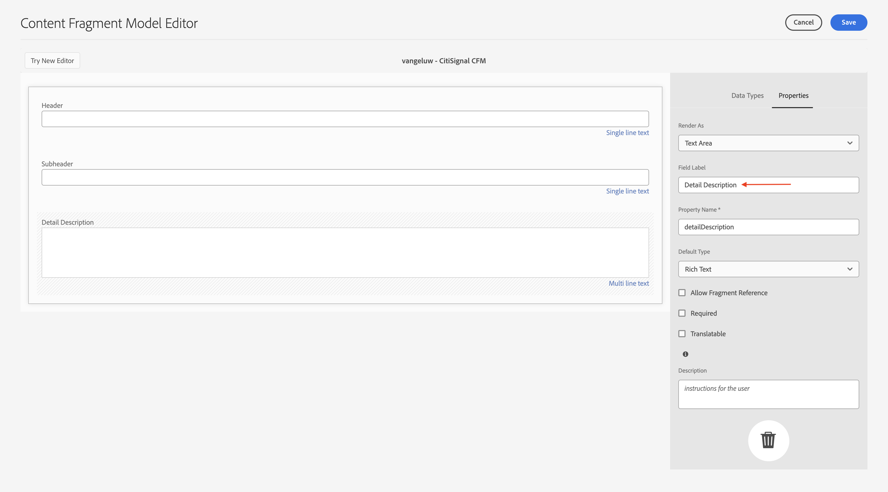
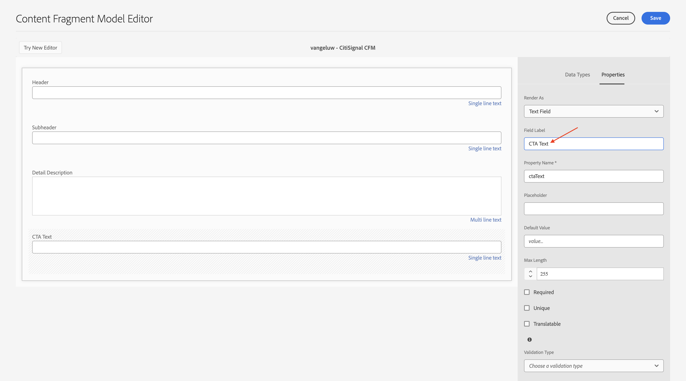
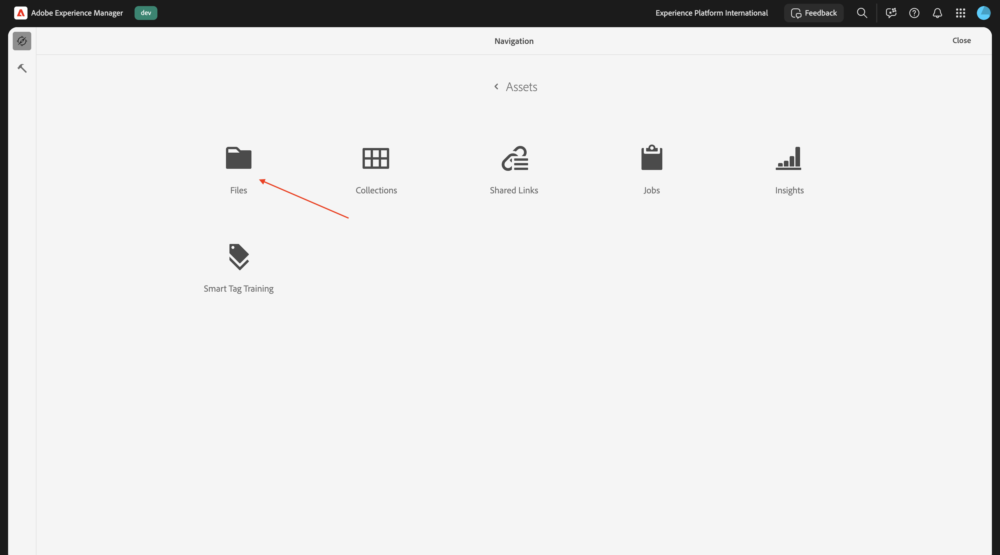
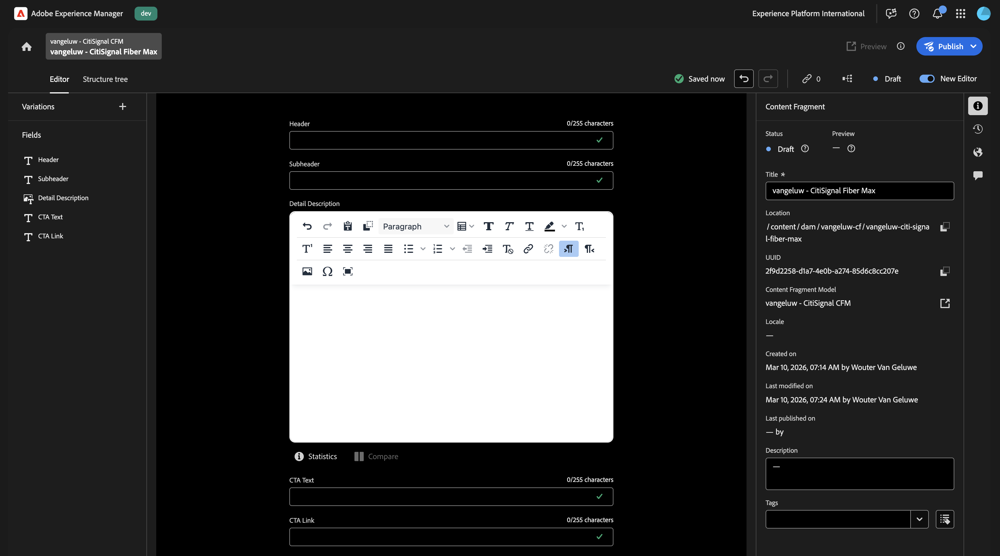
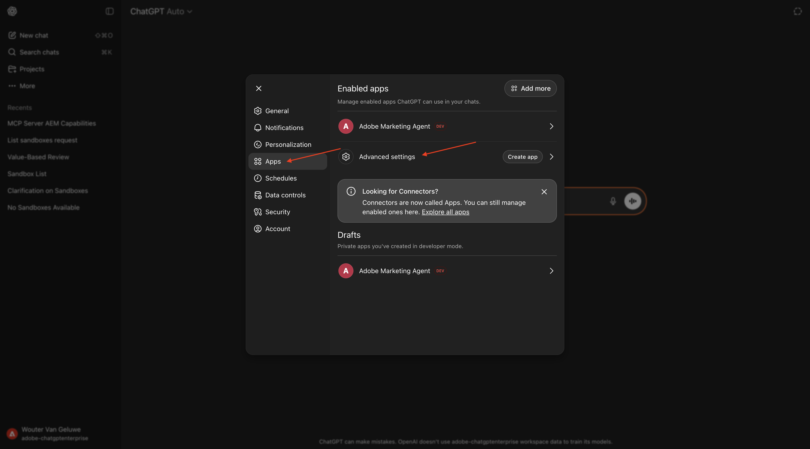
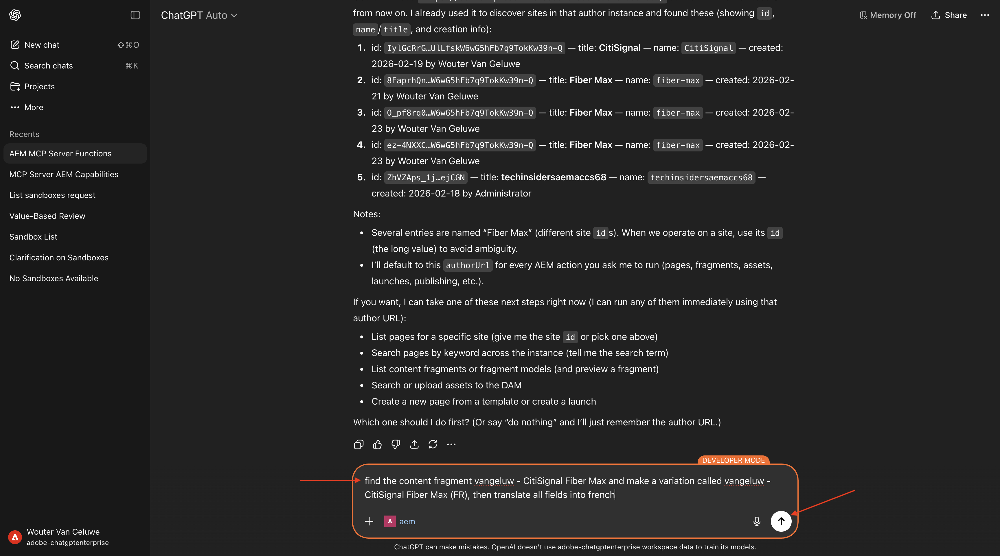

# 1.6.3 Escalar fragmentos de contenido con el servidor ChatGPT y MCP

>[!IMPORTANT]
>
>Para completar este ejercicio, debe tener acceso a un entorno de AEM Sites y Assets CS con EDS en funcionamiento, y los distintos agentes de AEM deben estar habilitados para la organización de IMS que utilice.
>
>Si aún no cuenta con ese entorno, vaya al ejercicio [Adobe Experience Manager Cloud Service &amp; Edge Delivery Services](./../../../modules/asset-mgmt/module2.1/aemcs.md){target="_blank"}. Siga las instrucciones allí y tendrá acceso a dicho entorno.

>[!IMPORTANT]
>
>Si ha configurado anteriormente un programa AEM CS con un entorno AEM Sites y Assets CS, es posible que la zona protegida de AEM CS haya estado en hibernación. Dado que la dehibernación de una zona protegida de este tipo tarda de 10 a 15 minutos, sería aconsejable iniciar el proceso de dehibernación ahora para que no tenga que esperar más adelante.

## 1.6.3.1 Crear modelo de fragmento de contenido

Vuelva a su entorno de Adobe Experience Manager Author, a **Herramientas** y luego vaya a **Explorador de configuración**.


Haga clic en **Crear**.


Use `Content Fragments` para los campos **Title** y **Name**.

Asegúrese de que las opciones **Modelos de fragmentos de contenido** y **Consultas persistentes de GraphQL** estén habilitadas.

Haga clic en **Crear**.


Vuelva al entorno de Adobe Experience Manager Author y luego vaya a **Fragmentos de contenido**.


Vaya a **Modelos de fragmentos de contenido**, seleccione su configuración **Fragmentos de contenido** y haga clic en **Crear**.


Use el nombre `--aepUserLdap-- - CitiSignal CFM`. Haz clic en **Crear y abrir**.


Entonces debería ver esto. Arrastre y suelte un campo **Texto de una sola línea** en el lienzo.



Cambie el campo **Etiqueta de campo** a `Header`.


Volver a **tipos de datos**. Arrastre y suelte un campo **Texto de una sola línea** en el lienzo.


Cambie el campo **Etiqueta de campo** a `Subheader`.


Volver a **tipos de datos**. Arrastre y suelte un campo **Texto multilínea** en el lienzo.


Cambie el campo **Etiqueta de campo** a `Detail Description`.



Volver a **tipos de datos**. Arrastre y suelte un campo **Texto de una sola línea** en el lienzo.


Cambie el campo **Etiqueta de campo** a `CTA Text`.



Volver a **tipos de datos**. Arrastre y suelte un campo **Texto de una sola línea** en el lienzo.


Cambie el campo **Etiqueta de campo** a `CTA Link`. Haga clic en **Guardar**.


Entonces debería ver esto.


Seleccione el modelo de fragmento de contenido y haga clic en **Publicar**.


Haga clic en **Publicar**.


## 1.6.3.2 Crear fragmento de contenido

Vuelva al entorno de Adobe Experience Manager Author y luego vaya a **Fragmentos de contenido**.


Entonces debería ver esto. Haga clic en **Crear** y luego seleccione **Carpeta**.


Escriba el título: `--aepUserLdap-- - CF`. Haga clic en **Crear**.


Regresa a tu entorno de Adobe Experience Manager Author y luego ve a **Assets**.


Ir a **Archivos**.



Seleccione la carpeta que acaba de crear, que debe tener el nombre `--aepUserLdap-- - CF` y haga clic en **Propiedades**.


Vaya a **Cloud Services** y haga clic en el icono **carpeta**.


Seleccione la configuración de nube que creó anteriormente, que debería llamarse **Fragmentos de contenido**. Haga clic en **Seleccionar**.


Entonces debería ver esto. Haga clic en **Guardar y cerrar**.


Vuelva al entorno de Adobe Experience Manager Author y luego vaya a **Fragmentos de contenido**.


Entonces debería ver esto. Haga clic en **Crear** y luego seleccione **Fragmento de contenido**.


Seleccione el **Modelo de fragmento de contenido** que creó anteriormente, con el nombre `--aepUserLdap-- - CitiSignal CFM`. Use el nombre `--aepUserLdap-- CitiSignal Fiber Max`.

Haz clic en **Crear y abrir**.


Entonces debería ver esto.



Rellene los campos de esta manera:

- **Encabezado**: `CitiSignal Fiber Max`
- **Subencabezado**: `Experience high speed internet now`
- **Descripción detallada**:

```
Experience the future of connectivity with CitiSignal Fiber Max, the ultimate solution for high-speed internet. Designed for homes and businesses that demand performance, Fiber Max delivers blazing-fast fiber speeds, ensuring seamless streaming, ultra-responsive gaming, and crystal-clear video calls.

Key Features:

Unmatched Speed: Enjoy lightning-fast downloads and uploads powered by cutting-edge fiber technology.
Reliable Performance: Consistent connectivity for work, entertainment, and everything in between.
Future-Ready: Built to handle the growing demands of smart homes and digital lifestyles.
Unlimited Potential: No data caps, no throttling—just pure speed.
Why Choose CitiSignal Fiber Max? Stay ahead with internet that works as hard as you do. Whether you’re powering a remote office or streaming in 4K, Fiber Max ensures you never miss a beat.
```

**Texto de CTA**: `Upgrade now by signing your new contract!`
**Vínculo de CTA**: `https://techinsiders68.adobedemosystem.com/`

Haga clic en **Publicar** y luego seleccione **Ahora**.


Haga clic en **Publicar**.


## 1.6.3.3 Configurar el servidor MCP en ChatGPT

>[!NOTE]
>
>El uso de Adobe Marketing Agent en ChatGPT requiere lo siguiente:
>- una versión de pago de ChatGPT Enterprise de OpenAI
>- uso del cliente web ChatGPT Enterprise

Vaya a [https://chatgpt.com/](https://chatgpt.com/){target="_blank"} e inicie sesión con los detalles de su cuenta. Una vez que haya iniciado sesión, debería ver esto. Haga clic en su nombre de usuario y seleccione **Configuración**.


Vaya a **Aplicaciones** y seleccione **Configuración avanzada**.



Active **Modo de desarrollador** y luego haga clic en **Atrás**.


Haga clic en **Crear aplicación**.


Rellene los campos de esta manera:

- **Nombre**: `aem`
- **URL del servidor MCP**: `https://mcp.adobeaemcloud.com/adobe/mcp/content`
- **Autenticación**: `OAuth`

Marque la casilla de verificación de **Entiendo y deseo continuar**.

Haga clic en **Crear**.


ChatGPT intentará conectarse a su cuenta de Adobe. Seleccione **Permitir acceso** y luego tendrá que iniciar sesión con su cuenta de Adobe.

Una vez que haya iniciado sesión correctamente, debería ver que su Adobe Marketing Agent ahora está conectado correctamente.


## 1.6.3.4: usar el servidor MCP de AEM en ChatGPT

Cierre esta ventana.


Entonces debería ver esto. Haga clic en el icono **+**, vaya a **Más** y luego seleccione **aem**.


Escriba la siguiente solicitud y haga clic en **Enviar**.

```
I just created a new custom mcp server named 'aem'. what can I do with that?
```


Entonces deberías ver algo como esto. Escriba la siguiente solicitud y haga clic en **Enviar**.

```
use the author url https://author-pXXXXXX-eXXXXXXX.adobeaemcloud.com/ from now on
```


Entonces deberías ver algo como esto. Escriba la siguiente solicitud y haga clic en **Enviar**.

```
find the content fragment --aepUserLdap-- - CitiSignal Fiber Max and make a variation called --aepUserLdap-- - CitiSignal Fiber Max (FR), then translate all fields into french
```



Haga clic en **Crear variación de fragmento**.


Haga clic en **Actualizar fragmento**.


Entonces debería ver esto. La variación del fragmento se ha creado correctamente.


Ahora también puede ver la nueva variación en la interfaz de usuario de AEM.


## Pasos siguientes

Volver a [AEM y agentes](./aemagents.md){target="_blank"}

[Volver a todos los módulos](./../../../overview.md){target="_blank"}