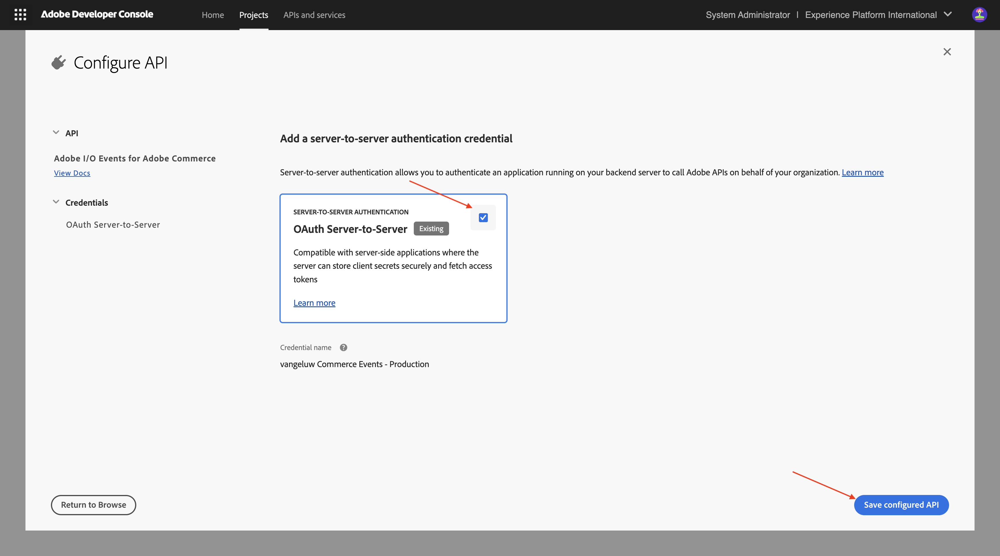
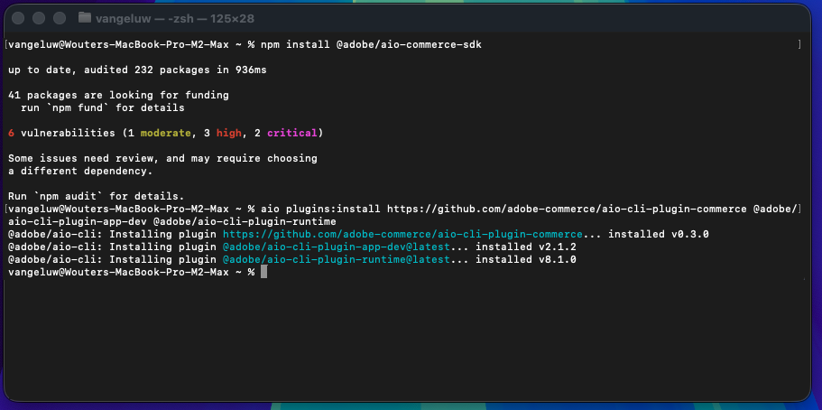

# 1.7.1 Configuración del entorno de desarrollo

## 1.7.1.1 Crear su proyecto de Adobe I/O

Vaya a [https://developer.adobe.com/console/home](https://developer.adobe.com/console/home){target="_blank"}.

Asegúrese de seleccionar la instancia correcta en la esquina superior derecha de la pantalla. Su instancia es `--aepImsOrgName--`.

>[!NOTE]
>
> La siguiente captura de pantalla muestra una organización específica seleccionada. Cuando vaya a través de este tutorial, es muy probable que su organización tenga un nombre diferente. Cuando se registró en este tutorial, se le proporcionaron los detalles del entorno que debe utilizar, siga esas instrucciones.

A continuación, seleccione **Crear proyecto a partir de la plantilla**.

Seleccione **App Builder**.

Escriba el nombre `--aepUserLdap-- vangeluw Commerce Events`. Haga clic en **Guardar**.

Entonces deberías ver algo como esto.

Haga clic en **+ Agregar servicio** y luego seleccione **API**.

Busque y seleccione la API **Eventos de E/S**. Haga clic en **Next**.

Cambie el nombre de la credencial a `vangeluw Commerce Events - Production`. Haga clic en **Guardar API configurada**.

Entonces debería ver esto. Haga clic en **+ Agregar servicio** y luego seleccione **API**.

Busque y seleccione la API **API de administración de E/S**. Haga clic en **Next**.

Haga clic en **Guardar API configurada**.

Entonces debería ver esto. Haga clic en **+ Agregar servicio** y luego seleccione **API**.

Busque y seleccione la API **Adobe Commerce as a Cloud Service**. Haga clic en **Next**.

Seleccione **Autenticación de servidor a servidor**. Haga clic en **Next**.

Haga clic en **Next**.

Seleccionar **Predeterminado - Cloud Manager**. Haga clic en **Guardar API configurada**.

Entonces debería ver esto. Haga clic en **+ Agregar servicio** y luego seleccione **API**.

Busque y seleccione la API **Adobe I/O Events for Adobe Commerce**. Haga clic en **Next**.

Haga clic en **Guardar API configurada**.

El proyecto ya está configurado y se puede utilizar.

## 1.7.1.2 Configurar su entorno de desarrollo

Para crear, enviar e implementar su aplicación extensible, su entorno de desarrollo local en su equipo debe tener instaladas las siguientes aplicaciones y paquetes:

- Node.js (versión 20.x o superior)
- npm (empaquetado con Node.js)
- Interfaz de línea de comandos (CLI) de Adobe Developer

Si estas aplicaciones o paquetes aún no están instalados en el equipo, siga estos pasos.

### Node.js y npm

Vaya a [https://nodejs.org/en/download](https://nodejs.org/en/download). Debería ver esto, con una serie de comandos de terminal que deben ejecutarse para tener instalados Node.js y npm. Los comandos que se muestran aquí son aplicables a MacBook.

En primer lugar, abra una nueva ventana de terminal. Pegue y ejecute el comando mencionado en la línea 2 de la captura de pantalla:

`curl -o- https://raw.githubusercontent.com/nvm-sh/nvm/v0.40.3/install.sh | bash`

A continuación, ejecute el comando en la línea 5 de la captura de pantalla:

`\. "$HOME/.nvm/nvm.sh"`

Después de ejecutar ambos comandos correctamente, ejecute este comando:

`node -v`

Debería ver el número de versión que se devuelve.

A continuación, ejecute este comando:

`npm -v`

Si NPM aún no está instalado, puede instalarlo con este comando: `npm install -g npm@11.9.0`.

Debería ver el número de versión que se devuelve.

Si los dos últimos comandos devolvieron correctamente un número de versión, la configuración de estas dos funciones se realizará correctamente.

### Interfaz de línea de comandos (CLI) de Adobe Developer

Para instalar la interfaz de línea de comandos (CLI) de Adobe Developer, ejecute el siguiente comando en una ventana de terminal:

`npm install -g @adobe/aio-cli`

La ejecución de este comando puede tardar un par de minutos. El resultado final debería ser similar al siguiente:

La interfaz de línea de comandos (CLI) de Adobe Developer ahora también se ha instalado correctamente.

### Extensión de SDK de la interfaz de línea de comandos (CLI) de Adobe Developer para Commerce

Para instalar la extensión de Adobe I/O SDK para Commerce, ejecute el siguiente comando en una ventana de terminal:

`npm install @adobe/aio-commerce-sdk`

### Complementos de Adobe Commerce para Adobe I/O CLI

Para instalar los complementos de Adobe Commerce para Adobe I/O CLI, ejecute el siguiente comando en una ventana de terminal:

`aio plugins:install https://github.com/adobe-commerce/aio-cli-plugin-commerce @adobe/aio-cli-plugin-app-dev @adobe/aio-cli-plugin-runtime`

Ahora ha configurado los elementos básicos para poder ejecutar un proyecto de App Builder en combinación con Adobe Commerce, Adobe I/O Events y Adobe I/O Runtime.

## Pasos siguientes

Vaya a [Usar Cursor.ai para desarrollar el proyecto](./ex2.md){target="_blank"}

Volver a [Herramientas inteligentes para desarrolladores para Adobe Commerce](./aiassisteddev.md){target="_blank"}

[Volver a todos los módulos](./../../../overview.md){target="_blank"}
