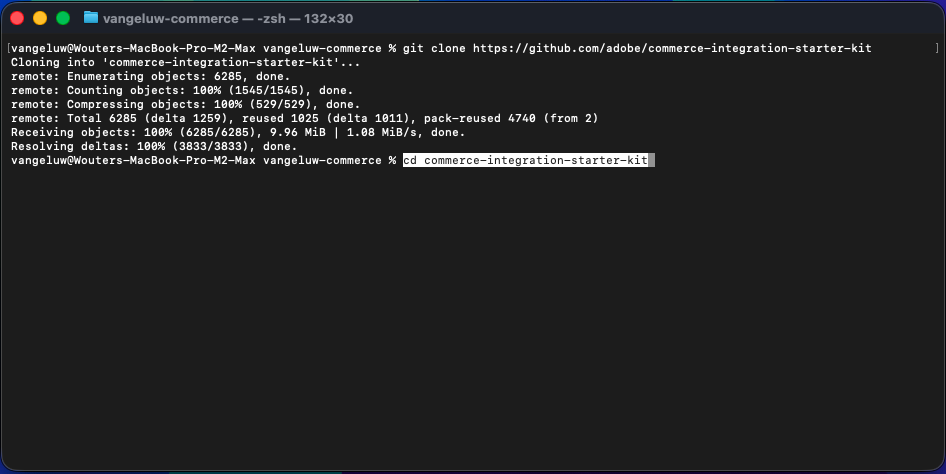
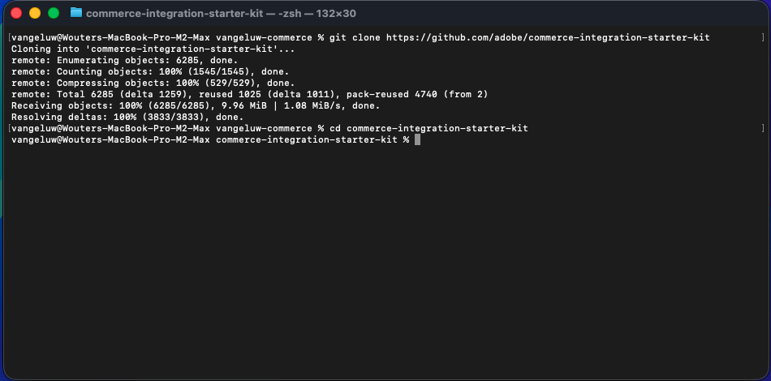
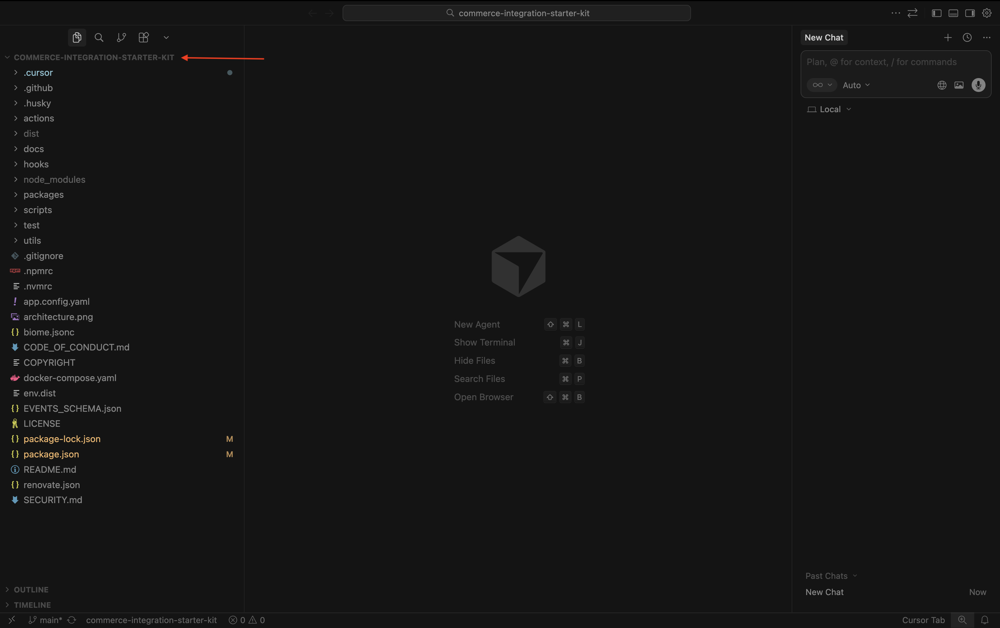

# 1.7.2 Use Cursor.ai para desarrollar su proyecto

## 1.7.2.1 Configurar el directorio y las herramientas

En el escritorio, cree un nuevo directorio con el nombre `--aepUserLdap---commerce`

Haga clic con el botón derecho en la carpeta y seleccione **Nuevo terminal en la carpeta**.

Entonces debería ver esto.

Ahora necesita clonar un repositorio de Github existente, que puede ver [https://github.com/adobe/commerce-integration-starter-kit](https://github.com/adobe/commerce-integration-starter-kit).

Este repositorio es el Starter Kit de Adobe que utiliza Adobe Developer App Builder para mejorar la fiabilidad de las conexiones en tiempo real y reducir el tiempo de salida al mercado de las integraciones entre Adobe Commerce y otros sistemas de back-office, como ERP, CRM y PIM.

Existen varias formas de clonar este repositorio; en este ejemplo se utiliza Terminal.

Introduzca el siguiente comando en la ventana de terminal y ejecútelo.

`git clone https://github.com/adobe/commerce-integration-starter-kit`

Después de un par de segundos, debería ver este resultado.

A continuación, debe navegar a la carpeta que acaba de crear. Introduzca el siguiente comando y, a continuación, ejecútelo.

`cd commerce-integration-starter-kit`

Entonces debería ver esto.

A continuación, debe configurar las herramientas de extensibilidad de Commerce para Cursor.ai. Introduzca el siguiente comando y, a continuación, ejecútelo.

`aio commerce extensibility tools-setup`

Seleccione **directorio actual**.

Seleccionar **Cursor**.

Seleccione **npm**.

Después de un par de minutos, deberías ver esto.

Al instalar las herramientas de extensibilidad de Commerce para Cursor.ai, ahora hay un servidor MCP disponible como parte del entorno Cursor.ai. En los próximos ejercicios, utilizará ese servidor MCP para ayudarle a desarrollar e implementar el proyecto del creador de aplicaciones.

## 1.7.2.2 Configurar su webhook

Para este ejercicio, necesitará un webhook que necesite configurarse para que cuando se cree un pedido, el evento de pedido se pueda transmitir a ese webhook. En este ejercicio, usará un extremo de ejemplo con [https://pipedream.com/requestbin](https://pipedream.com/requestbin).

Vaya a [https://pipedream.com/requestbin](https://pipedream.com/requestbin), cree una cuenta y luego un área de trabajo. Una vez creado el espacio de trabajo, verá algo similar a esto.

Haga clic en **copiar** para copiar la dirección URL. Deberá especificar esta dirección URL en el siguiente ejercicio. La dirección URL de este ejemplo es `https://eodts05snjmjz67.m.pipedream.net`.

## 1.7.2.3 Cursor.ai

Abrir Cursor.ai. Haga clic en **Abrir proyecto**.

Vaya a la carpeta que creó, que debería llamarse `--aepUserLdap---commerce`. En esa carpeta, seleccione la carpeta que se llama `commerce-integration-starter-kit`. Haga clic en **Abrir**.

Entonces debería ver esto. Antes de continuar, asegúrese de que la carpeta de nivel superior que se abre en Cursor.ai sea `commerce-integration-starter-kit`.

`I would like to build an app that subscribes to order created events and sends them to a configurable URL with basic authentication`

## Pasos siguientes

Volver a [Herramientas inteligentes para desarrolladores para Adobe Commerce](./aiassisteddev.md){target="_blank"}

[Volver a todos los módulos](./../../../overview.md){target="_blank"}