# 1.7.2 Use el cursor para desarrollar su proyecto

## 1.7.2.1 Configurar el directorio y las herramientas

En el escritorio, cree un nuevo directorio con el nombre `--aepUserLdap---commerce`

Haga clic con el botón derecho en la carpeta y seleccione **Nuevo terminal en la carpeta**.

Entonces debería ver esto.

Ahora necesita clonar un repositorio de Github existente, que puede ver [https://github.com/adobe/commerce-integration-starter-kit](https://github.com/adobe/commerce-integration-starter-kit).

Este repositorio es el Starter Kit de Adobe que utiliza Adobe Developer App Builder para mejorar la fiabilidad de las conexiones en tiempo real y reducir el tiempo de salida al mercado de las integraciones entre Adobe Commerce y otros sistemas de back-office, como ERP, CRM y PIM.

Existen varias formas de clonar este repositorio; en este ejemplo se utiliza Terminal.

Introduzca el siguiente comando en la ventana de terminal y ejecútelo.

`git clone https://github.com/adobe/commerce-integration-starter-kit`

Después de un par de segundos, debería ver este resultado.

A continuación, debe navegar a la carpeta que acaba de crear. Introduzca el siguiente comando y, a continuación, ejecútelo.

`cd commerce-integration-starter-kit`

Entonces debería ver esto.

A continuación, debe configurar las herramientas de extensibilidad de Commerce para Cursor. Introduzca el siguiente comando y, a continuación, ejecútelo.

`aio commerce extensibility tools-setup`

Seleccione **directorio actual**.

Seleccionar **Cursor**.

Seleccione **npm**.

Después de un par de minutos, deberías ver esto.

Al instalar las herramientas de extensibilidad de Commerce para Cursor, ahora hay un servidor MCP disponible como parte del entorno Cursor. En los próximos ejercicios, utilizará ese servidor MCP para ayudarle a desarrollar e implementar el proyecto del creador de aplicaciones.

## 1.7.2.2 Configurar su webhook

Para este ejercicio, necesitará un webhook que necesite configurarse para que cuando se cree un pedido, el evento de pedido se pueda transmitir a ese webhook. En este ejercicio, usará un extremo de ejemplo con [https://pipedream.com/requestbin](https://pipedream.com/requestbin).

Vaya a [https://pipedream.com/requestbin](https://pipedream.com/requestbin), cree una cuenta y luego un área de trabajo. Una vez creado el espacio de trabajo, verá algo similar a esto.

Haga clic en **copiar** para copiar la dirección URL. Deberá especificar esta dirección URL en el siguiente ejercicio. La dirección URL de este ejemplo es `https://eodts05snjmjz67.m.pipedream.net`.

## 1.7.2.3 Crear aplicación con cursor

Abra el cursor. Haga clic en **Abrir proyecto**.

Vaya a la carpeta que creó, que debería llamarse `--aepUserLdap---commerce`. En esa carpeta, seleccione la carpeta que se llama `commerce-integration-starter-kit`. Haga clic en **Abrir**.

Entonces debería ver esto. Antes de continuar, asegúrese de que la carpeta de nivel superior que se abre en el cursor es `commerce-integration-starter-kit`.

Utilice el método abreviado de teclado `Cmd + Shift + J` para abrir la configuración del cursor. Entonces debería ver esto. Vaya a **Herramientas y MCP**.

Habilite el servidor MCP **commerce-extensibility**. Una vez hecho esto, haga clic en **X** para cerrar la ventana.

Copie la siguiente solicitud y péguela en el cursor. A continuación, haga clic en el botón **enviar**.

`I would like to build an app that subscribes to order created events and sends them to a configurable URL with basic authentication`

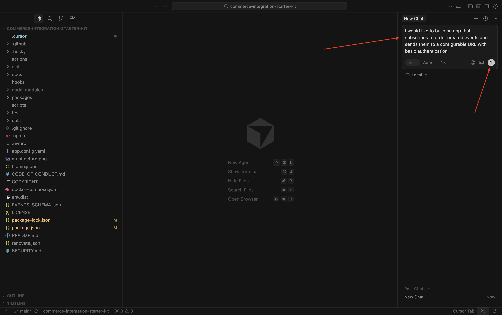

El cursor empezará a razonar y a ejecutarse. El cursor le pedirá confirmación un par de veces. Cuando esto suceda, haga clic en **Ejecutar**. Esto puede suceder de 5 a 10 veces, según el razonamiento y la configuración.

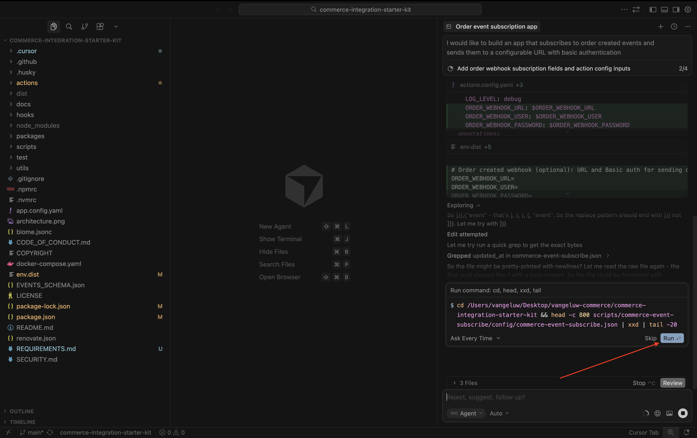

Después de un par de minutos, deberías ver algo así.

El siguiente paso, tal como lo indica Cursor, es crear un archivo con el nombre `.env` y proporcionar las variables necesarias.

## 1.7.2.4: cree su archivo .env

Seleccione el archivo **env.dist**. Escriba el comando `Cmd + C` y después el comando `Cmd + V`.

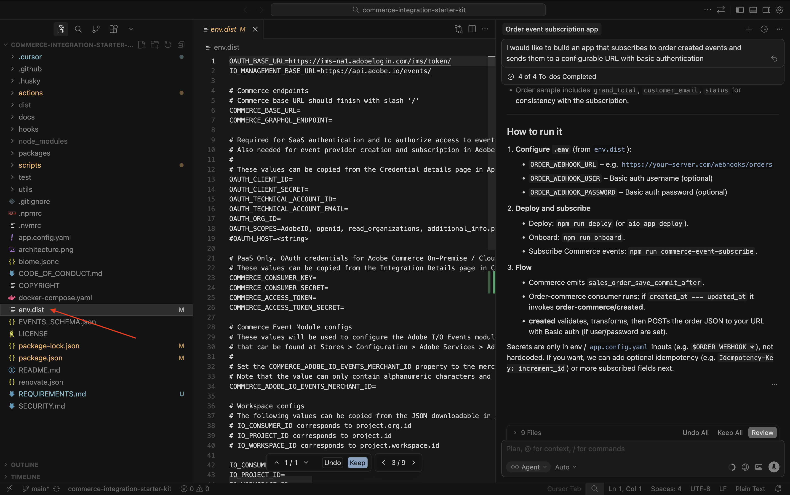

Cambie el nombre del archivo recién creado a `.env`.

A continuación, debe proporcionar los valores para todas las variables del archivo **.env**.

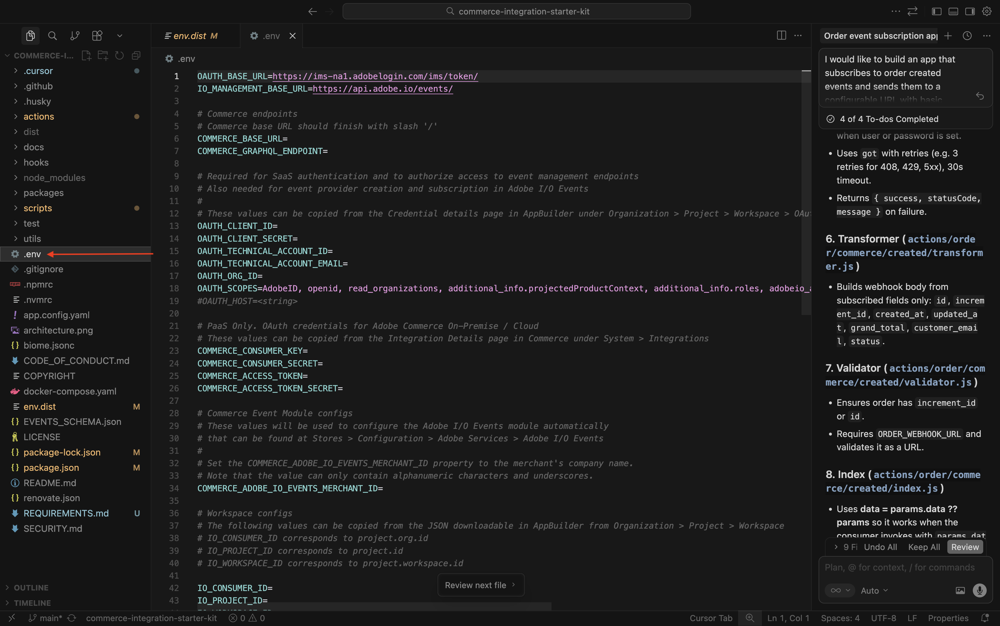

Aquí es donde puede encontrar toda la información necesaria.

### Extremos de Commerce

Puede encontrar estas variables en [https://experience.adobe.com](https://experience.adobe.com). Haga clic en **Commerce**.

Entonces debería ver esto. Haga clic en el icono **información** junto a su entorno ACCS, que debe llamarse `--aepUserLdap-- - ACCS`. Copie los valores del extremo REST y del extremo GraphQL.

En este ejemplo, estos son los valores que se van a copiar. Péguelas junto a las siguientes variables en el archivo **.env**, en las líneas 6 y 7.

- **COMMERCE_BASE_URL** = https://na1-sandbox.api.commerce.adobe.com/Lkp3U7tvTBNAmpFvwnZJ4B/
- **COMMERCE_GRAPHQL_ENDPOINT** = https://na1-sandbox.api.commerce.adobe.com/Lkp3U7tvTBNAmpFvwnZJ4B/graphql

Entonces debería tener esto en el archivo **.env**.

### Variables de proyecto de Adobe I/O

Puede encontrar estas variables en [https://developer.adobe.com/console](https://developer.adobe.com/console). Vaya a **Proyectos** y haga clic para abrir el proyecto de Adobe I/O que creó en el ejercicio anterior, que debería llamarse `--aepUserLdap-- Commerce Events`.

Ir a **Producción**.

Vaya a **OAuth Server-to-Server**. Entonces debería ver esto.

Copie los valores de los campos **ID de cliente**, **Secreto de cliente**, **ID de cuenta técnica**, **Correo electrónico de cuenta técnica** y **ID de organización** y péguelos junto a las siguientes variables en el archivo **.env** en las líneas 13-17.

- **OAUTH_CLIENT_ID**= **ID de cliente**
- **OAUTH_CLIENT_SECRET**= **Secreto de cliente**
- **OAUTH_TECHNICAL_ACCOUNT_ID**= **ID de cuenta técnica**
- **OAUTH_TECHNICAL_ACCOUNT_EMAIL**= **Correo electrónico de cuenta técnica**
- **OAUTH_ORG_ID**= **ID de organización**

Entonces debería tener esto en el archivo **.env**.

### COMMERCE_ADOBE_IO_EVENTS_MERCHANT_ID

Para el campo **COMMERCE_ADOBE_IO_EVENTS_MERCHANT_ID=**, escriba el valor `--aepUserLdap--_commerce_events` en la línea 34 del archivo **.env**.

Entonces debería tener esto en el archivo **.env**.

### Configuraciones de Workspace

Para recuperar estas variables, vuelva al proyecto de Adobe I/O y haga clic en **Información general de Workspace**.

Después de ir a la **descripción general de Workspace**, eche un vistazo a la dirección URL, que debería tener este aspecto: **https://developer.adobe.com/console/projects/133309/4566206088345586770/workspaces/4566206088345619105/details**.

El primer número de este ejemplo, 133309, es el valor que se va a usar para el campo **IO_CONSUMER_ID**.
El segundo número de este ejemplo, 4566206088345586770, es el valor que se va a utilizar para el campo **IO_PROJECT_ID**.
El tercer número de este ejemplo, 4566206088345619105, es el valor que se debe usar para el campo **IO_WORKSPACE_ID**.

- **IO_CONSUMER_ID**= 133309
- **IO_PROJECT_ID**= 4566206088345586770
- **IO_WORKSPACE_ID**= 4566206088345619105

Copie estos valores y péguelos junto a las siguientes variables en el archivo **.env**, en las líneas 42-44.

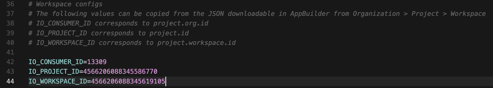

### EVENT_PREFIX

Para el campo **EVENT_PREFIX =**, escriba el valor `--aepUserLdap--_` en la línea 47 del archivo **.env**.

Entonces debería tener esto en el archivo **.env**.

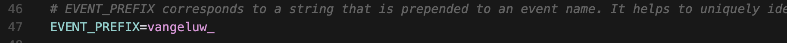

### Webhook

Para el campo **ORDER_WEBHOOK_URL**, debe pegar la dirección URL del webhook que creó anteriormente en este ejercicio, que debería tener este aspecto: `https://eodts05snjmjz67.m.pipedream.net`.

Entonces debería tener esto en el archivo **.env**.

### Credenciales de App Builder

Debe actualizar las siguientes variables en el archivo **.env** en las líneas 54-55:

- **AIO_RUNTIME_NAMESPACE**=
- **AIO_RUNTIME_AUTH**=

Puede recuperar los valores de estas variables volviendo al proyecto de Adobe I/O. Vaya a **Información general de Workspace** y haga clic en **Descargar todo**.

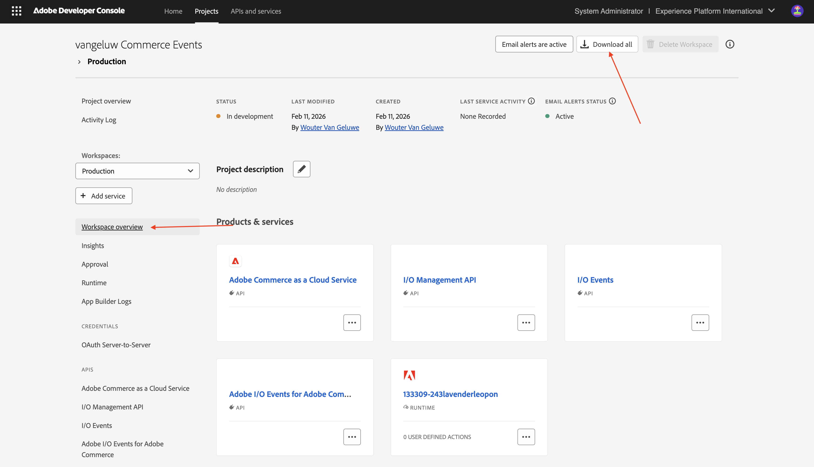

A continuación, se descargará un archivo como este. Abra ese archivo con un editor de texto.

Desplácese hacia la derecha hasta que vea **runtime**. Debería ver el campo **name**, que contiene el valor de **AIO_RUNTIME_NAMESPACE**.

Desplácese más hacia la derecha hasta que vea **auth**, que contiene el valor de **AIO_RUNTIME_AUTH**.

Pegue ambos valores en el archivo **.env** en las líneas 54-55, debería tener esto.

El archivo **.env** está ahora completamente configurado.

## 1.7.2.5 workspace.json

En el paso anterior descargó un archivo como este desde el proyecto de Adobe I/O.

Cambie el nombre de ese archivo y use el nombre `workspace.json`.

Copie el archivo en el directorio **scripts**>**incorporación**>**config**.

## 1.7.2.6 inicio de sesión en Adobe I/O

Vuelva a la ventana de terminal que había utilizado anteriormente. Escriba el comando `aio login`.

Debería ver esto después de iniciar sesión en el explorador.

## 1.7.2.7 está listo para implementarse

Copie la siguiente solicitud y péguela en el cursor. A continuación, haga clic en el botón **enviar**.

`Please deploy this code to Adobe I/O`

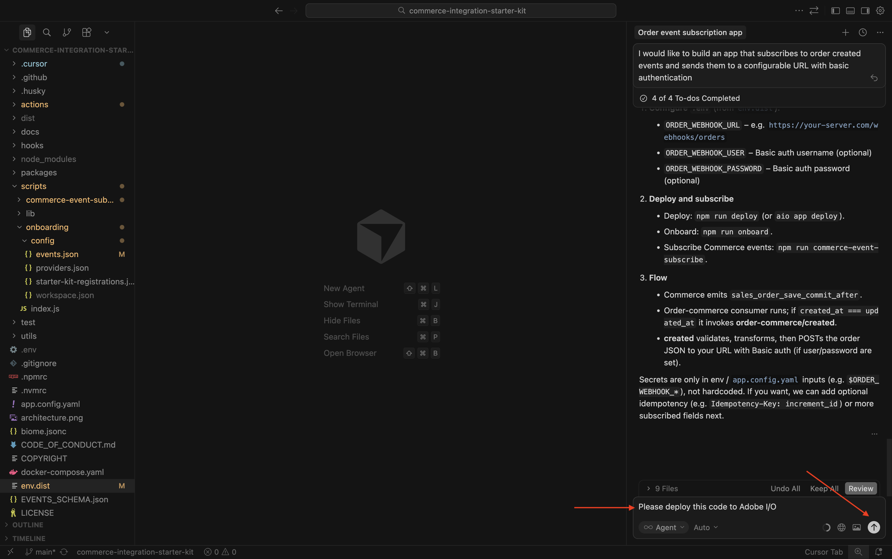

Haga clic en **Ejecutar** para permitir la acción. El cursor puede pedirle varias veces que confirme una acción.

La implementación finalizará después de un par de minutos.

Copie la siguiente solicitud y péguela en el cursor. A continuación, haga clic en el botón **enviar**.

`run the onboarding to commerce`

Después de un par de minutos, deberías ver esto.

Copie la siguiente solicitud y péguela en el cursor. A continuación, haga clic en el botón **enviar**.

`subscribe to commerce events`

Después de un par de minutos, deberías ver esto.

## 1.7.2.8 Verificar configuración en Adobe Commerce as a Cloud Service

Vaya a [https://experience.adobe.com](https://experience.adobe.com). Haga clic en **Commerce**.

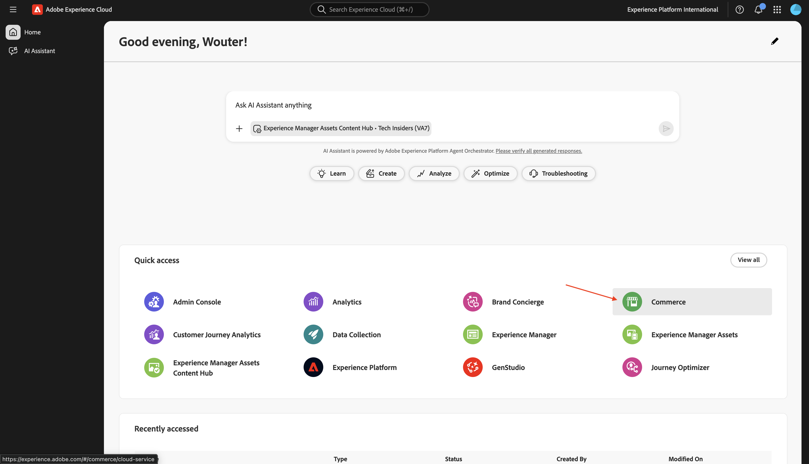

Haga clic en el entorno de as a Cloud Service de Adobe Commerce para abrirlo y, a continuación, iniciar sesión.

Vaya a **Sistema** y luego a **Suscripciones de eventos**.

Debería ver esta lista de suscripciones a eventos.

Vaya a **Tiendas** y luego a **Configuración**.

Vaya a **Servicios de Adobe** y seleccione **Adobe I/O Events**. Debería ver que el campo **Configuración de Adobe I/O Workspace** tiene un valor de un par de asteriscos y que el campo **ID de comerciante** también debe tener un valor como `--aepUserLdap--_commerce_events`.

Con esta configuración configurada, ahora puede probar la configuración de.

## 1.7.2.9 Probar el escenario

Abra el sitio web.

Vaya a **Relojes** y haga clic en cualquier producto.

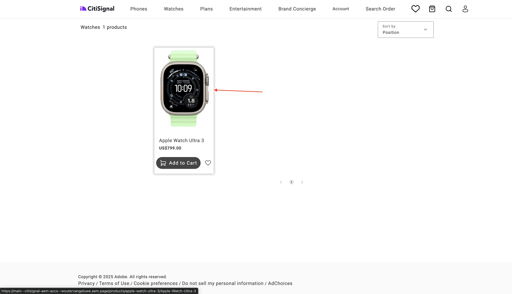

Configure el producto y haga clic en **Agregar al carro**.

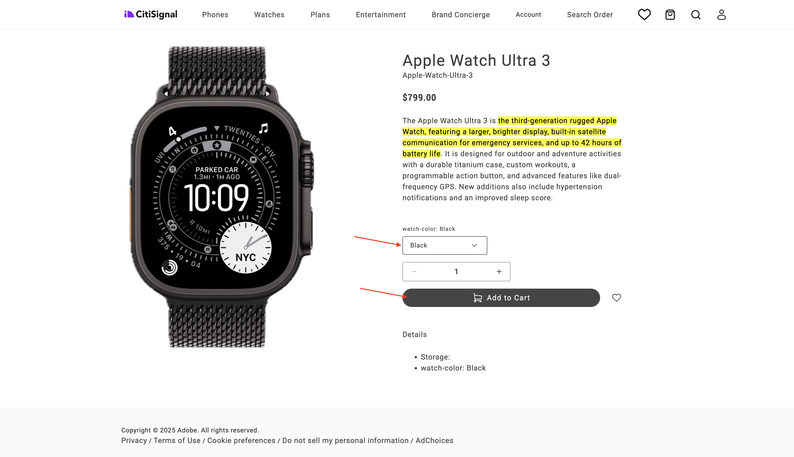

Haga clic en el icono **Carro** y seleccione **Finalizar compra**.

Complete sus datos y haga clic en **Realizar pedido**.

A continuación, debería ver una confirmación de pedido.

Cambie a la aplicación de webhook. Ahora debería ver un evento entrante para el pedido que acaba de confirmarse.

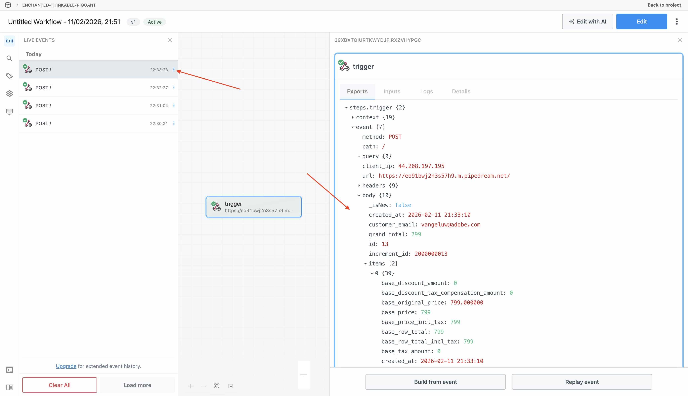

## 1.7.2.10 depuración de Adobe I/O

Vuelva al proyecto de Adobe I/O. Vaya a **Información general de Workspace**. Debería ver algo similar a esto. Desplácese un poco hacia abajo.

Haga clic para abrir **Commerce Order Sync**.

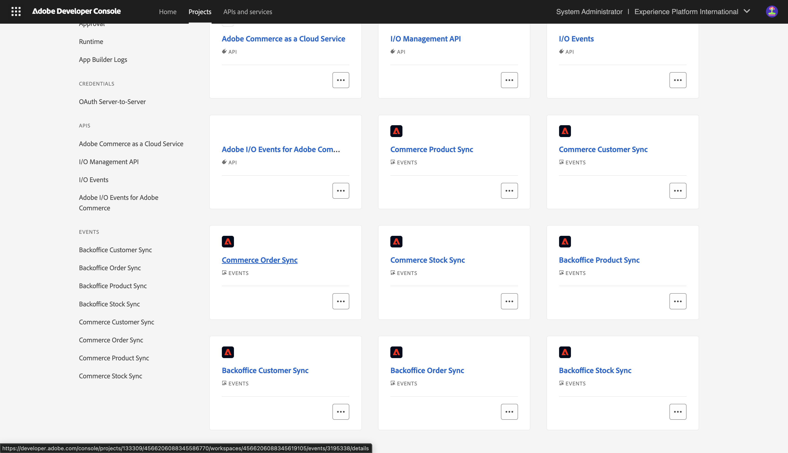

Ir a **Seguimiento de depuración**. Puede encontrar los últimos eventos entrantes allí, junto con su carga útil. Esto resulta útil para comprender qué eventos se han procesado y si se han procesado correctamente.

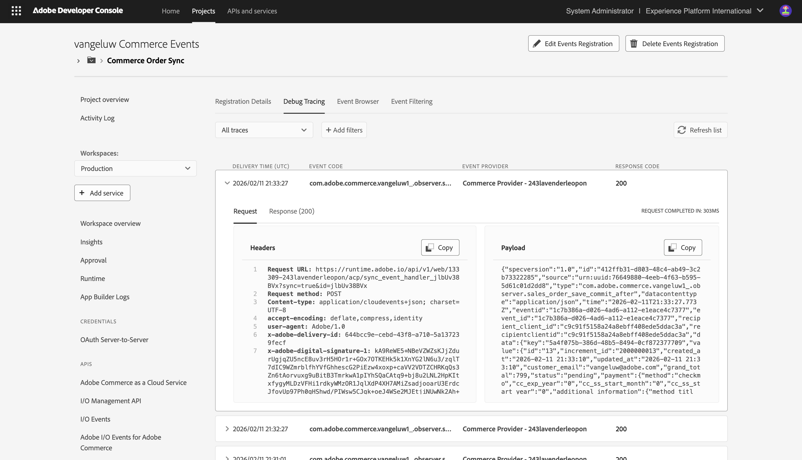

## Pasos siguientes

Volver a [Herramientas inteligentes para desarrolladores para Adobe Commerce](./aiassisteddev.md){target="_blank"}

[Volver a todos los módulos](./../../../overview.md){target="_blank"}
