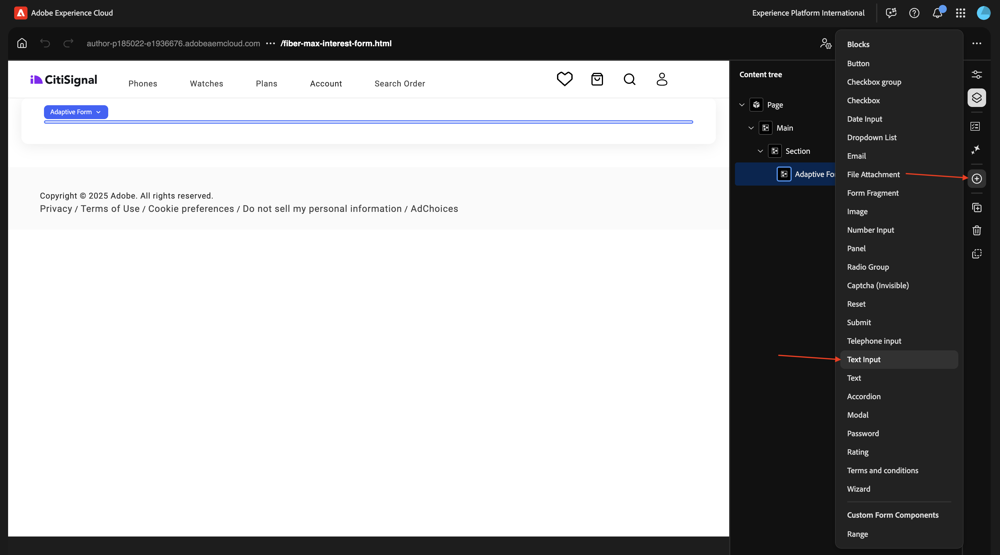
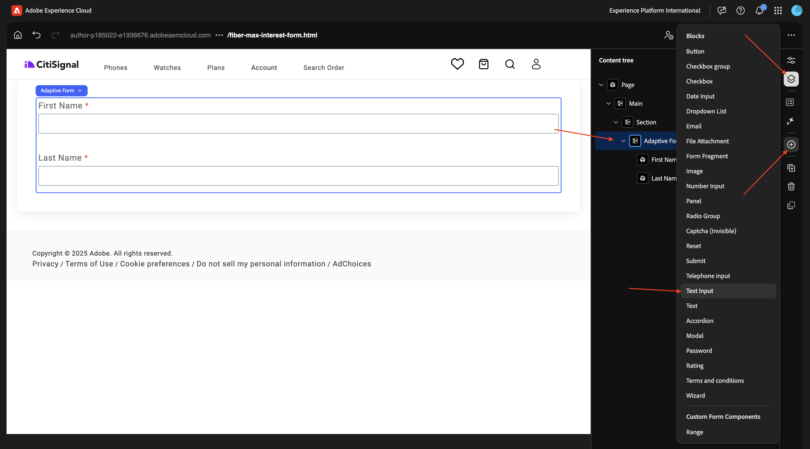
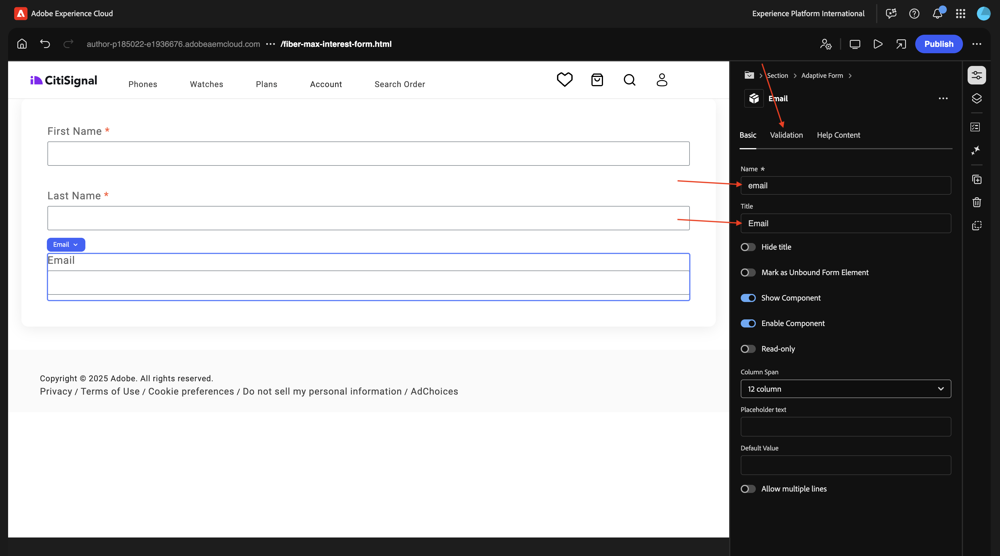
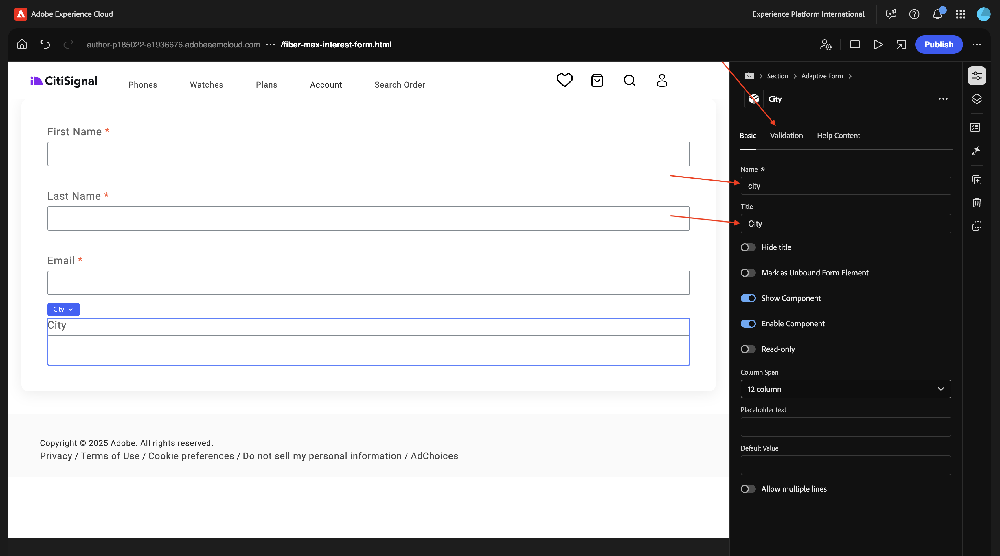

# 1.3.1 Creación de su primer formulario

>[!IMPORTANT]
>
>Para completar este ejercicio, debe tener acceso a un entorno de trabajo de AEM Assets CS Author con AEM Assets y Dynamic Media habilitados.
>
>Si no tiene ese entorno, vaya a [Adobe Experience Manager Cloud Service &amp; Edge Delivery Services](./../../../modules/asset-mgmt/module2.1/aemcs.md){target="_blank"}. Siga las instrucciones allí y tendrá acceso a dicho entorno.

>[!IMPORTANT]
>
>Si ha configurado anteriormente un programa AEM CS con un entorno de AEM Assets CS, es posible que la zona protegida de AEM CS esté en hibernación. Dado que la dehibernación de una zona protegida de este tipo tarda de 10 a 15 minutos, sería aconsejable iniciar el proceso de dehibernación ahora para que no tenga que esperar más adelante.

## 1.3.1.1 -

Vaya a [https://my.cloudmanager.adobe.com](https://my.cloudmanager.adobe.com){target="_blank"}. La organización que debe seleccionar es `--aepImsOrgName--`. Abra su entorno.

Ir a **Forms**.

Ir a **Forms y documentos**.

Haga clic en **Crear** y luego seleccione **Formulario adaptable**.

Seleccione **Edge Delivery Services** y luego **Página en blanco**. Haga clic en **Crear**.

Entonces debería ver esto. Rellene los campos siguientes:

- **Título**: `Fiber Max Interest Form`
- **Nombre**: debe rellenarse automáticamente en función del campo **Título**.
- **URL de Github**: proporcione la ruta al repositorio de Github vinculado a su sitio web

Haga clic en **Crear**.

Después de hacer clic en **Crear**, el **Editor universal** debería abrirse automáticamente y debería ver algo parecido a esto. Haga clic en el icono para abrir el **Árbol de contenido**.

En el **Árbol de contenido**, seleccione el objeto **Formulario adaptable**.

A continuación, haga clic en el icono **+** para agregar un elemento nuevo y seleccione **Entrada de texto**.

En el **Árbol de contenido**, seleccione el campo **Entrada de texto**.

Vaya a la vista **Básico**. Deberías ver esto.

Rellene los campos siguientes:

- **Nombre**: `first-name`
- **Título**: `First Name`

A continuación, vaya a **Validación**.

Gire el interruptor para que este sea un campo obligatorio. Rellene los campos siguientes:

- **Mensaje de error**: `Enter your first name`
- **Patrón**: `[A-Za-z][A-Za-z ]+`
- **Mensaje de error de patrón**: `Letters only!`

En el **Árbol de contenido**, seleccione el campo **Formulario adaptable**. Haga clic en el icono **+** y, a continuación, seleccione **Entrada de texto**.

En el **Árbol de contenido**, seleccione el campo recién creado **Entrada de texto**. Ir a **Propiedades**.

Vaya a la vista **Básico**. Deberías ver esto.

Rellene los campos siguientes:

- **Nombre**: `last-name`
- **Título**: `Last Name`

A continuación, vaya a **Validación**.

Gire el interruptor para que este sea un campo obligatorio. Rellene los campos siguientes:

- **Mensaje de error**: `Enter your last name`
- **Patrón**: `[A-Za-z][A-Za-z ]+`
- **Mensaje de error de patrón**: `Letters only!`

En el **Árbol de contenido**, seleccione el campo **Formulario adaptable**. Haga clic en el icono **+** y, a continuación, seleccione **Entrada de texto**.

En el **Árbol de contenido**, seleccione el campo recién creado **Entrada de texto**. Ir a **Propiedades**.

Vaya a la vista **Básico**. Deberías ver esto.

Rellene los campos siguientes:

- **Nombre**: `email`
- **Título**: `Email`

A continuación, vaya a **Validación**.

Gire el interruptor para que este sea un campo obligatorio. Rellene los campos siguientes:

- **Mensaje de error**: `Enter your email address`
- **Patrón**: `^[^@]+@[^@]+\.[^@]+$`
- **Mensaje de error de patrón**: `Please verify your email address!`

En el **Árbol de contenido**, seleccione el campo **Formulario adaptable**. Haga clic en el icono **+** y, a continuación, seleccione **Entrada de texto**.

En el **Árbol de contenido**, seleccione el campo recién creado **Entrada de texto**.

Vaya a la vista **Básico**. Deberías ver esto.

Rellene los campos siguientes:

- **Nombre**: `city`
- **Título**: `city`

A continuación, vaya a **Validación**.

Gire el interruptor para que este sea un campo obligatorio. Rellene los campos siguientes:

- **Mensaje de error**: `Enter your city`
- **Patrón**: `[A-Za-z][A-Za-z ]+`
- **Mensaje de error de patrón**: `Letters only!`

Haga clic en **Publicar**.

Vuelva a hacer clic en **Publicar**.

Haga clic en para abrir el formulario.

A continuación, puede rellenar el formulario, pero aún no lo puede enviar.

## Pasos siguientes

Paso siguiente: [-](./ex1.md){target="_blank"}

Volver a [Adobe Experience Manager Forms con Edge Delivery Services](./aemforms.md){target="_blank"}

[Volver a todos los módulos](./../../../overview.md){target="_blank"}
