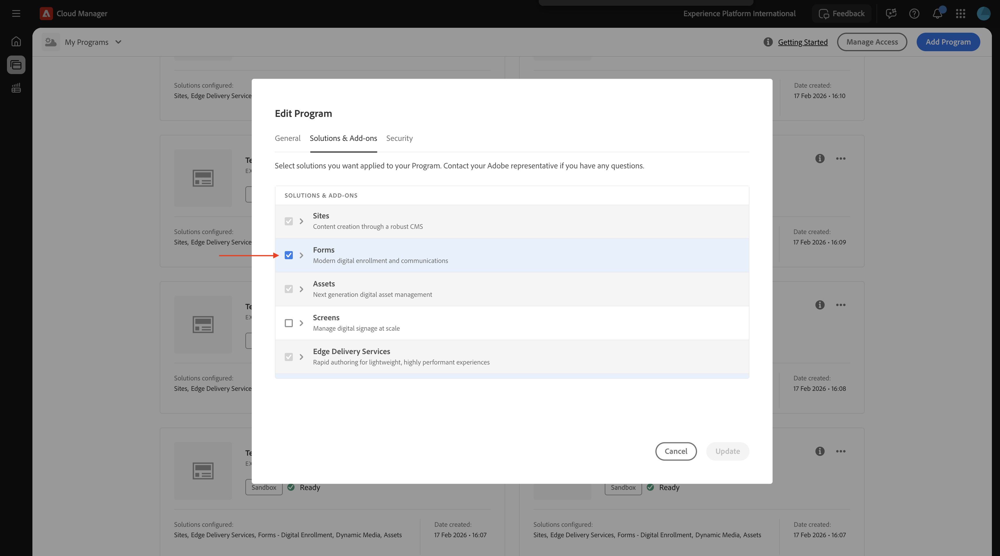
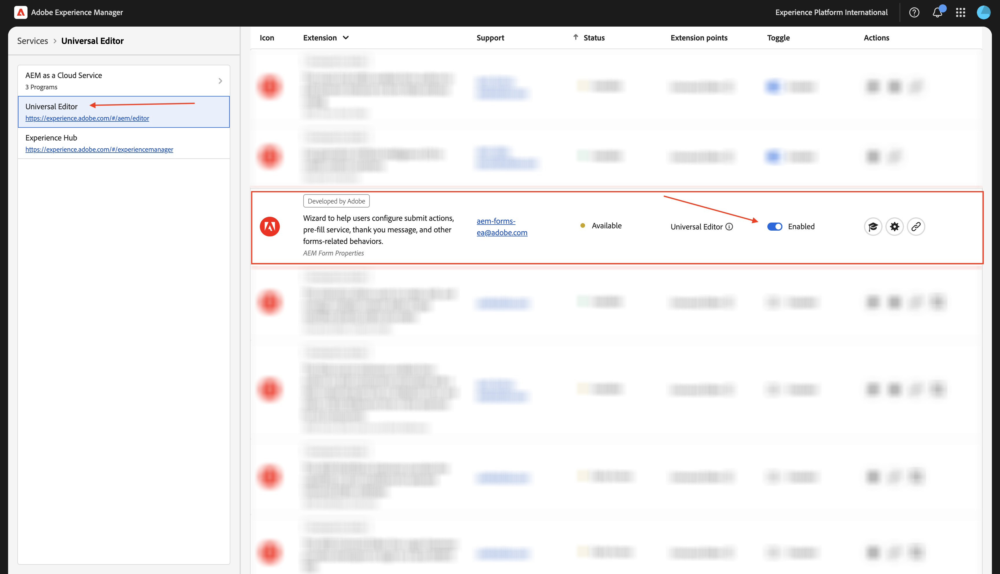
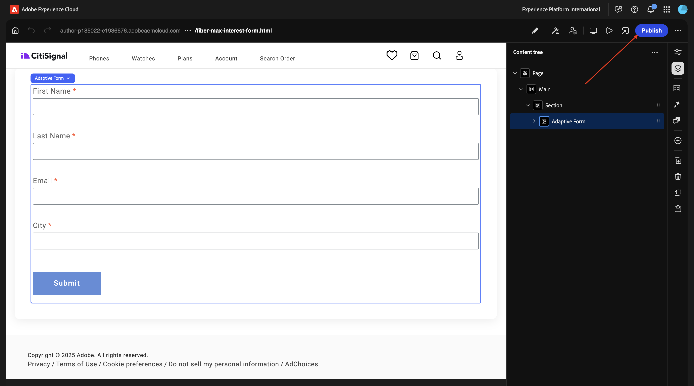
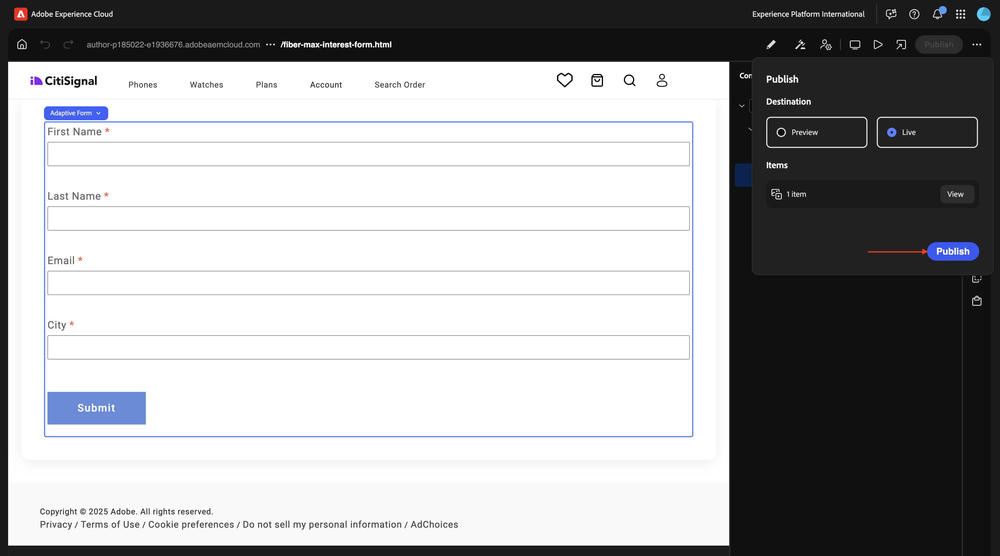

# 1.3.1 Creación de su primer formulario

>[!IMPORTANT]
>
>Para completar este ejercicio, debe tener acceso a un entorno de trabajo de AEM Assets CS Author con AEM Assets y Dynamic Media habilitados.
>
>Si no tiene ese entorno, vaya a [Adobe Experience Manager Cloud Service &amp; Edge Delivery Services](./../../../modules/asset-mgmt/module2.1/aemcs.md){target="_blank"}. Siga las instrucciones allí y tendrá acceso a dicho entorno.

>[!IMPORTANT]
>
>Si ha configurado anteriormente un programa AEM CS con un entorno de AEM Assets CS, es posible que la zona protegida de AEM CS esté en hibernación. Dado que la dehibernación de una zona protegida de este tipo tarda de 10 a 15 minutos, sería aconsejable iniciar el proceso de dehibernación ahora para que no tenga que esperar más adelante.

## 1.3.1.1 requisitos de entorno para usar AEM Forms con Edge Delivery Services

Antes de configurar el primer formulario, existen varios requisitos que deben cumplirse para poder seguir los pasos siguientes.

### Configuración del programa

En las **soluciones y complementos** de su programa Cloud Manager, **Forms** debe estar habilitado.



### bloques

En su repositorio de Github, debe tener disponibles los siguientes bloques:

- **formulario**
- **incrustar-formulario-adaptable**


### scripts

En el repositorio de Github, debe tener disponibles los siguientes scripts:

- **form-editor-support.css**
- **form-editor-support.js**


Además, en el archivo **editor-support.js**, es necesario realizar los siguientes cambios para habilitar la edición de formularios en el Editor universal.

- cambiar declaración de función de **function attachmentEventListners(main)** a **función asincrónica attachEventListners(main)**
- añada las líneas 152 y 153:

```
const module = await import('./form-editor-support.js');
module.attachEventListners(main);
```


Además, en el archivo **editor-support.js**, cambie las líneas 90-92 de esta manera:

```
if (block.dataset.aueModel === 'form') {
        return true;
      } else if (newBlock) {
```


### paths.json

Compruebe la configuración de su repositorio de Github, específicamente en el archivo **paths.json**. Estas líneas deben estar presentes en el archivo:

- En asignaciones: **&quot;/content/forms/af/:/forms/&quot;**
- En incluye: **&quot;/content/forms/af/&quot;**

```json
{
  "mappings": [
    "/content/CitiSignal/:/",
    "/content/CitiSignal/configuration:/.helix/config.json",
    "/content/CitiSignal/headers:/.helix/headers.json",
    "/content/CitiSignal/metadata:/metadata.json",
    "/content/CitiSignal.resource/enrichment/enrichment.json:/enrichment/enrichment.json",
    "/content/forms/af/:/forms/"
  ],
  "includes": [
    "/content/CitiSignal/",
    "/content/forms/af/"
  ]
}
```


Una vez cumplidos estos requisitos, puede crear su primer formulario.

## 1.3.1.2 Crear formulario

Vaya a [https://my.cloudmanager.adobe.com](https://my.cloudmanager.adobe.com){target="_blank"}. La organización que debe seleccionar es `--aepImsOrgName--`. Abra su entorno.


Ir a **Forms**.


Ir a **Forms y documentos**.


Haga clic en **Crear** y luego seleccione **Formulario adaptable**.


Seleccione **Edge Delivery Services** y luego **Página en blanco**. Haga clic en **Crear**.


Entonces debería ver esto. Rellene los campos siguientes:

- **Título**: `Fiber Max Interest Form`
- **Nombre**: debe rellenarse automáticamente en función del campo **Título**.
- **URL de Github**: proporcione la ruta al repositorio de Github vinculado a su sitio web

Haga clic en **Crear**.


Después de hacer clic en **Crear**, el **Editor universal** debería abrirse automáticamente y debería ver algo parecido a esto. Haga clic en el icono para abrir el **Árbol de contenido**.


En el **Árbol de contenido**, seleccione el objeto **Formulario adaptable**.


A continuación, haga clic en el icono **+** para agregar un elemento nuevo y seleccione **Entrada de texto**.


En el **Árbol de contenido**, seleccione el campo **Entrada de texto**.


Vaya a la vista **Básico**. Deberías ver esto.

Rellene los campos siguientes:

- **Nombre**: `first-name`
- **Título**: `First Name`

A continuación, vaya a **Validación**.


Gire el interruptor para que este sea un campo obligatorio. Rellene los campos siguientes:

- **Mensaje de error**: `Enter your first name`
- **Patrón**: `[A-Za-z][A-Za-z ]+`
- **Mensaje de error de patrón**: `Letters only!`


En el **Árbol de contenido**, seleccione el campo **Formulario adaptable**. Haga clic en el icono **+** y, a continuación, seleccione **Entrada de texto**.


En el **Árbol de contenido**, seleccione el campo recién creado **Entrada de texto**. Ir a **Propiedades**.


Vaya a la vista **Básico**. Deberías ver esto.

Rellene los campos siguientes:

- **Nombre**: `last-name`
- **Título**: `Last Name`

A continuación, vaya a **Validación**.


Gire el interruptor para que este sea un campo obligatorio. Rellene los campos siguientes:

- **Mensaje de error**: `Enter your last name`
- **Patrón**: `[A-Za-z][A-Za-z ]+`
- **Mensaje de error de patrón**: `Letters only!`


En el **Árbol de contenido**, seleccione el campo **Formulario adaptable**. Haga clic en el icono **+** y, a continuación, seleccione **Entrada de texto**.


En el **Árbol de contenido**, seleccione el campo recién creado **Entrada de texto**. Ir a **Propiedades**.


Vaya a la vista **Básico**. Deberías ver esto.

Rellene los campos siguientes:

- **Nombre**: `email`
- **Título**: `Email`

A continuación, vaya a **Validación**.


Gire el interruptor para que este sea un campo obligatorio. Rellene los campos siguientes:

- **Mensaje de error**: `Enter your email address`
- **Patrón**: `^[^@]+@[^@]+\.[^@]+$`
- **Mensaje de error de patrón**: `Please verify your email address!`


En el **Árbol de contenido**, seleccione el campo **Formulario adaptable**. Haga clic en el icono **+** y, a continuación, seleccione **Entrada de texto**.


En el **Árbol de contenido**, seleccione el campo recién creado **Entrada de texto**.


Vaya a la vista **Básico**. Deberías ver esto.

Rellene los campos siguientes:

- **Nombre**: `city`
- **Título**: `city`

A continuación, vaya a **Validación**.


Gire el interruptor para que este sea un campo obligatorio. Rellene los campos siguientes:

- **Mensaje de error**: `Enter your city`
- **Patrón**: `[A-Za-z][A-Za-z ]+`
- **Mensaje de error de patrón**: `Letters only!`


Haga clic en **Publicar**.


Vuelva a hacer clic en **Publicar**.


Haga clic en para abrir el formulario.


A continuación, puede rellenar el formulario, pero aún no lo puede enviar.


Después de publicar el formulario, ahora también está disponible en el dominio de Edge Delivery Services, que tiene este aspecto:

`https://main--techinsidersXX-citisignal-aem-accs--woutervangeluwe.aem.page/forms/fiber-max-interest-form`


## 1.3.1.3 Enviar formulario

Para enviar el formulario, se requieren dos cosas:

- un botón **Enviar**
- una acción **Enviar**

Además, en este ejercicio debe utilizar una hoja de cálculo de Google para registrar los envíos de este formulario.

### hoja de cálculo de Google

Vaya a [https://drive.google.com](https://drive.google.com) y cree una nueva hoja de cálculo en blanco.


Asigne un nombre al archivo `citisignal-fiber-max-interest`.

En la línea 1, en las celdas A-B-C-D, introduzca los siguientes nombres de campo:

- nombre
- apellido
- correo electrónico
- ciudad

A continuación, haga clic en **Compartir**.


Comparta el archivo con **forms@adobe.com** con derechos de acceso de nivel **Editor**.

A continuación, haga clic en **Copiar vínculo**.

Haga clic en **Enviar**.


Deberá utilizar el vínculo copiado en el siguiente paso.

### Botón Enviar

Para configurar el botón **Enviar**, ve a **Árbol de contenido**, selecciona **Formulario adaptable**, haz clic en el icono **+** y, a continuación, selecciona **Enviar**.


Entonces debería ver esto.


### Acción de envío

Las acciones de envío forman parte de una extensión para el editor universal.

>[!NOTE]
>
>Si no ve el icono **Editar propiedades del formulario**, significa que esta extensión aún no está habilitada para su entorno. Para habilitar esta extensión, vaya a [https://experience.adobe.com/#/aem/extension-manager](https://experience.adobe.com/#/aem/extension-manager) y habilite la extensión **Editar propiedades del formulario**.
>
>

Haga clic en el icono **Editar propiedades del formulario**.


Seleccione **Enviar a hoja de cálculo**. Pegue la dirección URL de la hoja de Google que creó anteriormente.

Haga clic en **Guardar y cerrar**.


>[!NOTE]
>
>Si recibe un error 401 - No autorizado, puede ser. porque su entorno no se ha habilitado para trabajar con hojas de Google. Póngase en contacto con su representante de Adobe para activar su entorno.

Haga clic en **Publicar**.



Vuelva a hacer clic en **Publicar**.



A continuación, puede actualizar su sitio, rellenar los formularios y hacer clic en **Enviar**.


El envío debería realizarse correctamente.


Si después echa un vistazo a su hoja de Google, debería ver también allí el envío correcto.


Ahora ha finalizado correctamente este ejercicio.

## Pasos siguientes

Volver a [Adobe Experience Manager Forms con Edge Delivery Services](./aemforms.md){target="_blank"}

[Volver a todos los módulos](./../../../overview.md){target="_blank"}
