# 1.4.1 Creación de recursos y plantilla de medios dinámicos

>[!IMPORTANT]
>
>Para completar este ejercicio, debe tener acceso a un entorno de trabajo de AEM Assets CS Author con AEM Assets y Dynamic Media habilitados.
>
>Si no tiene ese entorno, vaya a [Adobe Experience Manager Cloud Service &amp; Edge Delivery Services](./../../../modules/asset-mgmt/module2.1/aemcs.md){target="_blank"}. Siga las instrucciones allí y tendrá acceso a dicho entorno.

>[!IMPORTANT]
>
>Si ha configurado anteriormente un programa AEM CS con un entorno de AEM Assets CS, es posible que la zona protegida de AEM CS esté en hibernación. Dado que la dehibernación de una zona protegida de este tipo tarda de 10 a 15 minutos, sería aconsejable iniciar el proceso de dehibernación ahora para que no tenga que esperar más adelante.

## 1.4.1.1 Crear su compañía de Dynamic Media

Vaya a [https://my.cloudmanager.adobe.com](https://my.cloudmanager.adobe.com){target="_blank"}. La organización que debe seleccionar es `--aepImsOrgName--`.

Desplácese hacia abajo hasta **Compañías de Dynamic Media**. Haga clic en el icono **+** para crear una nueva compañía de Dynamic Media.

Introduzca la siguiente información:

- **Nombre de la compañía**: `--aepUserLdap---CitiSignal`.
- **Región de la compañía**: seleccione la región más cercana a usted.
- **Correos electrónicos para administradores de la compañía**: escriba el correo electrónico para administradores.

Haga clic en **Crear**.

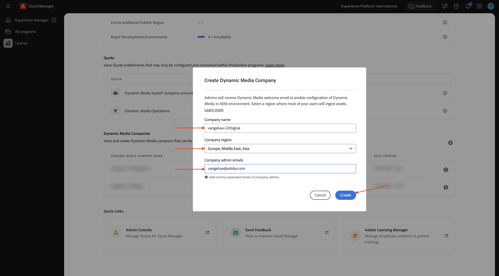

Entonces debería ver esto.

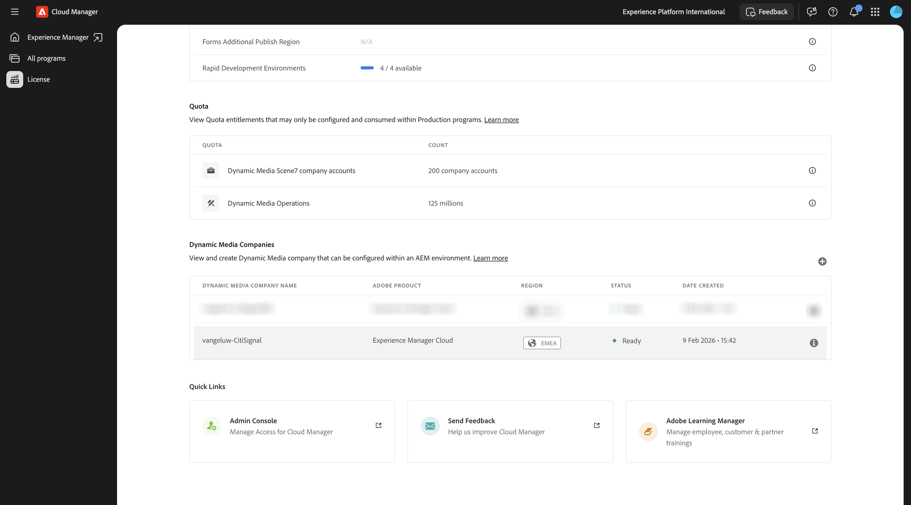

Ahora debería recibir un correo electrónico como el de abajo, que contiene su contraseña temporal. Para cambiar la contraseña o recuperarla en caso de que no hayas recibido un correo electrónico, debes instalar **Adobe Dynamic Media Classic desktop app**. Puede encontrar las instrucciones de instalación aquí: [https://experienceleague.adobe.com/es/docs/dynamic-media-classic/using/intro/dynamic-media-classic-desktop-app](https://experienceleague.adobe.com/es/docs/dynamic-media-classic/using/intro/dynamic-media-classic-desktop-app).

Siga las instrucciones allí y vuelva aquí una vez que la aplicación esté instalada en el sistema.

Abra la **aplicación de escritorio de Adobe Dynamic Media Classic**. Si conoce su contraseña, introdúzcala aquí y siga las instrucciones para cambiarla la primera vez que inicie sesión.

Si no conoces tu contraseña, haz clic en el vínculo **Olvidé tu contraseña** y sigue las instrucciones para restablecer tu contraseña y, a continuación, vuelve aquí e inicia sesión.

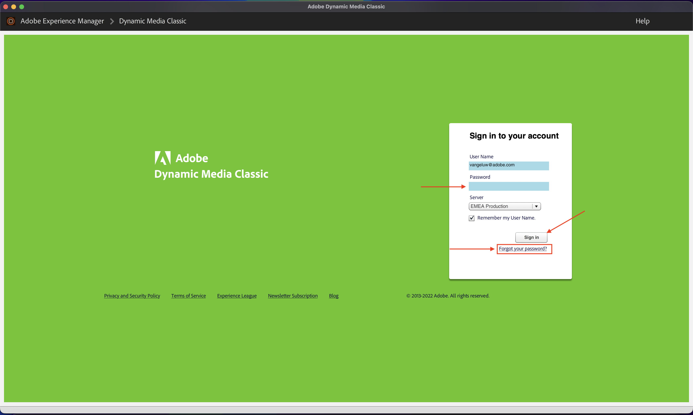

Después de iniciar sesión correctamente, debería ver una pantalla similar a esta.

## 1.4.1.2 Configurar Dynamic Media en AEM

Vaya a [https://my.cloudmanager.adobe.com](https://my.cloudmanager.adobe.com){target="_blank"}. La organización que debe seleccionar es `--aepImsOrgName--`.

Haga clic para abrir el programa Cloud Manager, que debería llamarse `--aepUserLdap-- - CitiSignal AEM+ACCS`.

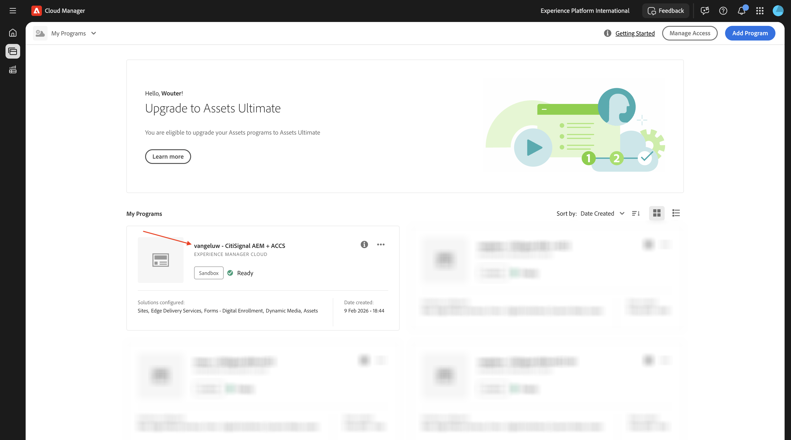

Haga clic en su entorno.

Haga clic en la dirección URL del entorno.

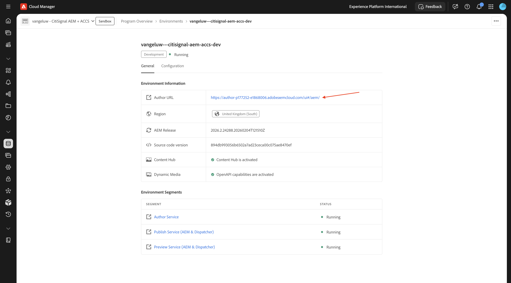

Vaya a **Herramientas**, a **Cloud Services** y luego a **Configuración de Dynamic Media**.

Seleccione **Global** (no marque la casilla de verificación) y luego haga clic en **Crear**.

Introduzca la siguiente información:

- **Título**: use este título: `--aepUserLdap-- - CitiSignal`.
- **Correo electrónico**: escribe tu dirección de correo electrónico.
- **Contraseña**: escriba la contraseña de la cuenta de Dynamic Media
- **Región**: seleccione la región que eligió al crear su compañía de Dynamic Media, en este ejemplo, **Europa**.

Haga clic en **Conectarse a Dynamic Media**.

Entonces debería ver esto. Configure lo siguiente:

- Seleccione la **compañía**: `--aepUserLdap-- - CitiSignal`.
- Definir **Publicar Assets** en **Inmediato**.
- Marque la casilla de verificación para **sincronizar todo el contenido**.

Haga clic en **Guardar**.

La configuración de Dynamic Media ya ha finalizado. Haga clic en **Aceptar**.

## 1.4.1.3 Exportar sus recursos

Descargue este archivo [citisignal-fiber-max-is-coming.psd](./assets/citisignal-fiber-max-is-coming.psd){target="_blank"} y ábralo con Adobe Photoshop.

Entonces debería ver esto. CitiSignal está planeando un despliegue de Fiber Max en 3 ciudades: Nueva York, París y Dubái.

Al mostrar u ocultar capas específicas, puede ver la imagen creada por los diseñadores.

A continuación se indican las instrucciones para exportar los archivos de imagen desde la plantilla de PSD de Photoshop. Si lo prefiere, también puede descargar las imágenes terminadas aquí [citisignal-dm-email-assets.zip](./assets/citisignal-dm-email-assets.zip){target="_blank"} y descomprimir el archivo en su escritorio.

Esta es la versión para Nueva York.

Esta es la versión para Dubai.

Esta es la versión para París.

Potencialmente, habrá muchas otras ciudades a las que CitiSignal lanzará Fiber Max, por lo que en el futuro, se podrán crear nuevas capas en este archivo. Por ahora, el foco está en las 3 ciudades ya mencionadas.

Para utilizar estas variaciones en combinación con Dynamic Media de AEM Assets, las capas de cada ciudad deben exportarse como imágenes por separado sin el archivo de fondo, y debe realizarse otra exportación para la capa de fondo sin incluir ninguna ciudad.

Ahora debería ocultar y mostrar sólo una de las capas. La primera capa que se mostrará es la capa **París**, y todas las demás capas deben estar ocultas.

Para exportar esa capa, ve a **Archivo** > **Exportar** > **Exportar como...**.

Entonces debería ver esto. Seleccione el tipo de archivo **PNG**, asegúrese de que **Transparency** está habilitado y haga clic en **Export**.

Cambie el nombre de archivo a `citisignal-fiber-max-is-coming-paris.png` y haga clic en **Exportar**.

La siguiente capa que se mostrará es **Dubái**, y todas las demás capas deben estar ocultas.

Para exportar esa capa, ve a **Archivo** > **Exportar** > **Exportar como...**.

Entonces debería ver esto. Seleccione el tipo de archivo **PNG**, asegúrese de que **Transparency** está habilitado y haga clic en **Export**.

Cambie el nombre de archivo a `citisignal-fiber-max-is-coming-dubai.png` y haga clic en **Exportar**.

La siguiente capa que se va a mostrar es **Nueva York**, y todas las demás capas deben estar ocultas.

Para exportar esa capa, ve a **Archivo** > **Exportar** > **Exportar como...**.

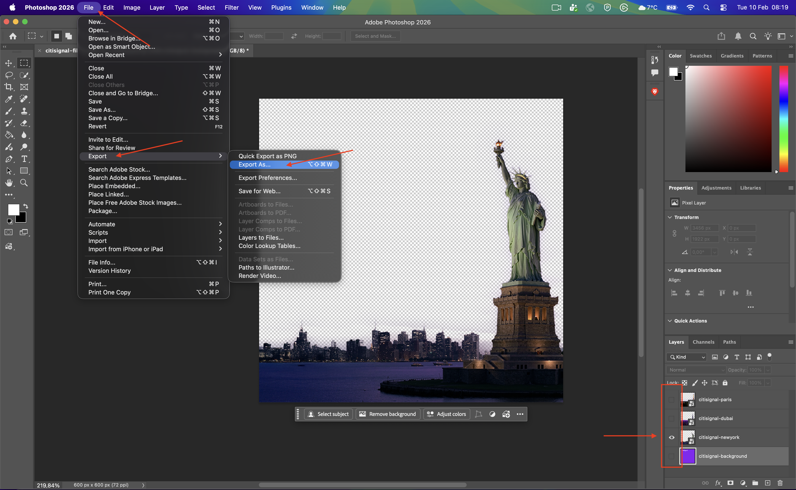

Entonces debería ver esto. Seleccione el tipo de archivo **PNG**, asegúrese de que **Transparency** está habilitado y haga clic en **Export**.

Cambie el nombre de archivo a `citisignal-fiber-max-is-coming-newyork.png` y haga clic en **Exportar**.

La siguiente capa que se va a mostrar es la capa **background**, y todas las demás capas deben estar ocultas.

Para exportar esa capa, ve a **Archivo** > **Exportar** > **Exportar como...**.

Entonces debería ver esto. Seleccione el tipo de archivo **PNG**, asegúrese de que **Transparency** está habilitado y haga clic en **Export**.

Cambie el nombre de archivo a `citisignal-fiber-max-is-coming-background` y haga clic en **Exportar**.

Estos archivos deberían estar disponibles en la ubicación de exportación seleccionada.

## 1.4.1.4 Cargar los recursos en AEM Assets CS

Vaya a [https://experience.adobe.com/](https://experience.adobe.com/){target="_blank"}. Ir a **Experience Manager Assets**.

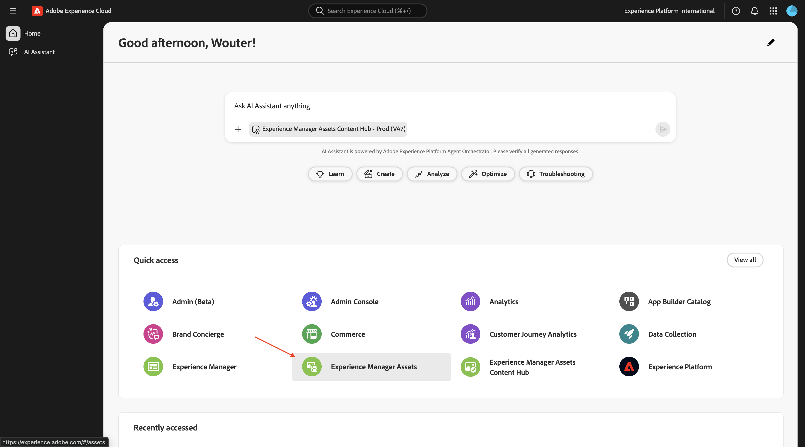

Seleccione el repositorio, que debe tener el nombre `--aepUserLdap-- - CitiSignal AEM + ACCS`.

Vaya a **Assets** y haga clic en **Crear carpeta**.

Para la carpeta, use el nombre: `--aepUserLdap-- - CitiSignal Dynamic Media`. Haga clic en **Crear**.

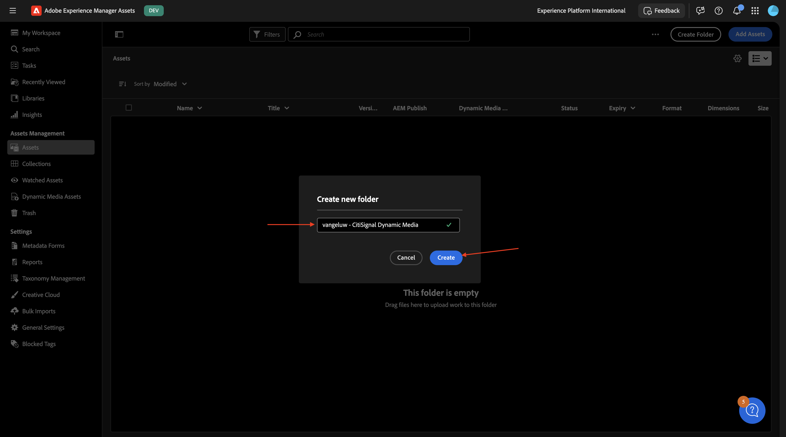

Haga doble clic para abrir la carpeta recién creada.

Haga clic en **Agregar Assets**.

Haga clic en **Examinar** y, a continuación, seleccione **Examinar archivos**.

Seleccione los 4 archivos PNG que exportó en el paso anterior.

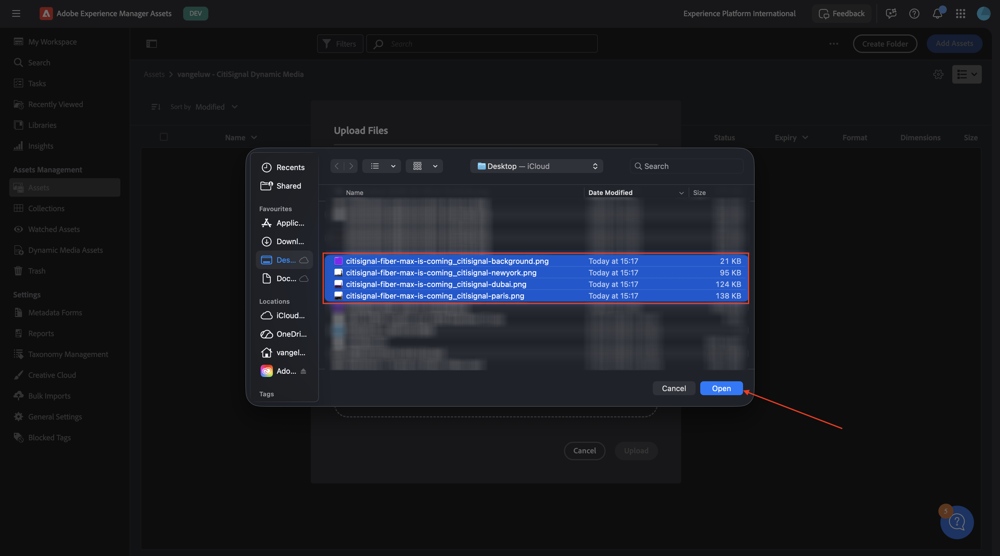

Haga clic en **Cargar**.

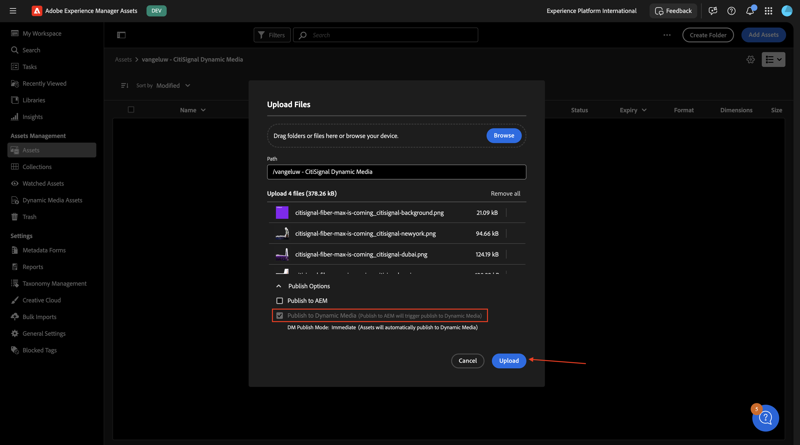

Las imágenes están ahora disponibles en AEM Assets CS.

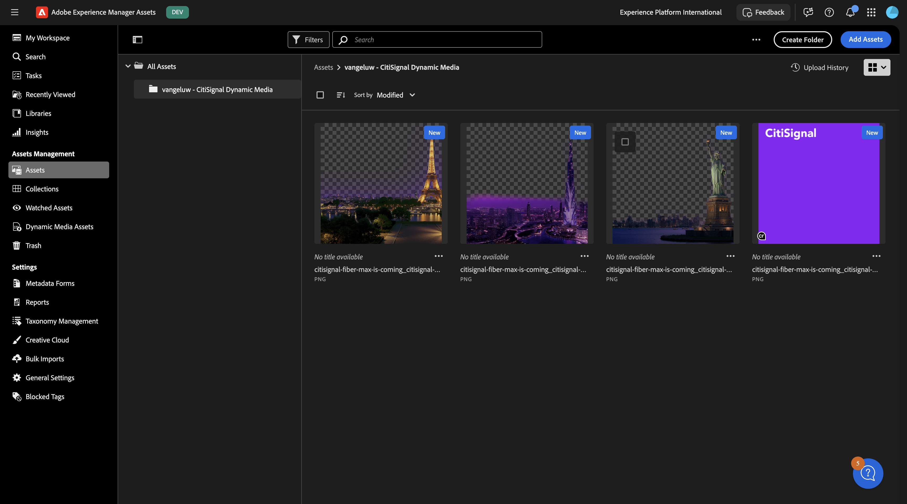

Espere un par de minutos y, a continuación, abra la **aplicación de escritorio de Adobe Dynamic Media Classic**; ahora debería ver que las imágenes cargadas también están disponibles en Dynamic Media.

## 1.4.1.5 Configurar la plantilla de Dynamic Media

En el menú de la izquierda, ve a **Dynamic Media Assets**. Haga clic para abrir la carpeta `--aepUserLdap-- - CitiSignal Dynamic Media`. A continuación, haga clic en **Crear plantilla**.

Introduzca la siguiente información:

- **Nombre de plantilla**: `--aepUserLdap-- - CitiSignal Fiber Max Launch Email Assets`
- **Anchura del lienzo**: `600px`
- **Altura del lienzo**: `600px`

Haga clic en **Crear**.

Entonces debería ver esto. Haga clic en el icono **Agregar imagen**.

Arrastre el archivo **citisignal-fiber-max-is-coming_citisignal-background.png** al lienzo y haga que se ajuste al lienzo.

A continuación, arrastre el archivo **citisignal-fiber-max-is-coming_citisignal-newyork.png** al lienzo y haga que se ajuste al lienzo.

A continuación, arrastre el archivo **citisignal-fiber-max-is-coming_citisignal-dubai.png** al lienzo y haga que se ajuste al lienzo.

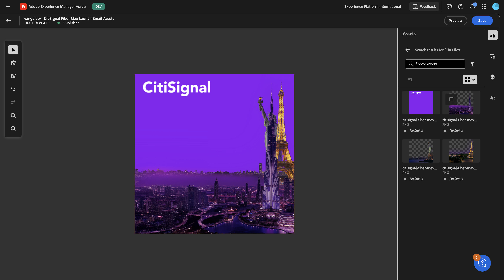

A continuación, arrastre el archivo **citisignal-fiber-max-is-coming_citisignal-paris.png** al lienzo y haga que se ajuste al lienzo.

Ahora tiene las 3 variaciones en la plantilla como capas distintas al mismo tiempo. Para mostrar u ocultar capas específicas, haga clic en el icono **capas**, donde verá que todas las capas están visibles actualmente.

Al ocultar un par de capas, puede controlar el aspecto de la imagen. En este ejemplo, solo están visibles la capa para **París** y la capa de fondo.

A continuación, debe añadir una capa de texto. Haga clic en el icono **capa de texto**.

Entonces debería ver esto.

Siéntase libre de adaptar el campo de texto en la forma que crea conveniente, aquí hay un ejemplo. No olvide habilitar la opción **Cambio de tamaño del texto inteligente** para que el texto real que se inserte en una etapa posterior tenga buen aspecto.

Añada una segunda capa de texto y haga que tenga este aspecto. No olvide habilitar la opción **Cambio de tamaño del texto inteligente** para que el texto real que se inserte en una etapa posterior tenga buen aspecto.

Seleccione la primera capa de texto. Haga clic en los 3 puntos **...** y, a continuación, seleccione **Editar**.

Entonces debería ver esto. Desplácese hacia abajo.

Haga clic en el icono **conmutador** para que el campo **Texto** esté habilitado. Cambie **Parameter Name** a `title`.

Seleccione la segunda capa de texto. Haga clic en los 3 puntos **...** y, a continuación, seleccione **Editar**.

Entonces debería ver esto. Desplácese hacia abajo.

Haga clic en el icono **conmutador** para que el campo **Texto** esté habilitado. Cambie **Parameter Name** a `body`.

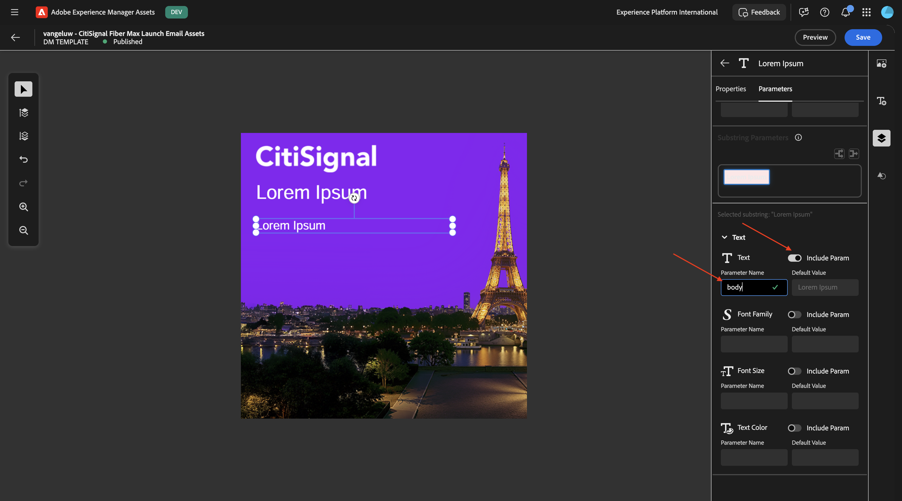

Seleccione la capa de **París**. Haga clic en los 3 puntos **...** y haga clic en **Editar**.

Vaya a **Parámetros**. Habilite el campo **Ocultar** e introduzca el **Nombre del parámetro**: `city_paris`. Haga clic en **Guardar**.

Seleccione la capa de **Dubai**. Haga clic en los 3 puntos **...** y haga clic en **Editar**.

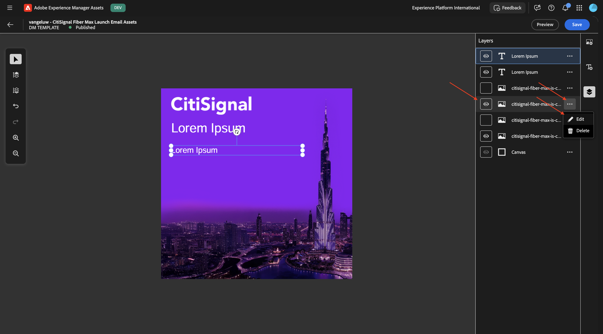

Vaya a **Parámetros**. Habilite el campo **Ocultar** e introduzca el **Nombre del parámetro**: `city_dubai`. Haga clic en **Guardar**.

Seleccione la capa para **Nueva York**. Haga clic en los 3 puntos **...** y haga clic en **Editar**.

Vaya a **Parámetros**. Habilite el campo **Ocultar** e introduzca el **Nombre del parámetro**: `city_ny`. Haga clic en **Guardar**.

Haga clic en **Vista previa**.

Habilite el conmutador para **Incluir todos los parámetros** y cambie algunas variables de entrada como se indica en la captura de pantalla. Debería ver cómo la imagen cambia de forma dinámica en función de la entrada proporcionada. Para los campos **city_paris**, **city_dubai** y **city_ny**, un valor de 0 significa que NO se ocultará esta imagen y un valor de 1 significa que se ocultará esta imagen.

Al cambiar algunas variables, ahora ve otra imagen que se muestra.

Al cambiar más variables, ahora ve otra imagen que se muestra.

Para utilizar esta plantilla con Adobe Journey Optimizer y cumplir los requisitos de este caso de uso, debe añadir una capa más que se utilizará para cambiar dinámicamente la ruta del archivo que debe mostrarse, en función de un campo que forme parte del Perfil del cliente en tiempo real en Adobe Experience Platform.

Durante la preparación de datos, se creó un campo en el esquema de Adobe Experience Platform para almacenar la **ciudad de despliegue más cercana** de un cliente. La ruta del campo es `--aepTenantId--.individualCharacteristics.fiber_rollout.closest_rollout_city`.

>[!NOTE]
>
>La captura de pantalla siguiente del esquema de Adobe Experience Platform es solo para obtener información. No es necesario navegar a AEP para visualizarlo usted mismo.

En el siguiente ejercicio, utilizará ese campo para seleccionar dinámicamente qué imagen se debe mostrar a qué cliente.

Para que sea posible, debe añadir una nueva capa de imagen.

En primer lugar, ocultemos las otras capas que contengan imágenes para las ciudades en despliegue.

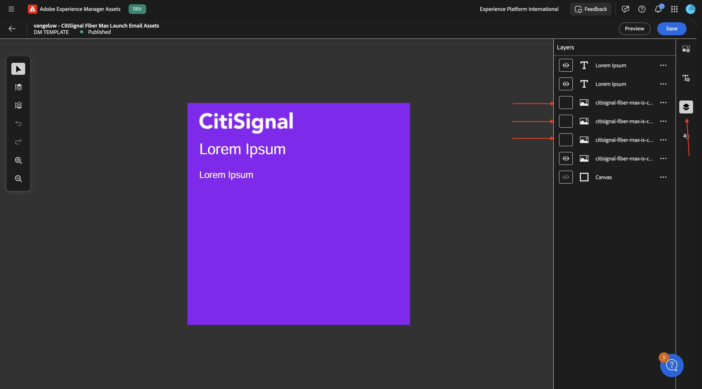

A continuación, ve a **Imágenes** y selecciona una imagen aleatoria de una ciudad y agrégala al lienzo, y asegúrate de que se ajuste a todo el lienzo. No importa la imagen de ciudad que elija, ya que AJO cambiará el trazado dinámicamente en el próximo ejercicio.

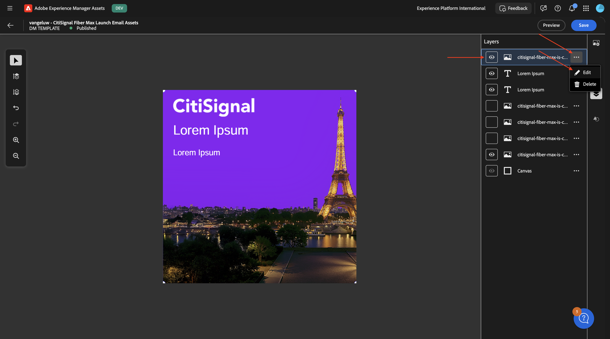

Vaya a **Parámetros**.

Haga clic en el icono **conmutador** para habilitar el campo **Ocultar**. Cambie **Parameter Name** a `dynamic_city_hide`.

Haga clic en el icono **conmutador** para habilitar el campo **Ocultar**. Cambie **Parameter Name** a `dynamic_city_image`.

Haga clic en **Guardar**.

Haga clic en **Vista previa**.

Entonces debería ver esto. Habilite el icono del conmutador **Incluir todos los parámetros**. Cambie algunas variables de entrada como se indica en la captura de pantalla. Debería ver cómo la imagen cambia de forma dinámica en función de la entrada proporcionada. Los campos estáticos **city_paris**, **city_dubai** y **city_ny** deben establecerse en 1, lo que significa que estas imágenes se ocultarán.

El campo **dynamic_city_hide** debe establecerse en 0, lo que significa que se mostrará.

El campo **dynamic_city_image** tiene ahora la dirección URL de la imagen de París, que tiene el siguiente aspecto: `vangeluwCitiSignalDM/citisignal-fiber-max-is-coming_citisignal-paris-1`.

Seleccione la palabra **paris** en la dirección URL.

Cambie **paris** a `newyork` y luego haga clic en otro lugar de la interfaz de usuario para ver el cambio de imagen en la imagen de la ciudad de Nueva York.

Seleccione la palabra **newyork**, cámbiela a `dubai` y luego haga clic en otro lugar de la interfaz de usuario para ver el cambio de imagen en la imagen de la ciudad de Dubái.

Finalmente, haga clic en **Publicar**.

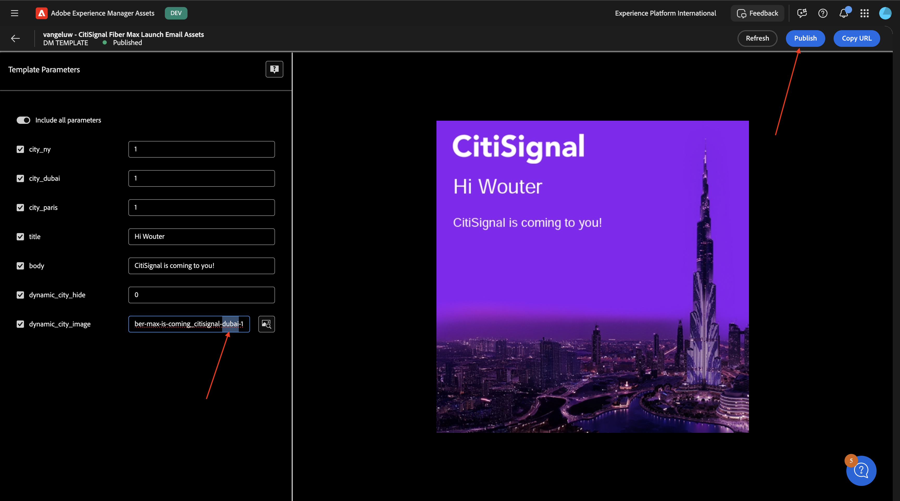

Entonces debería ver esto. Haga clic en **Sí**.

La plantilla de Dynamic Media ahora está configurada y publicada correctamente. En el siguiente ejercicio, utilizará esa plantilla en combinación con una campaña de correo electrónico en Adobe Journey Optimizer.

## Pasos siguientes

Paso siguiente: [Use su plantilla de medios dinámicos con Adobe Journey Optimizer](./ex2.md){target="_blank"}

Volver a [Adobe Experience Manager Assets y Dynamic Media](./aemassetsdm.md){target="_blank"}

[Volver a todos los módulos](./../../../overview.md){target="_blank"}
