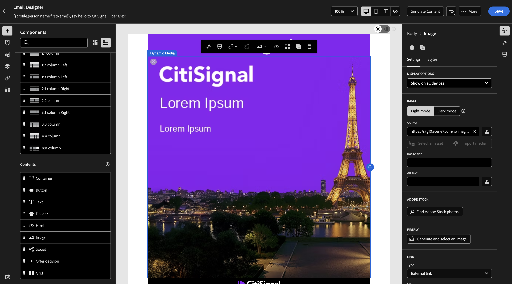

# 1.4.2 Uso de la plantilla de medios dinámicos con Adobe Journey Optimizer

## 1.4.2.1 Cree su campaña en Adobe Journey Optimizer

Inicie sesión en Adobe Journey Optimizer en [Adobe Experience Cloud](https://experience.adobe.com). Haga clic en **Journey Optimizer**.


Se le redirigirá a la vista **Inicio** en Journey Optimizer. Primero, asegúrese de que está usando la zona protegida correcta. La zona protegida que se va a usar se llama `--aepSandboxName--`. Estará en la vista **Inicio** de su zona protegida `--aepSandboxName--`.


Ahora creará una campaña. A diferencia del recorrido basado en eventos del ejercicio anterior, que se basa en eventos de experiencia entrantes o entradas o salidas de audiencia para almacenar en déclencheur un recorrido para un cliente específico, las campañas se dirigen a una audiencia completa una vez con contenido único como boletines informativos, promociones únicas o información genérica, o periódicamente con contenido similar enviado de forma regular como, por ejemplo, campañas de cumpleaños y recordatorios.

En el menú, ve a **Campañas** y haz clic en **Crear campaña**.


Seleccione **Programado - Marketing** y haga clic en **Crear**.


En la pantalla de creación de campañas, configure lo siguiente:

- **Nombre**: `--aepUserLdap-- - CitiSignal Fiber Max DM Email Campaign`.

Haga clic en **Acciones**.


Haga clic en **+ Agregar acción** y luego seleccione **Correo electrónico**.


A continuación, seleccione una **configuración de correo electrónico** existente y haga clic en **Editar contenido**.


Entonces verá esto... Para la **línea de asunto**, use esto:

```
{{profile.person.name.firstName}}, say hello to CitiSignal Fiber Max!
```

A continuación, haga clic en **Editar contenido**.


Seleccione **Diseño desde cero**.


Entonces debería ver esto.


Agregar 2x **1:1 columna** al lienzo.


Vaya a **Fragmentos**, arrastre el fragmento **encabezado** a la primera columna {1:1 y, a continuación, arrastre el fragmento **pie de página** a la segunda columna {1:1.


Agregue una nueva columna 1:1 entre los 2 fragmentos y, a continuación, agregue una **imagen** a esa columna 1:1. A continuación, haga clic en **Examinar**.


Vaya a la carpeta en la que ha almacenado la plantilla de Dynamic Media. Seleccione su plantilla de Dynamic Media y haga clic en **Seleccionar**.


Entonces debería ver esto.



## Pasos siguientes

Volver a [Adobe Experience Manager Assets y Dynamic Media](./aemassetsdm.md){target="_blank"}

[Volver a todos los módulos](./../../../overview.md){target="_blank"}
