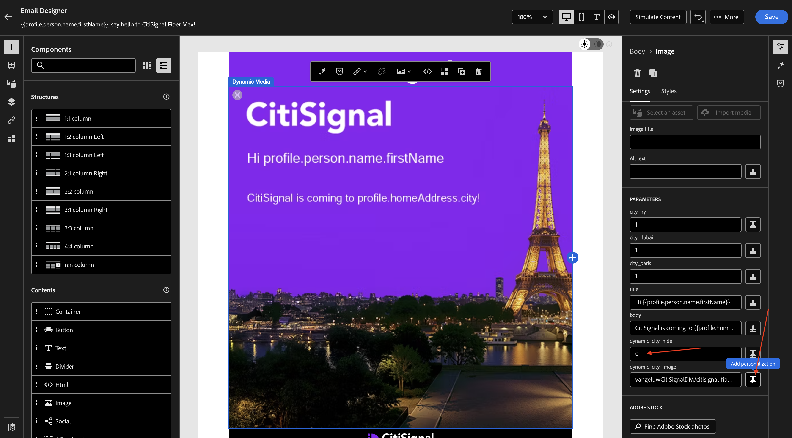

# 1.4.2 Uso de la plantilla de medios dinámicos con Adobe Journey Optimizer

## 1.4.2.1 Cree su campaña en Adobe Journey Optimizer

Inicie sesión en Adobe Journey Optimizer en [Adobe Experience Cloud](https://experience.adobe.com). Haga clic en **Journey Optimizer**.


Se le redirigirá a la vista **Inicio** en Journey Optimizer. Primero, asegúrese de que está usando la zona protegida correcta. La zona protegida que se va a usar se llama `--aepSandboxName--`. Estará en la vista **Inicio** de su zona protegida `--aepSandboxName--`.


Ahora creará una campaña. A diferencia del recorrido basado en eventos del ejercicio anterior, que se basa en eventos de experiencia entrantes o entradas o salidas de audiencia para almacenar en déclencheur un recorrido para un cliente específico, las campañas se dirigen a una audiencia completa una vez con contenido único como boletines informativos, promociones únicas o información genérica, o periódicamente con contenido similar enviado de forma regular como, por ejemplo, campañas de cumpleaños y recordatorios.

En el menú, ve a **Campañas** y haz clic en **Crear campaña**.


Seleccione **Programado - Marketing** y haga clic en **Crear**.


En la pantalla de creación de campañas, configure lo siguiente:

- **Nombre**: `--aepUserLdap-- - CitiSignal Fiber Max DM Email Campaign`.

Haga clic en **Acciones**.


Haga clic en **+ Agregar acción** y luego seleccione **Correo electrónico**.


A continuación, seleccione una **configuración de correo electrónico** existente y haga clic en **Editar contenido**.


Entonces verá esto... Para la **línea de asunto**, use esto:

```
{{profile.person.name.firstName}}, say hello to CitiSignal Fiber Max!
```

A continuación, haga clic en **Editar contenido**.


Seleccione **Diseño desde cero**.


Entonces debería ver esto.


Agregar 2x **1:1 columna** al lienzo.


Vaya a **Fragmentos**, arrastre el fragmento **encabezado** a la primera columna &lbrace;1:1 y, a continuación, arrastre el fragmento **pie de página** a la segunda columna &lbrace;1:1.


Agregue una nueva columna 1:1 entre los 2 fragmentos y, a continuación, agregue una **imagen** a esa columna 1:1. A continuación, haga clic en **Examinar**.


Vaya a la carpeta en la que ha almacenado la plantilla de Dynamic Media. Seleccione su plantilla de Dynamic Media y haga clic en **Seleccionar**.


Entonces debería ver esto. Tú también. observe los **PARÁMETROS** que le permiten cambiar los parámetros de la plantilla de dynamic media.


## 1.4.2.2 Personalizar la plantilla de medios dinámicos

Como se trató en el ejercicio anterior, AJO ahora necesita decidir dinámicamente cuáles deben ser los valores que formen parte de la plantilla de Dynamic Media.

Al igual que en el paso **Vista previa** del ejercicio anterior, los campos **city_paris**, **city_dubai** y **city_ny** deben establecerse en 1, lo que significa que estas imágenes se ocultarán.

Para el campo **title**, haga clic en el icono de personalización.


Reemplazar el texto predeterminado por: `Hi {{profile.person.name.firstName}}`. Haga clic en **Guardar**.


Para el campo **body**, haga clic en el icono de personalización.


Reemplazar el texto predeterminado por: `CitiSignal is coming to {{profile.homeAddress.city}}!`. Haga clic en **Guardar**.


Asegúrese de que el campo **`dynamic_city_hide`** esté establecido en 0. Haga clic en el icono de personalización del campo **`dynamic_city_image`**.



Reemplazar el texto predeterminado por: `--aepUserLdap--CitiSignalDM/citisignal-fiber-max-is-coming_citisignal-{{profile._experienceplatform.individualCharacteristics.fiber_rollout.closest_rollout_city}}-1`. Haga clic en **Guardar**.


Entonces debería ver esto. La imagen ya no se representa aquí, lo que se espera, ya que las variables dinámicas no están disponibles en el contexto del editor de correo electrónico.

Haga clic en **Guardar**.


Para probar la configuración, haz clic en **Simular contenido** y luego selecciona **Simular contenido**.


Entonces deberías ver algo como esto. Si no tiene perfiles de prueba disponibles, puede agregarlos en **Administrar perfiles de prueba**.

Una vez que tenga disponibles perfiles de prueba que contengan los datos necesarios para probar este caso de uso, puede cambiar de un perfil a otro para ver que los cambios se producen de forma dinámica.

Este es un perfil vinculado a la ciudad de lanzamiento en Nueva York.


Este es un perfil vinculado a la ciudad de despliegue París.


Este es un perfil vinculado a la ciudad de despliegue de Dubai.

Haga clic en **Cerrar**.


Ya ha terminado este ejercicio. No es necesario publicar la campaña de correo electrónico.

## Pasos siguientes

Volver a [Adobe Experience Manager Assets y Dynamic Media](./aemassetsdm.md){target="_blank"}

[Volver a todos los módulos](./../../../overview.md){target="_blank"}