# 1.5.1 Introducción a Adobe Commerce as a Cloud Service

Vaya a [https://experience.adobe.com/](https://experience.adobe.com/){target="_blank"}. Asegúrese de que está en el entorno correcto, que debe llamarse `--aepImsOrgName--`. Haga clic en **Commerce**.


## 1.5.1.1: cree su instancia de ACCS

Entonces debería ver esto. Haga clic en **+ Agregar instancia**.


Rellene los campos de esta manera:

- **Nombre de instancia**:

```
--aepUserLdap-- - ACCS
```

- **Entorno**: `Sandbox`
- **Región**: `North America`

Haga clic en **Agregar instancia**.


Su instancia se está creando. Esto puede tardar de 5 a 10 minutos.

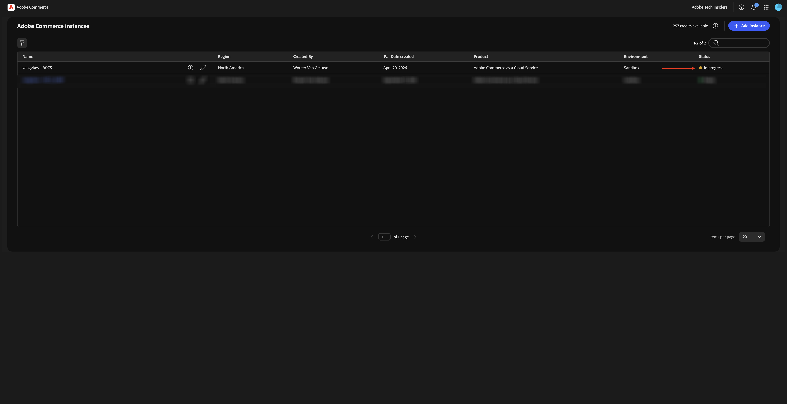

Una vez que la instancia esté lista, haga clic en la instancia para abrirla.


## 1.5.1.2 Configurar su almacén de CitiSignal

Entonces debería ver esto. Haz clic en **Iniciar sesión con Adobe ID** y luego inicia sesión.


Una vez que haya iniciado sesión, debería ver esta página de inicio. El primer paso es configurar su tienda de CitiSignal en Commerce. Haga clic en **Tiendas**.


Haga clic en **Todas las tiendas**.


Haga clic en **Crear sitio web**.

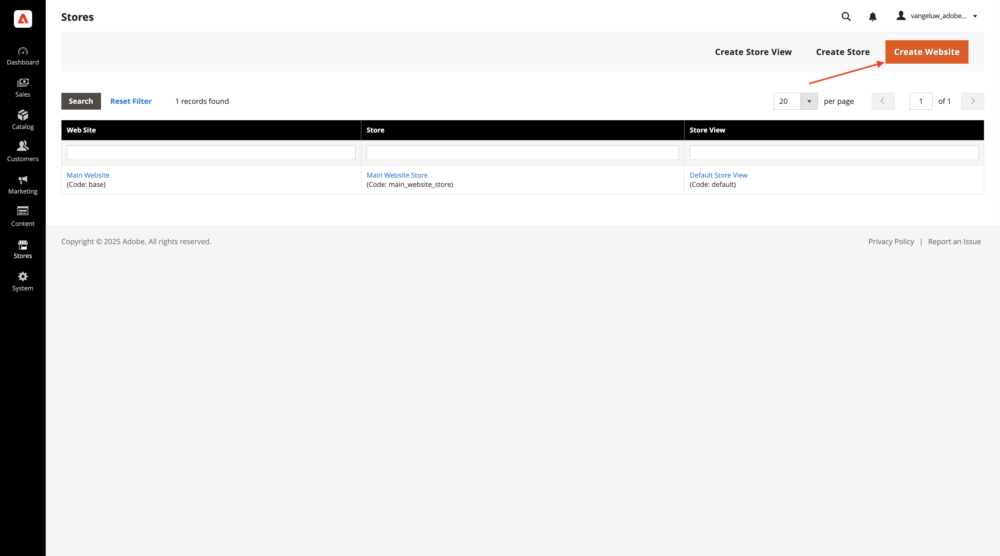

Rellene los campos de esta manera:

- **Nombre**:

```
CitiSignal
```

- **Código**:

```
citisignal
```

Haga clic en **Guardar sitio web**.


Entonces deberías estar de vuelta aquí. Haga clic en **Crear tienda**.


Rellene los campos de esta manera:

- **Sitio web**:

```
CitiSignal
```

- **Nombre**:

```
CitiSignal
```

- **Código**:

```
citisignal
```

- **Categoría raíz**: `Default Category`

Haga clic en **Guardar tienda**.


Entonces deberías estar de vuelta aquí. Haga clic en **Crear vista de tienda**.

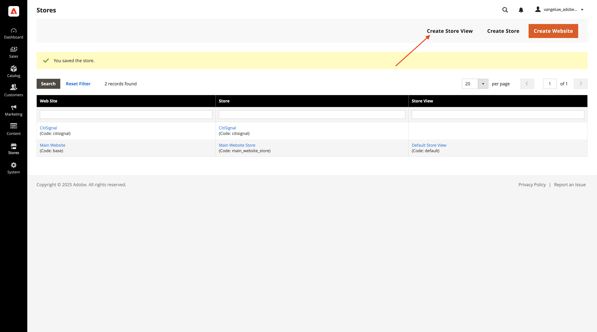

Rellene los campos de esta manera:

- **Almacén**:

```
CitiSignal
```

- **Nombre**:

```
CitiSignal
```

- **Código**:

```
citisignal
```

- **Estado**: `Enabled`

Haga clic en **Guardar vista de tienda**.

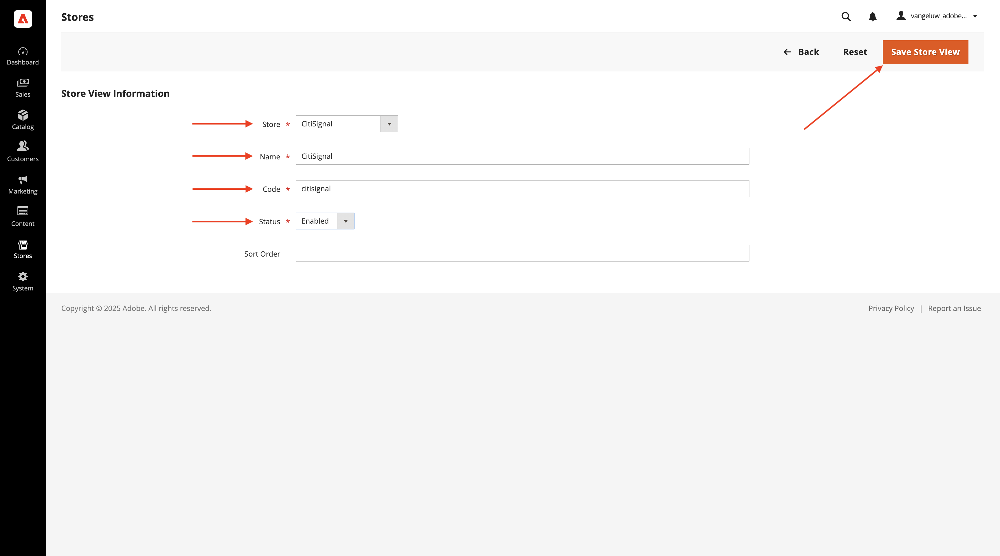

Entonces debería ver este mensaje. Haga clic en **Aceptar**.

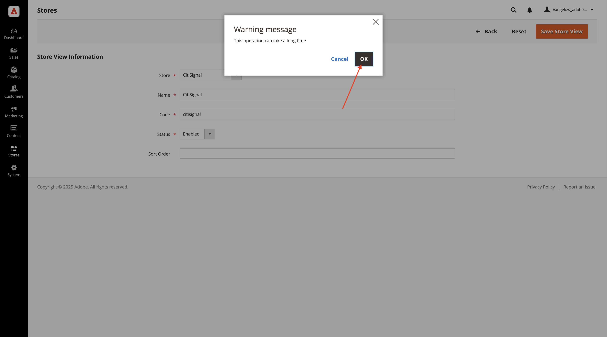

Entonces deberías estar de vuelta aquí. Haga clic en el sitio web **CitiSignal** para abrirlo.


Marque la casilla de verificación para establecer este sitio web como el sitio web predeterminado.

Haga clic en **Guardar sitio web**.


Entonces deberías estar de vuelta aquí.


## 1.5.1.3 Configurar categorías y productos

Vaya a **Catálogo** y luego seleccione **Categorías**.

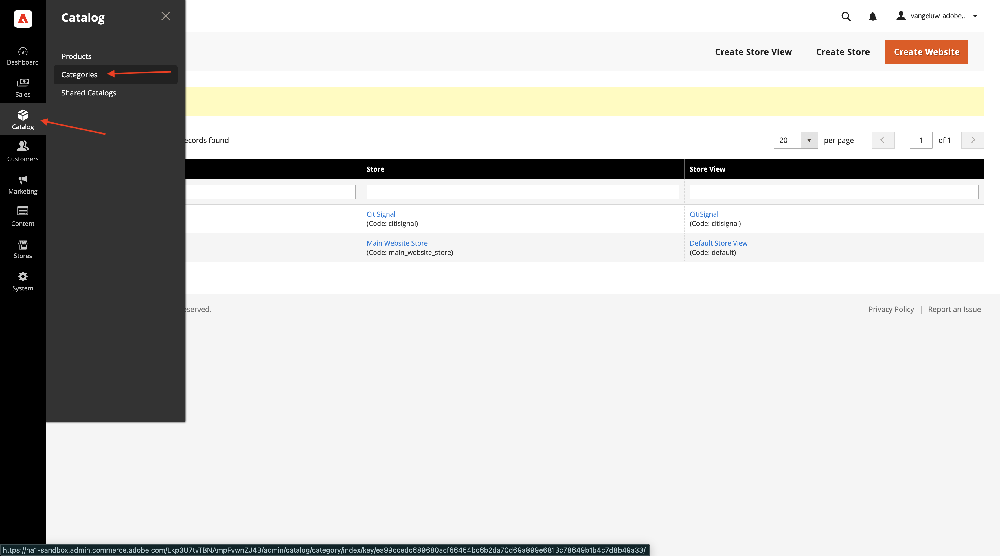

Seleccione **Categoría predeterminada** y haga clic en **Agregar subcategoría**.


Escriba el siguiente nombre y haga clic en **Guardar**.

```
Phones
```

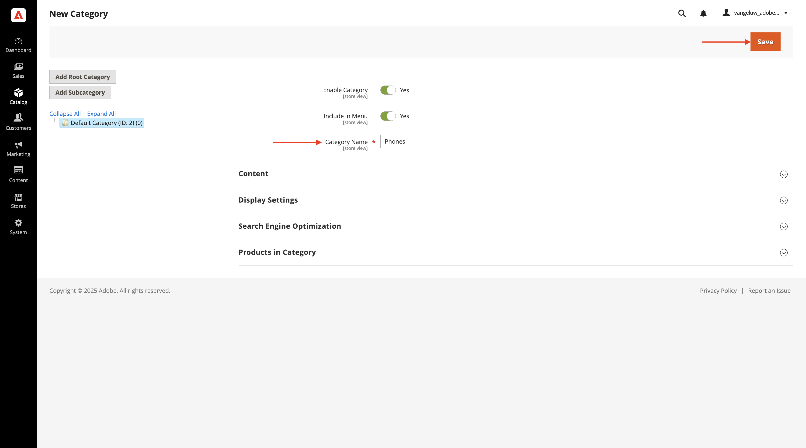

Seleccione **Categoría predeterminada** y luego haga clic en **Agregar subcategoría** de nuevo.


Escriba el siguiente nombre y haga clic en **Guardar**.

```
Watches
```


Seleccione **Categoría predeterminada** y luego haga clic en **Agregar subcategoría** de nuevo.

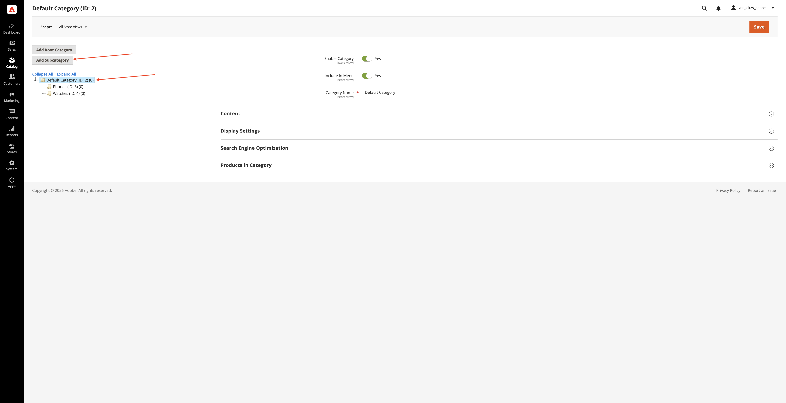

Escriba el siguiente nombre y haga clic en **Guardar**.

```
Plans
```

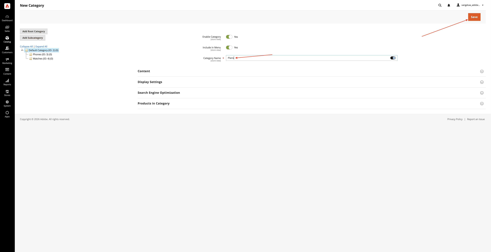

Seleccione **Categoría predeterminada** y luego haga clic en **Agregar subcategoría** de nuevo.


Escriba el siguiente nombre y haga clic en **Guardar**.

```
Entertainment
```


Luego debería tener 4 categorías creadas.


A continuación, ve a **Catálogo** y selecciona **Productos**.

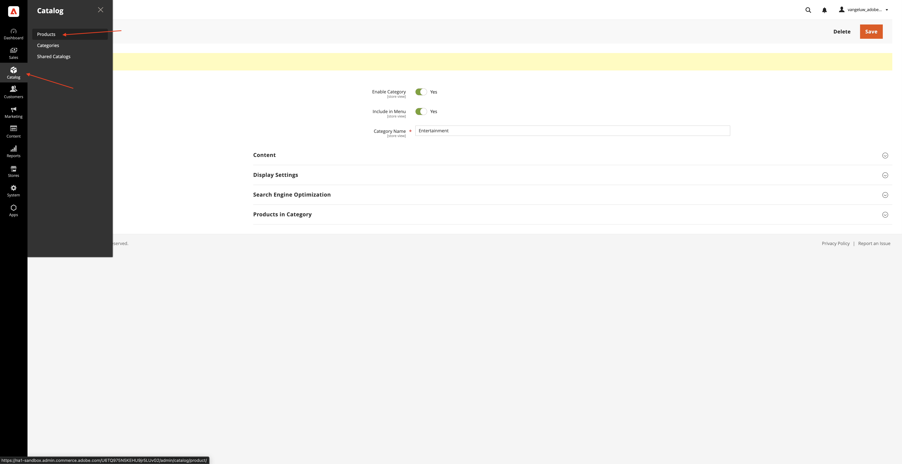

Entonces debería ver esto. Haga clic en **Agregar producto**.


Configure el producto de esta manera:

- **Nombre de producto**:

```
iPhone Air
```

- **SKU**:

>[!NOTE]
>
>Asegúrese de que el campo SKU sea idéntico al valor siguiente y de que no haya espacios en este campo.

```
iPhone-Air
```

- **Precio**:

```
999
```

- **Cantidad**:

```
10000
```

- **Categorías**: seleccione `Phones`

Haga clic en **Guardar**.

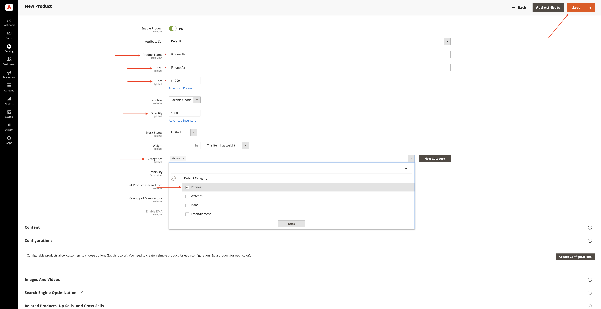

Desplácese hasta **Configuraciones** y haga clic en **Crear configuraciones**.


Entonces debería ver esto. Haga clic en **Crear nuevo atributo**.

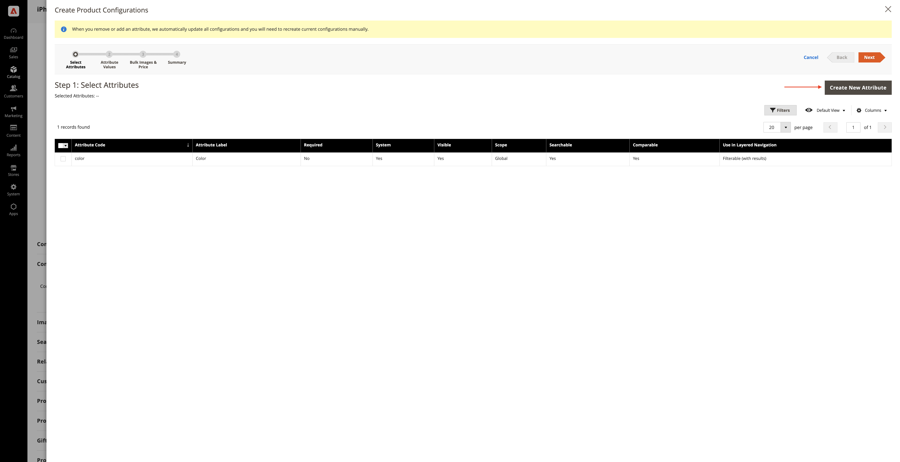

Establezca la **Etiqueta predeterminada** con el siguiente valor y, a continuación, haga clic en **Agregar opción** en **Administrar opciones**.

```
Storage
```


Configure la primera opción con el siguiente valor en las 3 columnas y luego haga clic en **Agregar opción** de nuevo.

```
256GB
```

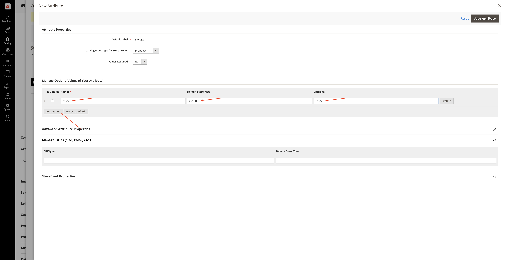

Configure la segunda opción con el siguiente valor en las 3 columnas y luego haga clic en **Agregar opción** de nuevo.

```
512GB
```


Configure la tercera opción con el siguiente valor en las 3 columnas.

```
1TB
```

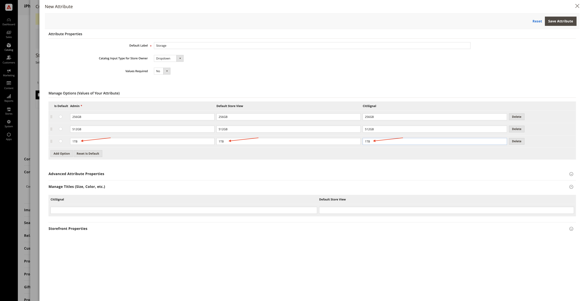

Desplácese hacia abajo hasta **Propiedades de tienda**. Establezca las siguientes opciones en **Yes**:

- **Usar en la búsqueda**
- **Permitir etiquetas de HTML en tienda**
- **Visible en páginas de catálogo en Storefront**
- **Uso en la lista de productos**

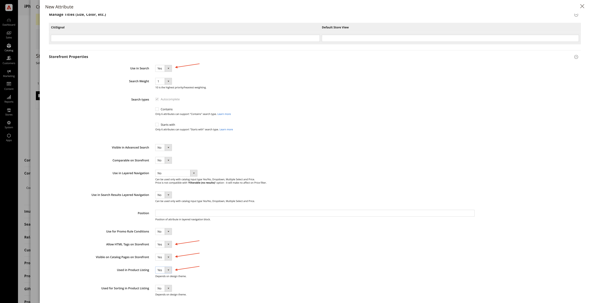

Desplácese hacia arriba y haga clic en **Guardar atributo**.

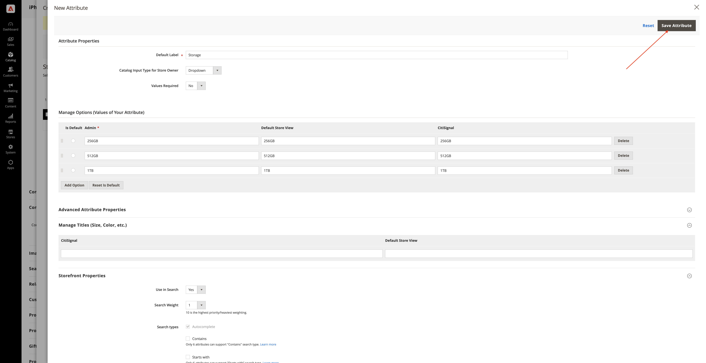

Entonces debería ver esto. Seleccione ambos atributos para **color** y **almacenamiento** y haga clic en **Siguiente**.


Entonces debería ver esto. Ahora debe añadir las opciones de color disponibles. Para ello, haga clic en **Crear nuevo valor**.

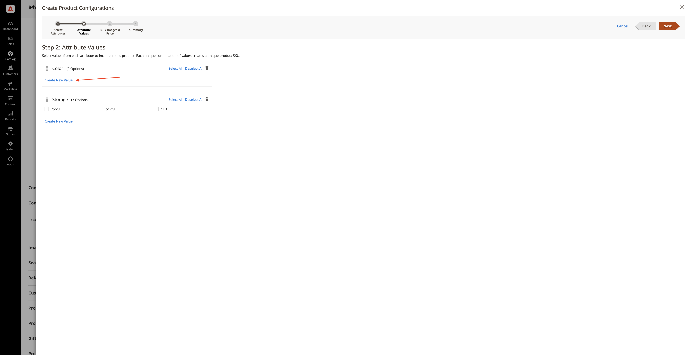

Escriba el valor `Sky-Blue` y haga clic en **Crear nuevo valor**.


Escriba el valor `Light-Gold` y haga clic en **Crear nuevo valor**.

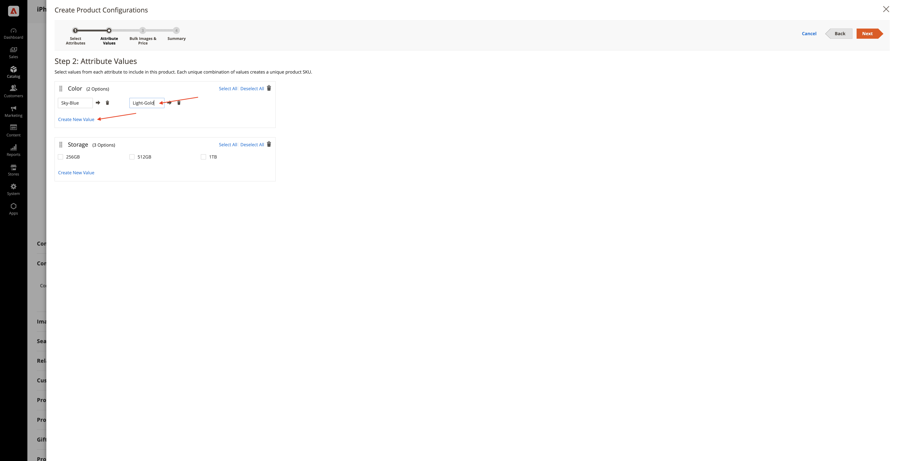

Escriba el valor `Cloud-White` y haga clic en **Crear nuevo valor**.


Escriba el valor `Space-Black`. Haga clic en **Seleccionar todo**


Seleccione las 3 opciones en **Almacenamiento** y haga clic en **Siguiente**.

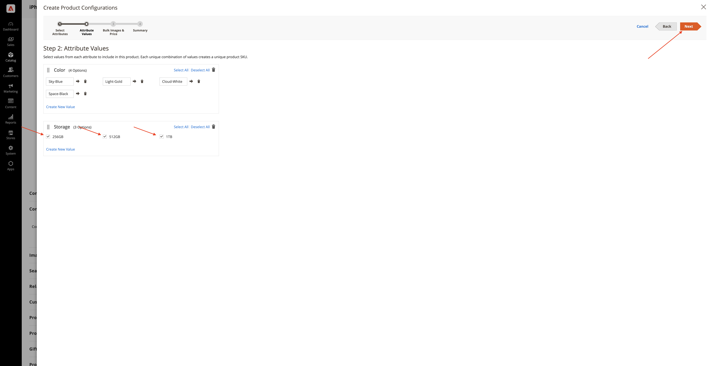

Deje la configuración predeterminada y haga clic en **Siguiente**.

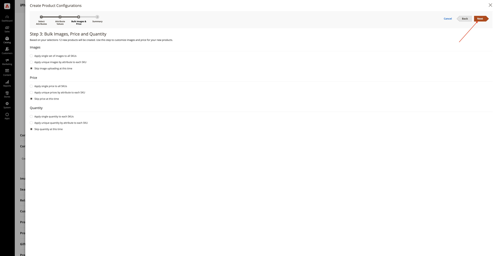

Entonces debería ver esto. Haga clic en **Generar productos**.

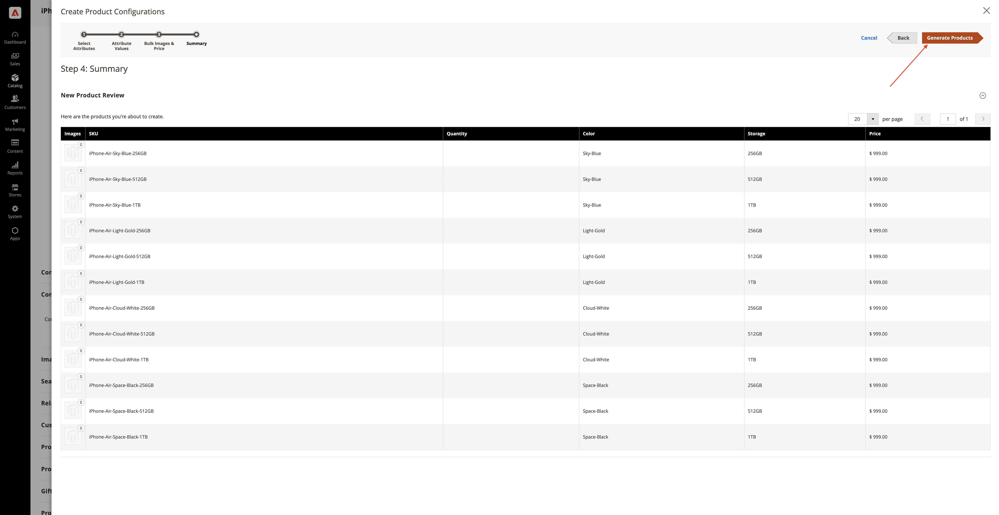

Establece la **cantidad** de cada producto en `10000`. Además, asegúrese de que la columna **SKU** no contenga espacios en ninguna de las SKU.

Haga clic en **Guardar**.


Haga clic en **Confirmar**.

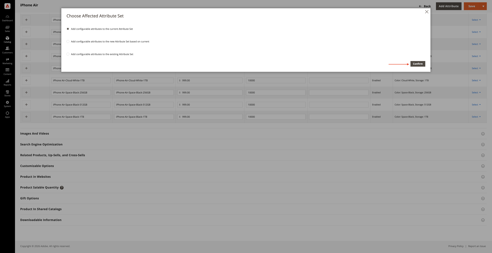

Desplácese hacia abajo hasta **Producto en sitios web** y marque la casilla de **CitiSignal**.

Haga clic en **Guardar**.

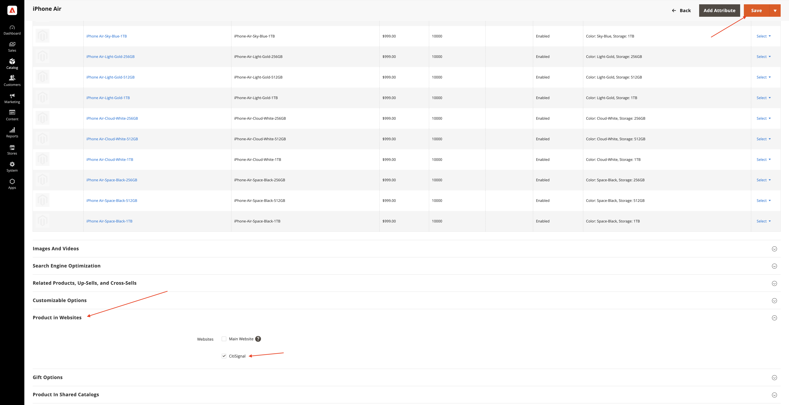

Entonces debería ver esto. Haga clic en **Atrás**.


Ahora verá el producto **iPhone Air** y sus variaciones en el catálogo de productos.

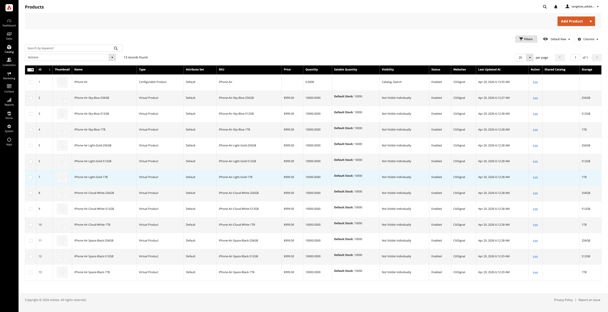

## 1.5.1.4 Importar productos

CitiSignal vende más productos, por lo que para crear los productos restantes en el catálogo de productos, ahora necesita importarlos.

Vaya a **Sistema** y luego a **Importar**.

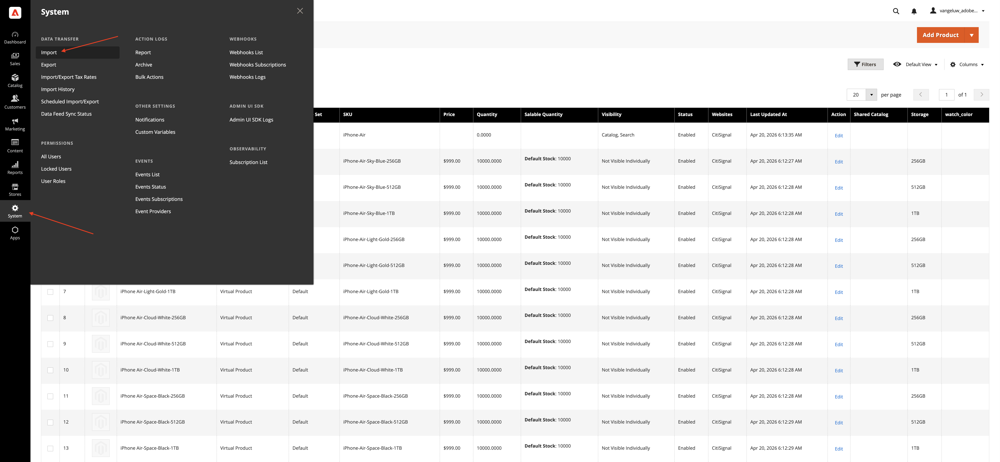

Seleccione los siguientes valores:

- **Tipo de entidad**: `Products`
- **Comportamiento de importación**: `Add/Update`
- **Estrategia de validación**: `Skip error entries`

Haga clic en **Elegir archivo**.


Descargue este archivo en su equipo: [product_catalog_import.csv.zip](./assets/product_catalog_import.csv.zip). Extraiga el archivo en su escritorio.

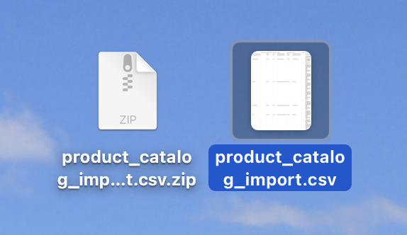

Seleccione el archivo **`product_catalog_import.csv`** y haga clic en **Abrir**.

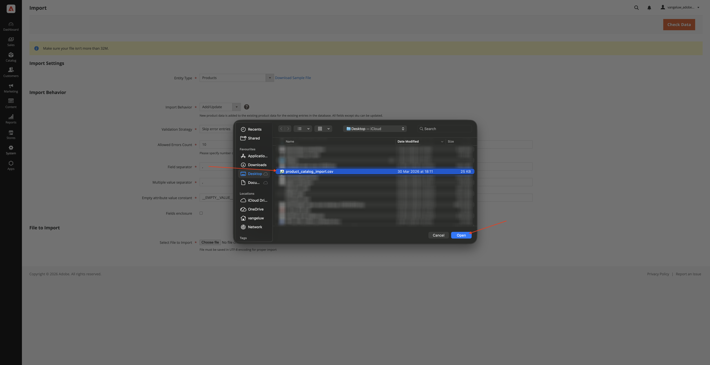

Entonces debería ver esto. Haga clic en **Comprobar datos**.


Entonces debería ver esto. Haga clic en **Importar**.

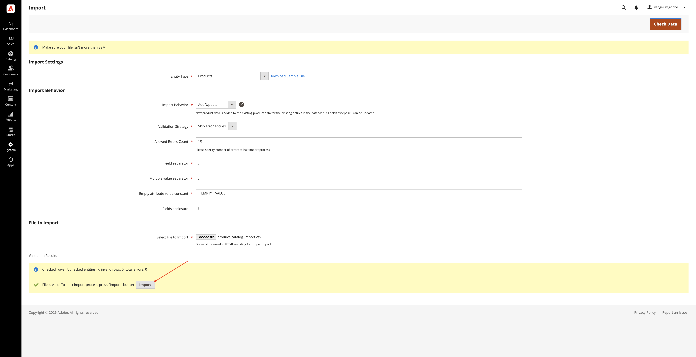

Entonces debería ver esto.


Vaya a **Catálogo** y luego a **Productos**.

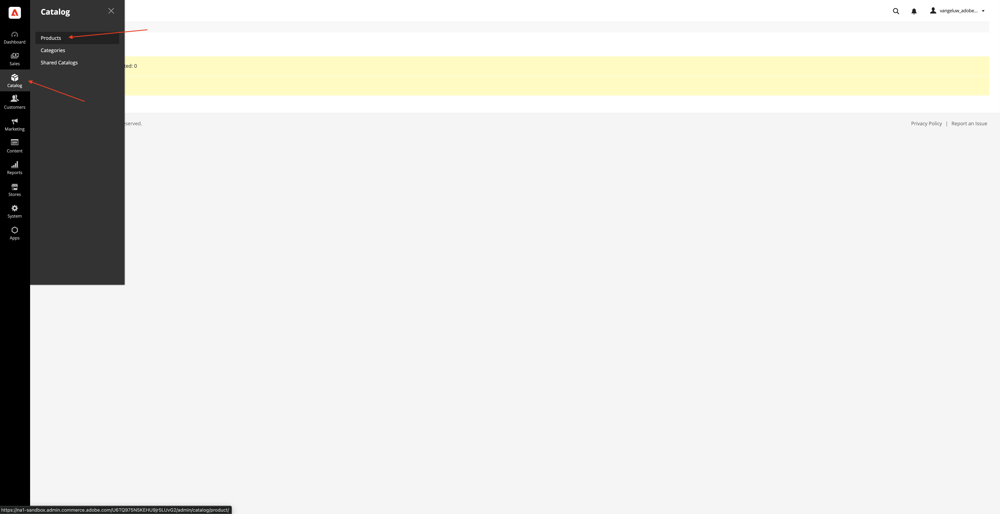

Desplácese hacia abajo para buscar los productos que acaba de importar.

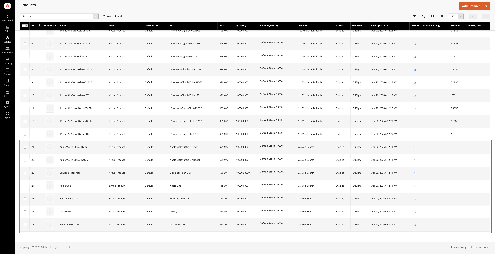

Siguiente paso: [Conectar ACCS a AEM Sites CS/EDS Storefront](./ex2.md){target="_blank"}

Volver a [Adobe Commerce as a Cloud Service](./accs.md){target="_blank"}

[Volver a todos los módulos](./../../../overview.md){target="_blank"}
