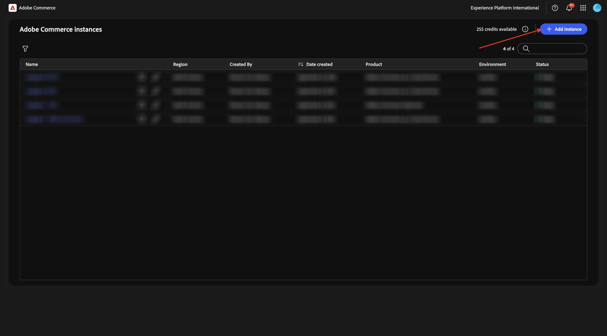
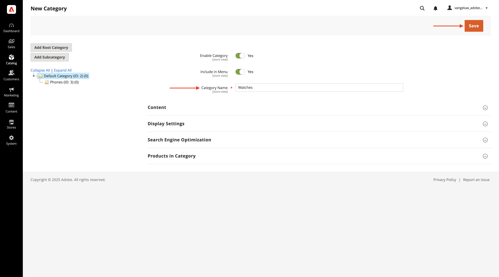
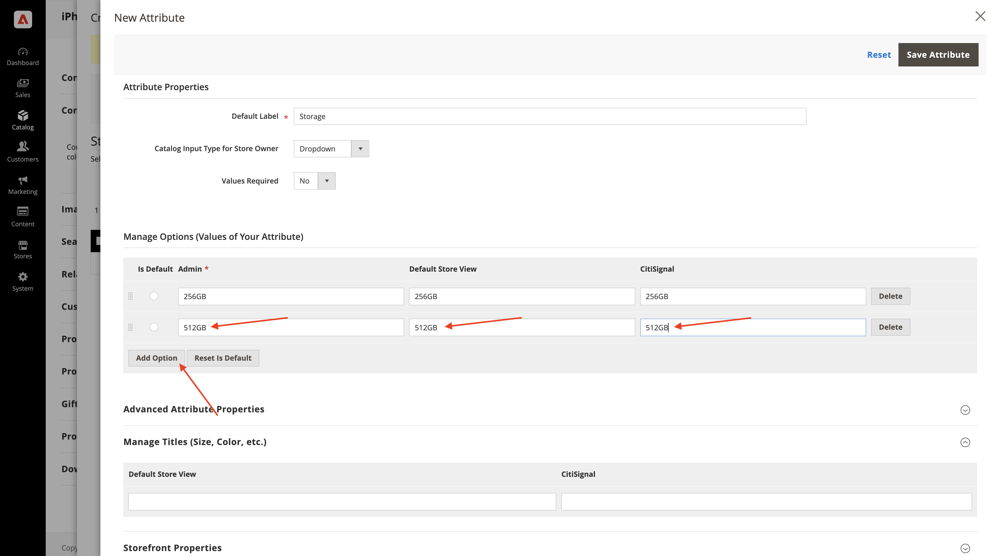
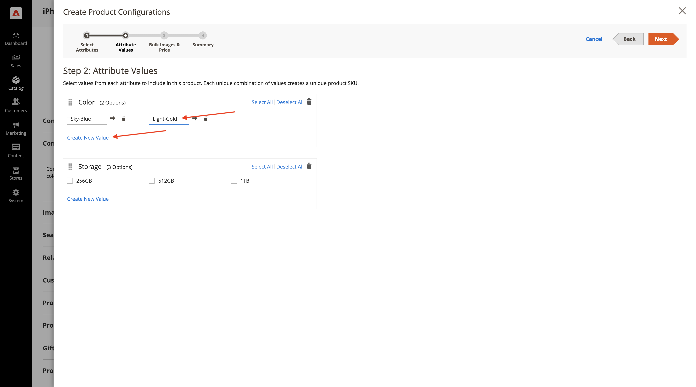
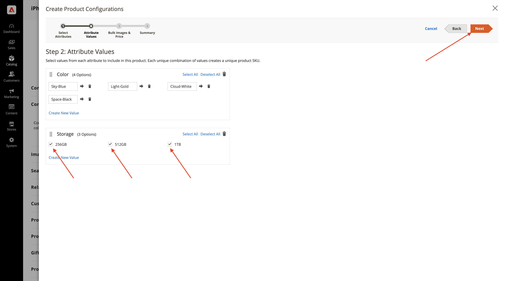

# 1.5.1 Introducción a Adobe Commerce as a Cloud Service

Vaya a [https://experience.adobe.com/](https://experience.adobe.com/){target="_blank"}. Asegúrese de que está en el entorno correcto, que debe llamarse `--aepImsOrgName--`. Haga clic en **Commerce**.

## 1.5.1.1: cree su instancia de ACCS

Entonces debería ver esto. Haga clic en **+ Agregar instancia**.

Rellene los campos de esta manera:

- **Nombre de instancia**: `--aepUserLdap-- - ACCS`
- **Entorno**: `Sandbox`
- **Región**: `North America`

Haga clic en **Agregar instancia**.

Su instancia se está creando en este momento. Esto puede tardar de 5 a 10 minutos.

Una vez que la instancia esté lista, haga clic en la instancia para abrirla.

## 1.5.1.2 Configurar su almacén de CitiSignal

Entonces debería ver esto. Haz clic en **Iniciar sesión con Adobe ID** y luego inicia sesión.

Una vez que haya iniciado sesión, debería ver esta página de inicio. El primer paso es configurar su tienda de CitiSignal en Commerce. Haga clic en **Tiendas**.

Haga clic en **Todas las tiendas**.

Haga clic en **Crear sitio web**.

Rellene los campos de esta manera:

- **Nombre**: `CitiSignal`
- **Código**: `citisignal`

Haga clic en **Guardar sitio web**.

Entonces deberías estar de vuelta aquí. Haga clic en **Crear tienda**.

Rellene los campos de esta manera:

- **Sitio web**: `CitiSignal`
- **Nombre**: `CitiSignal`
- **Código**: `citisignal`
- **Categoría raíz**: `Default Category`

Haga clic en **Guardar tienda**.

Entonces deberías estar de vuelta aquí. Haga clic en **Crear vista de tienda**.

Rellene los campos de esta manera:

- **Almacén**: `CitiSignal`
- **Nombre**: `CitiSignal`
- **Código**: `citisignal`
- **Estado**: `Enabled`

Haga clic en **Guardar vista de tienda**.

Entonces debería ver este mensaje. Haga clic en **Aceptar**.

Entonces deberías estar de vuelta aquí. Haga clic en el sitio web **CitiSignal** para abrirlo.

Marque la casilla de verificación para establecer este sitio web como el sitio web predeterminado.

Haga clic en **Guardar sitio web**.

Entonces deberías estar de vuelta aquí.

## 1.5.1.3 Configurar categorías y productos

Vaya a **Catálogo** y luego seleccione **Categorías**.

Seleccione **Categoría predeterminada** y haga clic en **Agregar subcategoría**.

Escriba el nombre `Phones` y haga clic en **Guardar**.

Seleccione **Categoría predeterminada** y luego haga clic en **Agregar subcategoría** de nuevo.

Escriba el nombre `Watches` y haga clic en **Guardar**.

A continuación, se deberían crear dos categorías.

A continuación, ve a **Catálogo** y selecciona **Productos**.

Entonces debería ver esto. Haga clic en **Agregar producto**.

Configure el producto de esta manera:

- **Nombre de producto**: `iPhone Air`
- **SKU**: `iPhone-Air`
- **Precio**: `999`
- **Cantidad**: `10000`
- **Categorías**: seleccione `Phones`

Haga clic en **Guardar**.

Desplácese hasta **Configuraciones** y haga clic en **Crear configuraciones**.

Entonces debería ver esto. Haga clic en **Crear nuevo atributo**.

Establezca la **Etiqueta predeterminada** en `Storage` y, a continuación, haga clic en **Agregar opción** en **Administrar opciones**.

Configure la primera opción con el nombre `256GB` en las 3 columnas y, a continuación, haga clic de nuevo en **Agregar opción**.

Configure la segunda opción con el nombre `512GB` en las 3 columnas y, a continuación, haga clic de nuevo en **Agregar opción**.

Configure la tercera opción con el nombre `1TB` en las 3 columnas.

Desplácese hacia abajo hasta **Propiedades de tienda**. Establezca las siguientes opciones en **Yes**:

- **Usar en la búsqueda**
- **Permitir etiquetas de HTML en tienda**
- **Visible en páginas de catálogo en Storefront**
- **Uso en la lista de productos**

Desplácese hacia arriba y haga clic en **Guardar atributo**.

Entonces debería ver esto. Seleccione ambos atributos para **color** y **almacenamiento** y haga clic en **Siguiente**.

Entonces debería ver esto. Ahora debe añadir las opciones de color disponibles. Para ello, haga clic en **Crear nuevo valor**.

Escriba el valor `Sky-Blue` y haga clic en **Crear nuevo valor**.

Escriba el valor `Light-Gold` y haga clic en **Crear nuevo valor**.

Escriba el valor `Cloud-White` y haga clic en **Crear nuevo valor**.

Escriba el valor `Space-Black`. Haga clic en **Seleccionar todo**

Seleccione las 3 opciones en **Almacenamiento** y haga clic en **Siguiente**.

Deje la configuración predeterminada y haga clic en **Siguiente**.

Entonces debería ver esto. Haga clic en **Generar productos**.

Establece la **cantidad** de cada producto en `10000`. Haga clic en **Guardar**.

Desplácese hacia abajo hasta **Producto en sitios web** y marque la casilla de **CitiSignal**.

Haga clic en **Guardar**.

Haga clic en **Confirmar**.

Entonces debería ver esto. Haga clic en **Atrás**.

Ahora verá el producto **iPhone Air** y sus variaciones en el catálogo de productos.

Siguiente paso: [Conectar ACCS a AEM Sites CS/EDS Storefront](./ex2.md){target="_blank"}

Volver a [Adobe Commerce as a Cloud Service](./accs.md){target="_blank"}

[Volver a todos los módulos](./../../../overview.md){target="_blank"}
