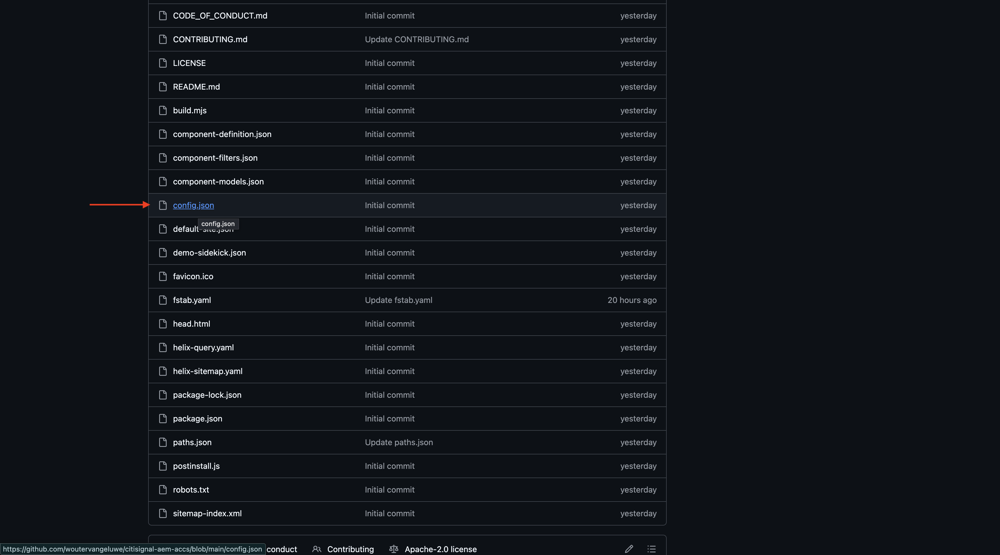
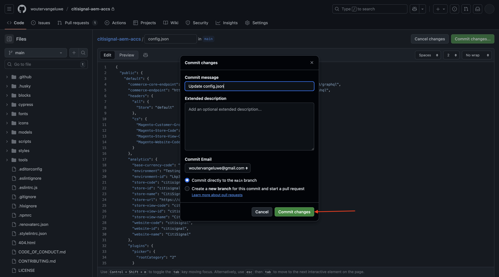

# 1.5.2 Conexión de ACCS a AEM Sites CS/EDS Storefront

>[!IMPORTANT]
>
>Para completar este ejercicio, debe tener acceso a un AEM Sites y a Assets CS en funcionamiento con el entorno EDS.
>
>Si aún no cuenta con ese entorno, vaya al ejercicio [Adobe Experience Manager Cloud Service &amp; Edge Delivery Services](./../../../modules/asset-mgmt/module2.1/aemcs.md){target="_blank"}. Siga las instrucciones allí y tendrá acceso a dicho entorno.

>[!IMPORTANT]
>
>Si ha configurado anteriormente un programa AEM CS con un entorno AEM Sites y Assets CS, es posible que la zona protegida de AEM CS haya estado en hibernación. Dado que la dehibernación de una zona protegida de este tipo tarda de 10 a 15 minutos, sería aconsejable iniciar el proceso de dehibernación ahora para que no tenga que esperar más adelante.

En este ejercicio, vinculará la tienda AEM Sites CS/EDS al servidor ACCS. En este momento, cuando abres tu AEM Sites CS/EDS Storefront y vas a la página de la lista de productos de **Phones**, todavía no ves ningún producto.

Al final de este ejercicio, debería ver los productos que configuró en el ejercicio anterior en la página de la lista de productos **Teléfonos** de su tienda AEM Sites CS/EDS.

Vaya a [https://experience.adobe.com/](https://experience.adobe.com/){target="_blank"}. Asegúrese de que está en el entorno correcto, que debe llamarse `--aepImsOrgName--`. Haga clic en **Commerce**.

Haga clic en el icono **información** junto a la instancia de ACCS, que debe llamarse `--aepUserLdap-- - ACCS`.

Entonces debería ver esto. Copie el **extremo de GraphQL**.

Vaya a [https://da.live/app/adobe-commerce/storefront-tools/tools/config-generator/config-generator](https://da.live/app/adobe-commerce/storefront-tools/tools/config-generator/config-generator). Ahora necesita generar un archivo config.json que se utilizará para vincular su tienda AEM Sites CS al servidor ACCS.

En la página **Generador de configuración**, pegue la dirección URL **GraphQL endpoint** que ha copiado.

Haga clic en **Generar**.

Copie la carga útil JSON completamente generada.

Vaya al repositorio de GitHub que se creó al configurar el entorno de AEM Sites CS/EDS. Ese repositorio se creó en el ejercicio [1.1.2 Configurar su entorno AEM CS](./../../../modules/asset-mgmt/module2.1/ex3.md){target="_blank"} y debe llamarse **citisignal-aem-accs**.

En el directorio raíz, desplácese hacia abajo y haga clic para abrir el archivo **config.json**.

Haga clic en el icono **Edit**.

Elimine todo el texto actual y reemplácelo pegando la carga útil JSON que copió en la página **Generador de configuración**.

Haga clic en **confirmar cambios...**.

Haga clic en **confirmar cambios**.

El archivo **config.json** se ha actualizado. Debería ver los cambios en el sitio web en un par de minutos. La manera de comprobar si los cambios se han realizado correctamente es ir a la página de producto **Teléfonos**. Ahora debería ver **iPhone Air** en la página.

Para acceder a su sitio web, debe ir a `main--citisignal-aem-accs--XXX.aem.page` y/o `main--citisignal-aem-accs--XXX.aem.live`, después de reemplazar XXX por su cuenta de usuario de GitHub, que en este ejemplo es `woutervangeluwe`.

En este ejemplo, la dirección URL completa se convierte en lo siguiente:
`https://main--citisignal-aem-accs--woutervangeluwe.aem.page` o `https://main--citisignal-aem-accs--woutervangeluwe.aem.live`.

Aunque el producto se está mostrando correctamente, aún no hay una imagen disponible para el producto. En el siguiente ejercicio, se configura el vínculo con AEM Assets CS para imágenes de productos.

Siguiente paso: [Conectar ACCS a AEM Assets CS](./ex3.md){target="_blank"}

Volver a [Adobe Commerce as a Cloud Service](./accs.md){target="_blank"}

[Volver a todos los módulos](./../../../overview.md){target="_blank"}
