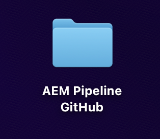
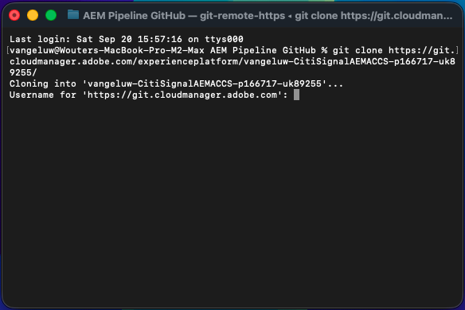
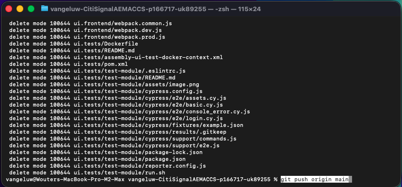
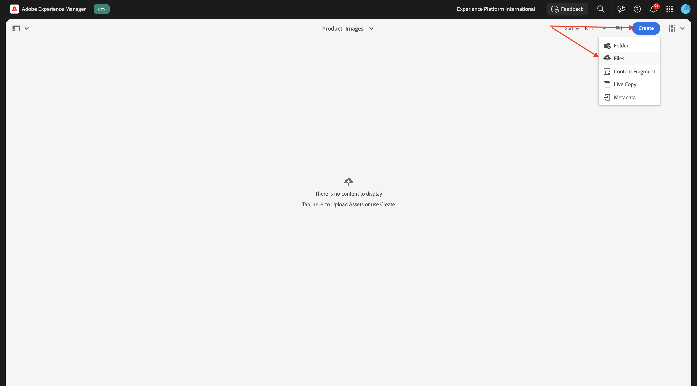

# 1.5.3 Conexión del ACCS a AEM Assets CS

>[!IMPORTANT]
>
>Para completar este ejercicio, debe tener acceso a un AEM Sites y a Assets CS en funcionamiento con el entorno EDS.
>
>Si aún no cuenta con ese entorno, vaya al ejercicio [Adobe Experience Manager Cloud Service &amp; Edge Delivery Services](./../../../modules/asset-mgmt/module2.1/aemcs.md){target="_blank"}. Siga las instrucciones allí y tendrá acceso a dicho entorno.

>[!IMPORTANT]
>
>Si ha configurado anteriormente un programa AEM CS con un entorno AEM Sites y Assets CS, es posible que la zona protegida de AEM CS haya estado en hibernación. Dado que la dehibernación de una zona protegida de este tipo tarda de 10 a 15 minutos, sería aconsejable iniciar el proceso de dehibernación ahora para que no tenga que esperar más adelante.

Después de completar el ejercicio anterior, pudo ver que ACCS devolvía un producto a su sitio web, pero aún no tenía una imagen. Al final de este ejercicio, también debería ver una imagen que se está devolviendo.


## 1.5.3.1 actualizar configuración de canalización

Vaya a [https://my.cloudmanager.adobe.com](https://my.cloudmanager.adobe.com){target="_blank"}. La organización que debe seleccionar es `--aepImsOrgName--`.

Haga clic para abrir el programa Cloud Manager, que debería llamarse `--aepUserLdap-- - CitiSignal AEM+ACCS`.


Desplácese un poco y haga clic en **Acceder a la info del repositorio** en la ficha **Canalizaciones**.


Entonces debería ver esto. Haga clic en **Generar contraseña**.


Vuelva a hacer clic en **Generar contraseña**.


Entonces debería tener una contraseña disponible. A continuación, haga clic en el icono **copiar** junto al campo **Línea de comandos Git**.


Cree un nuevo directorio en la ubicación que elija en su equipo y asígnele el nombre **GitHub de canalización de AEM**.



Haga clic con el botón derecho en la carpeta y seleccione **Nuevo terminal en la carpeta**.


Entonces debería ver esto.


Pegue el comando **Git command line** que copió anteriormente en la ventana de terminal.


Debe introducir un nombre de usuario. Copie el nombre de usuario de la canalización de programas de Cloud Manager **Acceder a la info del repositorio** y pulse **Intro**.



A continuación, debe introducir la contraseña. Copie la contraseña de la canalización de programas de Cloud Manager **Acceder a la info del repositorio** y pulse **Intro**.


Esto puede tardar un minuto. Una vez finalizado, tendrá una copia local del repositorio de Git vinculada a la canalización de su programa.


Verá un nuevo directorio en el directorio **GitHub de la canalización de AEM**. Abra ese directorio.


Seleccione todos los archivos de ese directorio y elimínelos.


Asegúrese de que el directorio esté vacío.


Vaya a [https://github.com/ankumalh/assets-commerce](https://github.com/ankumalh/assets-commerce).

A continuación, copie el archivo **assets-commerce-main.zip** en el escritorio y descomprímalo. Abra la carpeta **assets-commerce-main**.


Copie todos los archivos del directorio **assets-commerce-main** al directorio vacío del directorio de repositorio de canalización de su programa.


A continuación, abra **Microsoft Visual Studio Code** y abra la carpeta que contiene el repositorio de canalización de su programa en **Microsoft Visual Studio Code**.


Vaya a **Buscar** en el menú de la izquierda y busque `<my-app>`. Debe reemplazar todas las apariciones de `<my-app>` por `--aepUserLdap--citisignalaemaccs`.

Haga clic en el icono **reemplazar todo**.


Haga clic en **Reemplazar**.


Los nuevos archivos ya están listos para volver a cargarse en el repositorio de Git que está vinculado al repositorio de canalización de su programa. Para ello, abra la carpeta **GitHub de la canalización de AEM** y haga clic con el botón derecho en la carpeta que contiene los nuevos archivos. Seleccione **Nuevo terminal en la carpeta**.


Entonces debería ver esto. Pegue el comando `git add .` y pulse **intro**.


Entonces debería ver esto. Pegue el comando `git commit -m "add assets integration"` y pulse **intro**.


Entonces debería ver esto. Pegue el comando `git push origin main` y pulse **intro**.



Entonces debería ver esto. Sus cambios ahora se han implementado en el repositorio Git de la canalización de su programa.


Vuelva a Cloud Manager y haga clic en **Cerrar**.


Después de realizar cambios en el repositorio Git de la canalización, debe volver a ejecutar la canalización **Implementar en desarrollador**. Haga clic en los 3 puntos **...** y seleccione **Ejecutar**.


Haga clic en **Ejecutar**. La ejecución de una implementación de canalización puede tardar entre 10 y 15 minutos. Debe esperar hasta que la implementación de la canalización se complete correctamente antes de continuar.


## 1.5.3.2 Habilitar la integración de AEM Assets en ACCS

Vuelva a la instancia de ACCS. En el menú de la izquierda, ve a **Tiendas** y luego selecciona **Configuración**.


Desplácese hacia abajo en el menú hasta **SERVICIOS DE ADOBE** y, a continuación, abra **Integración de AEM Assets**. Entonces debería ver esto.


Complete las siguientes variables:

- **ID de programa de AEM Assets**: puede tomar el ID de programa de la URL de AEM CS Author. En este ejemplo, el identificador de programa es `166717`.


- **ID de entorno de AEM Assets**: puede tomar el ID de entorno de la URL de autor de AEM CS. En este ejemplo, el identificador de entorno es `1786231`.


- **Identificador de cliente IMS del selector de recursos**: establecido en `1`
- **Sincronización habilitada**: establecida en `Yes`
- **Propietario de la visualización**: establecido en `AEM Assets`
- **Regla de coincidencia de recursos**: `Match by product SKU`
- **Coincidencia por nombre de atributo SKU del producto**: `commerce:skus`

Haga clic en **Guardar configuración**.


Entonces debería ver esto.


## 1.5.3.3 Actualizar config.json

Vaya al repositorio de GitHub que se creó al configurar el entorno de AEM Sites CS/EDS. Ese repositorio se creó en el ejercicio [1.1.2 Configurar su entorno AEM CS](./../../../modules/asset-mgmt/module2.1/ex3.md){target="_blank"} y debe llamarse **citisignal-aem-accs**.

En el directorio raíz, desplácese hacia abajo y haga clic para abrir el archivo **config.json**. Haga clic en el icono **editar** para realizar cambios en el archivo.


Agregue el siguiente fragmento de código en la línea 5 `"commerce-endpoint": "https://na1-sandbox.api.commerce.adobe.com/XXX/graphql",`:

```json
 "commerce-assets-enabled": "true",
```

Haga clic en **Confirmar cambios...**.


Haga clic en **Confirmar cambios**.


El cambio se ha guardado y se publicará próximamente. Pueden pasar un par de minutos antes de que el cambio sea visible en la tienda.


## 1.5.3.4 Verificar campos de Commerce en AEM Assets CS

Inicie sesión en el entorno de AEM CS Author y vaya a **Assets**.


Ir a **Archivos**.


Abra la carpeta **CitiSignal**.


Pase el ratón sobre cualquier recurso y haga clic en el icono **información**.


Ahora debería ver una ficha **Commerce** que contiene 2 atributos de metadatos nuevos.


El entorno de AEM Assets CS ahora admite la integración de Commerce. Ahora puede empezar a cargar imágenes de productos.

## 1.5.3.4 Cargar Assets del producto y enlazar con productos

[Descargue las imágenes del producto aquí](./images/Product_Images.zip). Una vez descargados, exporte los archivos a su escritorio.


Haga clic en **Crear** y luego seleccione **Carpeta**.


Escriba el valor **Product_Images** para los campos **Title** y **Name**. Haga clic en **Crear**.


Haga clic en para abrir la carpeta que acaba de crear.


Haga clic en **Crear** y luego seleccione **Archivos**.



Vaya a la carpeta **Product_Images** del escritorio, seleccione todos los archivos y haga clic en **Abrir**.


Haga clic en **Cargar**.


Las imágenes estarán disponibles en la carpeta. Pase el ratón sobre el producto **iPhone-Air-Light-Gold.png** y haga clic en el icono **Propiedades**.


Desplácese hacia abajo y establezca el campo **Estado de revisión** en **Aprobado**. La integración de AEM Assets CS - ACCS solo funciona para imágenes aprobadas.


Desplácese hacia arriba, vaya a la ficha **Commerce** y, a continuación, haga clic en **Agregar** en **SKU del producto**.


Añada los siguientes SKU para este producto:

| Clave | Valor | Uso |
|:-------------:| :---------------:| :---------------:| 
| `iPhone-Air-Light-Gold` | `1` | `thumbnail, image, swatch_image, small_image` |
| `iPhone-Air-Light-Gold-256GB` | `1` | `thumbnail, image, swatch_image, small_image` |
| `iPhone-Air-Light-Gold-512GB` | `1` | `thumbnail, image, swatch_image, small_image` |
| `iPhone-Air-Light-Gold-1TB` | `1` | `thumbnail, image, swatch_image, small_image` |

Entonces deberías tener esto. Haga clic en **Guardar y cerrar**.


Pase el ratón sobre el producto **iPhone-Air-Space-Black.png** y haga clic en el icono **Propiedades**.


Desplácese hacia abajo y establezca el campo **Estado de revisión** en **Aprobado**. La integración de AEM Assets CS - ACCS solo funciona para imágenes aprobadas.


Desplácese hacia arriba, vaya a la ficha **Commerce** y, a continuación, haga clic en **Agregar** en **SKU del producto**.


Añada los siguientes SKU para este producto:

| Clave | Valor | Uso |
|:-------------:| :---------------:| :---------------:| 
| `iPhone-Air-Space-Black` | `1` | `thumbnail, image, swatch_image, small_image` |
| `iPhone-Air-Space-Black-256GB` | `1` | `thumbnail, image, swatch_image, small_image` |
| `iPhone-Air-Space-Black-512GB` | `1` | `thumbnail, image, swatch_image, small_image` |
| `iPhone-Air-Space-Black-1TB` | `1` | `thumbnail, image, swatch_image, small_image` |
| `iPhone-Air` | `1` | `thumbnail, image, swatch_image, small_image` |

Entonces deberías tener esto. Haga clic en **Guardar y cerrar**.


Pase el ratón sobre el producto **iPhone-Air-Sky-Blue.png** y haga clic en el icono **Propiedades**.


Desplácese hacia abajo y establezca el campo **Estado de revisión** en **Aprobado**. La integración de AEM Assets CS - ACCS solo funciona para imágenes aprobadas.


Desplácese hacia arriba, vaya a la ficha **Commerce** y, a continuación, haga clic en **Agregar** en **SKU del producto**.


Añada los siguientes SKU para este producto:

| Clave | Valor | Uso |
|:-------------:| :---------------:| :---------------:| 
| `iPhone-Air-Sky-Blue` | `1` | `thumbnail, image, swatch_image, small_image` |
| `iPhone-Air-Sky-Blue-256GB` | `1` | `thumbnail, image, swatch_image, small_image` |
| `iPhone-Air-Sky-Blue-512GB` | `1` | `thumbnail, image, swatch_image, small_image` |
| `iPhone-Air-Sky-Blue-1TB` | `1` | `thumbnail, image, swatch_image, small_image` |

Entonces deberías tener esto. Haga clic en **Guardar y cerrar**.


Pase el ratón sobre el producto **iPhone-Air-Cloud-White.png** y haga clic en el icono **Propiedades**.


Desplácese hacia abajo y establezca el campo **Estado de revisión** en **Aprobado**. La integración de AEM Assets CS - ACCS solo funciona para imágenes aprobadas.


Desplácese hacia arriba, vaya a la ficha **Commerce** y, a continuación, haga clic en **Agregar** en **SKU del producto**.


Añada los siguientes SKU para este producto:

| Clave | Valor | Uso |
|:-------------:| :---------------:| :---------------:| 
| `iPhone-Air-Cloud-White` | `1` | `thumbnail, image, swatch_image, small_image` |
| `iPhone-Air-Cloud-White-256GB` | `1` | `thumbnail, image, swatch_image, small_image` |
| `iPhone-Air-Cloud-White-512GB` | `1` | `thumbnail, image, swatch_image, small_image` |
| `iPhone-Air-Cloud-White-1TB` | `1` | `thumbnail, image, swatch_image, small_image` |

Entonces deberías tener esto. Haga clic en **Guardar y cerrar**.


Ahora, cada imagen de **iPhone Air** debe tener **pulgares verdes hacia arriba**, lo que indica que el recurso se ha aprobado.


## 1.5.3.5 Verificar imágenes de productos en la tienda AEM Sites CS/EDS

>[!NOTE]
>
>Los cambios realizados anteriormente pueden tardar hasta 15 minutos en implementarse correctamente. Si todavía no ve su imagen, espere 15 minutos y vuelva a intentarlo.

Para comprobar que la integración funciona, debe abrir el sitio web de CitiSignal.

Para acceder a su sitio web, vaya a `main--citisignal-aem-accs--XXX.aem.page` o `main--citisignal-aem-accs--XXX.aem.live`, después de reemplazar XXX por su cuenta de usuario de GitHub, que en este ejemplo es `woutervangeluwe`.

En este ejemplo, la dirección URL completa se convierte en lo siguiente:
`https://main--citisignal-aem-accs--woutervangeluwe.aem.page` o `https://main--citisignal-aem-accs--woutervangeluwe.aem.live`.

Entonces debería ver esto. Vaya a **Teléfonos**.


Debería ver una imagen de producto que se está mostrando para **iPhone Air**. Haga clic en **iPhone Air**.


Entonces debería ver esto. Realice un cambio en las opciones de color y almacenamiento, y verá que las imágenes cambian dinámicamente en función de las opciones que haya tomado.


Este es un ejemplo de cómo cambiar el color a **Oro claro** y el tamaño de almacenamiento a **256 GB**.


Siguiente paso: [Resumen y beneficios](./summary.md){target="_blank"}

Volver a [Adobe Commerce as a Cloud Service](./accs.md){target="_blank"}

[Volver a todos los módulos](./../../../overview.md){target="_blank"}
