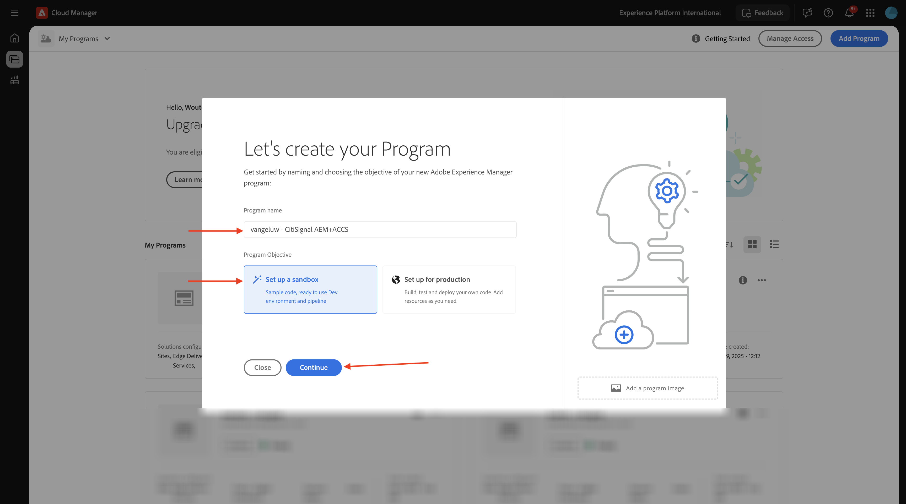
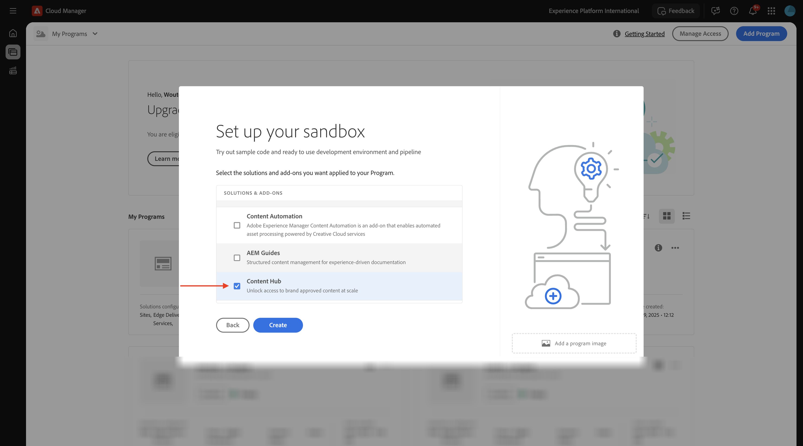
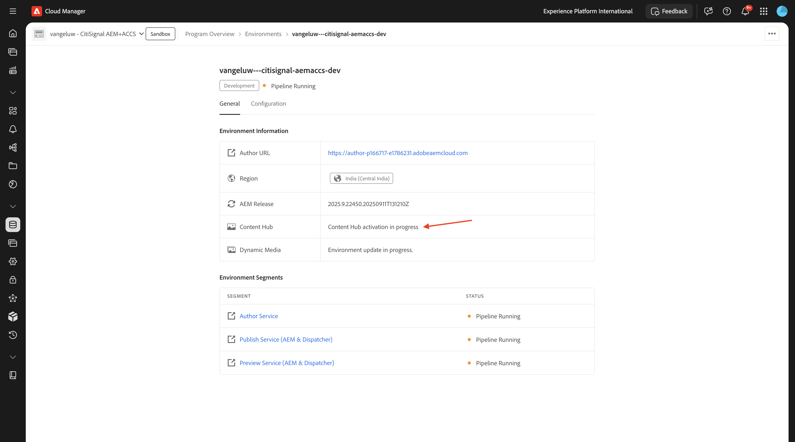

# 1.1.1 Creación de su programa de Cloud Manager

Vaya a [https://my.cloudmanager.adobe.com](https://my.cloudmanager.adobe.com){target="_blank"}. La organización que debe seleccionar es `--aepImsOrgName--`. Entonces verás algo como esto. Haga clic en **Agregar programa**.

Para el **Nombre de programa**, use `--aepUserLdap-- - CitiSignal AEM+ACCS`. Seleccione la opción **Configurar una zona protegida**. Haga clic en **Continuar**.

Asegúrese de que las siguientes opciones están seleccionadas:

- Sitios
- Formularios
- Recursos

Haga clic en la flecha de **Assets** para abrir la lista de opciones.

Asegúrese de que las siguientes opciones están seleccionadas:

- Content Hub

Desplazarse hacia abajo en la lista.

Asegúrese de que las siguientes opciones están seleccionadas:

- Edge Delivery Services
- Medios dinámicos

Haga clic en **Crear**.

La creación del entorno tardará un poco, de 10 a 20 minutos.

Una vez creados los entornos y listos para usarlos, recibirá una confirmación por correo electrónico tras la cual puede volver aquí.

Una vez que hayas recibido tu confirmación por correo electrónico, vuelve a [https://my.cloudmanager.adobe.com](https://my.cloudmanager.adobe.com){target="_blank"}. Verá que el estado del programa ha cambiado a **Listo**. Haga clic en el programa para abrirlo.

Eche un vistazo a la pestaña **Canalizaciones**. Haga clic en los 3 puntos **...** y luego haga clic en **Ejecutar**.

Haga clic en **Ejecutar**.

A continuación, haga clic en los 3 puntos **...** en la ficha **Entornos** y haga clic en **Ver detalles**.

A continuación, verá los detalles del entorno, incluida la dirección URL del entorno **Author**, que necesitará en el siguiente ejercicio.

Eche un vistazo a la línea **Content Hub** y seleccione **Haga clic para activar**.

Haga clic en **Activar**.

La activación de **Content Hub** se ha iniciado. Esto puede tardar 10 minutos o más.

Después de unos 10 minutos, se activará **Content Hub**.
A continuación, observe la línea **Dynamic Media** y seleccione **Haga clic para activar**.

Haga clic en **Activar**.

Se ha iniciado la activación de **Dynamic Media**. Esto puede tardar 10 minutos o más.

Después de unos 10 minutos, se activará **Dynamic Media**.

Una vez finalizada la ejecución de la canalización, puede continuar con el siguiente ejercicio.

Siguiente paso: [Configurar el entorno de AEM CS](./ex3.md){target="_blank"}

Volver a [Adobe Experience Manager Cloud Service &amp; Edge Delivery Services](./aemcs.md){target="_blank"}

[Volver a todos los módulos](./../../../overview.md){target="_blank"}
