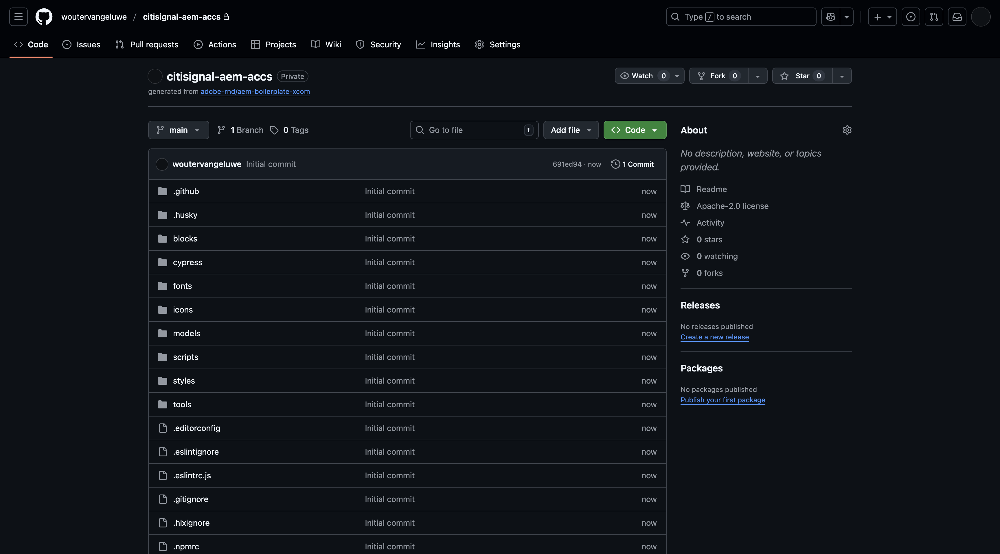
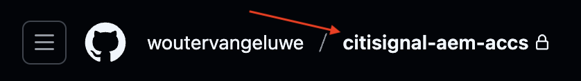
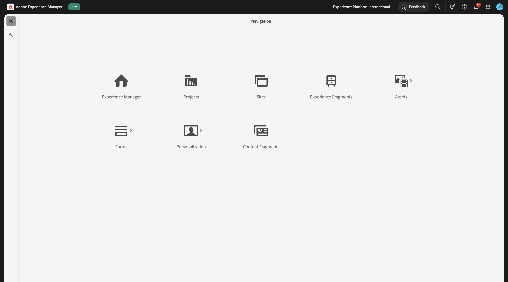
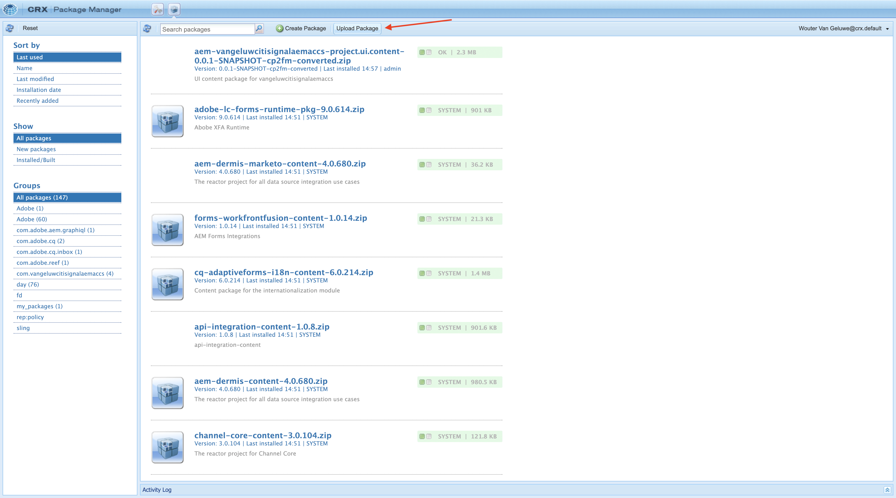
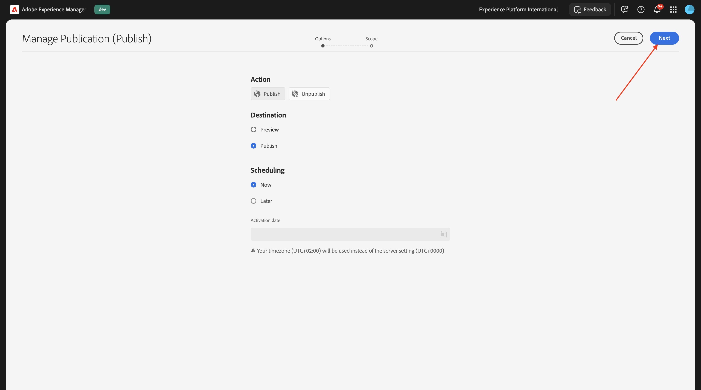
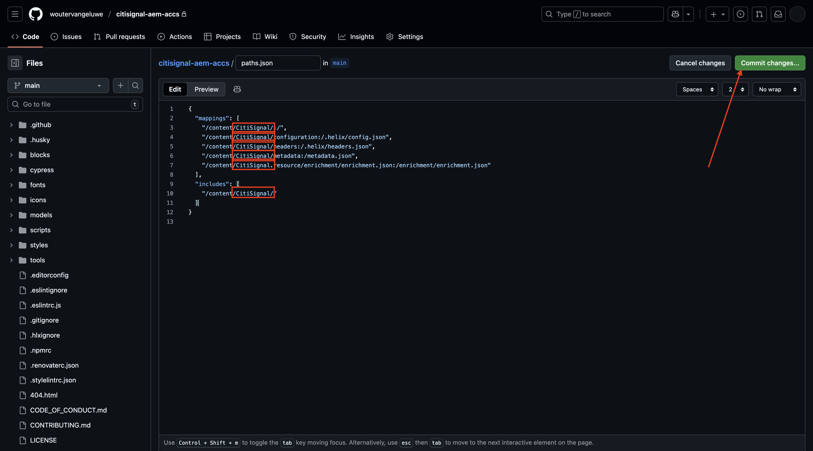

# 1.1.2 Configuración del entorno de AEM CS

## 1.1.2.1 Configurar su repositorio de GitHub

Vaya a [https://github.com](https://github.com){target="_blank"}. Haga clic en **Iniciar sesión**.

Introduzca sus credenciales. Haga clic en **Iniciar sesión**.

Cuando haya iniciado sesión, verá su panel de GitHub.

Vaya a [https://github.com/adobe-rnd/aem-boilerplate-xcom](https://github.com/adobe-rnd/aem-boilerplate-xcom){target="_blank"}. Entonces verá esto... Haga clic en **Usar esta plantilla** y luego haga clic en **Crear un nuevo repositorio**.

Para el **nombre del repositorio**, use `citisignal-aem-accs`. Establezca la visibilidad en **Privado**. Haga clic en **Crear repositorio**.

Después de un par de segundos, se crea el repositorio.

A continuación, vaya a [https://github.com/apps/aem-code-sync](https://github.com/apps/aem-code-sync){target="_blank"}. Haga clic en **Instalar** o **Configurar**.

Haga clic en el botón **Continuar** situado junto a la cuenta de usuario de GitHub.

Haga clic en **Configurar** junto a su cuenta de usuario de GitHub.

Haga clic en **Seleccionar solo repositorios** y, a continuación, agregue el repositorio que acaba de crear.

Desplácese hacia abajo y haga clic en **Guardar**.

Luego recibirás esta confirmación.

## 1.1.2.2 Actualizar archivo fstab.yaml

En su repositorio de GitHub, haga clic para abrir el archivo `fstab.yaml`.

Haga clic en el icono **editar**.

Ahora necesita actualizar el valor del campo **url** en la línea 3.

Debe reemplazar el valor actual por la URL de su entorno AEM Sites CS específico en combinación con la configuración de su repositorio de GitHub.

Este es el valor actual de la dirección URL: `https://author-p130360-e1272151.adobeaemcloud.com/bin/franklin.delivery/adobe-rnd/aem-boilerplate-xcom/main`.

Hay tres partes de la dirección URL que deben actualizarse

`https://XXX/bin/franklin.delivery/YYY/ZZZ/main`

XXX debe ser reemplazado por la URL de su entorno de AEM CS Author.

AAAA debe reemplazarse por su cuenta de usuario de GitHub.

ZZZ debe reemplazarse por el nombre del repositorio de GitHub que utilizó en el ejercicio anterior.

Puede encontrar la URL del entorno de AEM CS Author en [https://my.cloudmanager.adobe.com](https://my.cloudmanager.adobe.com){target="_blank"}. Haga clic en **Programa** para abrirlo.

A continuación, haga clic en los 3 puntos **...** en la ficha **Entornos** y haga clic en **Ver detalles**.

A continuación, verá los detalles del entorno, incluida la dirección URL del entorno **Autor**. Copie la dirección URL.

XXX = `author-p166717-e1786231.adobeaemcloud.com`

Para el nombre de cuenta de usuario de GitHub, puede encontrarlo fácilmente en la URL de su explorador. En este ejemplo, el nombre de cuenta de usuario es `woutervangeluwe`.

AAAA = `woutervangeluwe`

Para el nombre del repositorio de GitHub, también puede encontrarlo en la ventana del explorador que ha abierto en GitHub. En este caso, el nombre del repositorio es `citisignal`.

ZZZ = `citisignal-aem-accs`

Estos tres valores combinados dan lugar a esta nueva dirección URL que debe configurarse en el archivo `fstab.yaml`.

`https://author-p166717-e1786231.adobeaemcloud.com/bin/franklin.delivery/woutervangeluwe/citisignal-aem-accs/main`

Haga clic en **Confirmar cambios...**.

Haga clic en **Confirmar cambios**.

Se ha actualizado el archivo `fstab.yaml`.

## 1.1.2.3 Cargar recursos y sitio de CitiSignal

Vaya a [https://my.cloudmanager.adobe.com](https://my.cloudmanager.adobe.com){target="_blank"}. Haga clic en **Programa** para abrirlo.

A continuación, haga clic en la dirección URL del entorno de Author.

Haga clic en **Iniciar sesión con Adobe**.

A continuación, verá su entorno de Author.

La dirección URL será similar a la siguiente: `https://author-p166717-e1786231.adobeaemcloud.com/ui#/aem/aem/start.html?appId=aemshell`

Ahora necesita acceder al entorno **CRX Package Manager** de AEM. Para ello, elimine `ui#/aem/aem/start.html?appId=aemshell` de la dirección URL y reemplácelo por `crx/packmgr`, lo que significa que la dirección URL debería tener este aspecto ahora:
`https://author-p166717-e1786231.adobeaemcloud.com/crx/packmgr`.
Pulse **Intro** para cargar el entorno del administrador de paquetes

A continuación, haga clic en **Cargar paquete**.

Haga clic en **Examinar** para localizar el paquete que desea cargar.

El paquete que se va a cargar se llama **citisignal-assets.zip** y se puede descargar aquí: [https://one-adobe-tech-insiders.s3.us-west-2.amazonaws.com/one-adobe/citisignal_aem_accs.zip](https://one-adobe-tech-insiders.s3.us-west-2.amazonaws.com/one-adobe/citisignal_aem_accs.zip){target="_blank"}.

Seleccione el paquete `citisignal_aem_accs.zip` y haga clic en **Abrir**.

A continuación, haga clic en **Aceptar**.

A continuación, se carga el paquete. A continuación, haga clic en **Instalar** en el paquete que acaba de cargar.

Haga clic en **Instalar**.

Después de un par de minutos, el paquete se instalará.

Ahora puede cerrar esta ventana.

## 1.1.2.4 publicar recursos de CitiSignal

Vaya a [https://my.cloudmanager.adobe.com](https://my.cloudmanager.adobe.com){target="_blank"}. Haga clic en **Programa** para abrirlo.

A continuación, haga clic en la dirección URL del entorno de Author.

Haga clic en **Iniciar sesión con Adobe**.

A continuación, verá su entorno de Author. Haga clic en **Assets**.

Haga clic en **Archivos**.

Haga clic para seleccionar la carpeta **CitiSignal** y luego haga clic en **Administrar publicación**.

Haga clic en **Next**.

Haga clic en **Publicar**.

Sus recursos se han publicado.

## 1.1.2.5 Publicar sitio web de CitiSignal

Haz clic en el nombre del producto **Adobe Experience Manager** en la esquina superior izquierda de la pantalla y, a continuación, haz clic en la **flecha** junto a **Assets**.

A continuación, haga clic en **Sitios**.

Luego debería ver su sitio web **CitiSignal**, que se creó después de instalar el paquete anteriormente.

Para vincular el sitio al repositorio de GitHub que creó anteriormente, debe crear una **configuración de Edge Delivery Services**.

El primer paso es crear una **configuración de nube**.

Para ello, haga clic en el nombre del producto **Adobe Experience Manager** en la esquina superior izquierda de la pantalla, luego haga clic en el icono **herramientas** y seleccione **General**. Haga clic para abrir **Explorador de configuración**.

Entonces debería ver esto. Haga clic en **Crear**

Establezca los campos **Title** y **Name** en `CitiSignal`. Habilite la casilla de verificación para **Configuraciones de nube**.

Haga clic en **Crear**.

Entonces deberías tener esto.

A continuación, debe actualizar algunos campos de la **configuración de nube** que acaba de crear.

Para ello, haga clic en el nombre del producto **Adobe Experience Manager** en la esquina superior izquierda de la pantalla, luego haga clic en el icono **herramientas** y seleccione **Cloud Services**. Haga clic para abrir **Configuración de Edge Delivery Services**.

Seleccione **CitiSignal**, haga clic en **Crear** y seleccione **Configuración**.

Ahora debe rellenar los campos **Organización** y **Nombre del sitio**. Para ello, consulte primero la dirección URL del repositorio de GitHub.

- **Organización**: use el nombre de su nombre de organización de GitHub, en este ejemplo es `woutervangeluwe`
- **Nombre del sitio**: use el nombre del repositorio de GitHub, que debería ser `citisignal-aem-accs`.

Haga clic en **Guardar y cerrar**.

Entonces deberías tener esto. Habilite la casilla de verificación delante de la configuración de nube de Edge que acaba de crear y haga clic en **Publicar**.

## 1.1.2.6 Actualizar rutas de archivo.json

En su repositorio de GitHub, haga clic para abrir el archivo `paths.json`.

Haga clic en el icono **editar**.

Ahora necesita actualizar el texto de reemplazo `aem-boilerplate-commerce` por `CitiSignal` en las líneas 3, 4, 5, 6, 7 y 10.

Haga clic en **Confirmar cambios**.

Haga clic en **Confirmar cambios**.

Se ha actualizado el archivo `paths.json`.

## 1.1.2.7 Publicar sitio web de CitiSignal

Haz clic en el nombre del producto **Adobe Experience Manager** en la esquina superior izquierda de la pantalla y, a continuación, selecciona **Sitios**.

A continuación, haga clic en la casilla de verificación que hay delante de **CitiSignal**. A continuación, haga clic en **Administrar publicación**.

Haga clic en **Next**.

Haga clic en **Incluir configuración secundaria**.

Haga clic para seleccionar la casilla de verificación **Incluir elementos secundarios** y, a continuación, haga clic para anular la selección de las demás casillas de verificación. Haga clic en **Aceptar**.

Haga clic en **Publicar**.

Luego te enviarán de vuelta aquí. Haga clic en **CitiSignal**, seleccione la casilla de verificación que hay delante de **índice** y, a continuación, haga clic en **Editar**.

Su sitio web se abrirá en el **Editor universal**.

Ahora podrá acceder a su sitio web yendo a `main--citisignal-aem-accs--XXX.aem.page` y/o `main--citisignal-aem-accs--XXX.aem.live`, después de reemplazar XXX por su cuenta de usuario de GitHub, que en este ejemplo es `woutervangeluwe`.

En este ejemplo, la dirección URL completa se convierte en lo siguiente:
`https://main--citisignal-aem-accs--woutervangeluwe.aem.page` o `https://main--citisignal-aem-accs--woutervangeluwe.aem.live`.

Puede llevar algún tiempo antes de que todos los recursos se muestren correctamente, ya que primero deben publicarse.

A continuación, verá esto:

## 1.1.2.8 Rendimiento de página de prueba

Vaya a [https://pagespeed.web.dev/](https://pagespeed.web.dev/){target="_blank"}. Escriba su dirección URL y haga clic en **Analizar**.

A continuación, verá que el sitio web, tanto en una visualización móvil como de escritorio, obtiene una puntuación alta:

**Móvil**:

**Escritorio**:

Paso siguiente: [Desarrollar un bloque personalizado](./ex3.md){target="_blank"}

Volver a [Adobe Experience Manager Cloud Service &amp; Edge Delivery Services](./aemcs.md){target="_blank"}

[Volver a todos los módulos](./../../../overview.md){target="_blank"}
