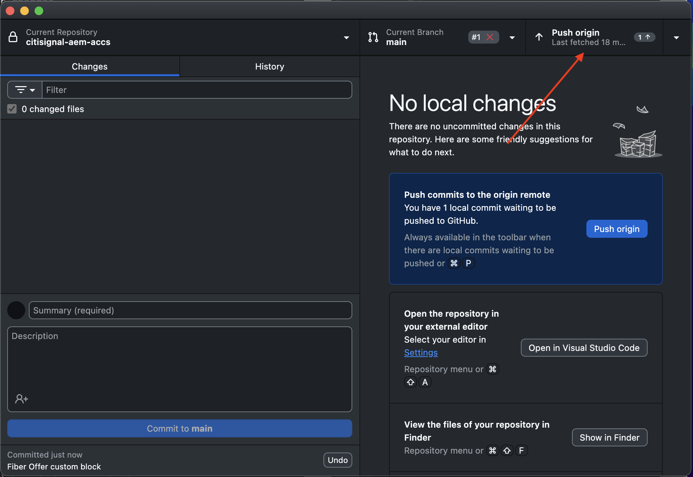
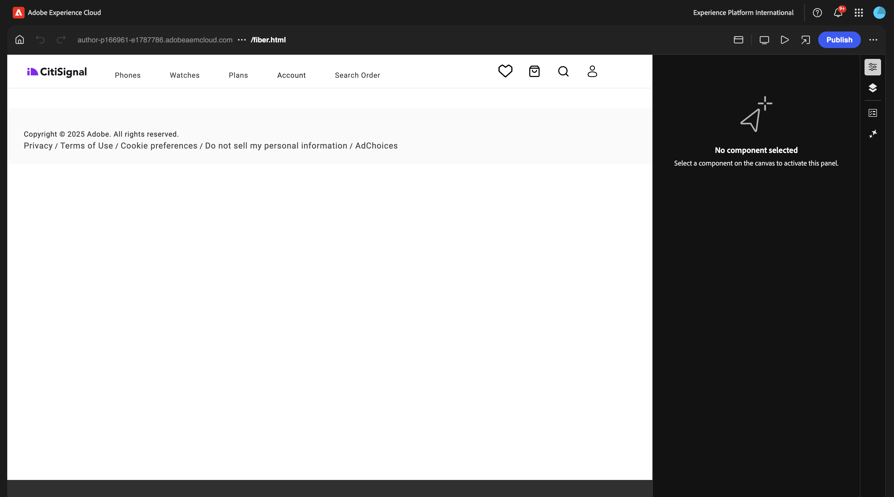
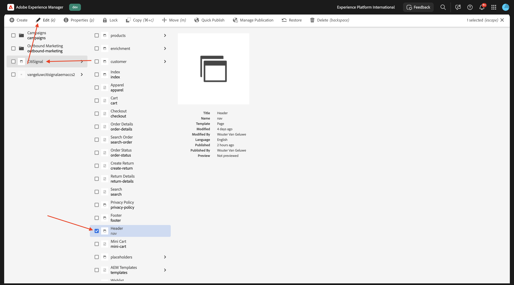

# 1.1.3 Desarrollar un bloque personalizado básico

## 1.1.3.1 Configure su entorno de desarrollo local

Vaya a [https://desktop.github.com/download/](https://desktop.github.com/download/){target="_blank"}, descargue e instale **Github Desktop**.

{zoomable="yes"}

Una vez instalado Github Desktop, vaya al repositorio de GitHub que creó en el ejercicio anterior. Haga clic en **&lt;> código** y, a continuación, haga clic en **Abrir con GitHub Desktop**.

{zoomable="yes"}

El repositorio de GitHub se abrirá en GitHub Desktop. No dude en cambiar la **Ruta local**. Haga clic en **Clonar**.

{zoomable="yes"}

A continuación, se creará una carpeta local.

{zoomable="yes"}

Abra Código de Visual Studio. Vaya a **Archivo** > **Abrir carpeta**.

{zoomable="yes"}

Seleccione la carpeta que usa la configuración de GitHub para **citisignal**.

{zoomable="yes"}

Ahora verá esa carpeta abierta en Visual Studio Code y ya estará listo para crear un nuevo bloque.

{zoomable="yes"}

## 1.1.3.2 Crear un bloque personalizado básico

Adobe recomienda desarrollar bloques en un enfoque de tres fases:

- Cree la definición y el modelo para el bloque, revíselo y llevelo a producción.
- Cree contenido con el nuevo bloque.
- Implemente la decoración y los estilos para el nuevo bloque.

### component-definition.json

En Visual Studio Code, abra el archivo **component-definition.json**.

{zoomable="yes"}

Desplácese hacia abajo hasta que vea el componente **Cita**. Coloque el cursor junto al corchete de cierre del último componente.

{zoomable="yes"}

Pegue este código e introduzca una coma **,** después del bloque de código:

```json
{
  "title": "FiberOffer",
  "id": "fiberoffer",
  "plugins": {
    "xwalk": {
      "page": {
        "resourceType": "core/franklin/components/block/v1/block",
        "template": {
          "name": "FiberOffer",
          "model": "fiberoffer",
          "offerText": "<p>Fiber will soon be available in your region!</p>",
          "offerCallToAction": "Get your offer now!",
          "offerImage": ""
        }
      }
    }
  }
}
```

Guarde los cambios.

{zoomable="yes"}

### component-models.json

En Visual Studio Code, abra el archivo **component-models.json**.

{zoomable="yes"}

Desplácese hacia abajo hasta que vea el último elemento. Coloque el cursor junto al corchete de cierre del último componente.

{zoomable="yes"}

Escriba una coma **,** y, a continuación, presione Intro y, en la línea siguiente, pegue este código:

```json
{
  "id": "fiberoffer",
  "fields": [
     {
       "component": "richtext",
       "name": "offerText",
       "value": "",
       "label": "Offer Text",
       "valueType": "string"
     },
     {
       "component": "richtext",
       "valueType": "string",
       "name": "offerCallToAction",
       "label": "Offer CTA",
       "value": ""
     },
     {
       "component": "reference",
       "valueType": "string",
       "name": "offerImage",
       "label": "Offer Image",
        "multi": false
     }
   ]
}
```

Guarde los cambios.

{zoomable="yes"}

### component-filters.json

En Visual Studio Code, abra el archivo **component-filters.json**.

{zoomable="yes"}

En la **sección**, escriba una coma **,** y el identificador de su componente **fiberoffer** después de la última línea actual.

Guarde los cambios.

{zoomable="yes"}

## 1.1.3.3: confirmar los cambios

Ahora ha realizado varios cambios en el proyecto que deben volver a enviarse al repositorio de GitHub. Para ello, abra **GitHub Desktop**.

Entonces debería ver los 3 archivos que acaba de editar en **Cambios**. Revise los cambios.

{zoomable="yes"}

Escriba un nombre para su PR, `Fiber Offer custom block`. Haga clic en **Compromiso con main**.

{zoomable="yes"}

Entonces debería ver esto. Haga clic en **Origen push**.

{zoomable="yes"}

Después de un par de segundos, los cambios se han insertado en el repositorio de GitHub.

{zoomable="yes"}

En el navegador, vaya a su cuenta de GitHub y al repositorio que ha creado para CitiSignal. Debería ver algo similar a esto, que muestre que se han recibido los cambios.

{zoomable="yes"}

## 1.1.3.4 Agregar el bloque a una página

Ahora que el bloque de presupuesto básico está definido y comprometido con el proyecto CitiSignal, puede agregar un bloque **fiberoffer** a una página existente.

Vaya a [https://my.cloudmanager.adobe.com](https://my.cloudmanager.adobe.com){target="_blank"}. Haga clic en **Programa** para abrirlo.

{zoomable="yes"}

A continuación, haga clic en los 3 puntos **...** en la ficha **Entornos** y haga clic en **Ver detalles**.

{zoomable="yes"}

A continuación, verá los detalles del entorno. Haga clic en la dirección URL del entorno **Author**.

>[!NOTE]
>
>Es posible que el entorno esté en hibernación. En ese caso, primero deberá anular la hibernación del entorno.

{zoomable="yes"}

Luego debería ver el entorno de AEM Author. Ir a **Sitios**.

{zoomable="yes"}

Vaya a **CitiSignal** > **us** > **en**.

{zoomable="yes"}

Haga clic en **Crear** y seleccione **Página**.

{zoomable="yes"}

Seleccione **Página** y haga clic en **Siguiente**.

{zoomable="yes"}

Introduzca los siguientes valores:

- Título: **CitiSignal Fiber**
- Nombre: **citisignal-fiber**
- Título de página: **CitiSignal Fiber**

Haga clic en **Crear**.

{zoomable="yes"}

Entonces debería ver esto.

{zoomable="yes"}

Haga clic en el área en blanco para seleccionar el componente **section**. A continuación, haga clic en el icono más **+** en el menú derecho.

{zoomable="yes"}

Debería ver el bloque personalizado en la lista de bloques disponibles. Haga clic en para seleccionarlo.

{zoomable="yes"}

Verá campos como **Texto de oferta**, **CTA de oferta** e **Imagen de oferta** que se agregan al editor. Haga clic en **+ Agregar** en el campo **Imagen de la oferta** para seleccionar una imagen.

{zoomable="yes"}

Entonces debería ver esto. Haga clic para abrir la carpeta **citisignal**.

{zoomable="yes"}

Seleccione la imagen **product-enrichment-1.png**. Haga clic en **Seleccionar**.

{zoomable="yes"}

Entonces deberías tener esto. Haga clic en **Publicar**.

{zoomable="yes"}

Vuelva a hacer clic en **Publicar**.

{zoomable="yes"}

Se ha publicado su nueva página.

## 1.1.3.5 Agregar su nueva página al menú de navegación

En la descripción general de AEM Sites, ve a **CitiSignal** > **Fragmentos** y marca la casilla de verificación de **Encabezado**. Haga clic en **Edit**.

{zoomable="yes"}

Agregue una opción de menú al menú de navegación con el texto `Fiber`. Seleccione el texto **Fibra** y haga clic en el icono **vínculo**.

{zoomable="yes"}

Escriba esto para la **URL** `/us/en/citisignal-fiber` y haga clic en el icono **V** para confirmar.

{zoomable="yes"}

Entonces deberías tener esto. Haga clic en **Publicar**.

{zoomable="yes"}

Vuelva a hacer clic en **Publicar**.

{zoomable="yes"}

Ahora podrá ver los cambios en su sitio web yendo a `main--citisignal--XXX.aem.page/us/en/` y/o `main--citisignal--XXX.aem.live/us/en/`, después de reemplazar XXX por su cuenta de usuario de GitHub, que en este ejemplo es `woutervangeluwe`.

En este ejemplo, la dirección URL completa se convierte en lo siguiente:
`https://main--citisignal--woutervangeluwe.aem.page/us/en/` o `https://main--citisignal--woutervangeluwe.aem.live/us/en/`.

Entonces debería ver esto. Haga clic en **Fibra**.

{zoomable="yes"}

Este es el bloque personalizado básico, pero que ahora se representa en el sitio web.

{zoomable="yes"}

Paso siguiente: [Bloque personalizado avanzado](./ex5.md){target="_blank"}

Volver a [Adobe Experience Manager Cloud Service &amp; Edge Delivery Services](./aemcs.md){target="_blank"}

[Volver a todos los módulos](./../../../overview.md){target="_blank"}
