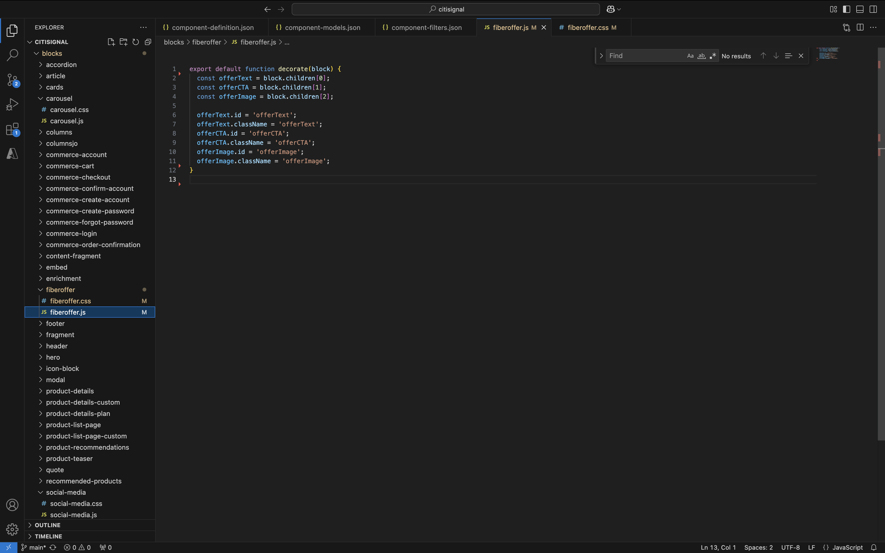
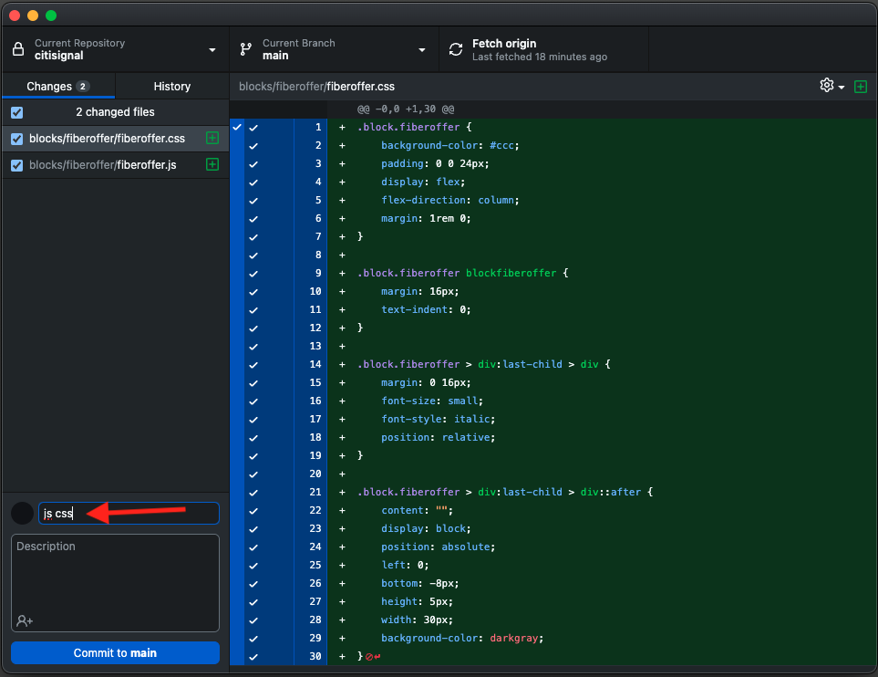
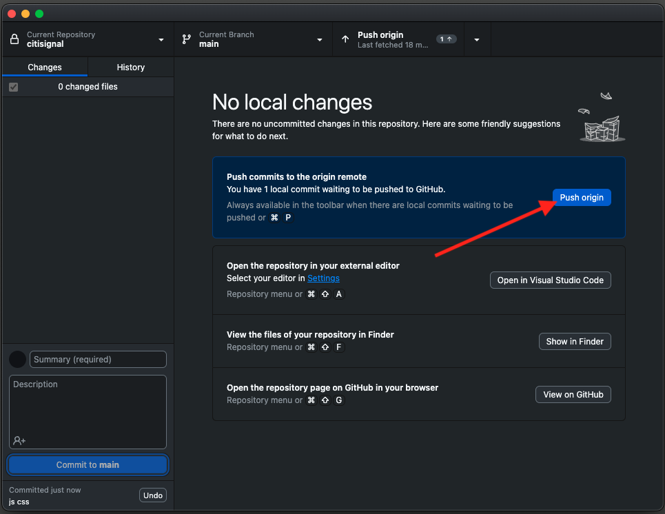
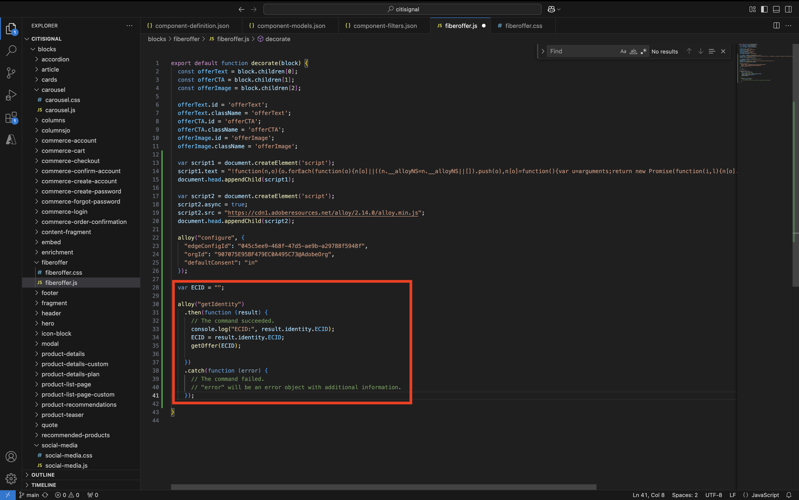

# 1.1.4 Bloque personalizado avanzado

En el ejercicio anterior configuró un bloque personalizado básico denominado **Oferta de fibra** que muestra campos como **Texto de oferta**, **CTA de oferta** y **Imagen de oferta** en el sitio web.

Ahora puede seguir trabajando en este bloque.

{zoomable="yes"}

## 1.1.4.1 - Aplicar estilo a tu bloque

Ahora que tiene un bloque **fiberoffer** en funcionamiento, puede aplicarle estilo.

Vuelva al código de Visual Studio y abra la carpeta **blocks**. Ahora debería ver varias carpetas, cada una de las cuales hace referencia a un bloque específico. Para que el bloque **fiberoffer** sea más avanzado, ahora necesita crear una carpeta para el bloque personalizado.

{zoomable="yes"}

Seleccione la carpeta **bloques** y haga clic en el icono **Crear nueva carpeta**.

{zoomable="yes"}

Asigne un nombre a la carpeta `fiberoffer` y pulse **intro**.

{zoomable="yes"}

Seleccione la nueva carpeta **fiberoffer** y haga clic en el icono **Crear nuevo archivo**.

{zoomable="yes"}

Se crea un nuevo archivo. Escriba el nombre **fiberoffer.js** y pulse intro.

{zoomable="yes"}

Ahora puede implementar la decoración de bloques agregando la siguiente JavaScript al archivo **fiberoffer.js**.

Guarde el archivo.

```js
export default function decorate(block) {
  const offerText = block.children[0];
  const offerCTA = block.children[1];
  const offerImage = block.children[2];

  offerText.id = 'offerText';
  offerText.className = 'offerText';
  offerCTA.id = 'offerCTA';
  offerCTA.className = 'offerCTA';
  offerImage.id = 'offerImage';
  offerImage.className = 'offerImage';
}
```

{zoomable="yes"}

Seleccione la nueva carpeta **fiberoffer** y haga clic en el icono **Crear nuevo archivo** de nuevo.

{zoomable="yes"}

Se crea un nuevo archivo. Escriba el nombre **fiberoffer.css** y pulse intro.

{zoomable="yes"}

Copie y pegue el siguiente código CSS en el archivo recién creado.

```js
.offerText, .offerCTA, .offerImage{
    color: #14161A;
    font-size: 30px;
    padding: 0 0 24px;
    display: flex;
    flex-direction: column;
    margin: 1rem 0;
    text-align: center;
}
```

Guarde los cambios.

{zoomable="yes"}

Ahora ha realizado varios cambios en el proyecto que deben volver a enviarse al repositorio de GitHub. Para ello, abra **GitHub Desktop**.

Entonces debería ver los 2 archivos que acaba de editar en **Cambios**. Revise los cambios.

Escriba un nombre para su PR, `js css`. Haga clic en **Compromiso con main**.

{zoomable="yes"}

Entonces debería ver esto. Haga clic en **Origen push**.

{zoomable="yes"}

En el navegador, vaya a su cuenta de GitHub y al repositorio que ha creado para CitiSignal. Debería ver algo similar a esto, que muestre que se han recibido los cambios.

{zoomable="yes"}

Ahora podrá ver los cambios en su sitio web yendo a `main--citisignal--XXX.aem.page/us/en/` y/o `main--citisignal--XXX.aem.live/us/en/`, después de reemplazar XXX por su cuenta de usuario de GitHub, que en este ejemplo es `woutervangeluwe`.

En este ejemplo, la dirección URL completa se convierte en lo siguiente:
`https://main--citisignal--woutervangeluwe.aem.page/us/en/` o `https://main--citisignal--woutervangeluwe.aem.live/us/en/`.

Debería ver esto, con el estilo aplicado a la página.

{zoomable="yes"}

## 1.1.4.2 Agregar lógica y cargar datos desde un extremo externo

Para este ejercicio, se realiza una configuración &quot;sin procesar&quot; de Web SDK de Adobe y se solicita la siguiente mejor oferta de Adobe Journey Optimizer Offer Decisioning.

Para ser claros: no se trata de una implementación de prácticas recomendadas de Web SDK para AEM as a Cloud Service. En el siguiente ejercicio, se implementará la recopilación de datos mediante un complemento específico desarrollado para esto.

Este ejercicio pretende mostrarle un par de cosas básicas en JavaScript, como cargar una biblioteca JS externa, usar la biblioteca **alloy.js**, enviar una solicitud y más.

La biblioteca **alloy.js** es la biblioteca detrás de Web SDK que permite enviar solicitudes desde un sitio web a Edge Network de Adobe y, desde allí, a aplicaciones como Adobe Experience Platform, Adobe Analytics, Adobe Target y más.

Añada este código en el código anterior que agregó para el estilo del bloque:

```javascript
var script1 = document.createElement('script');
  script1.text = "!function(n,o){o.forEach(function(o){n[o]||((n.__alloyNS=n.__alloyNS||[]).push(o),n[o]=function(){var u=arguments;return new Promise(function(i,l){n[o].q.push([i,l,u])})},n[o].q=[])})}(window,['alloy']);"
  document.head.appendChild(script1);

  var script2 = document.createElement('script');
  script2.async = true;
  script2.src = "https://cdn1.adoberesources.net/alloy/2.14.0/alloy.min.js";
  document.head.appendChild(script2);

  alloy("configure", {
    "edgeConfigId": "045c5ee9-468f-47d5-ae9b-a29788f5948f",
    "orgId": "907075E95BF479EC0A495C73@AdobeOrg",
    "defaultConsent": "in"
  });
```

Entonces deberías tener esto.

La primera etiqueta de script (script1) que agregó es una función que usa Web SDK y que crea un objeto window, denominado **alloy**.

La segunda etiqueta de script (script2) cargará asincrónicamente la biblioteca alloy.js desde la CDN de Adobe.

El tercer bloque de código configura básicamente el objeto de aleación para enviar datos a una organización de IMS y un conjunto de datos de Adobe específicos.

En el módulo **Introducción** ya configuró una secuencia de datos, llamada `--aepUserLdap-- - One Adobe Datastream`. El campo **edgeConfigId** del código anterior hace referencia al ID de la secuencia de datos que se configuró.

No es necesario cambiar el campo **edgeConfigId** en este momento. En el próximo ejercicio podrás hacerlo usando el complemento **MarTech**.

{zoomable="yes"}

Ahora debería tener esto.

{zoomable="yes"}

A continuación, agregue este bloque debajo del código anterior que agregó en.

```javascript
var ECID = "";

  alloy("getIdentity")
    .then(function (result) {
      // The command succeeded.
      console.log("ECID:", result.identity.ECID);
      ECID = result.identity.ECID;
      getOffer(ECID);

    })
    .catch(function (error) {
      // The command failed.
      // "error" will be an error object with additional information.
    });
```

Este bloque de código se utiliza para recuperar el valor del Experience Cloud ID (ECID). El ECID es el identificador de dispositivo único del explorador.

Como puede ver en el código anterior, una vez recuperado el ECID, se llama a otra función. Esta función se llama **getOffer()** y la agregará a continuación.

{zoomable="yes"}

A continuación, añada el siguiente código en la

```javascript
async function getOffer(ECID) {
  var url = "https://edge.adobedc.net/ee/irl1/v1/interact?configId=045c5ee9-468f-47d5-ae9b-a29788f5948f";

  var timestamp = new Date().toISOString();

  var offerRequest = {
    "events": [
      {
        "xdm": {
          "eventType": "decisioning.propositionDisplay",
          "timestamp": timestamp,
          "_experienceplatform": {
            "identification": {
              "core": {
                "ecid": ECID
              }
            }
          },
          "identityMap": {
            "ECID": [
              {
                "id": ECID
              }
            ]
          }
        },
        "query": {
          "personalization": {
            "schemas": [
              "https://ns.adobe.com/personalization/default-content-item",
              "https://ns.adobe.com/personalization/html-content-item",
              "https://ns.adobe.com/personalization/json-content-item",
              "https://ns.adobe.com/personalization/redirect-item",
              "https://ns.adobe.com/personalization/ruleset-item",
              "https://ns.adobe.com/personalization/message/in-app",
              "https://ns.adobe.com/personalization/message/content-card",
              "https://ns.adobe.com/personalization/dom-action"
            ],
            "decisionScopes": [
              "eyJ4ZG06YWN0aXZpdHlJZCI6ImRwczpvZmZlci1hY3Rpdml0eToxYTI3ODk3NzAzYTY5NWZmIiwieGRtOnBsYWNlbWVudElkIjoiZHBzOm9mZmVyLXBsYWNlbWVudDoxYTI0ZGM2MWJmYjJlMjIwIn0=",
              "eyJ4ZG06YWN0aXZpdHlJZCI6ImRwczpvZmZlci1hY3Rpdml0eToxYTI3ODk3NzAzYTY5NWZmIiwieGRtOnBsYWNlbWVudElkIjoiZHBzOm9mZmVyLXBsYWNlbWVudDoxYTI0ZGM0MzQyZjJlMjFlIn0="
            ]
          }
        }
      }
    ]
  }

  try {
    const response = await fetch(url, {
      method: "POST",
      headers: {
        "Content-Type": "application/json"
      },
      body: JSON.stringify(offerRequest),
    });

    if (response.status === 200) {
      var body = await response.json();
      console.log("Offer Decisioning Response: ", body);

      const decisions = body["handle"];

      decisions.forEach(decision => {
        if (decision["type"] == "personalization:decisions") {
          console.log("Offer Decisioning decision detail: ", decision);
          const payloads = decision["payload"];

          if (payloads === undefined || payloads.length == 0) {
            //do nothing
          } else {
            payloads.forEach(payload => {
              if (payload["placement"]["name"] == "Web - Image") {
                console.log("Web-Image payload");
                const items = payload["items"];
                items.forEach(item => {
                  if (item["id"].includes("dps:fallback-offer")) {
                    console.log("Item details: ", item);
                    const deliveryURL = item["data"]["deliveryURL"];

                    document.querySelector("#offerImage").innerHTML = "";
                  } else if (item["id"].includes("dps:personalized-offer")) {
                    console.log("Item details: ", item);
                    const deliveryURL = item["data"]["deliveryURL"];
                    console.log("Web-Image Personalized Offer Content: ", deliveryURL)

                    document.querySelector("#offerImage").innerHTML = "";
                  }
                });
              } else if (payload["placement"]["name"] == "Web - JSON") {
                console.log("Web-JSON payload");
                const items = payload["items"];
                items.forEach(item => {
                  if (item["id"].includes("dps:fallback-offer")) {
                    const content = JSON.parse(item["data"]["content"]);

                    console.log("Web-JSON Fallback Content: ", content)

                    document.querySelector("#offerText").innerHTML = content.text;
                    document.querySelector("#offerCTA").innerHTML = content.cta;
                  } else if (item["id"].includes("dps:personalized-offer")) {
                    const content = JSON.parse(item["data"]["content"]);

                    console.log("Web-JSON Personalized Offer Content: " + content);

                    document.querySelector("#offerText").innerHTML = content.text;
                    document.querySelector("#offerCTA").innerHTML = content.cta;
                  }
                });
              }
            });
          }
          document.querySelector("#offerImage").style.display = "block";
          document.querySelector("#offerText").style.display = "block";
          document.querySelector("#offerCTA").style.display = "block";
        }
      });
    } else {
      console.warn("Offer Decisioning Response unsuccessful:", response.body);
    }
  } catch (error) {
    console.error("Error when getting Offer Decisioning Response:", error);
  }
}
```

Es muy importante que este bloque de código se pegue debajo del corchete de cierre que puede ver en la línea 42 de este ejemplo. El código que acaba de pegar es una función independiente que necesita su propio lugar en este archivo y no se puede anidar en la **función predeterminada** anterior.

{zoomable="yes"}

El bloque de código que acaba de pegar simula una solicitud que normalmente realizaría Web SDK/alloy.js. En este ejemplo, se realizará una solicitud **fetch** a **edge.adobedc.net**.

En la solicitud, se especifican 2 **Ámbitos de decisión** que solicitarán a Adobe Journey Optimizer Offer Decisioning que proporcione una decisión sobre qué oferta debe ver este ECID.

Una vez recibida la respuesta de, este código analiza la respuesta y filtra elementos como la dirección URL de la imagen que debe mostrarse y la respuesta JSON que contiene elementos como el texto de la oferta y el CTA de ofertas, tras lo cual los muestra en el sitio web.

Recuerde: este método se utiliza solo para fines de habilitación y no es la mejor manera de implementar la recopilación de datos.

Guarde los cambios. A continuación, abra **Github Desktop**, asígnele un nombre a su PR y haga clic en **Comprometerse con main**.

{zoomable="yes"}

A continuación, haga clic en **Origen push**.

{zoomable="yes"}

Ahora podrá ver los cambios en su sitio web yendo a `main--citisignal--XXX.aem.page/us/en/` y/o `main--citisignal--XXX.aem.live/us/en/`, después de reemplazar XXX por su cuenta de usuario de GitHub, que en este ejemplo es `woutervangeluwe`.

En este ejemplo, la dirección URL completa se convierte en lo siguiente:
`https://main--citisignal--woutervangeluwe.aem.page/us/en/` o `https://main--citisignal--woutervangeluwe.aem.live/us/en/`.

Entonces debería ver esto.

{zoomable="yes"}

Paso siguiente: [Complemento AEM Edge Delivery Services MarTech](./ex6.md){target="_blank"}

Volver a [Adobe Experience Manager Cloud Service &amp; Edge Delivery Services](./aemcs.md){target="_blank"}

[Volver a todos los módulos](./../../../overview.md){target="_blank"}
