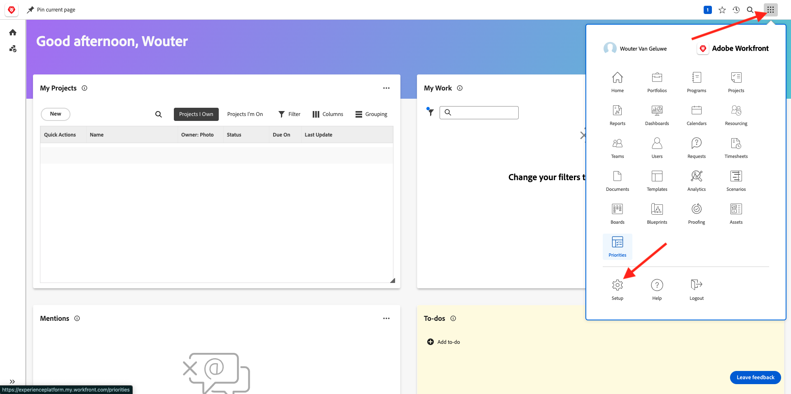
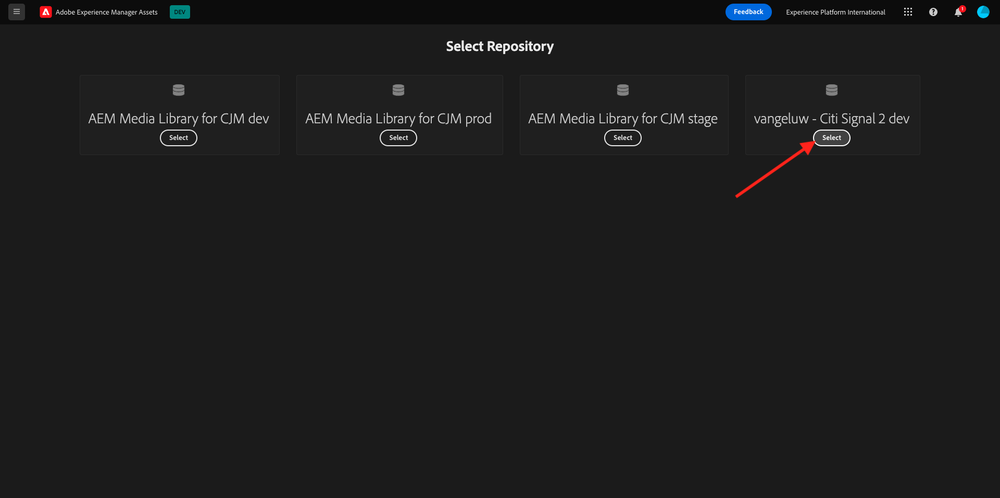
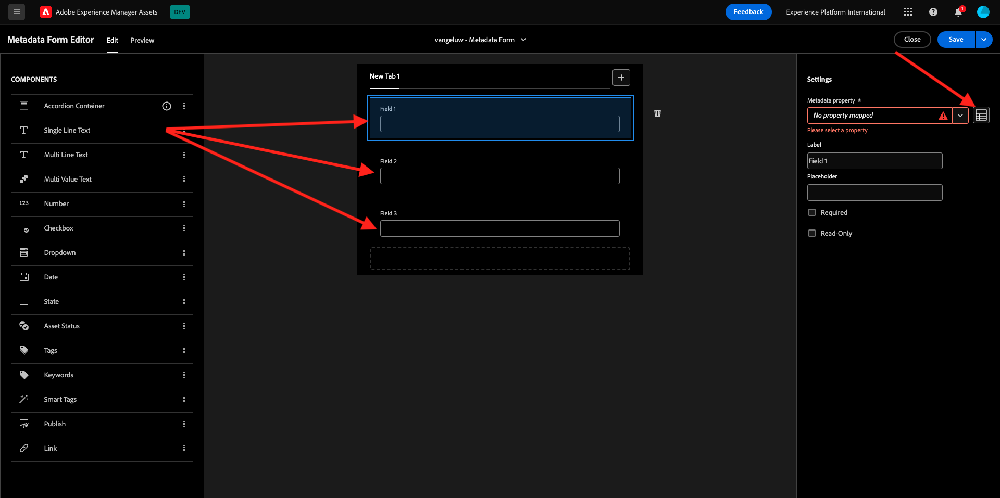
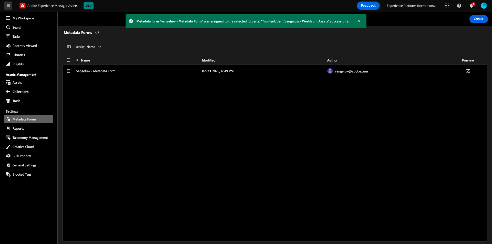
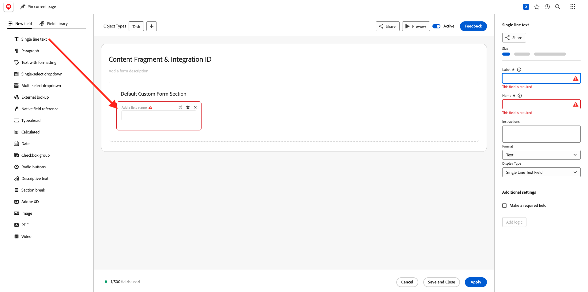
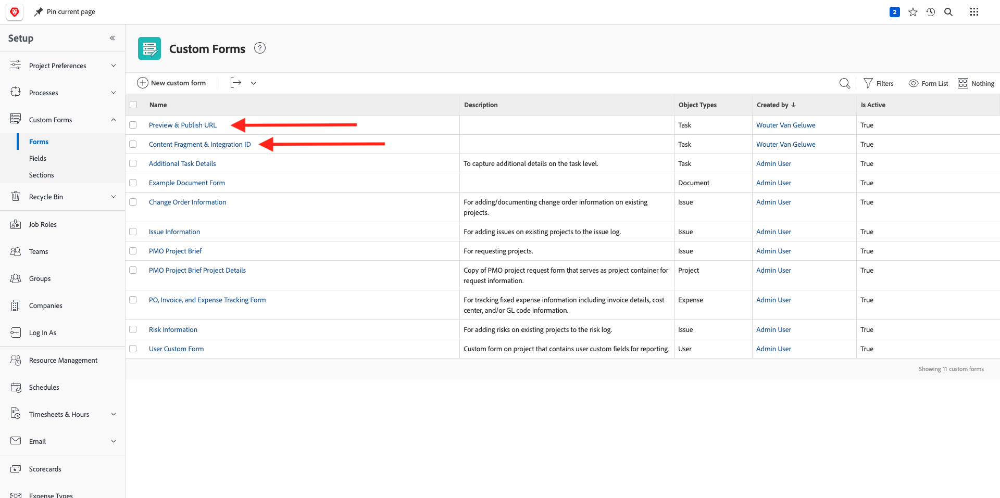

# 1.2.1 Introducción a Workfront

Inicie sesión en Adobe Workfront en [https://experienceplatform.my.workfront.com/](https://experienceplatform.my.workfront.com/){target="_blank"}.

Entonces verá esto.

## 1.2.1.1 Configuración de la integración de AEM Assets

Haga clic en el icono de 9 puntos **hamburguesa** y, a continuación, seleccione **Configuración**.

En el menú de la izquierda, desplácese hacia abajo hasta **Documentos** y, a continuación, haga clic en **Experience Manager Assets**.

Haga clic en **+ Agregar integración de Experience Manager**.

Para el nombre de su integración, use `--aepUserLdap-- - Citi Signal AEM`.

Abra el menú desplegable **Repositorio de Experience Manager** y seleccione su instancia de AEM CS, que debe llamarse `--aepUserLdap-- - Citi Signal`.

En **Metadatos**, configure la siguiente asignación:

| Campo de Workfront | Campo de Experience Manager Assets |
| --------------- | ------------------------------ | 
| **Documento** > **Nombre** | **wm:nombreDocumento** |
| **Proyecto** > **Descripción** | **wm:projectDescription** |
| **Tarea** > **Nombre** | **wm:taskName** |
| **Tarea** > **Descripción** | **wm:taskDescription** |

Habilite el conmutador para **sincronizar metadatos de objeto**.

Haga clic en **Guardar**.

Ya está configurada la integración de Workfront a AEM Assets CS.

## 1.2.1.2 Configuración de la integración de metadatos con AEM Assets

A continuación, debe configurar los AEM Assets para que los campos de metadatos del recurso de Workfront se compartan con AEM.

Para ello, vaya a [https://experience.adobe.com/](https://experience.adobe.com/). Haga clic en **Experience Manager Assets**.

Haga clic para seleccionar el entorno de AEM Assets, que debería llamarse `--aepUserLdap-- - Citi Signal dev`.

Entonces debería ver esto. En el menú de la izquierda, ve a **Assets** y haz clic en **Crear carpeta**.

Asigne un nombre a la carpeta `--aepUserLdap-- - Workfront Assets` y haga clic en **Crear**.

A continuación, ve a **Metadata Forms** en el menú de la izquierda y luego haz clic en **Crear**.

Use el nombre `--aepUserLdap-- - Metadata Form` y haga clic en **Crear**.

Agregue 3 nuevos campos **Texto de una sola línea** al formulario y seleccione el primer campo. A continuación, haga clic en el icono **Esquema** junto al campo **Propiedad de metadatos**.

En el campo de búsqueda, escriba `wm:project` y, a continuación, seleccione el campo **Descripción del proyecto**. Haga clic en **Seleccionar**.

Cambie la etiqueta del campo a **Descripción del proyecto**.

A continuación, seleccione el segundo campo **Texto de una sola línea** y haga clic en el icono **Esquema** junto al campo **Propiedad de metadatos** de nuevo.

Luego verá esta ventana emergente de nuevo. En el campo de búsqueda, escriba `wm:project` y, a continuación, seleccione el campo **Id. de proyecto**. Haga clic en **Seleccionar**.

Cambie la etiqueta del campo a **ID de proyecto**.

Seleccione el tercer campo **Texto de una sola línea** y haga clic en el icono **Esquema** junto al campo **Propiedad de metadatos** de nuevo.

Luego verá esta ventana emergente de nuevo. En el campo de búsqueda, escriba `wm:project` y, a continuación, seleccione el campo **Nombre de proyecto**. Haga clic en **Seleccionar**.

Cambie la etiqueta del campo a **Nombre de proyecto**. Haga clic en **Guardar**.

Cambie **Tab name** del formulario a `--aepUserLdap-- - Workfront Metadata`. Haga clic en **Guardar** y **Cerrar**.

Su **formulario de metadatos** ya está configurado.

A continuación, debe asignar el formulario de metadatos a la carpeta creada anteriormente. Marque la casilla de verificación del formulario de metadatos y haga clic en **Asignar a las carpetas**.

Seleccione su carpeta, que debe tener el nombre `--aepUserLdap-- - Workfront Assets`. Haga clic en **Asignar**.

El formulario de metadatos se ha asignado correctamente a la carpeta.

## 1.2.1.2 Configuración de la integración de AEM Sites

>[!NOTE]
>
>Este complemento está actualmente en modo **Acceso anticipado** y no está disponible en general todavía.
>
>Es posible que este complemento ya esté instalado en la instancia de Workfront que utiliza. Si ya está instalado, puede revisar las siguientes instrucciones, pero no es necesario cambiar nada en la configuración.

Vaya a [https://experience.adobe.com/#/@experienceplatform/aem/extension-manager/universal-editor](https://experience.adobe.com/#/@experienceplatform/aem/extension-manager/universal-editor){target="_blank"}.

Asegúrese de que **toggle** para este complemento esté establecido en **Enabled**. A continuación, haga clic en el icono **engranaje**.

Verá una ventana emergente de **Configuración de la extensión**. Configure los campos siguientes para utilizar este complemento.

| Clave | Valor |
| --------------- | ------------------------------ | 
| **`IMS_ENV`** | **PROD** |
| **`WORKFRONT_INSTANCE_URL`** | **https://experienceplatform.my.workfront.com** |
| **`SHOW_CUSTOM_FORMS`** | **&#39;{&quot;previewUrl&quot;: true, &quot;publishUrl&quot;: true}&#39;** |

Haga clic en **Guardar**.

Vuelva a la interfaz de usuario de Workfront y haga clic en el icono de 9 puntos **hamburguesa**. Seleccione **Configuración**.

En el menú de la izquierda, ve a **Forms personalizado** y selecciona **Formulario**. Haga clic en **+ Nuevo formulario personalizado**.

Seleccione **Tarea** y haga clic en **Continuar**.

A continuación, verá un formulario personalizado vacío. Escriba el nombre del formulario `Content Fragment & Integration ID`.

Arrastre y suelte un nuevo campo **Texto de una sola línea** en el lienzo.

Configure el nuevo campo de esta manera:

- **Etiqueta**: **Fragmento de contenido**
- **Nombre**: **`aem_workfront_integration_content_fragment`**

Agregue un nuevo campo **Texto de una sola línea** al lienzo y configure el nuevo campo de esta manera:

- **Etiqueta**: **Id. de integración**
- **Nombre**: **`aem_workfront_integration_id`**

Haga clic en **Aplicar**.

Ahora debe configurar un segundo formulario personalizado. Haga clic en **+ Nuevo formulario personalizado**.

Seleccione **Tarea** y haga clic en **Continuar**.

A continuación, verá un formulario personalizado vacío. Escriba el nombre del formulario `Preview & Publish URL`.

Arrastre y suelte un nuevo campo **Texto de una sola línea** en el lienzo.

Configure el nuevo campo de esta manera:

- **Etiqueta**: **URL de vista previa**
- **Nombre**: **`aem_workfront_integration_preview_url`**

Agregue un nuevo campo **Texto de una sola línea** al lienzo y configure el nuevo campo de esta manera:

- **Etiqueta**: **URL de publicación**
- **Nombre**: **`aem_workfront_integration_publish_url`**

Haga clic en **Aplicar**.

A continuación, debe tener disponibles dos formularios personalizados.

Paso siguiente: [1.2.2 Revisión con Workfront](./ex2.md){target="_blank"}

Volver a la administración de [flujos de trabajo con Adobe Workfront](./workfront.md){target="_blank"}

[Volver a todos los módulos](./../../../overview.md){target="_blank"}
