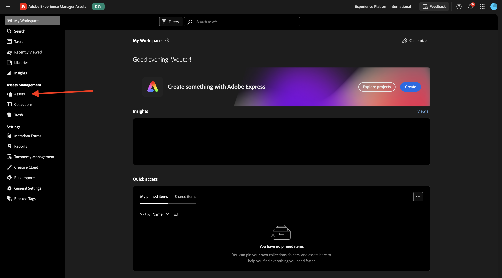
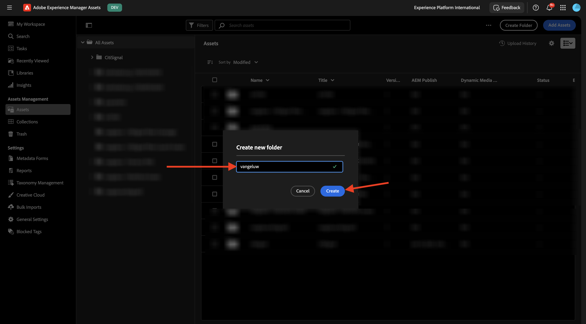
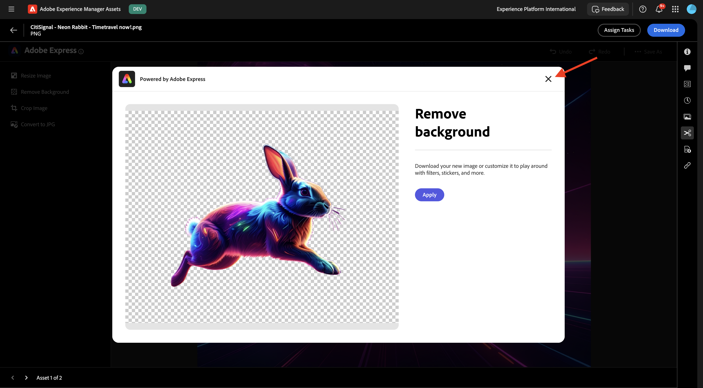

# 1.2.1 Introducción a los AEM Assets

Vaya a [https://experience.adobe.com/](https://experience.adobe.com/){target="_blank"}. Asegúrese de que está en el entorno correcto, que debe llamarse `--aepImsOrgName--`.

Abra **Adobe Experience Manager Assets**.

Seleccione el entorno de AEM Assets CS que se le ha asignado. En este caso, el entorno que se va a seleccionar es `--aepUserLdap-- - CitiSignal dev author`.

Entonces debería ver esto. Ir a **Assets**.

Debe utilizar una carpeta llamada `--aepUserLdap-- - CitiSignal Fiber Campaign`. Si aún no existe, haga clic en **Crear carpeta**.

Escriba el nombre `--aepUserLdap--` de la carpeta y haga clic en **Crear**.

Abra la carpeta recién creada. En uno de los ejercicios anteriores creó dos imágenes con los nombres `CitiSignal - Neon Rabbit - Get On Board Now!.png` y `CitiSignal - Neon Rabbit - Timetravel now!.png`. Ahora debe cargar estas imágenes en esta carpeta si aún no están allí.

Si ya no tiene estos archivos, puede descargarlos [aquí](./images/CitiSignal_Neon_Rabbit.zip){target="_blank"}.

Haga clic en **Agregar Assets**.

Seleccione las dos imágenes mencionadas anteriormente. Haga clic en **Abrir**.

Haga clic en **Cargar**.

Haga clic en una de las imágenes para seleccionarla.

Haga clic en **Detalles**.

Ahora está viendo los metadatos disponibles del archivo específico.

En el menú derecho, vaya a **Representaciones**. A continuación, verá una serie de representaciones predefinidas de la imagen que seleccionó con la capacidad de descargarlas.

En el menú derecho, haga clic en el icono **tijeras**. Encontrará una serie de acciones de edición disponibles, con tecnología de Adobe Express. Haga clic en **Quitar fondo**.

Después de un par de segundos, debería ver algo similar a esto, con la capacidad de aplicar los cambios o descargar el nuevo archivo. Cierre la ventana emergente.

Clip **Recortar imagen**.

Puede probar algunas variaciones de diferentes tamaños de recorte.

En el menú derecho, ve a **Tareas**. Haga clic en **Asignar tareas**.

Establezca **Título de tarea** en `Review image & approve`. Asígnese usted mismo. Haga clic en **Crear**.

Haga clic en **Ver** en la notificación.

También puede actualizar la pantalla para ver las tareas recién creadas en la lista **Tareas relacionadas**. Haga clic en el botón **Abrir** para ver los detalles de la tarea.

Entonces deberías ver algo como esto. Haga clic en **Aprobar**.

Confirme haciendo clic en **Aprobar**.

El recurso se ha aprobado en AEM Assets.

Siguiente paso: [Resumen y beneficios](./summary.md){target="_blank"}

Volver a [Adobe Experience Manager Assets](./aemassets.md){target="_blank"}

[Volver a todos los módulos](./../../../overview.md){target="_blank"}
