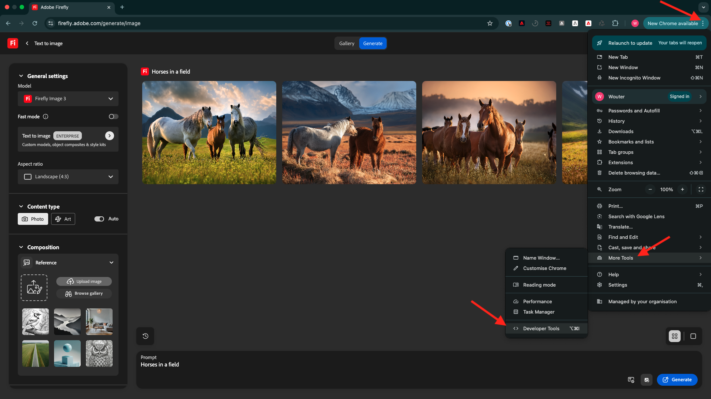
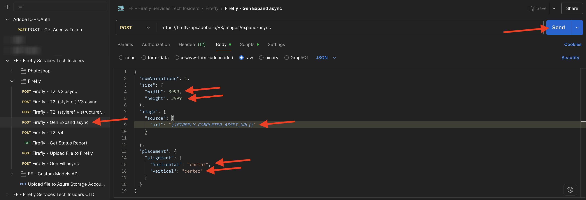
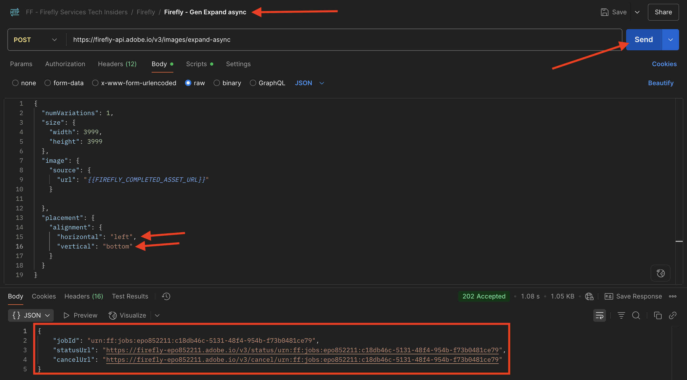

# 1.1.1 Introducción a Firefly Services

Aprenda a utilizar Postman y Adobe I/O para consultar las API de servicios de Adobe Firefly.

## 1.1.1.1 requisitos previos

Antes de continuar con este ejercicio, debes haber completado la configuración de [tu proyecto de Adobe I/O](./../../../modules/getting-started/gettingstarted/ex6.md), y también debes haber configurado una aplicación para interactuar con las API, como [Postman](./../../../modules/getting-started/gettingstarted/ex7.md) o [PostBuster](./../../../modules/getting-started/gettingstarted/ex8.md).

## 1.1.1.2 firefly.adobe.com

Vaya a [https://firefly.adobe.com](https://firefly.adobe.com). Haz clic en el icono **perfil** y asegúrate de haber iniciado sesión en la **cuenta** correcta, que debería ser `--aepImsOrgName--`. Si es necesario, haga clic en **Cambiar perfil** para cambiar a esa cuenta.

{zoomable="yes"}

Escriba el mensaje `Horses in a field` y haga clic en **Generar**.

{zoomable="yes"}

Entonces debería ver algo similar a esto.

{zoomable="yes"}

A continuación, abre **Herramientas para desarrolladores** en tu navegador.

{zoomable="yes"}

Entonces debería ver esto. Vaya a la ficha **Red**.

{zoomable="yes"}

Escriba el término de búsqueda **generate** y luego haga clic en **Generate** de nuevo. Debería ver una solicitud con el nombre **generate-async**. Selecciónelo y luego ve a **Carga** donde verás los detalles de la solicitud.

{zoomable="yes"}

La solicitud que está viendo aquí es la solicitud que se envía al servidor back-end de Firefly Services. Contiene varios parámetros importantes:

- **prompt**: Este es su prompt, solicitando qué tipo de imagen debe generar Firefly

- **seed**: En esta solicitud, las semillas se generaron de forma aleatoria. Siempre que Firefly genera una imagen, comienza el proceso de forma predeterminada seleccionando un número aleatorio denominado semilla. Este número aleatorio contribuye a lo que hace que cada imagen sea única, lo que es genial cuando desea generar una amplia variedad de imágenes. Sin embargo, puede haber ocasiones en que desee generar imágenes similares entre sí en varias solicitudes. Por ejemplo, cuando Firefly genera una imagen que desea modificar con otras opciones de Firefly (como ajustes preestablecidos de estilo, imágenes de referencia, etc.), utilice la semilla de esa imagen en solicitudes HTTP futuras para limitar la aleatoriedad de imágenes futuras y centrarse en la imagen que desee.

{zoomable="yes"}

Vuelva a consultar la interfaz de usuario. Cambie **Proporción de aspecto** a **Horizontal (4:3)**.

{zoomable="yes"}

Desplácese hacia abajo hasta **Efectos**, vaya a **Temas** y seleccione un efecto como **Comic book**.

{zoomable="yes"}

Vuelva a abrir **Herramientas para desarrolladores** en el explorador. A continuación, haga clic en **Generar** e inspeccione la solicitud de red que se está enviando.

{zoomable="yes"}

Al inspeccionar los detalles de la solicitud de red, ahora verá lo siguiente:

- **prompt** no ha cambiado en comparación con la solicitud anterior
- **semillas** no han cambiado en comparación con la solicitud anterior
- **tamaño** ha cambiado, según el cambio en **Proporción de aspecto**.
- Se han agregado **estilos** y tiene una referencia al efecto **cómic_book** que seleccionó

{zoomable="yes"}

Para el siguiente ejercicio, tendrás que usar uno de los números **seed**. Anote un número semilla de su elección.

En el siguiente ejercicio hará cosas similares con los servicios de Firefly, pero utilizando la API en lugar de la interfaz de usuario. En este ejemplo, el número semilla es **45781**.

## 1.1.1.3 Adobe I/O - access_token

En la colección **Adobe IO - OAuth**, seleccione la solicitud **POST - Obtener token de acceso** y seleccione **Enviar**. La respuesta debe contener un nuevo **accestoken**.

{zoomable="yes"}

## 1.1.1.4 API de servicios de Firefly, imagen de texto 2

Ahora que tiene un access_token válido y nuevo, está listo para enviar su primera solicitud a las API de servicios de Firefly.

Seleccione la solicitud **POST - Firefly - T2I V3** de la colección **FF - Firefly Services Tech Insiders**.

{zoomable="yes"}

Copie la dirección URL de la imagen de la respuesta y ábrala en el explorador web para ver la imagen.

{zoomable="yes"}

Debería ver una imagen hermosa que represente a `horses in a field`.

{zoomable="yes"}

En el **Cuerpo** de su solicitud **POST - Firefly - T2I V3**, agregue lo siguiente en el campo `"promptBiasingLocaleCode": "en-US"` y reemplace la variable `XXX` por uno de los números semilla que la interfaz de usuario de Firefly Services utilizó aleatoriamente. En este ejemplo, el número **seed** es `45781`.

```json
,
  "seeds": [
    XXX
  ]
```

Haga clic en **Enviar**. Recibirá una respuesta con una nueva imagen generada por los servicios de Firefly. Abra la imagen para verla.

{zoomable="yes"}

Entonces debería ver una nueva imagen con ligeras diferencias, basada en la **semilla** que se utilizó.

{zoomable="yes"}

A continuación, en **Body** de su solicitud **POST - Firefly - T2I V3**, pegue el siguiente objeto **styles** debajo del objeto **seed**. Esto cambiará el estilo de la imagen generada a **comic_book**.

```json
,
  "contentClass": "art",
  "styles": {
    "presets": [
      "comic_book"
    ],
    "strength": 50
  }
```

Entonces deberías tener esto. Haga clic en **Enviar**.

{zoomable="yes"}

Haga clic en la dirección URL de la imagen para abrirla.

{zoomable="yes"}

La imagen ha cambiado un poco. Al aplicar ajustes preestablecidos de estilo, la imagen semilla ya no se aplica del mismo modo que antes.

{zoomable="yes"}

Elimine el código del objeto **seed** del **cuerpo** de su solicitud. Haga clic en **Enviar** y, a continuación, haga clic en la URL de la imagen que obtiene de la respuesta.

```json
,
  "seeds": [
    XXX
  ]
```

{zoomable="yes"}

La imagen ha cambiado un poco de nuevo.

{zoomable="yes"}


## 1.1.1.5 API de servicios de Firefly, Gen Expand

Seleccione la solicitud **POST - Firefly - Gen Expand** de la colección **FF - Firefly Services Tech Insiders** y vaya al **Cuerpo** de la solicitud.

- **size**: escriba la resolución que desee. El valor introducido aquí debe ser mayor que el tamaño original de la imagen y no puede ser superior a 4096.
- **image.source.url**: este campo necesita un vínculo a la imagen que debe expandirse. En este ejemplo, se utiliza una variable para hacer referencia a la imagen generada en el ejercicio anterior.

- **alineación horizontal**: Los valores aceptados son: `"center"`,`"left`, `"right"`.
- **alineación vertical**: Los valores aceptados son: `"center"`,`"top`, `"bottom"`.

{zoomable="yes"}

Haga clic en la URL de la imagen que forma parte de la respuesta.

{zoomable="yes"}

Ahora verá que la imagen generada en el ejercicio anterior se ha ampliado a la resolución de 3999x3999.

{zoomable="yes"}

Al cambiar la alineación de la posición, la salida también será ligeramente diferente. En este ejemplo, la ubicación se cambia a **left, bottom**. Haga clic en **Enviar** y, a continuación, haga clic en para abrir la dirección URL de la imagen generada.

{zoomable="yes"}

A continuación, debe ver que la imagen original se utiliza en una ubicación diferente, lo que influye en toda la imagen.

{zoomable="yes"}

## Pasos siguientes

Vaya a [Optimizar el proceso de Firefly mediante Microsoft Azure y las direcciones URL prefirmadas](./ex2.md){target="_blank"}

Volver a [Información general sobre los servicios de Adobe Firefly](./firefly-services.md){target="_blank"}

Volver a [Todos los módulos](./../../../overview.md){target="_blank"}
